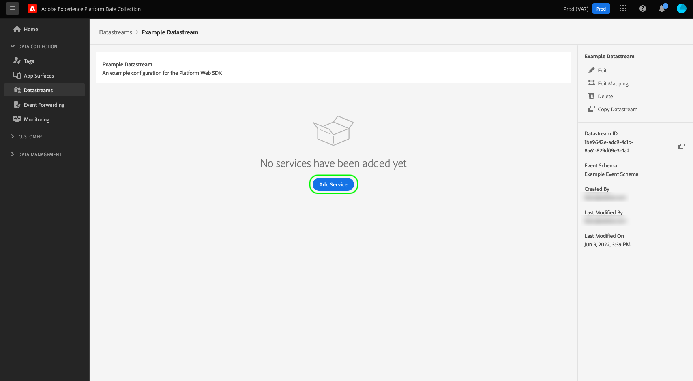

# Erstellen und Konfigurieren von Datenströmen

Dieses Dokument beschreibt die Schritte zum Konfigurieren eines [Datenstroms](./overview.md) in der Benutzeroberfläche.

## Zugriff auf den [!UICONTROL Datastreams] Arbeitsbereich

Sie können Datenströme in der Datenerfassungs-Benutzeroberfläche oder der Experience Platform-Benutzeroberfläche durch Auswahl von **[!UICONTROL Datastreams]** in der linken Navigationsleiste erstellen und verwalten.

Auf der Registerkarte **[!UICONTROL Datastreams]** wird eine Liste der vorhandenen Datenströme angezeigt, einschließlich ihres Anzeigenamens, ihrer ID und des Datums der letzten Änderung. Um [Details anzuzeigen und Services zu konfigurieren](#view-details) wählen Sie den Namen eines Datenstroms aus.

Um weitere Optionen für einen bestimmten Datenstrom anzuzeigen, wählen Sie das Symbol „Mehr“ (**…**). Um die [Basiskonfiguration](#configure) für den Datenstrom zu aktualisieren, wählen Sie **[!UICONTROL Edit]**. Um den Datenstrom zu entfernen, wählen Sie **[!UICONTROL Delete]** aus.

## Erstellen eines Datenspeichers {#create}

Um einen Datenstrom zu erstellen, wählen Sie zunächst **[!UICONTROL New Datastream]** aus.

Der Workflow zur Erstellung eines Datenstroms wird geöffnet, beginnend mit dem Konfigurationsschritt. Geben Sie hier einen Namen und eine optionale Beschreibung für den Datenstrom an.

Wenn Sie einen Datenstrom zur Verwendung in Experience Platform konfigurieren und auch die Web-SDK verwenden, müssen Sie auch ein [ereignisbasiertes Experience-Datenmodell-Schema (XDM) ](../xdm/classes/experienceevent.md), das die Daten darstellt, die aufgenommen werden sollen.

### Konfigurieren der Geolokalisierung und Netzwerksuche {#geolocation-network-lookup}

Mit den Einstellungen Geolocation und Netzwerksuche können Sie den Grad der Granularität der geografischen Daten und Daten auf Netzwerkebene definieren, die Sie erfassen möchten.

Erweitern Sie den Abschnitt **[!UICONTROL Geolocation and network lookup]** , um die unten beschriebenen Einstellungen zu konfigurieren.

| Einstellung | Beschreibung |
| --- | --- |
| [!UICONTROL Geo Lookup] | Ermöglicht die Geolokalisierung für die ausgewählten Optionen basierend auf der IP-Adresse des Besuchers. Zu den verfügbaren Optionen gehören: <ul><li>**Land**: Befüllt `xdm.placeContext.geo.countryCode`</li><li>**Postleitzahl**: Befüllt `xdm.placeContext.geo.postalCode`</li><li>**Bundesland/**: Befüllt `xdm.placeContext.geo.stateProvince`</li><li>**DMA**: Befüllt `xdm.placeContext.geo.dmaID`</li><li>**city**: befüllt `xdm.placeContext.geo.city`</li><li>**Latitude**: Befüllt `xdm.placeContext.geo._schema.latitude`</li><li>**Längengrad**: Befüllt `xdm.placeContext.geo._schema.longitude`</li></ul>Bei Auswahl von **[!UICONTROL City]**, **[!UICONTROL Latitude]** oder **[!UICONTROL Longitude]** erhalten Sie Koordinaten bis zu zwei Dezimalpunkten, unabhängig davon, welche anderen Optionen ausgewählt sind. Dies wird als Granularität auf Stadtebene betrachtet.   Wenn Sie keine Option auswählen, wird die Geolokalisierungs-Suche deaktiviert. Die Geolokalisierung erfolgt vor dem [!UICONTROL IP Obfuscation], d. h. sie wird durch die [!UICONTROL IP Obfuscation] nicht beeinflusst. |
| [!UICONTROL Network Lookup] | Ermöglicht die Netzwerksuche für die ausgewählten Optionen basierend auf der IP-Adresse des Besuchers. Zu den verfügbaren Optionen gehören: <ul><li>**Mobilnetzbetreiber**: Befüllt `xdm.environment.carrier`</li><li>**Domain**: Befüllt `xdm.environment.domain`</li><li>**ISP**: Befüllt `xdm.environment.ISP`</li><li>**Verbindungstyp**: Befüllt `xdm.environment.connectionType`</li></ul> |

Wenn Sie eines der oben genannten Felder für die Datenerfassung aktivieren, stellen Sie sicher, dass Sie beim Konfigurieren der Web-SDK die [`context`](/help/web-sdk/commands/configure/context.md)-Array-Eigenschaft richtig festgelegt haben.

Geolokalisierungs-Suchfelder verwenden die `context` Array-Zeichenfolge `"placeContext"`, während Netzwerk-Suchfelder die `context` Array-Zeichenfolge `"environment"` verwenden.

Stellen Sie außerdem sicher, dass jedes gewünschte XDM-Feld in Ihrem Schema vorhanden ist. Ist dies nicht der Fall, können Sie die von Adobe bereitgestellte `Environment Details` Feldergruppe zu Ihrem Schema hinzufügen.

### Gerätesuche konfigurieren {#geolocation-device-lookup}

Mit den **[!UICONTROL Device Lookup]** können Sie gerätespezifische Informationen auswählen, die Sie erfassen möchten.

Erweitern Sie den Abschnitt **[!UICONTROL Device Lookup]** , um die unten beschriebenen Einstellungen zu konfigurieren.

>[!IMPORTANT]
>
>Die in der folgenden Tabelle aufgeführten Einstellungen schließen sich gegenseitig aus. Sie können nicht gleichzeitig sowohl Benutzeragenteninformationen *und* Gerätesuchdaten auswählen.

| Einstellung | Beschreibung |
| --- | --- |
| **[!UICONTROL Keep user agent and client hints headers]** | Wählen Sie diese Option aus, um nur die in der Benutzeragenten-Zeichenfolge gespeicherten Informationen zu erfassen. Diese Einstellung ist standardmäßig ausgewählt. Befüllt `xdm.environment.browserDetails.userAgent` |
| **[!UICONTROL Use device lookup to collect the following information]** | Wählen Sie diese Option aus, wenn Sie eine oder mehrere der folgenden gerätespezifischen Informationen erfassen möchten: <ul><li>**[!UICONTROL Device]**:<ul><li>**Gerätehersteller**: Befüllt `xdm.device.manufacturer`</li><li>**Gerätemodell**: Befüllt `xdm.device.modelNumber`</li><li>**Marketing-Name**: Befüllt `xdm.device.model`</li></ul></li><li>**[!UICONTROL Hardware]**: <ul><li>**Hardwaretyp**: Befüllt `xdm.device.type`</li><li>**Display height**: Befüllt `xdm.device.screenHeight`</li><li>**Anzeigebreite**: Befüllt `xdm.device.screenWidth`</li><li>**Farbtiefe anzeigen**: Befüllt `xdm.device.colorDepth`</li></ul></li><li>**[!UICONTROL Browser]**: <ul><li>**Browser-Anbieter**: Befüllt `xdm.environment.browserDetails.vendor`</li><li>**Browser-Name**: Befüllt `xdm.environment.browserDetails.name`</li><li>**Browser-Version**: Befüllt `xdm.environment.browserDetails.version`</li></ul></li><li>**[!UICONTROL Operating system]**: <ul><li>**Betriebssystemanbieter**: Befüllt `xdm.environment.operatingSystemVendor`</li><li>**Betriebssystemname**: Befüllt `xdm.environment.operatingSystem`</li><li>**OS-Version**: Befüllt `xdm.environment.operatingSystemVersion`</li></ul></li></ul>Gerätesuchinformationen können nicht zusammen mit Benutzeragenten- und Client-Hinweisen erfasst werden. Die Auswahl von „Geräteinformationen erfassen“ deaktiviert die Erfassung von Benutzeragenten- und Client-Hinweisen und umgekehrt. |
| **[!UICONTROL Do not collect any device information]** | Wählen Sie diese Option aus, wenn Sie keine Gerätesuchinformationen erfassen möchten. Es werden keine Daten zu Geräten, Hardware, Browsern, Betriebssystemen, Benutzeragenten oder Client-Hinweisen erfasst. |

Wenn Sie eines der oben genannten Felder für die Datenerfassung aktivieren, stellen Sie sicher, dass Sie beim Konfigurieren der Web-SDK die [`context`](/help/web-sdk/commands/configure/context.md)-Array-Eigenschaft richtig festgelegt haben.

Geräte- und Hardwareinformationen verwenden die `context` Array-`"device"`, während Browser- und Betriebssysteminformationen die `context` Array-`"environment"` verwenden.

Stellen Sie außerdem sicher, dass jedes gewünschte XDM-Feld in Ihrem Schema vorhanden ist. Ist dies nicht der Fall, können Sie die von Adobe bereitgestellte `Environment Details` Feldergruppe zu Ihrem Schema hinzufügen.

### Erweiterte Optionen konfigurieren {#advanced-options}

Um erweiterte Konfigurationsoptionen anzuzeigen, wählen Sie **[!UICONTROL Advanced Options]** aus. Hier können Sie zusätzliche Datenstromeinstellungen konfigurieren, z. B. IP-Verschleierung, First-Party-ID-Cookies und mehr.

>[!IMPORTANT]
>
> Sie sind dafür verantwortlich, sicherzustellen, dass Sie alle erforderlichen Berechtigungen, Einverständnisse, Genehmigungen und Genehmigungen erhalten haben, die nach den geltenden Gesetzen und Vorschriften zur Erfassung, Verarbeitung und Übermittlung personenbezogener Daten, einschließlich genauer Standortinformationen, erforderlich sind.
> 
> Die Auswahl der Verschleierung von IP-Adressen hat keinen Einfluss auf die Ebene der Geolokalisierungsinformationen, die von der IP-Adresse abgeleitet und an Ihre konfigurierten Adobe-Lösungen gesendet werden. Die Suche nach Geolokalisierungen muss begrenzt oder separat deaktiviert werden.

| Einstellung | Beschreibung |
| --- | --- |
| [!UICONTROL IP Obfuscation] | Gibt den Typ der IP-Verschleierung an, die auf dem Datenstrom angewendet werden soll. Die Einstellung für die IP-Verschleierung wirkt sich auf jede Verarbeitung aus, die auf der Kunden-IP basiert. Dazu gehören alle Experience Cloud-Services, die Daten aus Ihrem Datenstrom erhalten. Die IP-Verschleierung findet statt, bevor Ereignisse an einen nachgelagerten Service gesendet werden, z. B. die Datenvorbereitung. 
Verfügbare Optionen:
 <ul><li>**[!UICONTROL None]**: Deaktiviert die IP-Verschleierung. Die vollständige Benutzer-IP-Adresse wird über den Datenstrom gesendet.</li><li>**[!UICONTROL Partial]**: Verschleiert bei IPv4-Adressen das letzte Oktett der IP-Adresse des Benutzers. Bei IPv6-Adressen werden die letzten 80 Bits der Adresse verschleiert. 
Beispiele:
 <ul><li>IPv4: `1.2.3.4` -> `1.2.3.0`</li><li>IPv6: `2001:0db8:1345:fd27:0000:ff00:0042:8329` -> `2001:0db8:1345:0000:0000:0000:0000:0000`</li></ul></li><li>**[!UICONTROL Full]**: Verschleiert die gesamte IP-Adresse. 
Beispiele:
 <ul><li>IPv4: `1.2.3.4` -> `0.0.0.0`</li><li>IPv6: `2001:0db8:1345:fd27:0000:ff00:0042:8329` -> `0:0:0:0:0:0:0:0`</li></ul></li></ul> Auswirkungen der IP-Verschleierung auf andere Adobe-Produkte: <ul><li>**Adobe Target**: Die [!UICONTROL IP obfuscation] auf Datenstromebene wird vor der [!UICONTROL IP obfuscation] in Adobe Target auf alle in der Anfrage vorhandenen IP-Adressen angewendet. Wenn beispielsweise die [!UICONTROL IP obfuscation] auf Datenstromebene auf **[!UICONTROL Full]** und die Adobe Target-IP-Verschleierungsoption auf **[!UICONTROL Last octet obfuscation]** festgelegt ist, erhält Adobe Target eine vollständig verschleierte IP-Adresse. Wenn die [!UICONTROL IP obfuscation] auf Datenstromebene auf **[!UICONTROL Partial]** und die Adobe Target-IP-Verschleierungsoption auf **[!UICONTROL Full]** festgelegt ist, empfängt Adobe Target eine teilweise verschleierte IP-Adresse und wendet dann die vollständige Verschleierung darauf an. Die Adobe Target-IP-Verschleierung wird unabhängig vom Datenstrom verwaltet. Weitere Informationen finden Sie in der Adobe Target-Dokumentation zu [IP-Verschleierung](https://experienceleague.adobe.com/docs/target-dev/developer/implementation/privacy/privacy.html) und [Geolokalisierung](https://experienceleague.adobe.com/docs/target/using/audiences/create-audiences/categories-audiences/geo.html).</li><li>**Audience Manager**: Die [!UICONTROL IP obfuscation] auf Datenstromebene wird vor der [!UICONTROL IP obfuscation] in Audience Manager auf alle in der Anfrage vorhandenen IP-Adressen angewendet. Die Option [!UICONTROL IP obfuscation] auf Datenstromebene wirkt sich auf alle von Audience Manager durchgeführten Geolokalisierungs-Suchen aus. Eine auf einer vollständig verschleierten IP basierende Geolokalisierung in Audience Manager führt zu einer unbekannten Region, und alle Segmente, die auf den resultierenden Geolokalisierungsdaten basieren, werden nicht realisiert. Weitere Informationen finden Sie in der Audience Manager-Dokumentation unter [IP-Verschleierung](https://experienceleague.adobe.com/docs/audience-manager/user-guide/features/administration/ip-obfuscation.html).</li><li>**Adobe Analytics**: Wenn die Einstellung für die IP-Verschleierung auf Datenstromebene auf **[!UICONTROL Full]** festgelegt ist, behandelt Adobe Analytics die IP-Adresse als leer. Dies wirkt sich auf alle Analytics-Verarbeitungsvorgänge aus, die von IP-Adressen abhängig sind, z. B. Geolokalisierungen und IP-Filterung. Damit Analytics die nicht verschleierten oder teilweise verschleierten IP-Adressen erhält, legen Sie für die Einstellung der IP-Verschleierung **[!UICONTROL Partial]** oder **[!UICONTROL None]** fest. Teilweise verschleierte und nicht verschleierte IP-Adressen können innerhalb von Analytics weiter verschleiert werden. Weitere Informationen zum Aktivieren der IP[Verschleierung in ](https://experienceleague.adobe.com/docs/analytics/admin/admin-tools/manage-report-suites/edit-report-suite/report-suite-general/general-acct-settings-admin.html?lang=de) finden Sie in der Adobe Analytics-Dokumentation . Wenn die IP-Adresse vollständig verschleiert ist und der Seitentreffer weder eine [!DNL ECID] noch eine [!DNL VisitorID] hat, löscht Analytics den Treffer, anstatt eine [Fallback-ID](https://experienceleague.adobe.com/docs/id-service/using/reference/analytics-reference/analytics-ids.html?lang=en) zu generieren, die teilweise auf der IP-Adresse basiert.</li><li>**Adobe Advertising**: Wenn die IP-Verschleierung auf Datenstromebene auf [!UICONTROL Partial] oder [!UICONTROL Full] festgelegt ist, sind geografische Berichte und Funktionen (einschließlich Messung und Retargeting) in Advertising DSP deaktiviert, mit Ausnahme von verbundenen TV-Anzeigen.</li></ul> |
| [!UICONTROL First Party ID Cookie] | Wenn diese Einstellung aktiviert ist, weist sie das Edge-Netzwerk an, bei der Suche nach einer [First-Party-Geräte-ID](../web-sdk/identity/first-party-device-ids.md) ein bestimmtes Cookie zu verwenden, anstatt nach diesem Wert in der Identity Map zu suchen.  Wenn Sie diese Einstellung aktivieren, müssen Sie den Namen des Cookies angeben, in dem die ID gespeichert werden soll. |
| [!UICONTROL Third Party ID Sync] | ID-Synchronisationen können in Container zusammengefasst werden, damit verschiedene ID-Synchronisationen zu unterschiedlichen Zeiten ausgeführt werden können. Wenn diese Einstellung aktiviert ist, können Sie festlegen, welcher Container mit ID-Synchronisationen für diesen Datenstrom ausgeführt werden soll. |
| [!UICONTROL Third Party ID Sync Container ID] | Die numerische ID des Containers, der für die ID-Synchronisierung von Drittanbietern verwendet werden soll. |
| [!UICONTROL Container ID Overrides] | In diesem Abschnitt können Sie zusätzliche IDs für Synchronisierungs-Container von Drittanbietern definieren, mit denen Sie die standardmäßige ID überschreiben können. |
| [!UICONTROL Access Type] | Legt den Authentifizierungstyp fest, den das Edge Network für den Datenstrom akzeptiert. <ul><li>**[!UICONTROL Mixed Authentication]**: Wenn diese Option aktiviert ist, akzeptiert die Edge Network sowohl authentifizierte als auch nicht authentifizierte Anfragen. Wählen Sie diese Option aus, wenn Sie die Web-SDK oder [Mobile SDK](https://developer.adobe.com/client-sdks/home/) zusammen mit der [Edge Network-API verwenden ](https://developer.adobe.com/data-collection-apis/docs/api/). </li><li>**[!UICONTROL Authenticated Only]**: Wenn diese Option aktiviert ist, akzeptiert die Edge Network nur authentifizierte Anfragen. Wählen Sie diese Option aus, wenn Sie nur die Edge Network-API verwenden und verhindern möchten, dass nicht authentifizierte Anfragen von der Edge Network verarbeitet werden.</li></ul> |
| [!UICONTROL Media Analytics] | Ermöglicht die Verarbeitung von Streaming-Tracking-Daten für die Edge Network-Integration über Experience Platform SDKs oder [Media Edge API](https://developer.adobe.com/cja-apis/docs/endpoints/media-edge/getting-started/). Weitere Informationen zu Media Analytics finden Sie in der [Dokumentation](https://experienceleague.adobe.com/docs/media-analytics/using/media-overview.html?lang=de). |

Wenn Sie von hier aus Ihren Datenstrom für Experience Platform konfigurieren, befolgen Sie das Tutorial [Datenvorbereitung für die Datenerfassung](./data-prep.md) um Ihre Daten einem Experience Platform-Ereignisschema zuzuordnen, bevor Sie mit dieser Anleitung fortfahren. Wählen Sie andernfalls **[!UICONTROL Save]** aus und fahren Sie mit dem nächsten Abschnitt fort.

## Anzeigen von Datenstromdetails {#view-details}

Nachdem Sie einen neuen Datenstrom konfiguriert oder einen vorhandenen ausgewählt haben, um ihn anzuzeigen, wird die Detailseite für diesen Datenstrom angezeigt. Hier finden Sie weitere Informationen zum Datenstrom, einschließlich seiner Kennung.

Im Bildschirm mit den Datenspeicherdetails können Sie [Services hinzufügen](#add-services), um Funktionen der Adobe Experience Cloud-Produkte zu aktivieren, auf die Sie Zugriff haben. Sie können auch die [Basiskonfiguration](#create) des Datenstroms bearbeiten, seine [Zuordnungsregeln](./data-prep.md) aktualisieren, [den Datenstrom kopieren](#copy) oder vollständig löschen.

## Hinzufügen von Services zu einem Datenstrom {#add-services}

Wählen Sie auf der Detailseite eines Datenstroms die Option **[!UICONTROL Add Service]** aus, um verfügbare Services für diesen Datenstrom hinzuzufügen.

Wählen Sie im nächsten Bildschirm im Dropdown-Menü einen Service aus, der für diesen Datenstrom konfiguriert werden soll. In dieser Liste werden nur die Services angezeigt, auf die Sie Zugriff haben.

Wählen Sie den gewünschten Service aus, geben Sie die angezeigten Konfigurationsoptionen ein und wählen Sie dann **[!UICONTROL Save]** aus, um den Service zum Datenstrom hinzuzufügen. Alle hinzugefügten Services werden in der Detailansicht für den Datenstrom angezeigt.

In den folgenden Unterabschnitten werden die Konfigurationsoptionen für die einzelnen Services beschrieben.

>[!NOTE]
>
>Jede Service-Konfiguration enthält einen **[!UICONTROL Enabled]** Umschalter, der automatisch aktiviert wird, wenn der Service ausgewählt wird. Um den ausgewählten Service für diesen Datenstrom zu deaktivieren, wählen Sie erneut den Umschalter **[!UICONTROL Enabled]** aus.

### Adobe Advertising-Einstellungen {#advertising}

Dieser Service ist für die Integration von Adobe Advertising mit Customer Journey Analytics erforderlich.

### Adobe Analytics-Einstellungen {#analytics}

Mit diesem Service wird festgelegt, ob und wie Daten an Adobe Analytics gesendet werden. Siehe [Senden von Daten an Adobe Analytics](/help/web-sdk/use-cases/adobe-analytics.md).

| Einstellung | Beschreibung |
| --- | --- |
| [!UICONTROL Report Suite ID] | **(Erforderlich)** Die ID der Analytics Report Suite, an die Sie Daten senden möchten. Diese ID finden Sie in der Adobe Analytics-Benutzeroberfläche unter [!UICONTROL Admin] > [!UICONTROL ReportSuites]. Wenn mehrere Report Suites angegeben sind, werden die Daten in jede einzelne Report Suite kopiert. |
| [!UICONTROL Visitor ID namespace] | (Optional) Der Namespace, den Sie für die Adobe Analytics verwenden möchten [visitorID](https://experienceleague.adobe.com/docs/analytics/implementation/vars/config-vars/visitorid.html?lang=de). Wenn Sie ein Ereignis senden, dessen Wert für diesen Namespace angegeben ist, wird es automatisch als `visitorID` in Analytics verwendet. |
| [!UICONTROL Report Suite Overrides] | In diesem Abschnitt können Sie zusätzliche Report Suite-IDs hinzufügen, die Sie verwenden können, um die Standard-ID zu überschreiben. |

### Adobe Audience Manager-Einstellungen {#audience-manager}

Mit diesem Service wird festgelegt, ob und wie Daten an Adobe Audience Manager gesendet werden. Zum Senden von Daten an Audience Manager müssen Sie nur diesen Abschnitt aktivieren. Die anderen Einstellungen sind optional, werden jedoch empfohlen.

| Einstellung | Beschreibung |
| --- | --- |
| [!UICONTROL Cookie Destinations Enabled] | Ermöglicht dem SDK das Freigeben von Segmentinformationen über [Cookie-Ziele](https://experienceleague.adobe.com/docs/audience-manager/user-guide/features/destinations/custom-destinations/create-cookie-destination.html?lang=de) in [!DNL Audience Manager]. |
| [!UICONTROL URL Destinations Enabled] | Ermöglicht dem SDK das Freigeben von Segmentinformationen über [URL-Ziele](https://experienceleague.adobe.com/docs/audience-manager/user-guide/features/destinations/custom-destinations/create-url-destination.html?lang=de) in [!DNL Audience Manager]. |

### Adobe Experience Platform-Einstellungen {#aep}

>[!IMPORTANT]
>
>Beachten Sie beim Aktivieren eines Datenstroms für Experience Platform die derzeit verwendete Experience Platform-Sandbox, die in der oberen Leiste der Benutzeroberfläche angezeigt wird.
>
>
>
>Sandboxes sind virtuelle Partitionen in Adobe Experience Platform, mit denen Sie Ihre Daten und Implementierungen von anderen in Ihrem Unternehmen isolieren können. Nachdem ein Datenstrom erstellt wurde, kann seine Sandbox nicht mehr geändert werden. Weitere Informationen zur Rolle von Sandboxes in Experience Platform finden Sie i der [Sandbox-Dokumentation](../sandboxes/home.md).

Mit diesem Service wird festgelegt, ob und wie Daten an Adobe Experience Platform gesendet werden.

| Einstellung | Beschreibung |
|---| --- |
| [!UICONTROL Event Dataset] | **(Erforderlich)** Wählen Sie den Experience Platform-Datensatz aus, an den Kundenereignisdaten gestreamt werden. Dieses Schema muss die [XDM ExperienceEvent-Klasse](../xdm/classes/experienceevent.md) verwenden. Um weitere Datensätze hinzuzufügen, wählen Sie **[!UICONTROL Add Event Dataset]** aus. |
| [!UICONTROL Profile Dataset] | Wählen Sie den Experience Platform-Datensatz aus, der zum Senden der Kundenattribute **Einverständnis**, **Push-Token** und **Benutzeraktivitätsregion** verwendet wird. Dieses Schema muss die [Klasse „XDM Individual Profile“](../xdm/classes/individual-profile.md) verwenden. |
| [!UICONTROL Offer Decisioning] | Aktiviert Offer Decisioning für Web-SDK-Implementierungen. Weitere Informationen dazu finden Sie [ Handbuch unter „Verwenden von Offer Decisioning SDK mit Web ](../web-sdk/personalization/offer-decisioning/offer-decisioning-overview.md)&quot;.  Weitere Informationen zu Offer Decisioning-Funktionen finden Sie in der [Adobe Journey Optimizer-Dokumentation](https://experienceleague.adobe.com/docs/journey-optimizer/using/offer-decisioning/get-started-decision/starting-offer-decisioning.html?lang=de). |
| [!UICONTROL Edge Segmentation] | Aktiviert [Edge-](../segmentation/methods/edge-segmentation.md)) für diesen Datenstrom. Wenn die [Web SDK](../web-sdk/home.md)- oder [Edge Network-API](https://developer.adobe.com/data-collection-apis/docs/api/) Daten über einen Datenstrom sendet, bei dem die Edge-Segmentierung aktiviert ist, werden alle aktualisierten Zielgruppenzugehörigkeiten für das betreffende Profil in der Antwort zurückgesendet.  Sie können diese Option in Kombination mit **Personalization-** Zielen“ für Anwendungsfälle der Personalisierung der gleichen Seite und der nächsten Seite über [Edge-Ziele](../destinations/ui/activate-edge-personalization-destinations.md), [Offer Decisioning](https://experienceleague.adobe.com/de/docs/journey-optimizer/using/decisioning/offer-decisioning/get-started-decision/starting-offer-decisioning), [Adobe Target](https://experienceleague.adobe.com/en/docs/target) oder [Adobe Journey Optimizer verwenden](https://experienceleague.adobe.com/de/docs/journey-optimizer/using/ajo-home) |
| [!UICONTROL Personalization Destinations] | Aktiviert [benutzerdefinierte Personalization](../destinations/catalog/personalization/custom-personalization.md) für diesen Datenstrom. Wenn die [Web SDK](../web-sdk/home.md)- oder [Edge Network-API](https://developer.adobe.com/data-collection-apis/docs/api/) Daten über einen Datenstrom mit aktivierten Personalisierungszielen sendet, werden Zielgruppenzugehörigkeiten und zugeordnete Profilattribute (nur für authentifizierte [Edge Network-API](https://developer.adobe.com/data-collection-apis/docs/api/)-Anfragen) für das betreffende Profil in der Antwort zurückgesendet. |
| [!UICONTROL Adobe Journey Optimizer] | Adobe Journey Optimizer Aktiviert  für diesen Datenstrom.  Wenn diese Option aktiviert ist, kann der Datenstrom personalisierte Inhalte aus Web- und App-basierten Inbound-Kampagnen in Adobe Journey Optimizer zurückgeben.  Für diese Option muss der ausgewählte Datensatz ein Schema verwenden, das die **[!UICONTROL Experience Event - Proposition Interactions]** Feldergruppe[ enthält](../xdm/ui/resources/schemas.md#add-field-groups). Diese Feldergruppe wird verwendet, um alle Benutzerinteraktionen mit Adobe Journey Optimizer-Kampagnen und -Erlebnissen aufzuzeichnen. |

### Adobe Target-Einstellungen {#target}

Mit diesem Service wird festgelegt, ob und wie Daten an Adobe Target gesendet werden.

| Einstellung | Beschreibung |
| --- | --- |
| [!UICONTROL Property Token] | [!DNL Target] ermöglicht Kunden, Berechtigungen mithilfe von Eigenschaften zu steuern. Weitere Informationen zu Eigenschaften finden Sie in der Anleitung zum [Konfigurieren von Unternehmensberechtigungen](https://experienceleague.adobe.com/docs/target/using/administer/manage-users/enterprise/properties-overview.html?lang=de) in der [!DNL Target]-Dokumentation.  Das Eigenschafts-Token befindet sich in der Adobe Target-Benutzeroberfläche unter [!UICONTROL Setup] > [!UICONTROL Properties]. |
| [!UICONTROL Target Environment ID] | [Umgebungen in Adobe Target](https://experienceleague.adobe.com/docs/target/using/administer/hosts.html?lang=de) helfen Ihnen in allen Entwicklungsphasen bei der Implementierung. Diese Einstellung gibt an, welche Umgebung Sie für diesen Datenstrom verwenden werden.  Empfohlen wird, der Einfachheit halber eine unterschiedliche Einstellung für jede Ihrer `dev`-, `stage`- und `prod`Datenstrom-Umgebungen auszuwählen. Wenn Sie jedoch bereits Adobe Target-Umgebungen definiert haben, können Sie diese verwenden. |
| [!UICONTROL Target Third Party ID namespace] | Der Identity-Namespace für die `mbox3rdPartyId`, den Sie für diesen Datenstrom verwenden möchten. Wenn Sie eine [!DNL Customer Attributes] Integration mit Adobe Target verwenden oder `thirdPartyId` verwenden, um Profile über die [Adobe Target Profiles API](https://experienceleague.adobe.com/en/docs/target-dev/developer/api/profile-apis/profiles-api) zu aktualisieren oder zu erstellen, müssen Sie einen Namespace-Wert Ihrer Wahl angeben. Sie müssen diesen Namespace im `IdentityMap` Ihres XDM-Schemas verwenden, um die `customerID` oder `thirdPartyId` zu senden, die in Ihren Uploads von Kundenattributen oder in Ihren API-Aufrufen zur Profilaktualisierung verwendet werden.  Weitere Informationen dazu erhalten Sie im Handbuch zur [Implementierung der `mbox3rdPartyId` mit dem Web SDK](../web-sdk/personalization/adobe-target/using-mbox-3rdpartyid.md). |
| [!UICONTROL Property Token Overrides] | In diesem Abschnitt können Sie zusätzliche Eigenschafts-Token definieren, mit denen Sie das standardmäßige überschreiben können. |

### [!UICONTROL Event Forwarding]

Mit diesem Service wird festgelegt, ob und wie Daten an die [Ereignisweiterleitung](../tags/ui/event-forwarding/overview.md) gesendet werden.

| Einstellung | Beschreibung |
| --- | --- |
| [!UICONTROL Launch Property] | **(Erforderlich)** Die Ereignisweiterleitungs-Eigenschaft, an die Sie Daten senden möchten. |
| [!UICONTROL Launch Environment] | **(Erforderlich)** Die Umgebung innerhalb der ausgewählten Eigenschaft, an die Sie Daten senden möchten. |

>[!NOTE]
>
>Sie können **[!UICONTROL Manually enter IDs]** auswählen, um die Eigenschafts- und Umgebungsnamen einzugeben, anstatt die Dropdown-Menüs zu verwenden.

## Kopieren eines Datenstroms {#copy}

Sie können eine Kopie eines vorhandenen Datenstroms erstellen und seine Details nach Bedarf ändern.

>[!NOTE]
>
>Datenströme können nur innerhalb derselben [Sandbox](../sandboxes/home.md) kopiert werden. Mit anderen Worten: Sie können den Datenstrom von einer Sandbox nicht in eine andere kopieren.

Klicken Sie auf der Hauptseite im [!UICONTROL Datastreams] Workspace auf die Auslassungspunkte (**….**) für den betreffenden Datenstrom aus und klicken Sie dann auf **[!UICONTROL Copy]**.

Alternativ können Sie **[!UICONTROL Copy Datastream]** aus der Detailansicht eines bestimmten Datenstroms auswählen.

Ein Bestätigungsdialogfeld erscheint, in dem Sie aufgefordert werden, einen eindeutigen Namen für den neuen, zu erstellenden Datenstrom sowie Details zu den Konfigurationsoptionen, die kopiert werden, anzugeben. Wenn Sie bereit sind, wählen Sie **[!UICONTROL Copy]** aus.

Die Hauptseite des Arbeitsbereichs [!UICONTROL Datastreams] wird erneut angezeigt, diesmal mit dem neuen Datenstrom.

## Nächste Schritte

In diesem Handbuch wurde beschrieben, wie Datenströme in der Datenerfassungs-Benutzeroberfläche verwaltet werden. Weitere Informationen zum Installieren und Konfigurieren des Web SDK nach dem Einrichten eines Datenstroms finden Sie im [Handbuch E2E zur Datenerfassung](../collection/e2e.md#install).
