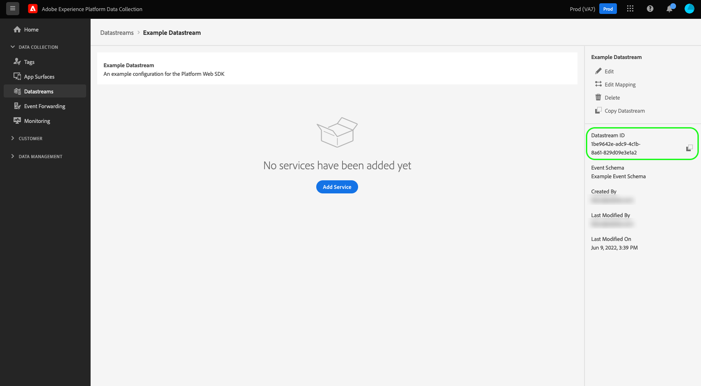

# Erstellen und Konfigurieren von Datenspeichern

Dieses Dokument beschreibt die Schritte zum Konfigurieren eines [Datenstroms](./overview.md) in der Benutzeroberfläche.

## Zugriff auf den Arbeitsbereich [!UICONTROL Datenströme]

Sie können Datenströme in der Datenerfassungs-Benutzeroberfläche oder der Experience Platform-Benutzeroberfläche durch Auswählen von **[!UICONTROL Datenströme]** in der linken Navigationsleiste erstellen und verwalten.

In der Registerkarte **[!UICONTROL Datenströme]** wird eine Liste mit vorhandenen Datenströmen angezeigt, darunter auch der Anzeigename, die Kennung und das Datum der letzten Änderung. Wählen Sie den Namen eines Datenstroms aus, um [seine Details anzuzeigen und Services zu konfigurieren](#view-details).

Wählen Sie das Symbol „Mehr“ (**...**) aus, wenn Sie für einen bestimmten Datenstrom weitere Optionen anzeigen möchten. Auswählen Sie **[!UICONTROL Bearbeiten]** aus, um die [Basiskonfiguration](#configure) für den Datenstrom zu aktualisieren, oder wählen Sie **[!UICONTROL Löschen]** aus, um den Datenstrom zu entfernen.

## Erstellen eines neuen Datenstroms {#create}

Um einen Datenstrom zu erstellen, wählen Sie zunächst **[!UICONTROL Neuer Datenstrom]** aus.

Der Workflow zur Erstellung eines Datenstroms wird geöffnet, beginnend mit dem Konfigurationsschritt. Geben Sie hier einen Namen und eine optionale Beschreibung für den Datenstrom an.

Wenn Sie diesen Datenstrom zur Verwendung in Experience Platform konfigurieren und das Platform Web SDK verwenden, müssen Sie auch ein [ereignisbasiertes Experience-Datenmodell-Schema (XDM)](../xdm/classes/experienceevent.md) für die Daten auswählen, die aufgenommen werden sollen.

### Geolocation und Netzwerksuche konfigurieren {#geolocation-network-lookup}

Mit den Einstellungen für Geolocation und Netzwerksuche können Sie die Granularität der geografischen Daten und Daten auf Netzwerkebene definieren, die Sie erfassen möchten.

Erweitern Sie die **[!UICONTROL Geolocation und Netzwerksuche]** um die unten beschriebenen Einstellungen zu konfigurieren.

| Einstellung | Beschreibung |
| --- | --- |
| [!UICONTROL Geo-Suche] | Aktiviert die Geolocation-Suche für die ausgewählten Optionen basierend auf der IP-Adresse des Besuchers. Zu den verfügbaren Optionen gehören: <ul><li>**Land**: Füllt `xdm.placeContext.geo.countryCode`</li><li>**Postleitzahl**: Füllt `xdm.placeContext.geo.postalCode`</li><li>**Bundesland/Provinz**: Füllt `xdm.placeContext.geo.stateProvince`</li><li>**DMA**: Füllt `xdm.placeContext.geo.dmaID`</li><li>**Ort**: Füllt `xdm.placeContext.geo.city`</li><li>**Breiten**: Füllt `xdm.placeContext.geo._schema.latitude`</li><li>**Länge**: Füllt `xdm.placeContext.geo._schema.longitude`</li></ul>Die Auswahl von **[!UICONTROL Stadt]**, **[!UICONTROL Breitengrad]** oder **[!UICONTROL Längengrad]** liefert Koordinaten mit bis zu zwei Dezimalstellen, unabhängig davon, welche anderen Optionen ausgewählt wurden. Dies gilt als Granularität auf Stadtebene.   Wenn Sie keine Option auswählen, werden die Geolocation-Suchen deaktiviert. Geolocation erfolgt vor [!UICONTROL IP-Verschleierung], was bedeutet, dass sie von der [!UICONTROL IP-Verschleierung] -Einstellung. |
| [!UICONTROL Netzwerksuche] | Aktiviert die Netzwerksuche für die ausgewählten Optionen basierend auf der IP-Adresse des Besuchers. Zu den verfügbaren Optionen gehören: <ul><li>**Netzbetreiber**: Füllt `xdm.environment.carrier`</li><li>**Domäne**: Füllt `xdm.environment.domain`</li><li>**ISP**: Füllt `xdm.environment.ISP`</li></ul> |

Wenn Sie eines der oben genannten Felder für die Datenerfassung aktivieren, stellen Sie sicher, dass Sie die Variable [`context`](../edge/data-collection/automatic-information.md) Array-Eigenschaft bei [Konfigurieren des Web SDK](../edge/fundamentals/configuring-the-sdk.md).

Geolocation-Suchfelder verwenden die `context` Array-Zeichenfolge `"placeContext"`, während Suchfelder im Netzwerk die `context` Array-Zeichenfolge `"environment"`.

Stellen Sie außerdem sicher, dass jedes gewünschte XDM-Feld in Ihrem Schema vorhanden ist. Ist dies nicht der Fall, können Sie die von Adobe bereitgestellte `Environment Details` Feldergruppe in Ihr Schema ein.

### Konfigurieren der Gerätesuche {#geolocation-device-lookup}

Die **[!UICONTROL Gerätesuche]** -Einstellungen können Sie gerätespezifische Informationen auswählen, die Sie erfassen möchten.

Erweitern Sie die **[!UICONTROL Gerätesuche]** um die unten beschriebenen Einstellungen zu konfigurieren.

>[!IMPORTANT]
>
>Die in der folgenden Tabelle beschriebenen Einstellungen schließen sich gegenseitig aus. Sie können nicht sowohl Benutzeragenten- als auch Geräte-Lookup-Daten gleichzeitig auswählen.

| Einstellung | Beschreibung |
| --- | --- |
| **[!UICONTROL Überschriften von Benutzeragenten und Client-Hinweisen beibehalten]** | Wählen Sie diese Option, um nur die in der Benutzeragenten-Zeichenfolge gespeicherten Informationen zu erfassen. Diese Einstellung ist standardmäßig ausgewählt. Populationen `xdm.environment.browserDetails.userAgent` |
| **[!UICONTROL Verwenden Sie die Gerätesuche, um die folgenden Informationen zu erfassen]** | Wählen Sie diese Option aus, wenn Sie eine oder mehrere der folgenden gerätespezifischen Informationen erfassen möchten: <ul><li>**[!UICONTROL Gerät]** Information:<ul><li>**Gerätehersteller**: Füllt `xdm.device.manufacturer`</li><li>**Gerätemodell**: Füllt `xdm.device.modelNumber`</li><li>**Marketing-Name**: Füllt `xdm.device.model`</li></ul></li><li>**[!UICONTROL Hardware]** Information: <ul><li>**Hardwaretyp**: Füllt `xdm.device.type`</li><li>**Anzeigehöhe**: Füllt `xdm.device.screenHeight`</li><li>**Anzeigebreite**: Füllt `xdm.device.screenWidth`</li><li>**Farbtiefe anzeigen**: Füllt `xdm.device.colorDepth`</li></ul></li><li>**[!UICONTROL Browser]** Information: <ul><li>**Browser-Anbieter**: Füllt `xdm.environment.browserDetails.vendor`</li><li>**Browsername**: Füllt `xdm.environment.browserDetails.name`</li><li>**Browserversion**: Füllt `xdm.environment.browserDetails.version`</li></ul></li><li>**[!UICONTROL Betriebssystem]** Information: <ul><li>**Betriebssystemanbieter**: Füllt `xdm.environment.operatingSystemVendor`</li><li>**Betriebssystemname**: Füllt `xdm.environment.operatingSystem`</li><li>**Betriebssystemversion**: Füllt `xdm.environment.operatingSystemVersion`</li></ul></li></ul>Informationen zur Gerätesuche können nicht zusammen mit Benutzeragent und Client-Hinweisen erfasst werden. Wenn Sie auswählen, Geräteinformationen zu erfassen, wird die Erfassung von Benutzeragent- und Client-Hinweisen deaktiviert und umgekehrt. |
| **[!UICONTROL Erfassen Sie keine Geräteinformationen.]** | Wählen Sie diese Option aus, wenn Sie keine Gerätesucherinformationen erfassen möchten. Es werden keine Daten zu Gerät, Hardware, Browser, Betriebssystem, Benutzeragent oder Client-Hinweis erfasst. |

Wenn Sie eines der oben genannten Felder für die Datenerfassung aktivieren, stellen Sie sicher, dass Sie die Variable [`context`](../edge/data-collection/automatic-information.md) Array-Eigenschaft bei [Konfigurieren des Web SDK](../edge/fundamentals/configuring-the-sdk.md).

Geräte- und Hardwareinformationen verwenden die `context` Array-Zeichenfolge `"device"`, während Browser- und Betriebssysteminformationen die `context` Array-Zeichenfolge `"environment"`.

Stellen Sie außerdem sicher, dass jedes gewünschte XDM-Feld in Ihrem Schema vorhanden ist. Ist dies nicht der Fall, können Sie die von Adobe bereitgestellte `Environment Details` Feldergruppe in Ihr Schema ein.

### Erweiterte Optionen konfigurieren {#@advanced-options}

Auswählen **[!UICONTROL Erweiterte Optionen]** , um zusätzliche Steuerelemente zum Konfigurieren des Datastreams anzuzeigen, z. B. IP-Verschleierung, Erstanbieter-ID-Cookies und mehr.

>[!IMPORTANT]
>
> Sie sind dafür verantwortlich, sicherzustellen, dass Sie alle erforderlichen Berechtigungen, Einverständnisse, Genehmigungen und Autorisierungen erhalten haben, die nach den geltenden Gesetzen und Vorschriften erforderlich sind, um personenbezogene Daten zu erfassen, zu verarbeiten und zu übermitteln, einschließlich präziser Geolokalisierungsinformationen.
> 
> Die von Ihnen gewählte Art der IP-Adressverschleierung hat keinen Einfluss auf den Umfang der Geolokalisierungsinformationen, die aus der IP-Adresse abgeleitet und an Ihre konfigurierten Adobe-Lösungen gesendet werden. Die Suche nach Geolokalisierungen muss begrenzt oder separat deaktiviert werden.

| Einstellung | Beschreibung |
| --- | --- |
| [!UICONTROL IP-Verschleierung] | Gibt den Typ der IP-Verschleierung an, die auf dem Datenstrom angewendet werden soll. Die IP-Verschleierungseinstellung wirkt sich auf jede Verarbeitung aus, die auf der Kunden-IP basiert. Dies umfasst alle Experience Cloud-Dienste, die Daten aus Ihrem Datenstrom empfangen. 
Verfügbare Optionen:
 <ul><li>**[!UICONTROL Keine]**: Deaktiviert die IP-Verschleierung. Die vollständige Benutzer-IP-Adresse wird über den Datenstrom gesendet.</li><li>**[!UICONTROL Teilweise]**: Bei IPv4-Adressen wird das letzte Oktett der Benutzer-IP-Adresse verschleiert. Bei IPv6-Adressen werden die letzten 80 Bits der Adresse verschleiert. 
Beispiele:
 <ul><li>IPv4: `1.2.3.4` -> `1.2.3.0`</li><li>IPv6: `2001:0db8:1345:fd27:0000:ff00:0042:8329` -> `2001:0db8:1345:0000:0000:0000:0000:0000`</li></ul></li><li>**[!UICONTROL Vollständig]**: Verschleiert die gesamte IP-Adresse. 
Beispiele:
 <ul><li>IPv4: `1.2.3.4` -> `0.0.0.0`</li><li>IPv6: `2001:0db8:1345:fd27:0000:ff00:0042:8329` -> `0:0:0:0:0:0:0:0`</li></ul></li></ul> Auswirkungen der IP-Verschleierung auf andere Adobe-Produkte: <ul><li>**Adobe Target**: Die Datenasterebene [!UICONTROL IP-Verschleierung] wird vor dem [!UICONTROL IP-Verschleierung] in Adobe Target an alle IP-Adressen gesendet werden, die in der Anfrage vorhanden sind. Wenn beispielsweise die Datenasterebene [!UICONTROL IP-Verschleierung] ist auf **[!UICONTROL Voll]** und die IP-Verschleierungsoption von Adobe Target auf **[!UICONTROL Verschleierung des letzten Oktetts]**, erhält Adobe Target eine vollständig verschleierte IP-Adresse. Wenn der Datastream-Wert [!UICONTROL IP-Verschleierung] ist auf **[!UICONTROL Teilweise]** und die IP-Verschleierungsoption von Adobe Target auf **[!UICONTROL Voll]**, erhält Adobe Target eine teilweise verschleierte IP-Adresse und wendet dann die vollständige Verschleierung an. Die IP-Verschleierung von Adobe Target wird unabhängig vom Datastraam verwaltet. Weitere Informationen finden Sie in der Adobe Target-Dokumentation zu [IP-Verschleierung](https://developer.adobe.com/target/before-implement/privacy/privacy/) und [Geolokalisierung](https://experienceleague.adobe.com/docs/target/using/audiences/create-audiences/categories-audiences/geo.html?lang=de).</li><li>**Audience Manager**: Die Datenasterebene [!UICONTROL IP-Verschleierung] -Einstellung angewendet wird, bevor [!UICONTROL IP-Verschleierung] im Audience Manager an alle in der Anfrage vorhandenen IP-Adressen ausgeführt werden. Jede von Audience Manager durchgeführte Geolokalisierungssuche ist von der Option [!UICONTROL IP-Verschleierung] auf Datenstromebene betroffen. Eine Geolokalisierungssuche in Audience Manager, die auf einer vollständig verschleierten IP basiert, führt zu einer unbekannten Region, und alle Segmente, die auf den resultierenden Geolokalisierungsdaten basieren, werden nicht realisiert. Weitere Informationen finden Sie in der Audience Manager-Dokumentation unter [IP-Verschleierung](https://experienceleague.adobe.com/docs/audience-manager/user-guide/features/administration/ip-obfuscation.html?lang=de).</li><li>**Adobe Analytics**: Adobe Analytics erhält derzeit die teilweise verschleierten IP-Adressen, wenn eine andere IP-Verschleierungsoption als „KEINE“ ausgewählt ist. Damit Analytics vollständig verschleierte IP-Adressen empfangen kann, müssen Sie die IP-Verschleierung separat in Adobe Analytics konfigurieren. Dieses Verhalten wird in zukünftigen Versionen aktualisiert. In der Adobe Analytics-[Dokumentation](https://experienceleague.adobe.com/docs/analytics/admin/admin-tools/manage-report-suites/edit-report-suite/report-suite-general/general-acct-settings-admin.html?lang=de) finden Sie weitere Einzelheiten zur Aktivierung der IP-Verschleierung in Analytics.</li></ul> |
| [!UICONTROL First-Party-ID-Cookie] | Wenn diese Einstellung aktiviert ist, weist sie das Edge-Netzwerk an, bei der Suche nach einer [First-Party-Geräte-ID](../edge/identity/first-party-device-ids.md) ein bestimmtes Cookie zu verwenden, anstatt nach diesem Wert in der Identity Map zu suchen.  Wenn Sie diese Einstellung aktivieren, müssen Sie den Namen des Cookies angeben, in dem die ID gespeichert ist. |
| [!UICONTROL Synchronisierung der Third-Party-ID] | ID-Synchronisationen können in Container zusammengefasst werden, damit verschiedene ID-Synchronisationen zu unterschiedlichen Zeiten ausgeführt werden können. Wenn diese Einstellung aktiviert ist, können Sie festlegen, welcher Container mit ID-Synchronisationen für diesen Datenstrom ausgeführt werden soll. |
| [!UICONTROL Container-ID der Drittanbieter-ID-Synchronisierung] | Die numerische ID des Containers, der für die ID-Synchronisierung von Drittanbietern verwendet werden soll. |
| [!UICONTROL Überschreibungen der Container-ID] | In diesem Abschnitt können Sie zusätzliche IDs für ID-Synchronisierungs-Container von Drittanbietern definieren, die Sie verwenden können, um die standardmäßige zu überschreiben. |
| [!UICONTROL Zugriffstyp] | Legt den Authentifizierungstyp fest, den das Edge Network für den Datenstrom akzeptiert. <ul><li>**[!UICONTROL Gemischte Authentifizierung]**: Wenn diese Option aktiviert ist, akzeptiert das Edge Network sowohl authentifizierte als auch nicht authentifizierte Anfragen. Wählen Sie diese Option, wenn Sie das Web SDK oder das [Mobile SDK](https://developer.adobe.com/client-sdks/documentation/) zusammen mit der [Server-API](../server-api/overview.md) verwenden möchten. </li><li>**[!UICONTROL Nur authentifiziert]**: Wenn diese Option aktiviert ist, akzeptiert das Edge Network nur authentifizierte Anfragen. Wählen Sie diese Option aus, wenn Sie beabsichtigen, nur die Server-API zu verwenden und verhindern möchten, dass nicht authentifizierte Anfragen vom Edge Network verarbeitet werden.</li></ul> |
| [!UICONTROL Media Analytics] | Wählen Sie diese Option, um die Verarbeitung von Streaming-Tracking-Daten für die Edge-Netzwerkintegration über Experience Platform-SDKs oder Media Edge-API zu aktivieren. Informationen zu Media Analytics finden Sie im Abschnitt [Dokumentation](https://experienceleague.adobe.com/docs/media-analytics/using/media-overview.html?lang=de). |

Wenn hier Ihren Datenstrom für Experience Platform konfigurieren, folgen Sie dem Tutorial zu [Datenvorbereitung für die Datenerfassung](./data-prep.md), um Ihre Daten einem Platform-Ereignisschema zuzuordnen, bevor Sie mit dieser Anleitung fortfahren. Wählen Sie andernfalls **[!UICONTROL Speichern]** und fahren Sie mit dem nächsten Abschnitt fort.

## Anzeigen von Datenstromdetails {#view-details}

Nachdem Sie einen neuen Datenstrom konfiguriert oder einen vorhandenen ausgewählt haben, um ihn anzuzeigen, wird die Detailseite für diesen Datenstrom angezeigt. Hier finden Sie weitere Informationen zum Datenstrom, einschließlich seiner Kennung.

Im Bildschirm mit den Datenspeicherdetails können Sie [Services hinzufügen](#add-services), um Funktionen der Adobe Experience Cloud-Produkte zu aktivieren, auf die Sie Zugriff haben. Sie können auch die [Basiskonfiguration](#create) des Datenstroms bearbeiten, seine [Zuordnungsregeln](./data-prep.md) aktualisieren, [den Datenstrom kopieren](#copy) oder vollständig löschen.

## Hinzufügen von Services zu einem Datenstrom {#add-services}

Wählen Sie auf der Detailseite eines Datenstroms die Option **[!UICONTROL Service hinzufügen]** aus, um verfügbare Services für diesen Datenstrom hinzuzufügen.

Wählen Sie im nächsten Bildschirm im Dropdown-Menü einen Service aus, der für diesen Datenstrom konfiguriert werden soll. In dieser Liste werden nur die Services angezeigt, auf die Sie Zugriff haben.

Wählen Sie den gewünschten Service aus, geben Sie die angezeigten Konfigurationsoptionen ein und wählen Sie dann **[!UICONTROL Speichern]** aus, um den Service zum Datenstrom hinzuzufügen. Alle hinzugefügten Services werden in der Detailansicht für den Datenstrom angezeigt.

In den folgenden Unterabschnitten werden die Konfigurationsoptionen für die einzelnen Services beschrieben.

>[!NOTE]
>
>Jede Service-Konfiguration enthält den Umschalter **[!UICONTROL Aktiviert]**, der automatisch aktiviert wird, wenn der Service ausgewählt wird. Um den ausgewählten Service für diesen Datenstrom zu deaktivieren, wählen Sie nochmals den Umschalter **[!UICONTROL Aktiviert]** aus.

### Adobe Analytics-Einstellungen {#analytics}

Mit diesem Service wird festgelegt, ob und wie Daten an Adobe Analytics gesendet werden. Weitere Informationen finden Sie in der Anleitung zum [Senden von Daten an Analytics](../edge/data-collection/adobe-analytics/analytics-overview.md).

| Einstellung | Beschreibung |
| --- | --- |
| [!UICONTROL Report Suite-ID] | **(Erforderlich)** Die ID der Analytics Report Suite, an die Sie Daten senden möchten. Diese ID finden Sie in der Adobe Analytics-Benutzeroberfläche unter [!UICONTROL Administration] > [!UICONTROL ReportSuites]. Wenn mehrere Report Suites angegeben sind, werden die Daten in jede einzelne Report Suite kopiert. |
| [!UICONTROL Report Suite-Überschreibungen] | In diesem Abschnitt können Sie zusätzliche Report Suite-IDs hinzufügen, die Sie verwenden können, um die Standard-ID zu überschreiben. |

### Adobe Audience Manager-Einstellungen {#audience-manager}

Mit diesem Service wird festgelegt, ob und wie Daten an Adobe Audience Manager gesendet werden. Zum Senden von Daten an Audience Manager müssen Sie nur diesen Abschnitt aktivieren. Die anderen Einstellungen sind optional, werden jedoch empfohlen.

| Einstellung | Beschreibung |
| --- | --- |
| [!UICONTROL Cookie-Ziele aktiviert] | Ermöglicht dem SDK das Freigeben von Segmentinformationen über [Cookie-Ziele](https://experienceleague.adobe.com/docs/audience-manager/user-guide/features/destinations/custom-destinations/create-cookie-destination.html?lang=de) in [!DNL Audience Manager]. |
| [!UICONTROL URL-Ziele aktiviert] | Ermöglicht dem SDK das Freigeben von Segmentinformationen über [URL-Ziele](https://experienceleague.adobe.com/docs/audience-manager/user-guide/features/destinations/custom-destinations/create-url-destination.html?lang=de) in [!DNL Audience Manager]. |

### Adobe Experience Platform-Einstellungen {#aep}

>[!IMPORTANT]
>
>Beachten Sie beim Aktivieren eines Datenstroms für Platform die aktuell verwendete Platform-Sandbox, die in der oberen Leiste der Benutzeroberfläche angezeigt wird.
>
>
>
>Sandboxes sind virtuelle Partitionen in Adobe Experience Platform, mit denen Sie Ihre Daten und Implementierungen von anderen in Ihrem Unternehmen isolieren können. Nachdem ein Datenstrom erstellt wurde, kann seine Sandbox nicht mehr geändert werden. Weitere Informationen zur Rolle von Sandboxes in Experience Platform finden Sie i der [Sandbox-Dokumentation](../sandboxes/home.md).

Mit diesem Service wird festgelegt, ob und wie Daten an Adobe Experience Platform gesendet werden.

| Einstellung | Beschreibung |
|---| --- |
| [!UICONTROL Ereignis-Datensatz] | **(Erforderlich)** Wählen Sie den Platform-Datensatz aus, an den Kundenereignisdaten gestreamt werden. Dieses Schema muss die [XDM ExperienceEvent-Klasse](../xdm/classes/experienceevent.md) verwenden. Um weitere Datensätze hinzuzufügen, wählen Sie **[!UICONTROL Ereignis-Datensatz hinzufügen]** aus. |
| [!UICONTROL Profildatensatz] | Wählen Sie den Platform-Datensatz aus, an den Kundenattributdaten gesendet werden. Dieses Schema muss die [Klasse „XDM Individual Profile“](../xdm/classes/individual-profile.md) verwenden. |
| [!UICONTROL Offer Decisioning] | Aktivieren Sie dieses Kontrollkästchen, um Offer Decisioning für eine Platform Web SDK-Implementierung zu aktivieren. Weitere Informationen dazu finden Sie im Handbuch zum [Verwenden von Offer Decisioning mit dem Platform Web SDK](../edge/personalization/offer-decisioning/offer-decisioning-overview.md).  Weitere Informationen zu Offer Decisioning-Funktionen finden Sie in der [Adobe Journey Optimizer-Dokumentation](https://experienceleague.adobe.com/docs/journey-optimizer/using/offer-decisioniong/get-started/starting-offer-decisioning.html?lang=de). |
| [!UICONTROL Edge-Segmentierung] | Aktivieren Sie dieses Kontrollkästchen, um [Edge-Segmentierung](../segmentation/ui/edge-segmentation.md) für diesen Datenstrom zu aktivieren. Wenn das SDK Daten über einen Datenstrom sendet, für den die Edge-Segmentierung aktiviert ist, werden alle aktualisierten Segmentzugehörigkeiten für das betreffende Profil in der Antwort zurückgesendet.  Diese Option kann in Kombination mit [!UICONTROL Personalisierungszielen] für [Anwendungsfälle für die Personalisierung der nächsten Seite](../destinations/ui/activate-edge-personalization-destinations.md) verwendet werden. |
| [!UICONTROL Personalisierungsziele] | Wenn diese Option nach dem Aktivieren des Kontrollkästchens [!UICONTROL Edge-Segmentierung] aktiviert wird, kann der Datenstrom mit Personalisierungszielen, wie etwa [benutzerdefinierte Personalisierung](../destinations/catalog/personalization/custom-personalization.md), verbunden werden.  Die genauen Schritte zum [Konfigurieren von Personalisierungszielen](../destinations/ui/activate-edge-personalization-destinations.md) finden Sie in der Dokumentation zu Zielen. |
| [!UICONTROL Adobe Journey Optimizer] | Aktivieren Sie dieses Kontrollkästchen, um [Adobe Journey Optimizer](https://experienceleague.adobe.com/docs/journey-optimizer/using/ajo-home.html?lang=de) für diesen Datenstrom zu aktivieren.    Wenn diese Option aktiviert ist, kann der Datenstrom personalisierte Inhalte aus Web- und App-basierten Inbound-Kampagnen in [!DNL Adobe Journey Optimizer] zurückgeben. [!UICONTROL Edge-Segmentierung] muss aktiv sein. Wenn [!UICONTROL Edge-Segmentierung] nicht aktiviert ist, ist diese Option ausgegraut. |

### Adobe Target-Einstellungen {#target}

Mit diesem Service wird festgelegt, ob und wie Daten an Adobe Target gesendet werden.

| Einstellung | Beschreibung |
| --- | --- |
| [!UICONTROL Eigenschafts-Token] | [!DNL Target] ermöglicht Kunden, Berechtigungen durch die Verwendung von Eigenschaften zu steuern. Weitere Informationen zu Eigenschaften finden Sie in der Anleitung zum [Konfigurieren von Unternehmensberechtigungen](https://experienceleague.adobe.com/docs/target/using/administer/manage-users/enterprise/properties-overview.html?lang=de) in der [!DNL Target]-Dokumentation.  Das Eigenschafts-Token befindet sich in der Adobe Target-Benutzeroberfläche unter [!UICONTROL Einrichtung] > [!UICONTROL Eigenschaften]. |
| [!UICONTROL Target-Umgebungs-ID] | [Umgebungen in Adobe Target](https://experienceleague.adobe.com/docs/target/using/administer/hosts.html?lang=de) helfen Ihnen in allen Entwicklungsphasen bei der Implementierung. Diese Einstellung gibt an, welche Umgebung Sie für diesen Datenstrom verwenden werden.  Empfohlen wird, der Einfachheit halber eine unterschiedliche Einstellung für jede Ihrer `dev`-, `stage`- und `prod`Datenstrom-Umgebungen auszuwählen. Wenn Sie jedoch bereits Adobe Target-Umgebungen definiert haben, können Sie diese verwenden. |
| [!UICONTROL Namespace der Target-Third-Party-ID] | Der Identity-Namespace für die `mbox3rdPartyId`, den Sie für diesen Datenstrom verwenden möchten. Weitere Informationen dazu erhalten Sie im Handbuch zur [Implementierung der `mbox3rdPartyId` mit dem Web SDK](../edge/personalization/adobe-target/using-mbox-3rdpartyid.md). |
| [!UICONTROL Eigenschafts-Token-Überschreibungen] | In diesem Abschnitt können Sie zusätzliche Eigenschafts-Token definieren, mit denen Sie das Standard-Token überschreiben können. |

### Einstellungen zur [!UICONTROL Ereignisweiterleitung]

Mit diesem Service wird festgelegt, ob und wie Daten an die [Ereignisweiterleitung](../tags/ui/event-forwarding/overview.md) gesendet werden.

| Einstellung | Beschreibung |
| --- | --- |
| [!UICONTROL Start-Eigenschaft] | **(Erforderlich)** Die Ereignisweiterleitungs-Eigenschaft, an die Sie Daten senden möchten. |
| [!UICONTROL Start-Umgebung] | **(Erforderlich)** Die Umgebung innerhalb der ausgewählten Eigenschaft, an die Sie Daten senden möchten. |

>[!NOTE]
>
>Sie können die Option **[!UICONTROL IDs manuell eingeben]** auswählen, um die Eigenschafts- und Umgebungsnamen manuell einzugeben, anstatt die Dropdown-Menüs zu verwenden.

## Kopieren eines Datenstroms {#copy}

Sie können eine Kopie eines vorhandenen Datenstroms erstellen und seine Details nach Bedarf ändern.

>[!NOTE]
>
>Datenströme können nur innerhalb derselben [Sandbox](../sandboxes/home.md) kopiert werden. Mit anderen Worten: Sie können den Datenstrom von einer Sandbox nicht in eine andere kopieren.

Wählen Sie auf der Hauptseite im Arbeitsbereich [!UICONTROL Datenströme] die Auslassungszeichen für den entsprechenden Datenstrom aus (**...**) und danach **[!UICONTROL Kopieren]**.

![Bild, das die Option [!UICONTROL Kopieren] zeigt, die in der Datenstrom-Listenansicht ausgewählt wird](assets/configure/copy-datastream-list.png)

Alternativ können Sie in der Detailansicht eines Datenstroms **[!UICONTROL Datenstrom kopieren]** auswählen.

![Bild, das die Option [!UICONTROL Kopieren] zeigt, die in der Datenstrom-Detailansicht ausgewählt wird](assets/configure/copy-datastream-details.png)

Ein Bestätigungsdialogfeld erscheint, in dem Sie aufgefordert werden, einen eindeutigen Namen für den neuen, zu erstellenden Datenstrom sowie Details zu den Konfigurationsoptionen, die kopiert werden, anzugeben. Wenn Sie bereit sind, wählen Sie **[!UICONTROL Kopieren]** aus.

Die Hauptseite des Arbeitsbereichs [!UICONTROL Datenstrom] wird erneut angezeigt, diesmal mit dem neuen Datenstrom.

## Nächste Schritte

In diesem Handbuch wurde beschrieben, wie Datenströme in der Datenerfassungs-Benutzeroberfläche verwaltet werden. Weitere Informationen zum Installieren und Konfigurieren des Web SDK nach dem Einrichten eines Datenstroms finden Sie im [Handbuch E2E zur Datenerfassung](../collection/e2e.md#install).
