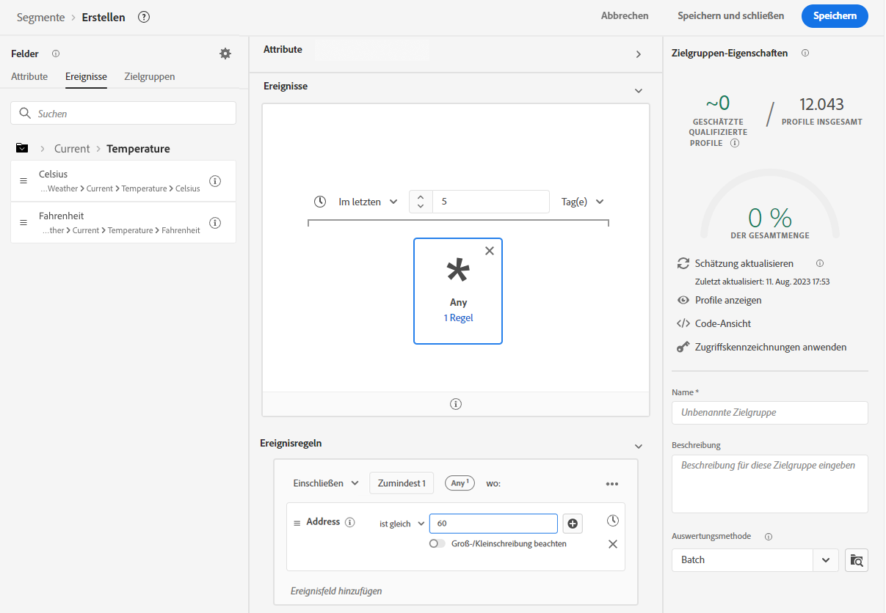
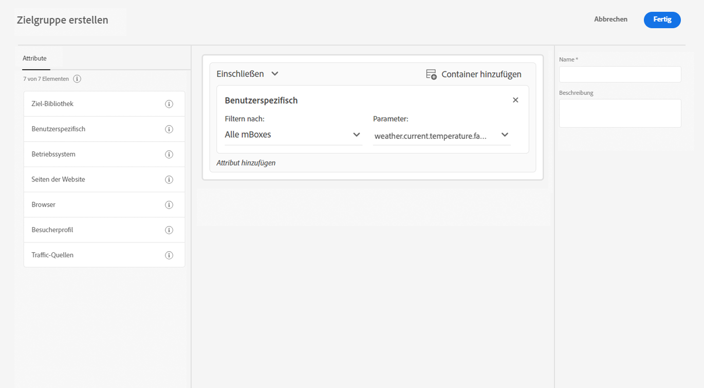

# Erweitern der Datenerfassung mit Wetterdaten aus [!DNL The Weather Channel]

Adobe ist eine Partnerschaft mit [!DNL [The Weather Company]](https://www.ibm.com/weather) eingegangen, um die über Datenströme gesammelten Daten um den zusätzlichen Kontext des Wetters in den Vereinigten Staaten zu ergänzen. Sie können diese Daten für Analysen, Targeting und die Erstellung von Zielgruppen in Experience Platform verwenden.

Es gibt drei Datentypen, die in verfügbar sind [!DNL The Weather Channel]:

* **[!UICONTROL Aktuelles Wetter]**: Die aktuellen Wetterbedingungen der Benutzenden basierend auf ihrem Standort. Dazu gehören aktuelle Temperatur, Niederschlag, Wolkenabdeckung und mehr.
* **[!UICONTROL Vorhergesagtes Wetter]**: Die Prognose enthält die 1-, 2-, 3-, 5-, 7- und 10-tägige Prognose für den Standort des Benutzers.
* **[!UICONTROL Trigger]**: Trigger sind spezifische Kombinationen, die verschiedenen semantischen Wetterbedingungen entsprechen. Es gibt drei verschiedene Arten von Wetter-Triggern:

   * **[!UICONTROL Wetter-Trigger]**: Semantisch aussagekräftige Bedingungen, wie z. B. kaltes oder regnerisches Wetter. Diese können sich in ihren Definitionen nach verschiedenen Klimazonen unterscheiden.
   * **[!UICONTROL Produkt-Trigger]**: Bedingungen, die zum Kauf verschiedener Arten von Produkten führen würden. Zum Beispiel: Die Prognosen für das kalte Wetter könnten dazu führen, dass der Kauf von Regenmänteln wahrscheinlicher ist.
   * **[!UICONTROL Unwetter-Trigger]**: Unwetterwarnungen wie Schneesturm- oder Hurrikan-Warnungen.

## Voraussetzungen {#prerequisites}

Bevor Sie Wetterdaten verwenden, stellen Sie sicher, dass Sie die folgenden Voraussetzungen erfüllen:

* Sie müssen die Wetterdaten lizenzieren, die Sie von [!DNL The Weather Channel]. Von dort werden sie dann für Ihr Konto aktiviert.
* Wetterdaten sind nur über Datenströme verfügbar. Um Wetterdaten zu verwenden, müssen Sie [!DNL Web SDK], [!DNL Mobile Edge Extension] oder [Server-API](../../server-api/overview.md) , um diese Daten einzuschließen.
* Für Ihren Datenstrom muss die [[!UICONTROL Geo-Position]](../configure.md#advanced-options) aktiviert sein.
* Fügen Sie die [Wetterfeldgruppe](#schema-configuration) dem Schema, das Sie verwenden.

## Bereitstellung {#provisioning}

Sobald Sie die Daten von [!DNL The Weather Channel] haben lizenzieren lassen, wird Ihr Konto für den Zugriff auf die Daten freigegeben. Als Nächstes müssen Sie sich an die Adobe-Kundenunterstützung wenden, damit die Daten in Ihrem Datenstrom aktiviert werden. Nach der Aktivierung werden die Daten automatisch angefügt.

Sie können überprüfen, ob sie hinzugefügt werden, indem Sie eine Randverfolgung mit dem Debugger ausführen oder Assurance verwenden, um einen Treffer über das [!DNL Edge Network] zu verfolgen.

### Schemakonfiguration {#schema-configuration}

Sie müssen zu Ihrem Experience Platform-Schema die Wetterfeldgruppen hinzufügen, die dem Ereignisdatensatz entsprechen, den Sie in Ihrem Datenstrom verwenden. Es stehen fünf Feldergruppen zur Verfügung:

* [!UICONTROL Vorhergesagtes Wetter]
* [!UICONTROL Aktuelles Wetter]
* [!UICONTROL Produkt-Trigger]
* [!UICONTROL Relative Trigger]
* [!UICONTROL Unwetter-Trigger]

## Zugriff auf die Wetterdaten {#access-weather-data}

Sobald Ihre Daten lizenziert und verfügbar sind, können Sie in den Adobe-Services auf verschiedene Arten darauf zugreifen.

### Adobe Analytics {#analytics}

In [!DNL Adobe Analytics] stehen die Wetterdaten zusammen mit dem Rest Ihres [!DNL XDM]-Schemas für die Zuordnung über Verarbeitungsregeln zur Verfügung.

Die Liste der Felder, die Sie zuordnen können, finden Sie auf der Seite [Wetterreferenz](weather-reference.md). Wie bei allen [!DNL XDM]-Schemata werden die Schlüssel mit dem Präfix `a.x` versehen. Ein Feld mit dem Namen `weather.current.temperature.farenheit` würde zum Beispiel in [!DNL Analytics] als `a.x.weather.current.temperature.farenheit` erscheinen.

### Adobe Customer Journey Analytics {#cja}

In [!DNL Adobe Customer Journey Analytics] sind die Wetterdaten in dem Datensatz verfügbar, der im Datenstrom angegeben ist. Solange die Wetterattribute [zu Ihrem Schema hinzugefügt wurde](#prerequisites-prerequisites), können sie [Hinzufügen zu einer Datenansicht](https://experienceleague.adobe.com/docs/analytics-platform/using/cja-dataviews/create-dataview.html?lang=de) in [!DNL Customer Journey Analytics].

### Real-Time Customer Data Platform {#rtcdp}

Die Wetterdaten sind im [Real-time Customer Data Platform](../../rtcdp/overview.md), zur Verwendung in Zielgruppen. Wetterdaten werden an Ereignisse angehängt.

Da sich die Wetterbedingungen häufig ändern, empfiehlt Adobe, die Zielgruppen mit Zeitbeschränkungen zu versehen, wie im Beispiel oben gezeigt. Einen kalten Tag in den letzten ein oder zwei Tagen zu haben ist viel wirkungsvoller als einen kalten Tag vor 6 Monaten.

Informationen über die verfügbaren Felder finden Sie in der [Wetterreferenz](weather-reference.md).

### Adobe Target {#target}

In [!DNL Adobe Target] können Sie Wetterdaten nutzen, um die Personalisierung in Echtzeit voranzutreiben. Die Wetterdaten werden als [!UICONTROL mBox]-Parameter an [!DNL Target] übergeben, und Sie können über einen benutzerdefinierten [!UICONTROL mBox]-Parameter auf sie zugreifen.

Der Parameter ist der [!DNL XDM]-Pfad zu einem bestimmten Feld. Weitere Informationen zu den verfügbaren Feldern und den entsprechenden Pfaden finden Sie in der [Wetterreferenz](weather-reference.md).

## Nächste Schritte {#next-steps}

Nach dem Lesen dieses Dokuments wissen Sie nun besser, wie Sie Wetterdaten in verschiedenen Adobe-Lösungen nutzen können. Weitere Informationen über die Zuordnung von Wetterdatenfeldern finden Sie in der [Feldzuordnungsreferenz](weather-reference.md).
