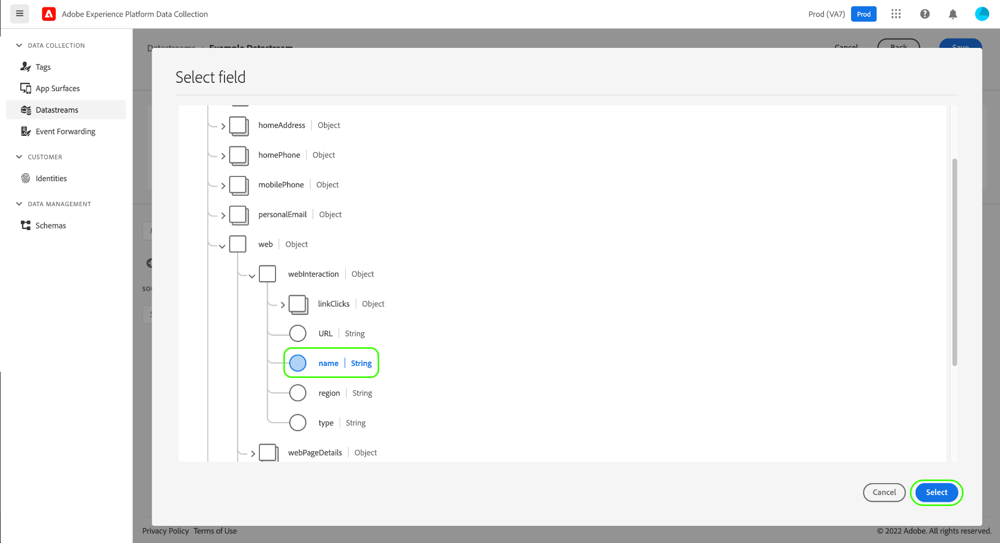
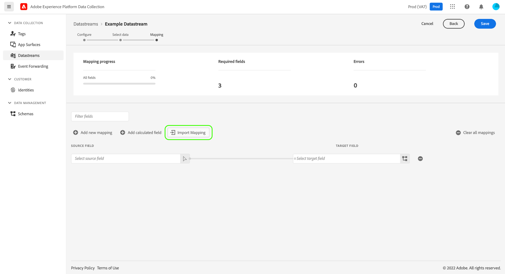

# Datenvorbereitung für die Datenerfassung

Verwenden Sie [!DNL Data Prep], einen [!DNL Adobe Experience Platform]-Service, um Daten dem Experience-Datenmodell (XDM) zuzuordnen, umzuformen [&#x200B; validieren](/help/xdm/home.md). Beim Konfigurieren eines Experience Platform-aktivierten [Datenstroms](/help/datastreams/overview.md) können Sie [!DNL Data Prep] Funktionen verwenden, um Ihre Quelldaten dem XDM zuzuordnen, wenn Sie sie an die [!DNL Adobe Experience Platform Edge Network] senden.

Alle von einer Web-Seite gesendeten Daten müssen als XDM in Experience Platform landen. Sie haben drei Möglichkeiten, Daten aus einer On-Page-Datenschicht in das von Experience Platform akzeptierte XDM zu übersetzen:

1. Formatieren Sie die Datenschicht auf der Webseite selbst in XDM neu.
2. Verwenden Sie die [!DNL Tags] Funktion „Datenelemente“, um das vorhandene Datenschichtformat einer Web-Seite in XDM umzuformatieren.
3. Formatieren Sie das vorhandene Datenschichtformat einer Web-Seite über die [!DNL Edge Network] in XDM um, indem Sie die Datenvorbereitung für die Datenerfassung verwenden.

Dieses Handbuch behandelt die dritte Option.

## Verwendung der Datenvorbereitung für die Datenerfassung {#when-to-use-data-prep}

Die Datenvorbereitung für die Datenerfassung ist in zwei Situationen nützlich:

1. Die Website verfügt über eine gut geformte, verwaltete und gepflegte Datenschicht, und Sie möchten sie direkt an die [!DNL Edge Network] senden, anstatt die JavaScript-Manipulation zu verwenden, um sie auf der Seite in XDM zu konvertieren (entweder über [!DNL Tags] Datenelemente oder über die manuelle JavaScript-Manipulation).
2. Auf der Site wird ein anderes Tagging-System als [!DNL Tags] bereitgestellt.

## Senden einer vorhandenen Datenschicht an die Edge Network über Web SDK {#send-datalayer-via-websdk}

Die vorhandene Datenschicht muss mithilfe des [`data`](/help/collection/js/commands/sendevent/data.md)-Objekts innerhalb des `sendEvent`-Befehls gesendet werden.

Wenn Sie [!DNL Tags] verwenden, müssen Sie das Feld **[!UICONTROL Data]** des Aktionstyps [**[!UICONTROL Send Event]**](/help/tags/extensions/client/web-sdk/actions/send-event.md) verwenden.

Im Rest dieses Handbuchs wird beschrieben, wie Sie die Datenschicht XDM-Standards zuordnen, nachdem sie von der Web-SDK gesendet wurde.

>[!NOTE]
>
>Eine umfassende Anleitung zu allen [!DNL Data Prep], einschließlich der Umwandlungsfunktionen für berechnete Felder, finden Sie in der folgenden Dokumentation:
>
>* [Datenvorbereitung – Übersicht](/help/data-prep/home.md)
>* [Funktionen zur Datenvorbereitung](/help/data-prep/functions.md)
>* [Verarbeiten von Datenformaten mit der Datenvorbereitung](/help/data-prep/data-handling.md)

In diesem Handbuch wird beschrieben, wie Sie Ihre Daten innerhalb der Benutzeroberfläche zuordnen können. Um die Schritte abzuschließen, starten Sie den Prozess der Erstellung eines Datenstroms bis (einschließlich) des [Basiskonfigurationsschritts](/help/datastreams/configure.md#create).

Eine kurze Demonstration des Prozesses Datenvorbereitung für die Datenerfassung finden Sie im folgenden Video:

>[!VIDEO](https://video.tv.adobe.com/v/342120?quality=12&enable10seconds=on&speedcontrol=on)

## Angeben von Beispieldaten {#select-data}

Wählen Sie **[!UICONTROL Save and Add Mapping]** aus, nachdem Sie die Basiskonfiguration für einen Datenstrom abgeschlossen haben. Daraufhin wird der Schritt **[!UICONTROL Select data]** angezeigt. Von hier aus müssen Sie ein JSON-Beispielobjekt bereitstellen, das die Struktur der Daten darstellt, die Sie an Experience Platform senden möchten.

Um Eigenschaften direkt aus Ihrer Datenschicht zu erfassen, muss das JSON-Objekt über eine einzige Stammeigenschaft verfügen: `data`. Die Untereigenschaften des `data`-Objekts sollten dann so konstruiert werden, dass es den Datenschicht-Eigenschaften zugeordnet werden kann, die Sie erfassen möchten. Wählen Sie den folgenden Abschnitt aus, um ein Beispiel für ein ordnungsgemäß formatiertes JSON-Objekt mit einem `data`-Stamm zu sehen.

+++JSON-Beispieldatei mit `data` Stamm

```json
{
  "data": {
    "eventMergeId": "cce1b53c-571f-4f36-b3c1-153d85be6602",
    "eventType": "view:load",
    "timestamp": "2021-09-30T14:50:09.604Z",
    "web": {
      "webPageDetails": {
        "siteSection": "Product section",
        "server": "example.com",
        "name": "product home",
        "URL": "https://www.example.com"
      },
      "webReferrer": {
        "URL": "https://www.adobe.com/index2.html",
        "type": "external"
      }
    },
    "commerce": {
      "purchase": 1,
      "order": {
        "orderID": "1234"
      }
    },
    "product": [
      {
        "productInfo": {
          "productID": "123"
        }
      },
      {
        "productInfo": {
          "productID": "1234"
        }
      }
    ],
    "reservation": {
      "id": "anc45123xlm",
      "name": "Embassy Suits",
      "SKU": "12345-L",
      "skuVariant": "12345-LG-R",
      "priceTotal": "112.99",
      "currencyCode": "USD",
      "adults": 2,
      "children": 3,
      "productAddMethod": "PDP",
      "_namespace": {
        "test": 1,
        "priceTotal": "112.99",
        "category": "Overnight Stay"
      },
      "freeCancellation": false,
      "cancellationFee": 20,
      "refundable": true
    }
  }
}
```

+++

Bei der Erfassung von Eigenschaften aus einem XDM-Objekt-Datenelement gelten dieselben Regeln für das JSON-Objekt, doch die Stammeigenschaft muss stattdessen als `xdm` eingegeben werden. Wählen Sie den folgenden Abschnitt aus, um ein Beispiel für ein ordnungsgemäß formatiertes JSON-Objekt mit einem `xdm`-Stamm zu sehen.

+++JSON-Beispieldatei mit `xdm` Stamm

```json
{
  "xdm": {
    "environment": {
      "type": "browser",
      "browserDetails": {
        "userAgent": "Mozilla/5.0 (Macintosh; Intel Mac OS X 10_7_5) AppleWebkit/537.36 (KHTML, like Gecko) Chrome/49.0.2623.112 Safari/537.36",
        "javaScriptEnabled": true,
        "javaScriptVersion": "1.8.5",
        "cookiesEnabled": true,
        "viewportHeight": 900,
        "viewportWidth": 1680,
        "javaEnabled": true
      },
      "domain": "adobe.com",
      "colorDepth": 24,
      "viewportHeight": 1050,
      "viewportWidth": 1680
    },
    "device": {
      "screenHeight": 1050,
      "screenWidth": 1680
    }
  }
}
```

+++

Sie können die Option zum Hochladen des Objekts als Datei auswählen oder stattdessen das Raw-Objekt in das bereitgestellte Textfeld einfügen. Wenn die JSON gültig ist, wird im rechten Bereich ein Vorschauschema angezeigt. Wählen Sie **[!UICONTROL Next]** aus, um fortzufahren.


>[!NOTE]
>
>Verwenden Sie ein JSON-Beispielobjekt, das jedes Datenschichtelement darstellt, das auf einer beliebigen Seite verwendet werden kann. Beispielsweise verwenden nicht alle Seiten Datenschichtelemente des Warenkorbs. Fügen Sie jedoch Datenschichtelemente des Warenkorbs in dieses JSON-Beispielobjekt ein.

## Zuordnen der Daten {#mapping}

Der **[!UICONTROL Mapping]** Schritt wird angezeigt, sodass Sie die Felder in Ihren Quelldaten dem Zielereignisschema in Experience Platform zuordnen können. Sie haben die Möglichkeit, die Zuordnung auf zwei Arten zu konfigurieren:

* [Erstellen Sie &#x200B;](#create-mapping) für diesen Datenstrom durch einen manuellen Prozess.
* [Importieren Sie Zuordnungsregeln](#import-mapping) aus einem vorhandenen Datenstrom.

>[!IMPORTANT]
>
>[!DNL Data Prep]-Zuordnung überschreibt `identityMap` XDM-Payloads, was sich weiter auf den Profilabgleich mit [!DNL Real-Time CDP] Audiences auswirken kann.

### Erstellen von Zuordnungsregeln {#create-mapping}

Um eine Zuordnungsregel zu erstellen, wählen Sie **[!UICONTROL Add new mapping]** aus.


Wählen Sie das Quellensymbol () und danach im sich öffnenden Dialogfeld das Quellfeld aus, das Sie auf der bereitgestellten Arbeitsfläche zuordnen möchten. Nachdem Sie ein Feld ausgewählt haben, verwenden Sie die Schaltfläche **[!UICONTROL Select]** , um fortzufahren.


Wählen Sie als Nächstes das Schemasymbol () aus, um ein ähnliches Dialogfeld für das Zielereignisschema zu öffnen. Wählen Sie das Feld aus, dem Sie die Daten zuordnen möchten, und bestätigen Sie dann mit **[!UICONTROL Select]**.



Die Zuordnungsseite wird erneut mit der abgeschlossenen Feld-Zuordnung angezeigt. Der Abschnitt **[!UICONTROL Mapping progress]** wird aktualisiert und zeigt die Gesamtzahl der Felder an, die erfolgreich zugeordnet wurden.


>[!TIP]
>
>Wenn Sie ein Array von Objekten (im Quellfeld) einem Array von anderen Objekten (im Zielfeld) zuordnen möchten, fügen Sie wie unten dargestellt in den Pfaden der Quell- und Zielfelder nach dem Array-Namen `[*]` ein.
>
>

### Importieren vorhandener Zuordnungsregeln {#import-mapping}

Wenn Sie zuvor einen Datenstrom erstellt haben, können Sie seine konfigurierten Zuordnungsregeln für einen neuen Datenstrom wiederverwenden.

>[!WARNING]
>
>Durch das Importieren von Zuordnungsregeln aus einem anderen Datenstrom werden alle Feldzuordnungen überschrieben, die Sie möglicherweise vor dem Import hinzugefügt haben.

Wählen Sie zunächst **[!UICONTROL Import Mapping]** aus.



Wählen Sie im sich öffnenden Dialogfeld den Datenstrom aus, dessen Zuordnungsregeln Sie importieren möchten. Wählen Sie nach Auswahl des Datenstroms **[!UICONTROL Preview]** aus.


>[!NOTE]
>
>Datenströme können nur innerhalb derselben [Sandbox](/help/sandboxes/home.md) importiert werden. Es ist nicht möglich, einen Datenstrom von einer Sandbox in eine andere zu importieren.

Im nächsten Bildschirm wird eine Vorschau der gespeicherten Zuordnungsregeln für den ausgewählten Datenstrom gezeigt. Stellen Sie sicher, dass die angezeigten Zuordnungen korrekt sind und wählen Sie dann **[!UICONTROL Import]** aus, um die Zuordnungen zu bestätigen und zum neuen Datenstrom hinzuzufügen.


>[!NOTE]
>
>Wenn Quellfelder in den importierten Zuordnungsregeln nicht in den von Ihnen [zuvor bereitgestellten](#select-data) JSON-Beispieldaten enthalten sind, werden diese Feldzuordnungen nicht in den Import einbezogen.

### Abschließen der Zuordnung {#complete-mapping}

Ordnen Sie weitere Felder dem Zielschema zu. Sie müssen zwar nicht alle verfügbaren Quellfelder zuordnen, jedoch müssen alle Felder im Zielschema, die als erforderlich festgelegt sind, zugeordnet werden, um diesen Schritt abzuschließen. Der **[!UICONTROL Required fields]** gibt an, wie viele erforderlichen Felder in der aktuellen Konfiguration noch nicht zugeordnet sind.

Wenn die Anzahl der erforderlichen Felder null erreicht und Sie Ihre Zuordnung überprüft haben, wählen Sie **[!UICONTROL Save]** aus, um Ihre Änderungen abzuschließen.


## Nächste Schritte {#next-steps}

In diesem Handbuch wurde beschrieben, wie Sie Ihre Daten XDM zuordnen, wenn Sie einen Datenstrom in der Benutzeroberfläche einrichten. Wenn Sie dem Tutorial zu allgemeinen Datenströmen gefolgt sind, können Sie jetzt zur Anleitung zum Anzeigen [&#x200B; Datenspeicherdetails &#x200B;](/help/datastreams/overview.md).
