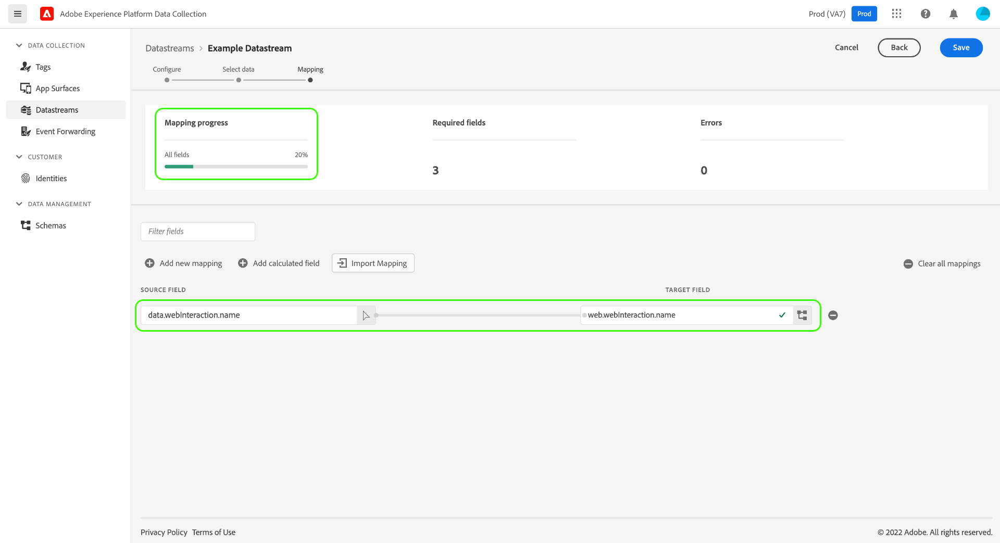

# Datenvorbereitung für die Datenerfassung

Datenvorbereitung ist ein Adobe Experience Platform-Service, mit dem Sie Daten zuordnen, umwandeln und validieren können, die an das [Experience-Datenmodell (XDM)](../xdm/home.md) gesendet oder von ihm empfangen werden. Beim Konfigurieren eines Platform-aktivierten [Datenstroms](./overview.md) können Sie Datenvorbereitungs-Funktionen verwenden, um Ihre Quelldaten dem XDM zuzuordnen, wenn Sie sie an das Platform Edge Network senden.

>[!NOTE]
>
>Eine umfassende Anleitung zu allen Datenvorbereitungs-Funktionen, einschließlich der Umwandlungsfunktionen für berechnete Felder, finden Sie in der folgenden Dokumentation:
>
>* [Datenvorbereitung – Übersicht](../data-prep/home.md)
>* [Funktionen zur Datenvorbereitung](../data-prep/functions.md)
>* [Verarbeiten von Datenformaten mit der Datenvorbereitung](../data-prep/data-handling.md)

In diesem Handbuch wird beschrieben, wie Sie Ihre Daten innerhalb der Benutzeroberfläche zuordnen können. Führen Sie zunächst den Prozess zur Erstellung eines Datenstroms bis (einschließlich) der [allgemeinen Konfiguration](./overview.md#create) aus.

Eine kurze Erklärung des Prozesses „Datenvorbereitung für die Datenerfassung“ finden Sie im folgenden Video:

>[!VIDEO](https://video.tv.adobe.com/v/342120?quality=12&enable10seconds=on&speedcontrol=on)

## [!UICONTROL Auswählen von Daten] {#select-data}

Wählen Sie nach der allgemeinen Konfiguration eines Datenstroms die Option **[!UICONTROL Speichern und Zuordnung hinzufügen]** aus. Daraufhin wird der Schritt **[!UICONTROL Daten auswählen]** angezeigt. Hier müssen Sie ein JSON-Beispielobjekt bereitstellen, das der Struktur der Daten entspricht, die Sie an Platform senden möchten.

Um Eigenschaften direkt aus Ihrer Datenschicht zu erfassen, muss das JSON-Objekt über eine einzige Stammeigenschaft verfügen: `data`. Die Untereigenschaften der `data` -Objekt sollte dann so konstruiert werden, dass es den Datenschichteigenschaften zugeordnet wird, die Sie erfassen möchten. Wählen Sie den folgenden Abschnitt aus, um ein Beispiel für ein ordnungsgemäß formatiertes JSON-Objekt mit einem `data`-Stamm zu sehen.

+++JSON-Beispieldatei mit `data`-Stamm

```json
{
  "data": {
    "eventMergeId": "cce1b53c-571f-4f36-b3c1-153d85be6602",
    "eventType": "view:load",
    "timestamp": "2021-09-30T14:50:09.604Z",
    "web": {
      "webPageDetails": {
        "siteSection": "Product section",
        "server": "example.com",
        "name": "product home",
        "URL": "https://www.example.com"
      },
      "webReferrer": {
        "URL": "https://www.adobe.com/index2.html",
        "type": "external"
      }
    },
    "commerce": {
      "purchase": 1,
      "order": {
        "orderID": "1234"
      }
    },
    "product": [
      {
        "productInfo": {
          "productID": "123"
        }
      },
      {
        "productInfo": {
          "productID": "1234"
        }
      }
    ],
    "reservation": {
      "id": "anc45123xlm",
      "name": "Embassy Suits",
      "SKU": "12345-L",
      "skuVariant": "12345-LG-R",
      "priceTotal": "112.99",
      "currencyCode": "USD",
      "adults": 2,
      "children": 3,
      "productAddMethod": "PDP",
      "_namespace": {
        "test": 1,
        "priceTotal": "112.99",
        "category": "Overnight Stay"
      },
      "freeCancellation": false,
      "cancellationFee": 20,
      "refundable": true
    }
  }
}
```

+++

Bei der Erfassung von Eigenschaften aus einem XDM-Objekt-Datenelement gelten dieselben Regeln für das JSON-Objekt, doch die Stammeigenschaft muss stattdessen als `xdm` eingegeben werden. Wählen Sie den folgenden Abschnitt aus, um ein Beispiel für ein ordnungsgemäß formatiertes JSON-Objekt mit einem `xdm`-Stamm zu sehen.

+++JSON-Beispieldatei mit `xdm`-Stamm

```json
{
  "xdm": {
    "environment": {
      "type": "browser",
      "browserDetails": {
        "userAgent": "Mozilla/5.0 (Macintosh; Intel Mac OS X 10_7_5) AppleWebkit/537.36 (KHTML, like Gecko) Chrome/49.0.2623.112 Safari/537.36",
        "javaScriptEnabled": true,
        "javaScriptVersion": "1.8.5",
        "cookiesEnabled": true,
        "viewportHeight": 900,
        "viewportWidth": 1680,
        "javaEnabled": true
      },
      "domain": "adobe.com",
      "colorDepth": 24,
      "viewportHeight": 1050,
      "viewportWidth": 1680
    },
    "device": {
      "screenHeight": 1050,
      "screenWidth": 1680
    }
  }
}
```

+++

Sie können die Option zum Hochladen des Objekts als Datei auswählen oder stattdessen das Raw-Objekt in das bereitgestellte Textfeld einfügen. Wenn die JSON gültig ist, wird im rechten Bereich ein Vorschauschema angezeigt. Klicken Sie auf **[!UICONTROL Weiter]**, um fortzufahren.


## [!UICONTROL Zuordnung]

Der Schritt **[!UICONTROL Zuordnung]** wird angezeigt, sodass Sie die Felder in Ihren Quelldaten dem Zielereignisschema in Platform zuordnen können. Sie haben die Möglichkeit, die Zuordnung auf zwei Arten zu konfigurieren:

* [Erstellen von Zuordnungsregeln](#create-mapping) für diesen Datastream durch einen manuellen Prozess.
* [Importieren Sie Zuordnungsregeln](#import-mapping) aus einem vorhandenen Datenstrom.

### Erstellen von Zuordnungsregeln {#create-mapping}

Um eine Zuordnungsregel zu erstellen, wählen Sie **[!UICONTROL Neues Mapping hinzufügen]**.


Wählen Sie das Quellensymbol () und danach im sich öffnenden Dialogfeld das Quellfeld aus, das Sie auf der bereitgestellten Arbeitsfläche zuordnen möchten. Nachdem Sie ein Feld ausgewählt haben, verwenden Sie die Schaltfläche **[!UICONTROL Auswählen]**, um fortzufahren.


Wählen Sie anschließend das Schemasymbol () aus, um ein ähnliches Dialogfeld für das Zielereignisschema zu öffnen. Wählen Sie das Feld aus, dem Sie die Daten zuordnen möchten, und bestätigen Sie dann mit **[!UICONTROL Auswählen]**.


Die Zuordnungsseite wird erneut mit der abgeschlossenen Feld-Zuordnung angezeigt. Der Abschnitt **[!UICONTROL Zuordnungsfortschritt]** wird aktualisiert und zeigt die Gesamtzahl der Felder an, die bereits erfolgreich zugeordnet wurden.



>[!TIP]
>
>Wenn Sie ein Array von Objekten (im Quellfeld) einem Array von anderen Objekten (im Zielfeld) zuordnen möchten, fügen Sie wie unten dargestellt in den Pfaden der Quell- und Zielfelder nach dem Array-Namen `[*]` ein.
>
>

### Importieren vorhandener Zuordnungsregeln {#import-mapping}

Wenn Sie zuvor einen Datastream erstellt haben, können Sie die konfigurierten Zuordnungsregeln für einen neuen Datastream wiederverwenden.

>[!WARNING]
>
>Beim Importieren von Zuordnungsregeln aus einem anderen Datenspeicher werden alle vor dem Import hinzugefügten Feldzuordnungen überschrieben.

Wählen Sie zunächst **[!UICONTROL Zuordnung importieren]** aus.

![Bild, das die Auswahl der Schaltfläche [!UICONTROL Zuordnung importieren] zeigt](assets/data-prep/import-mapping-button.png)

Wählen Sie im sich öffnenden Dialogfeld den Datenstrom aus, dessen Zuordnungsregeln Sie importieren möchten. Wählen Sie danach **[!UICONTROL Vorschau]** aus.


>[!NOTE]
>
>Datenströme können nur innerhalb derselben [Sandbox](../sandboxes/home.md) importiert werden. Mit anderen Worten: Sie können den Datenstrom von einer Sandbox nicht in eine andere importieren.

Im nächsten Bildschirm wird eine Vorschau der gespeicherten Zuordnungsregeln für den ausgewählten Datenstrom gezeigt. Prüfen Sie, ob die angezeigten Zuordnungen korrekt sind und wählen Sie dann **[!UICONTROL Importieren]** aus, um die Zuordnungen zu bestätigen und zum neuen Datenstrom hinzuzufügen.


>[!NOTE]
>
>Wenn Quellfelder in den importierten Zuordnungsregeln nicht in den von Ihnen [zuvor bereitgestellten](#select-data) JSON-Beispieldaten enthalten sind, werden diese Feldzuordnungen nicht in den Import einbezogen.

### Abschließen der Zuordnung

Führen Sie die oben genannten Schritte erneut aus, um den Rest der Felder dem Zielschema zuzuordnen. Sie müssen zwar nicht alle verfügbaren Quellfelder zuordnen, jedoch müssen alle Felder im Zielschema, die wie erforderlich festgelegt sind, für diesen Schritt zugeordnet werden. Der Zähler **[!UICONTROL Erforderliche Felder]** gibt an, wie viele erforderlichen Felder in der aktuellen Konfiguration noch nicht zugeordnet sind.

Sobald die erforderliche Feldanzahl null erreicht hat und Sie mit Ihrer Zuordnung zufrieden sind, wählen Sie **[!UICONTROL Speichern]** , um Ihre Änderungen abzuschließen.


## Nächste Schritte

In diesem Handbuch wurde beschrieben, wie Sie Ihre Daten XDM zuordnen, wenn Sie einen Datenstrom in der Benutzeroberfläche einrichten. Wenn Sie dem Tutorial zu allgemeinen Datenströmen gefolgt sind, können Sie jetzt zur Anleitung zum [Anzeigen von Datenspeicherdetails](./overview.md) zurückkehren
