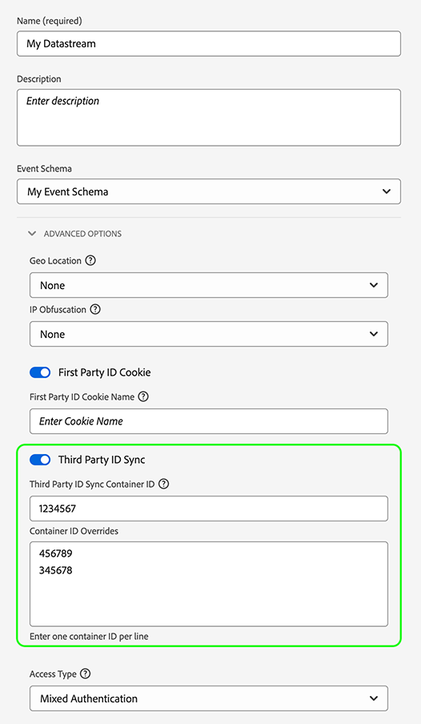

# Konfigurieren von Datenstromüberschreibungen

Mit Datastream-Überschreibungen können Sie zusätzliche Konfigurationen für Ihre Datenspeicher definieren, die über das Web SDK oder Mobile SDK an das Edge Network übergeben werden.

Auf diese Weise können Sie andere Verhaltensweisen von Datastreams als die Standardeinstellungen Trigger haben, ohne einen Datastream zu erstellen oder Ihre vorhandenen Einstellungen zu ändern.

Die Außerkraftsetzung der Datastream-Konfiguration erfolgt in zwei Schritten:

1. Zunächst müssen Sie Ihre Datastream-Konfigurationsüberschreibungen im [Datastream-Konfigurationsseite](configure.md).
2. Anschließend müssen Sie die Außerkraftsetzungen auf eine der folgenden Arten an das Edge Network senden:
   * Durch die `sendEvent` oder `configure` [Web SDK](#send-overrides) Befehle.
   * Über das Web SDK [Tag-Erweiterung](../tags/extensions/client/web-sdk/web-sdk-extension-configuration.md).
   * Über das Mobile SDK [sendEvent](#send-overrides) API oder mithilfe von [Regeln](#send-overrides).

In diesem Artikel wird der Prozess zur Überschreibung der End-to-End-Datenstromkonfiguration für jeden unterstützten Überschreibungstyp erläutert.

>[!IMPORTANT]
>
>Datenspeicherüberschreibungen werden nur für [Web SDK](../web-sdk/home.md) und [Mobile SDK](https://developer.adobe.com/client-sdks/home/) Integrationen. [Server-API](../server-api/overview.md) -Integrationen unterstützen derzeit keine Überschreibungen von Datastream.
><br>
>Datenstromüberschreibungen sollten verwendet werden, wenn Sie verschiedene Daten an verschiedene Datenströme senden müssen. Verwenden Sie keine Datastream-Überschreibungen für Anwendungsfälle zur Personalisierung oder Einverständnisdaten.

## Anwendungsfälle {#use-cases}

Damit Sie besser verstehen können, wie und wann Sie Datenstromüberschreibungen verwenden sollten, finden Sie hier einige Beispiele für Anwendungsfälle, die Kundinnen und Kunden von Adobe Experience Platform mit dieser Funktion bewältigen können.

**Datenerfassung für mehrere Regionen**

Ein Unternehmen hat verschiedene Websites oder Subdomains für verschiedene Länder, in denen es tätig ist. Es hat separate Datenströme mit entsprechenden analysespezifischen Report Suites, länderspezifischen Adobe Target-Eigenschafts-Token, länderspezifischen Schemata, Datensätzen, Journey Optimizer-Konfigurationen usw. [konfiguriert](configure.md). Das Unternehmen verfügt außerdem über einen globalen Satz an Konfigurationen, in denen alle landesspezifischen Daten aggregiert werden.

Durch die Verwendung von Datenstromüberschreibungen kann das Unternehmen den Datenfluss dynamisch in verschiedene Datenströme umstellen, anstatt das Standardverhalten zu ändern, Daten an einen Datenstrom zu senden.

Ein gängiger Anwendungsfall könnte das Senden von Daten an einen länderspezifischen Datastream und auch an einen globalen Datastream sein, wo Kunden wichtige Aktionen ausführen, wie z. B. eine Bestellung aufgeben oder ihr Benutzerprofil aktualisieren.

**Unterscheiden von Profilen und Identitäten für verschiedene Geschäftseinheiten**

Ein Unternehmen mit mehreren Geschäftseinheiten möchte mehrere Experience Platform-Sandboxes verwenden, um für jede Geschäftseinheit spezifische Daten zu speichern.

Anstatt Daten an einen standardmäßigen Datenstrom zu senden, kann das Unternehmen Datenstromüberschreibungen verwenden, um sicherzustellen, dass jede Geschäftseinheit über einen eigenen Datenstrom verfügt, über den Daten empfangen werden können.

## Konfigurieren von Datenstromüberschreibungen in der Datenstrom-Benutzeroberfläche {#configure-overrides}

Überschreibungen der Datenstromkonfiguration ermöglichen es Ihnen, die folgenden Datenstromkonfigurationen zu ändern:

* Experience Platform-Ereignisdatensätze
* Adobe Target-Eigenschafts-Token
* Audience Manager-ID-Synchronisierungs-Container
* Report Suites in Adobe Analytics

### Datenstromüberschreibungen für Adobe Target {#target-overrides}

Um Datenstromüberschreibungen für einen Adobe Target-Datenstrom zu konfigurieren, müssen Sie zunächst einen Adobe Target-Datenstrom erstellen lassen. Befolgen Sie die Anweisungen, mit dem [Adobe Target](configure.md#target)-Dienst einen [Datenstrom zu konfigurieren](configure.md).

Nachdem Sie den Datastream erstellt haben, bearbeiten Sie die [Adobe Target](configure.md#target) -Dienst, den Sie hinzugefügt haben, und verwenden Sie **[!UICONTROL Eigenschafts-Token - Überschreibungen]** -Abschnitt, um die gewünschten Datastream-Umgehungen hinzuzufügen, wie in der Abbildung unten dargestellt. Fügen Sie pro Zeile ein Eigenschafts-Token hinzu.


Nachdem Sie die gewünschten Überschreibungen hinzugefügt haben, speichern Sie Ihre Datenstromeinstellungen.

Ihre Adobe Target-Datenstromüberschreibungen sollten jetzt konfiguriert sein. Jetzt können Sie [Senden der Überschreibungen an das Edge Network über das Web SDK oder Mobile SDK](#send-overrides).

### Datenstromüberschreibungen für Adobe Analytics {#analytics-overrides}

Um Datenstromüberschreibungen für einen Adobe Analytics-Datenstrom zu konfigurieren, müssen Sie zunächst einen [Adobe Analytics](configure.md#analytics)-Datenstrom erstellen lassen. Befolgen Sie die Anweisungen, mit dem [Adobe Analytics](configure.md#analytics)-Dienst einen [Datenstrom zu konfigurieren](configure.md).

Nachdem Sie den Datastream erstellt haben, bearbeiten Sie die [Adobe Analytics](configure.md#target) -Dienst, den Sie hinzugefügt haben, und verwenden Sie **[!UICONTROL Report Suite - Überschreibungen]** -Abschnitt, um die gewünschten Datastream-Umgehungen hinzuzufügen, wie in der Abbildung unten dargestellt.

Wählen Sie **[!UICONTROL Batch-Modus anzeigen]** aus, um die Stapelbearbeitung der Report Suite-Überschreibungen zu aktivieren. Sie können eine Liste mit Report Suite-Überschreibungen kopieren und einfügen und dabei pro Zeile eine Report Suite eingeben.


Nachdem Sie die gewünschten Überschreibungen hinzugefügt haben, speichern Sie Ihre Datenstromeinstellungen.

Ihre Adobe Analytics-Datenstromüberschreibungen sollten jetzt konfiguriert sein. Jetzt können Sie [Senden der Überschreibungen an das Edge Network über das Web SDK oder Mobile SDK](#send-overrides).

### Datenstromüberschreibungen für Experience Platform-Ereignisdatensätze {#event-dataset-overrides}

Um Datenstromüberschreibungen für Experience Platform-Ereignisdatensätze zu konfigurieren, müssen Sie zunächst einen [Adobe Experience Platform](configure.md#aep)-Datenstrom erstellt haben. Befolgen Sie die Anweisungen, mit dem [Adobe Experience Platform](configure.md#aep)-Dienst einen [Datenstrom zu konfigurieren](configure.md).

Nachdem Sie den Datastream erstellt haben, bearbeiten Sie die [Adobe Experience Platform](configure.md#aep) den Sie hinzugefügt haben, und wählen Sie **[!UICONTROL Ereignis-Datensatz hinzufügen]** -Option zum Hinzufügen eines oder mehrerer Ereignis-Datensätze überschreiben, wie in der Abbildung unten dargestellt.


Nachdem Sie die gewünschten Überschreibungen hinzugefügt haben, speichern Sie Ihre Datenstromeinstellungen.

Sie sollten jetzt die Adobe Experience Platform-Datenstromüberschreibungen konfiguriert haben. Jetzt können Sie [Senden der Überschreibungen an das Edge Network über das Web SDK oder Mobile SDK](#send-overrides).

### Datenstromüberschreibungen für ID-Synchronisierungs-Container von Drittanbietern {#container-overrides}

Um Datenstromüberschreibungen für ID-Synchronisierungs-Container von Drittanbietern zu konfigurieren, müssen Sie zunächst einen Datenstrom erstellen lassen. Befolgen Sie die Anweisungen zum [Konfigurieren eines Datenstroms](configure.md), um einen Datenstrom zu erstellen.

Nachdem Sie den Datenstrom erstellt haben, navigieren Sie zu **[!UICONTROL Erweiterte Optionen]** und aktivieren Sie die Option **[!UICONTROL Synchronisierung der Drittanbieter-ID]**.

Verwenden Sie dann den Abschnitt **[!UICONTROL Container-ID-Überschreibungen]**, um die Container-IDs hinzuzufügen, für die Sie die Standardeinstellung überschreiben möchten, wie in der Abbildung unten dargestellt.

>[!IMPORTANT]
>
>Container-IDs müssen numerische Werte sein, z. B. `1234567`, nicht aber Zeichenfolgen wie `"1234567"`. Wenn Sie einen Zeichenfolgenwert über das Web SDK als Container-ID-Überschreibung senden, erhalten Sie einen Fehler.



Nachdem Sie die gewünschten Überschreibungen hinzugefügt haben, speichern Sie Ihre Datenstromeinstellungen.

Sie sollten jetzt die Überschreibungen des ID-Synchronisierungs-Containers konfiguriert haben. Jetzt können Sie [Senden der Überschreibungen an das Edge Network über das Web SDK oder Mobile SDK](#send-overrides).

## Überschreibungen an das Edge Network senden {#send-overrides}

Nachdem Sie in der Datenerfassungs-Benutzeroberfläche Datastream-Überschreibungen konfiguriert haben, können Sie die Überschreibungen über das Web SDK oder das Mobile SDK an das Edge Network senden.

* **Web SDK**: Siehe [Überschreibungen der Datenspeicherkonfiguration](../web-sdk/commands/datastream-overrides.md#library) für Anweisungen zur Tag-Erweiterung und Codebeispiele für JavaScript-Bibliotheken.
* **Mobile SDK**: Sie können Datenspeicher-ID-Überschreibungen entweder mit der [sendEvent-API](https://developer.adobe.com/client-sdks/edge/edge-network/tutorials/send-overrides-sendevent/) oder mithilfe von [Regeln](https://developer.adobe.com/client-sdks/edge/edge-network/tutorials/send-overrides-rules/).

## Payload-Beispiel {#payload-example}

Die obigen Beispiele generieren eine [!DNL Edge Network] Nutzlast ähnlich der unten stehenden.

```json
{
  "meta": {
    "configOverrides": {
      "com_adobe_experience_platform": {
        "datasets": {
          "event": {
            "datasetId": "SampleProfileDatasetIdOverride"
          }
        }
      },
      "com_adobe_analytics": {
        "reportSuites": [
        "MyFirstOverrideReportSuite",
        "MySecondOverrideReportSuite",
        "MyThirdOverrideReportSuite"
        ]
      },
      "com_adobe_identity": {
        "idSyncContainerId": "1234567"
      },
      "com_adobe_target": {
        "propertyToken": "63a46bbc-26cb-7cc3-def0-9ae1b51b6c62"
      }
    },
    "state": {  }
  },
  "events": [  ]
}
```
