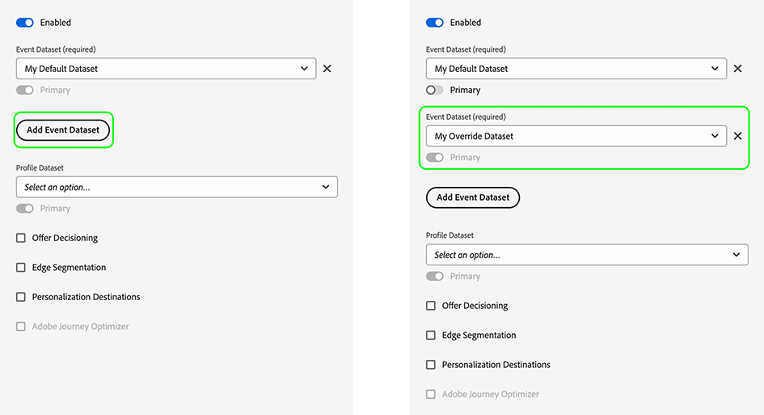

# Konfigurieren von Datenstromüberschreibungen

Verwenden Sie Datenstromüberschreibungen, um zusätzliche Konfigurationen für Ihre Datenströme zu definieren, die über die Web-SDK oder mobile SDK an die [!DNL Edge Network] übergeben werden.

Trigger verschiedener Datenstromverhaltensweisen, ohne einen neuen Datenstrom zu erstellen oder Ihre bestehenden Einstellungen zu ändern.

Die Überschreibung der Datenstromkonfiguration ist ein zweistufiger Prozess:

1. Zunächst müssen Sie Ihre Überschreibung der Datenstromkonfiguration auf der Seite [Datenstromkonfiguration“ &#x200B;](/help/datastreams/configure.md).
2. Anschließend müssen Sie die Überschreibungen auf eine der folgenden Arten an die [!DNL Edge Network] senden:
   * Durch die `sendEvent` oder `configure` [Web SDK](#send-overrides)-Befehle.
   * Über die Web-SDK [Tag-Erweiterung](/help/tags/extensions/client/web-sdk/configure/configuration-overrides.md).
   * Über die Mobile SDK [sendEvent](#send-overrides)-API oder mithilfe von [Rules](#send-overrides).

In diesem Artikel wird der Prozess zur Überschreibung der End-to-End-Datenstromkonfiguration für jeden unterstützten Überschreibungstyp erläutert.

>[!IMPORTANT]
>
>[!DNL Edge Network] API-Integrationen unterstützen derzeit keine Überschreibungen von Datenstroms.
>
>Datenstromüberschreibungen sollten verwendet werden, wenn Sie verschiedene Daten an verschiedene Datenströme senden müssen. Verwenden Sie keine Datenstrom-Überschreibungen für Personalisierungs-Anwendungsfälle oder Einverständnisdaten.

## Anwendungsfälle {#use-cases}

Die folgenden Anwendungsfälle zeigen, wie und wann Datenstrom-Überschreibungen verwendet werden.

### Datenerfassung für mehrere Regionen {#multi-region}

Ein Unternehmen hat verschiedene Websites oder Subdomains für verschiedene Länder, in denen es tätig ist. Sie verfügen über [konfigurierte](/help/datastreams/configure.md) separate Datenströme mit entsprechenden Analytics-spezifischen Report Suites, länderspezifischen [!DNL Adobe Target]-Eigenschafts-Token, länderspezifischen Schemas, Datensätzen, [!DNL Journey Optimizer]-Konfigurationen usw. Das Unternehmen verfügt außerdem über einen globalen Satz an Konfigurationen, in denen alle landesspezifischen Daten aggregiert werden.

Durch die Verwendung von Datenstromüberschreibungen kann das Unternehmen den Datenfluss dynamisch in verschiedene Datenströme umstellen, anstatt das Standardverhalten zu ändern, Daten an einen Datenstrom zu senden.

Ein gängiges Anwendungsbeispiel ist das Senden von Daten an einen länderspezifischen Datenstrom und auch an einen globalen Datenstrom, wenn Kunden eine wichtige Aktion durchführen, z. B. eine Bestellung aufgeben oder ihr Benutzerprofil aktualisieren.

### Differenzierung von Profilen und Identitäten für verschiedene Geschäftsbereiche {#multiple-business-units}

Ein Unternehmen mit mehreren Geschäftseinheiten möchte mehrere Experience Platform-Sandboxes verwenden, um für jede Geschäftseinheit spezifische Daten zu speichern.

Anstatt Daten an einen standardmäßigen Datenstrom zu senden, kann das Unternehmen Datenstromüberschreibungen verwenden, um sicherzustellen, dass jede Geschäftseinheit über einen eigenen Datenstrom verfügt, über den Daten empfangen werden können.

## Konfigurieren von Datenstromüberschreibungen in der Datenstrom-Benutzeroberfläche {#configure-overrides}

Mit Überschreibungen der Datenstromkonfiguration können Sie die folgenden Datenstromkonfigurationen ändern:

* Experience Platform-Ereignisdatensätze
* Eigenschafts-Token [!DNL Adobe Target]
* Audience Manager-ID-Synchronisierungs-Container
* Report Suites [!DNL Adobe Analytics]

### Datenstromüberschreibungen für Adobe Target {#target-overrides}

Um Datenstromüberschreibungen für einen [!DNL Adobe Target] Datenstrom zu konfigurieren, muss zunächst ein [!DNL Adobe Target] Datenstrom erstellt werden. Befolgen Sie die Anweisungen, mit dem [Adobe Target](/help/datastreams/configure.md#target)-Dienst einen [Datenstrom zu konfigurieren](/help/datastreams/configure.md).

Bearbeiten Sie nach dem Erstellen des Datenstroms den hinzugefügten [Adobe Target](/help/datastreams/configure.md#target)-Service und verwenden Sie den Abschnitt **[!UICONTROL Property Token Overrides]** , um die gewünschten Datenstromüberschreibungen hinzuzufügen. Fügen Sie pro Zeile ein Eigenschafts-Token hinzu.


Speichern Sie nach dem Hinzufügen der gewünschten Überschreibungen Ihre Datenstromeinstellungen.

Die [!DNL Adobe Target] Datenstromüberschreibungen sind jetzt konfiguriert. Sie können jetzt [Überschreibungen an senden [!DNL Edge Network]  über die Web-SDK oder Mobile SDK](#send-overrides).

### Datenstromüberschreibungen für Adobe Analytics {#analytics-overrides}

Um Datenstromüberschreibungen für einen [!DNL Adobe Analytics] Datenstrom zu konfigurieren, muss zunächst ein [Adobe Analytics](/help/datastreams/configure.md#analytics)-Datenstrom erstellt werden. Befolgen Sie die Anweisungen, mit dem [Adobe Analytics](/help/datastreams/configure.md#analytics)-Dienst einen [Datenstrom zu konfigurieren](/help/datastreams/configure.md).

Bearbeiten Sie nach dem Erstellen des Datenstroms den hinzugefügten [Adobe Analytics](/help/datastreams/configure.md#analytics)-Service und verwenden Sie den Abschnitt **[!UICONTROL Report Suite Overrides]** , um die gewünschten Datenstromüberschreibungen hinzuzufügen.

Wählen Sie **[!UICONTROL Show Batch Mode]** aus, um die Batch-Bearbeitung der Report Suite-Überschreibungen zu aktivieren. Sie können eine Liste mit Report Suite-Überschreibungen kopieren und einfügen und dabei pro Zeile eine Report Suite eingeben.


Speichern Sie nach dem Hinzufügen der gewünschten Überschreibungen Ihre Datenstromeinstellungen.

Die [!DNL Adobe Analytics] Datenstromüberschreibungen sind jetzt konfiguriert. Sie können jetzt [Überschreibungen an senden [!DNL Edge Network]  über die Web-SDK oder Mobile SDK](#send-overrides).

### Datenstromüberschreibungen für Experience Platform-Ereignisdatensätze {#event-dataset-overrides}

Um Datenstromüberschreibungen für Experience Platform-Ereignisdatensätze zu konfigurieren, müssen Sie zunächst einen [Adobe Experience Platform](/help/datastreams/configure.md#aep)-Datenstrom erstellt haben. Befolgen Sie die Anweisungen, mit dem [Adobe Experience Platform](/help/datastreams/configure.md#aep)-Dienst einen [Datenstrom zu konfigurieren](/help/datastreams/configure.md).

Bearbeiten Sie nach dem Erstellen des Datenstroms den hinzugefügten [Adobe Experience Platform](/help/datastreams/configure.md#aep)-Service und wählen Sie die Option **[!UICONTROL Add Event Dataset]** aus, um einen oder mehrere Ereignis-Datensätze zu überschreiben.



Speichern Sie nach dem Hinzufügen der gewünschten Überschreibungen Ihre Datenstromeinstellungen.

Die [!DNL Adobe Experience Platform] Datenstromüberschreibungen sind jetzt konfiguriert. Sie können jetzt [Überschreibungen an senden [!DNL Edge Network]  über die Web-SDK oder Mobile SDK](#send-overrides).

### Datenstromüberschreibungen für ID-Synchronisierungs-Container von Drittanbietern {#container-overrides}

Um Datenstromüberschreibungen für ID-Synchronisierungs-Container von Drittanbietern zu konfigurieren, müssen Sie zunächst einen Datenstrom erstellen lassen. Befolgen Sie die Anweisungen zum [Konfigurieren eines Datenstroms](/help/datastreams/configure.md), um einen Datenstrom zu erstellen.

Wechseln Sie nach dem Erstellen des Datenstroms zu **[!UICONTROL Advanced Options]** und aktivieren Sie die Option **[!UICONTROL Third Party ID Sync]** .

Verwenden Sie dann den Abschnitt **[!UICONTROL Container ID Overrides]** , um die Container-IDs hinzuzufügen, die Sie die Standardeinstellung überschreiben möchten.

>[!IMPORTANT]
>
>Container-IDs müssen numerische Werte sein, z. B. `1234567`, nicht aber Zeichenfolgen wie `"1234567"`. Wenn Sie einen Zeichenfolgenwert über das Web SDK als Container-ID-Überschreibung senden, erhalten Sie einen Fehler.


Speichern Sie nach dem Hinzufügen der gewünschten Überschreibungen Ihre Datenstromeinstellungen.

Die Überschreibungen des ID-Synchronisierungs-Containers sind jetzt konfiguriert. Sie können jetzt [Überschreibungen an senden [!DNL Edge Network]  über die Web-SDK oder Mobile SDK](#send-overrides).

## Überschreibungen an Edge Network senden {#send-overrides}

Nach dem Konfigurieren von Datenstrom-Überschreibungen in der Datenerfassungs-Benutzeroberfläche können Sie die Überschreibungen über die Web-SDK oder die Mobile SDK an die [!DNL Edge Network] senden.

* **Web SDK**: Siehe [Überschreibungen der Datenstromkonfiguration](/help/collection/js/commands/configure/edgeconfigoverrides.md) für Code-Beispiele für die JavaScript-Bibliothek.
* **Mobile SDK**: Überschreibungen der Datenstrom-ID können entweder über die [sendEvent-API](https://developer.adobe.com/client-sdks/edge/edge-network/tutorials/send-overrides-sendevent/) oder mithilfe von [Rules](https://developer.adobe.com/client-sdks/edge/edge-network/tutorials/send-overrides-rules/) gesendet werden.

## Payload-Beispiel {#payload-example}

Die vorherigen Beispiele generieren eine [!DNL Edge Network] Payload, die der folgenden ähnelt.

```json
{
  "meta": {
    "configOverrides": {
      "com_adobe_experience_platform": {
        "datasets": {
          "event": {
            "datasetId": "SampleProfileDatasetIdOverride"
          }
        }
      },
      "com_adobe_analytics": {
        "reportSuites": [
        "MyFirstOverrideReportSuite",
        "MySecondOverrideReportSuite",
        "MyThirdOverrideReportSuite"
        ]
      },
      "com_adobe_identity": {
        "idSyncContainerId": "1234567"
      },
      "com_adobe_target": {
        "propertyToken": "63a46bbc-26cb-7cc3-def0-9ae1b51b6c62"
      }
    },
    "state": {  }
  },
  "events": [  ]
}
```
