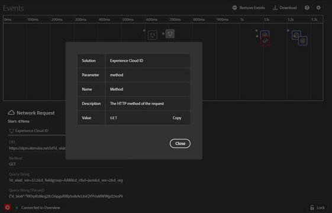

# Registerkarte „Ereignisse“

Die **Ereignisse** bietet eine grafische Ansicht der Ereignisse, die auf einer Zeitleiste angezeigt werden.

Für jedes Ereignis wird auf der Timeline ein Symbol der entsprechenden Lösung angezeigt. Mit den Symbolen werden auch Änderungen an der Datenschicht gekennzeichnet (sofern aktiviert). Wenn Sie den Mauszeiger über ein Symbol bewegen, erhalten Sie eine Zusammenfassung des jeweiligen Ereignisses. Wählen Sie das Ereignis aus, um weitere Details anzuzeigen. Sie können die Umschalttaste, Auswahl oder Strg-Auswahl drücken, um mehrere Ereignisse anzuzeigen.

Klicken Sie auf ein Detail, um weitere Informationen zu erhalten.

## Änderungen an der Datenschicht verfolgen

So aktivieren Sie das Verfolgen von Datenschichtänderungen auf der Timeline:

1. Wählen Sie oben rechts das Zahnradsymbol aus.
1. Geben Sie den Namen Ihrer Datenschicht ein.

   

1. Wählen Sie **[!UICONTROL Speichern]** aus.

In den Details zu Datenschichtänderungen werden alle gelöschten oder hinzugefügten Elemente angezeigt. Sie können **{}** auswählen, um tiefer in die Datenschicht zu schauen.

## Ereignisinformationen herunterladen

Wählen Sie **[!UICONTROL Herunterladen]** aus, um eine Excel-Datei mit Informationen zu Ihren Seitenaufrufen herunterzuladen.
