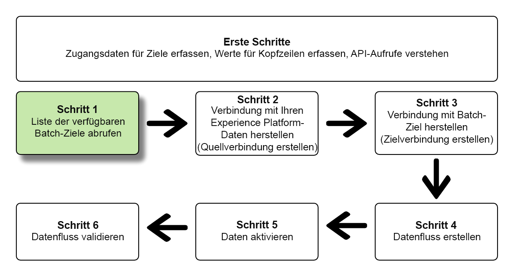
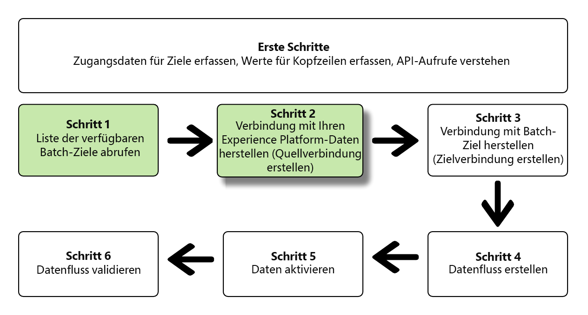
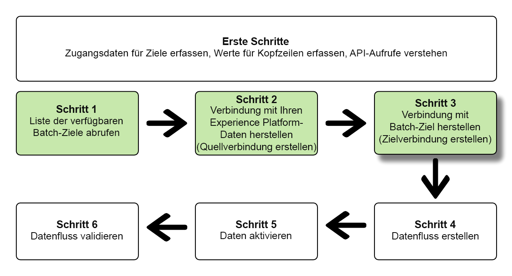
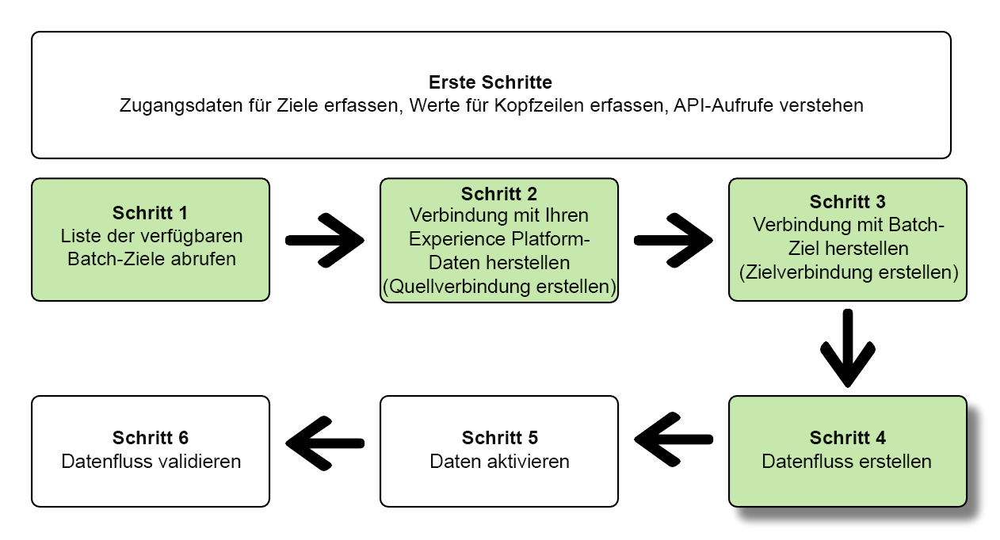
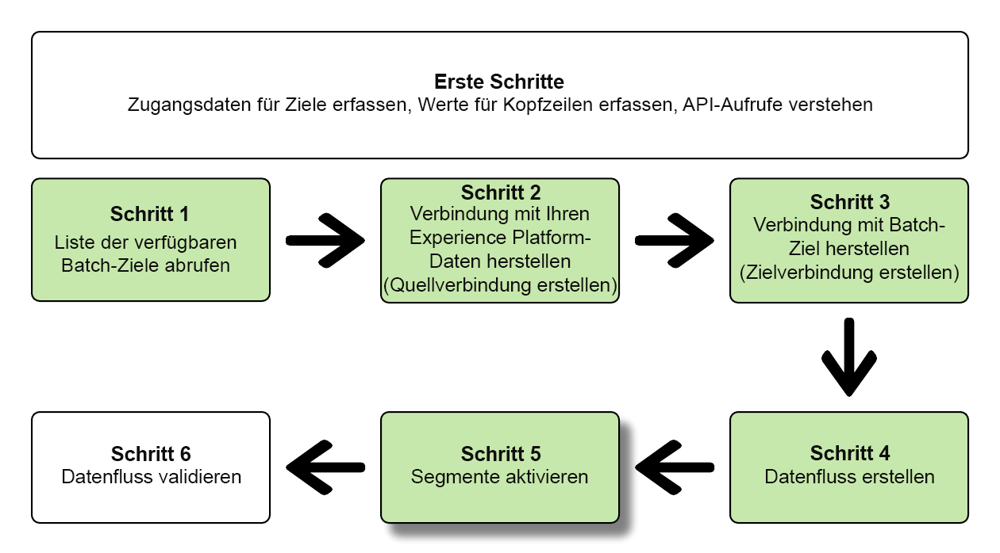
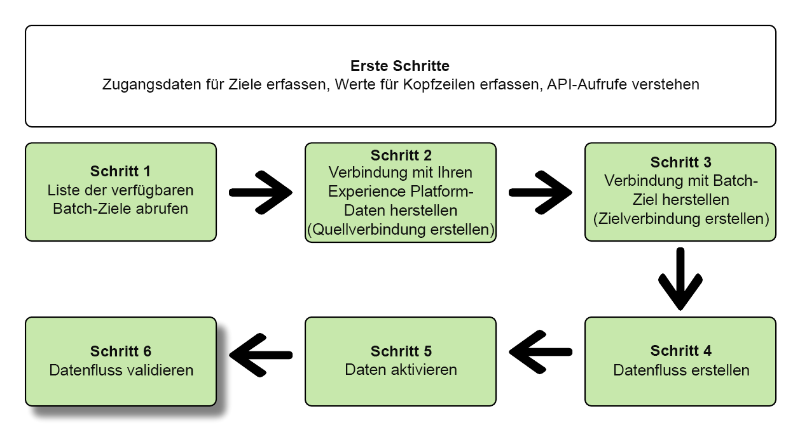

# Verbindung zu Batch-Zielen herstellen und Daten mithilfe der Flow Service-API aktivieren

In diesem Tutorial erfahren Sie, wie Sie mit der Flow Service-API einen Batch erstellen [Cloud-Speicher](../catalog/cloud-storage/overview.md) oder [E-Mail-Marketing-Ziel](../catalog/email-marketing/overview.md)erstellen Sie einen Datenfluss zu Ihrem neu erstellten Ziel und exportieren Sie Daten über CSV-Dateien an Ihr neu erstelltes Ziel.

In diesem Tutorial wird in allen Beispielen das Adobe Campaign-Ziel verwendet, die Schritte sind jedoch für alle Batch-Cloud-Speicher- und E-Mail-Marketing-Ziele identisch.


Wenn Sie die Platform-Benutzeroberfläche bevorzugen, um eine Verbindung zu einem Ziel herzustellen und Daten zu aktivieren, finden Sie weitere Informationen unter [Ziel verbinden](../ui/connect-destination.md) und [Aktivieren von Zielgruppendaten für Batch-Profil-Export-Ziele](../ui/activate-batch-profile-destinations.md) Tutorials.

## Erste Schritte {#get-started}

Dieses Handbuch setzt ein Verständnis der folgenden Komponenten von Adobe Experience Platform voraus:

* [[!DNL Experience Data Model (XDM) System]](../../xdm/home.md): Das standardisierte Framework, mit dem [!DNL Experience Platform] Kundenerlebnisdaten organisiert.
* [[!DNL Segmentation Service]](../../segmentation/api/overview.md): [!DNL Adobe Experience Platform Segmentation Service] ermöglicht Ihnen das Erstellen von Segmenten und das Generieren von Zielgruppen in [!DNL Adobe Experience Platform] von [!DNL Real-time Customer Profile] Daten.
* [[!DNL Sandboxes]](../../sandboxes/home.md): [!DNL Experience Platform] bietet virtuelle Sandboxes, die eine einzelne [!DNL Platform]-Instanz in separate virtuelle Umgebungen unterteilen, damit Sie Programme für digitale Erlebnisse entwickeln und weiterentwickeln können.

Die folgenden Abschnitte enthalten zusätzliche Informationen, die Sie benötigen, um Daten für Batch-Ziele in Platform zu aktivieren.

### Erforderliche Anmeldedaten sammeln {#gather-required-credentials}

Um die Schritte in diesem Tutorial abzuschließen, sollten Sie je nach Zieltyp, mit dem Sie Segmente verbinden und aktivieren, über die folgenden Anmeldeinformationen verfügen.

* Für [!DNL Amazon] S3-Verbindungen: `accessId`, `secretKey`
* Für [!DNL Amazon] S3-Verbindungen [!DNL Adobe Campaign]: `accessId`, `secretKey`
* Bei SFTP-Verbindungen: `domain`, `port`, `username`, `password` oder `sshKey` (je nach Verbindungsmethode zum FTP-Speicherort)
* Für [!DNL Azure Blob] Verbindungen: `connectionString`

>[!NOTE]
>
>Die Anmeldeinformationen `accessId`, `secretKey` für Amazon S3-Verbindungen und `accessId`, `secretKey` für Amazon S3-Verbindungen mit Adobe Campaign identisch sind.

### Lesen von Beispiel-API-Aufrufen {#reading-sample-api-calls}

In diesem Tutorial wird anhand von Beispielen für API-Aufrufe die korrekte Formatierung von Anfragen aufgezeigt. Dazu gehören Pfade, erforderliche Kopfzeilen und ordnungsgemäß formatierte Anfrage-Payloads. Außerdem wird ein Beispiel für eine von der API im JSON-Format zurückgegebene Antwort bereitgestellt. Informationen zu den Konventionen, die in der Dokumentation für Beispiel-API-Aufrufe verwendet werden, finden Sie im Abschnitt zum [Lesen von Beispiel-API-Aufrufen](../../landing/troubleshooting.md#how-do-i-format-an-api-request) im Handbuch zur Fehlerbehebung für [!DNL Experience Platform]

### Werte für erforderliche und optionale Kopfzeilen sammeln {#gather-values-headers}

Um [!DNL Platform]-APIs aufzurufen, müssen Sie zunächst das [Authentifizierungs-Tutorial](https://experienceleague.adobe.com/docs/experience-platform/landing/platform-apis/api-authentication.html?lang=de) abschließen. Durch Abschluss des Authentifizierungs-Tutorials werden die Werte für die einzelnen erforderlichen Header in allen [!DNL Experience Platform]-API-Aufrufen bereitgestellt, wie unten dargestellt:

* Authorization: Bearer `{ACCESS_TOKEN}`
* x-api-key: `{API_KEY}`
* x-gw-ims-org-id: `{IMS_ORG}`

Ressourcen in [!DNL Experience Platform] kann in bestimmte virtuelle Sandboxes isoliert werden. In Anforderungen an [!DNL Platform] APIs können Sie den Namen und die Kennung der Sandbox angeben, in der der Vorgang ausgeführt werden soll. Dies sind optionale Parameter.

* x-sandbox-name: `{SANDBOX_NAME}`

>[!NOTE]
>
>Weitere Informationen zu Sandboxes in [!DNL Experience Platform] finden Sie in der [Sandbox-Übersichtsdokumentation](../../sandboxes/home.md).

Bei allen Anfragen, die eine Payload enthalten (POST, PUT, PATCH), ist eine zusätzliche Medientyp-Kopfzeile erforderlich:

* Content-Type: `application/json`

### API-Referenzdokumentation {#api-reference-documentation}

Die zugehörige Referenzdokumentation für alle API-Vorgänge finden Sie in diesem Tutorial. Siehe Abschnitt [Flussdienst-API-Dokumentation zur Adobe I/O](https://www.adobe.io/experience-platform-apis/references/flow-service/). Es wird empfohlen, dieses Tutorial und die API-Referenzdokumentation parallel zu verwenden.

## Liste der verfügbaren Ziele abrufen {#get-the-list-of-available-destinations}



Als ersten Schritt sollten Sie entscheiden, für welches Ziel Daten aktiviert werden sollen. Führen Sie also zunächst einen Aufruf durch, um eine Liste der verfügbaren Ziele anzufordern, mit denen Sie eine Verbindung herstellen und Segmente aktivieren können. Führen Sie die folgende GET-Anfrage an den `connectionSpecs`-Endpunkt aus, um eine Liste der verfügbaren Ziele zu erhalten:

**API-Format**

```http
GET /connectionSpecs
```

**Anfrage**

```shell
curl --location --request GET 'https://platform.adobe.io/data/foundation/flowservice/connectionSpecs' \
--header 'accept: application/json' \
--header 'x-gw-ims-org-id: {IMS_ORG}' \
--header 'x-api-key: {API_KEY}' \
--header 'x-sandbox-name: {SANDBOX_NAME}' \
--header 'Authorization: Bearer {ACCESS_TOKEN}'
```


**Antwort**

Eine erfolgreiche Antwort enthält eine Liste der verfügbaren Ziele und ihre eindeutigen Kennungen (`id`). Notieren Sie sich den Wert des Ziels, das Sie verwenden möchten, da Sie ihn in weiteren Schritten benötigen werden. Wenn Sie z. B. Segmente mit Adobe Campaign verbinden und bereitstellen möchten, suchen Sie in der Antwort nach folgendem Code-Ausschnitt:

```json
{
    "id": "0b23e41a-cb4a-4321-a78f-3b654f5d7d97",
  "name": "Adobe Campaign",
  ...
  ...
}
```

Die nachstehende Tabelle enthält die Verbindungsspezifikations-IDs für häufig verwendete Batch-Ziele:

| Ziel | Verbindungsspezifikations-ID |
---------|----------|
| [!DNL Adobe Campaign] | 0b23e41a-cb4a-4321-a78f-3b654f5d7d97 |
| [!DNL Amazon S3] | 4890fc95-5a1f-4983-94bb-e060c08e3f81 |
| [!DNL Azure Blob] | e258278b-a4cf-43ac-b158-4fa0ca0d948b |
| [!DNL Oracle Eloqua] | c1e44b6b-e7c8-404b-9031-58f0ef760604 |
| [!DNL Oracle Responsys] | a5e28ddf-e265-426e-83a1-9d03a3a6822b |
| [!DNL Salesforce Marketing Cloud] | f599a5b3-60a7-4951-950a-cc4115c7ea27 |
| SFTP | 64ef4b8b-a6e0-41b5-9677-3805d1ee5dd0 |

{style=&quot;table-layout:auto&quot;}

## Verbinden Sie Ihre [!DNL Experience Platform] data {#connect-to-your-experience-platform-data}



Als Nächstes müssen Sie eine Verbindung zu Ihrem [!DNL Experience Platform] Daten, damit Sie Profildaten exportieren und in Ihrem bevorzugten Ziel aktivieren können. Das umfasst zwei Unterschritte, die nachfolgend beschrieben werden.

1. Zunächst müssen Sie einen Aufruf ausführen, um den Zugriff auf Ihre Daten in [!DNL Experience Platform], indem Sie eine Basisverbindung einrichten.
2. Führen Sie dann mithilfe der Basis-Verbindungs-ID einen weiteren Aufruf durch, bei dem Sie eine *Quellverbindung*, wodurch die Verbindung zu Ihrer [!DNL Experience Platform] Daten.

### Zugriff auf Ihre Daten zulassen in [!DNL Experience Platform]

**API-Format**

```http
POST /connections
```

**Anfrage**

```shell
curl --location --request POST 'https://platform.adobe.io/data/foundation/flowservice/connections' \
--header 'Authorization: Bearer {ACCESS_TOKEN}' \
--header 'x-api-key: {API_KEY}' \
--header 'x-gw-ims-org-id: {IMS_ORG}' \
--header 'x-sandbox-name: {SANDBOX_NAME}' \
--header 'Content-Type: application/json' \
--data-raw '{
            "name": "Base connection to Experience Platform",
            "description": "This call establishes the connection to Experience Platform data",
            "connectionSpec": {
                "id": "{CONNECTION_SPEC_ID}",
                "version": "1.0"
            }
}'
```

| Eigenschaft | Beschreibung |
| --------- | ----------- |
| `name` | Geben Sie einen Namen für die Basisverbindung zum Experience Platform-Profilspeicher ein. |
| `description` | Optional können Sie eine Beschreibung für die Basisverbindung angeben. |
| `connectionSpec.id` | Verwenden Sie die Verbindungsspezifikations-ID für die [Experience Platform-Profilspeicher](/help/profile/home.md#profile-data-store) - `8a9c3494-9708-43d7-ae3f-cda01e5030e1`. |

**Antwort**

Eine erfolgreiche Antwort enthält die eindeutige Kennung der Basisverbindung (`id`). Notieren Sie sich diesen Wert, da Sie ihn im nächsten Schritt zum Erstellen der Quellverbindung benötigen werden.

```json
{
    "id": "1ed86558-59b5-42f7-9865-5859b552f7f4"
}
```

### Verbinden Sie Ihre [!DNL Experience Platform] data {#connect-to-platform-data}

**API-Format**

```http
POST /sourceConnections
```

**Anfrage**

```shell
curl --location --request POST 'https://platform.adobe.io/data/foundation/flowservice/sourceConnections' \
--header 'Authorization: Bearer {ACCESS_TOKEN}' \
--header 'x-api-key: {API_KEY}' \
--header 'x-gw-ims-org-id: {IMS_ORG}' \
--header 'x-sandbox-name: {SANDBOX_NAME}' \
--header 'Content-Type: application/json' \
--data-raw '{
            "name": "Connecting to Profile Store",
            "description": "Optional",
            "connectionSpec": {
                "id": "{CONNECTION_SPEC_ID}",
                "version": "1.0"
            },
            "baseConnectionId": "{BASE_CONNECTION_ID}",
            "data": {
                "format": "CSV",
                "schema": null
            },
            "params" : {}
}'
```

| Eigenschaft | Beschreibung |
| --------- | ----------- |
| `name` | Geben Sie einen Namen für die Quellverbindung zum Experience Platform-Profilspeicher ein. |
| `description` | Optional können Sie eine Beschreibung für die Quellverbindung angeben. |
| `connectionSpec.id` | Verwenden Sie die Verbindungsspezifikations-ID für die [Experience Platform-Profilspeicher](/help/profile/home.md#profile-data-store) - `8a9c3494-9708-43d7-ae3f-cda01e5030e1`. |
| `baseConnectionId` | Verwenden Sie die Kennung der Basisverbindung, die Sie im vorherigen Schritt erhalten haben. |
| `data.format` | `CSV` ist derzeit das einzige unterstützte Dateiexportformat. |

**Antwort**

Eine erfolgreiche Antwort gibt die eindeutige Kennung (`id`) für die neu erstellte Quellverbindung zu [!DNL Profile Store]. Dadurch wird bestätigt, dass Sie erfolgreich eine Verbindung zu Ihrem [!DNL Experience Platform] Daten. Notieren Sie sich diesen Wert, da Sie ihn in einem späteren Schritt benötigen werden.

```json
{
    "id": "ed48ae9b-c774-4b6e-88ae-9bc7748b6e97"
}
```

## Verbindung zum Batch-Ziel herstellen {#connect-to-batch-destination}



In diesem Schritt richten Sie eine Verbindung zu Ihrem gewünschten Batch-Cloud-Speicher oder E-Mail-Marketing-Ziel ein. Das umfasst zwei Unterschritte, die nachfolgend beschrieben werden.

1. Zunächst müssen Sie einen Aufruf ausführen, um den Zugriff auf die Zielplattform zu autorisieren, indem Sie eine Basisverbindung einrichten.
2. Mithilfe der Kennung der Basisverbindung führen Sie dann einen weiteren Aufruf durch, in dem Sie eine *Zielverbindung*, der den Speicherort in Ihrem Speicherkonto angibt, an dem die exportierten Datendateien bereitgestellt werden, sowie das Format der zu exportierenden Daten.

### Zugriff auf das Batch-Ziel zulassen {#authorize-access-to-batch-destination}

**API-Format**

```http
POST /connections
```

**Anfrage**

Die folgende Anfrage stellt eine Basisverbindung zu Adobe Campaign-Zielen her. Behalten Sie abhängig vom Speicherort, an den Sie Dateien in (Amazon S3, SFTP, Azure Blob) exportieren möchten, die entsprechenden `auth` die anderen anzugeben und zu löschen.

```shell
curl --location --request POST 'https://platform.adobe.io/data/foundation/flowservice/connections' \
--header 'Authorization: Bearer {ACCESS_TOKEN}' \
--header 'x-api-key: {API_KEY}' \
--header 'x-gw-ims-org-id: {IMS_ORG}' \
--header 'x-sandbox-name: {SANDBOX_NAME}' \
--header 'Content-Type: application/json' \
--data-raw '{
    "name": "S3 Connection for Adobe Campaign",
    "description": "summer advertising campaign",
    "connectionSpec": {
        "id": "0b23e41a-cb4a-4321-a78f-3b654f5d7d97",
        "version": "1.0"
    },
    "auth": {
        "specName": "S3",
        "params": {
            "accessId": "{ACCESS_ID}",
            "secretKey": "{SECRET_KEY}"
        }
    }
    "auth": {
        "specName": "SFTP with Password",
        "params": {
            "domain": "{DOMAIN}",
            "host": "{HOST}",
            "username": "{USERNAME}",
            "password": "{PASSWORD}"
        }
    }
    "auth": {
        "specName": "SFTP with SSH Key",
        "params": {
            "domain": "{DOMAIN}",
            "host": "{HOST}",
            "username": "{USERNAME}",
            "sshKey": "{SSH_KEY}"
        }
    }        
    "auth": {
        "specName": "Azure Blob",
        "params": {
            "connectionString": "{AZURE_BLOB_CONNECTION_STRING}"
        }
    }    
}'
```

+++ Beispielanfrage zum Herstellen einer Verbindung zu Amazon S3-Zielen

Die folgende Anfrage stellt eine Basisverbindung zu Amazon S3-Zielen her.

```shell
curl --location --request POST 'https://platform.adobe.io/data/foundation/flowservice/connections' \
--header 'Authorization: Bearer {ACCESS_TOKEN}' \
--header 'x-api-key: {API_KEY}' \
--header 'x-gw-ims-org-id: {IMS_ORG}' \
--header 'x-sandbox-name: {SANDBOX_NAME}' \
--header 'Content-Type: application/json' \
--data-raw '{
    "name": "Connect to Amazon S3",
    "description": "summer advertising campaign",
    "connectionSpec": {
        "id": "4890fc95-5a1f-4983-94bb-e060c08e3f81",
        "version": "1.0"
    },
    "auth": {
        "specName": "Access Key",
        "params": {
            "s3AccessKey": "{AMAZON_S3_ACCESS_KEY}",
            "s3SecretKey": "{AMAZON_S3_SECRET_KEY}"
        }
    }
}'
```

+++

+++ Beispielanfrage zum Herstellen einer Verbindung zu Azure Blob-Zielen

Die folgende Anfrage stellt eine Basisverbindung zu Azure Blob-Zielen her.

```shell
curl --location --request POST 'https://platform.adobe.io/data/foundation/flowservice/connections' \
--header 'Authorization: Bearer {ACCESS_TOKEN}' \
--header 'x-api-key: {API_KEY}' \
--header 'x-gw-ims-org-id: {IMS_ORG}' \
--header 'x-sandbox-name: {SANDBOX_NAME}' \
--header 'Content-Type: application/json' \
--data-raw '{
    "name": "Connect to Azure Blob",
    "description": "Summer advertising campaign",
    "connectionSpec": {
        "id": "e258278b-a4cf-43ac-b158-4fa0ca0d948b",
        "version": "1.0"
    },
    "auth": {
        "specName": "ConnectionString",
        "params": {
            "connectionString": "{AZURE_BLOB_CONNECTION_STRING}"
        }
    }
}'
```

+++

+++ Beispielanfrage zum Herstellen einer Verbindung zu Oracle Eloqua-Zielen

Die nachstehende Anfrage stellt eine Basisverbindung zu Oracle Eloqua-Zielen her. Behalten Sie je nach Speicherort, in den Sie Dateien exportieren möchten, die entsprechenden `auth` die anderen anzugeben und zu löschen.

```shell
curl --location --request POST 'https://platform.adobe.io/data/foundation/flowservice/connections' \
--header 'Authorization: Bearer {ACCESS_TOKEN}' \
--header 'x-api-key: {API_KEY}' \
--header 'x-gw-ims-org-id: {IMS_ORG}' \
--header 'x-sandbox-name: {SANDBOX_NAME}' \
--header 'Content-Type: application/json' \
--data-raw '{
    "name": "Connect to Eloqua destination",
    "description": "summer advertising campaign",
    "connectionSpec": {
        "id": "c1e44b6b-e7c8-404b-9031-58f0ef760604",
        "version": "1.0"
    },
    "auth": {
        "specName": "SFTP with Password",
        "params": {
            "domain": "{DOMAIN}",
            "host": "{HOST}",
            "username": "{USERNAME}",
            "password": "{PASSWORD}"
        }
    }
    "auth": {
        "specName": "SFTP with SSH Key",
        "params": {
            "domain": "{DOMAIN}",
            "host": "{HOST}",
            "username": "{USERNAME}",
            "sshKey": "{SSH_KEY}"
        }
    }    
}'
```

+++

+++ Beispielanfrage zum Herstellen einer Verbindung zu Oracle Responsys-Zielen

Die folgende Anfrage stellt eine Basisverbindung zu Oracle Responsys-Zielen her. Behalten Sie je nach Speicherort, in den Sie Dateien exportieren möchten, die entsprechenden `auth` die anderen anzugeben und zu löschen.

```shell
curl --location --request POST 'https://platform.adobe.io/data/foundation/flowservice/connections' \
--header 'Authorization: Bearer {ACCESS_TOKEN}' \
--header 'x-api-key: {API_KEY}' \
--header 'x-gw-ims-org-id: {IMS_ORG}' \
--header 'x-sandbox-name: {SANDBOX_NAME}' \
--header 'Content-Type: application/json' \
--data-raw '{
    "name": "Connect to Responsys destination",
    "description": "summer advertising campaign",
    "connectionSpec": {
        "id": "a5e28ddf-e265-426e-83a1-9d03a3a6822b",
        "version": "1.0"
    },
    "auth": {
        "specName": "SFTP with Password",
        "params": {
            "domain": "{DOMAIN}",
            "host": "{HOST}",
            "username": "{USERNAME}",
            "password": "{PASSWORD}"
        }
    }
    "auth": {
        "specName": "SFTP with SSH Key",
        "params": {
            "domain": "{DOMAIN}",
            "host": "{HOST}",
            "username": "{USERNAME}",
            "sshKey": "{SSH_KEY}"
        }
    }    
}'
```

+++

+++ Beispielanfrage zum Herstellen einer Verbindung zu Salesforce-Marketing Cloud-Zielen

Die nachstehende Anfrage stellt eine Basisverbindung zu Salesforce Marketing Cloud-Zielen her. Behalten Sie je nach Speicherort, in den Sie Dateien exportieren möchten, die entsprechenden `auth` die anderen anzugeben und zu löschen.

```shell
curl --location --request POST 'https://platform.adobe.io/data/foundation/flowservice/connections' \
--header 'Authorization: Bearer {ACCESS_TOKEN}' \
--header 'x-api-key: {API_KEY}' \
--header 'x-gw-ims-org-id: {IMS_ORG}' \
--header 'x-sandbox-name: {SANDBOX_NAME}' \
--header 'Content-Type: application/json' \
--data-raw '{
    "name": "Connect to Salesforce Marketing Cloud",
    "description": "summer advertising campaign",
    "connectionSpec": {
        "id": "f599a5b3-60a7-4951-950a-cc4115c7ea27",
        "version": "1.0"
    },
    "auth": {
        "specName": "SFTP with Password",
        "params": {
            "domain": "{DOMAIN}",
            "host": "{HOST}",
            "username": "{USERNAME}",
            "password": "{PASSWORD}"
        }
    }
    "auth": {
        "specName": "SFTP with SSH Key",
        "params": {
            "domain": "{DOMAIN}",
            "host": "{HOST}",
            "username": "{USERNAME}",
            "sshKey": "{SSH_KEY}"
        }
    }    
}'
```

+++

+++ Beispielanforderung für die Verbindung mit SFTP mit Passwortzielen

Die nachstehende Anfrage stellt eine Basisverbindung zu SFTP-Zielen her.

```shell
curl --location --request POST 'https://platform.adobe.io/data/foundation/flowservice/connections' \
--header 'Authorization: Bearer {ACCESS_TOKEN}' \
--header 'x-api-key: {API_KEY}' \
--header 'x-gw-ims-org-id: {IMS_ORG}' \
--header 'x-sandbox-name: {SANDBOX_NAME}' \
--header 'Content-Type: application/json' \
--data-raw '{
    "name": "Connect to SFTP with password",
    "description": "summer advertising campaign",
    "connectionSpec": {
        "id": "64ef4b8b-a6e0-41b5-9677-3805d1ee5dd0",
        "version": "1.0"
    },
    "auth": {
        "specName": "Basic Authentication for sftp",
        "params": {
            "host": "{HOST}",
            "username": "{USERNAME}",
            "password": "{PASSWORD}"
        }
    }
}'
```

+++

| Eigenschaft | Beschreibung |
| --------- | ----------- |
| `name` | Geben Sie einen Namen für die Basisverbindung zum Batch-Ziel an. |
| `description` | Optional können Sie eine Beschreibung für die Basisverbindung angeben. |
| `connectionSpec.id` | Verwenden Sie die Verbindungsspezifikations-ID für Ihr gewünschtes Batch-Ziel. Sie haben diese ID im Schritt erhalten. [Liste der verfügbaren Ziele abrufen](#get-the-list-of-available-destinations). |
| `auth.specname` | Gibt das Authentifizierungsformat für das Ziel an. Um den specName für Ihr Ziel zu ermitteln, führen Sie einen [GET-Aufruf an den Endpunkt &quot;Verbindungsanforderungen&quot;](https://developer.adobe.com/experience-platform-apis/references/flow-service/#operation/retrieveConnectionSpec), um die Verbindungsspezifikation Ihres gewünschten Ziels anzugeben. Suchen Sie nach dem Parameter . `authSpec.name` in der Antwort. <br> Bei Adobe Campaign-Zielen können Sie beispielsweise eine der folgenden Optionen verwenden: `S3`, `SFTP with Password`oder `SFTP with SSH Key`. |
| `params` | Je nach Ziel, mit dem Sie eine Verbindung herstellen, müssen Sie unterschiedliche erforderliche Authentifizierungsparameter angeben. Bei Verbindungen des Typs Amazon S3 müssen Sie Ihre Zugriffskennung und den geheimen Schlüssel für Ihren Speicherort im Amazon S3-Speicher angeben. <br> Um die erforderlichen Parameter für Ihr Ziel zu ermitteln, führen Sie einen [GET-Aufruf an den Endpunkt &quot;Verbindungsanforderungen&quot;](https://developer.adobe.com/experience-platform-apis/references/flow-service/#operation/retrieveConnectionSpec), um die Verbindungsspezifikation Ihres gewünschten Ziels anzugeben. Suchen Sie nach dem Parameter . `authSpec.spec.required` in der Antwort. |

**Antwort**

Eine erfolgreiche Antwort enthält die eindeutige Kennung der Basisverbindung (`id`). Notieren Sie sich diesen Wert, da Sie ihn im nächsten Schritt benötigen, um eine Zielverbindung zu erstellen.

```json
{
    "id": "1ed86558-59b5-42f7-9865-5859b552f7f4"
}
```

### Speicherort und Datenformat angeben {#specify-storage-location-data-format}

[!DNL Adobe Experience Platform] Exportiert Daten für Batch-E-Mail-Marketing- und Cloud-Speicher-Ziele in Form von [!DNL CSV] Dateien. In diesem Schritt können Sie den Pfad in Ihrem Speicherort ermitteln, an dem die Dateien exportiert werden.

>[!IMPORTANT]
> 
>[!DNL Adobe Experience Platform] teilt die Exportdateien automatisch mit 5 Millionen Datensätzen (Zeilen) pro Datei auf. Jede Zeile stellt ein Profil dar.
>
>Dateinamen mit Aufspaltung werden mit einer Zahl angehängt, die angibt, dass die Datei Teil eines größeren Exports ist. Dies zeigt an: `filename.csv`, `filename_2.csv`, `filename_3.csv`.

**API-Format**

```http
POST /targetConnections
```

**Anfrage**

Die folgende Anfrage stellt eine Zielverbindung zu Adobe Campaign-Zielen her, um zu bestimmen, wo die exportierten Dateien in Ihrem Speicherort landen. Behalten Sie je nach Speicherort, in den Sie Dateien exportieren möchten, die entsprechenden `params` die anderen anzugeben und zu löschen.

```shell
curl --location --request POST 'https://platform.adobe.io/data/foundation/flowservice/targetConnections' \
--header 'Authorization: Bearer {ACCESS_TOKEN}' \
--header 'x-api-key: {API_KEY}' \
--header 'x-gw-ims-org-id: {IMS_ORG}' \
--header 'Content-Type: application/json' \
--data-raw '{
    "name": "TargetConnection for Adobe Campaign",
    "description": "Connection to Adobe Campaign",
    "baseConnectionId": "{BASE_CONNECTION_ID}",
    "connectionSpec": {
        "id": "0b23e41a-cb4a-4321-a78f-3b654f5d7d97",
        "version": "1.0"
    },
    "data": {
        "format": "json",
        "schema": {
            "id": "1.0",
            "version": "1.0"
        }
    },
    "params": {
        "mode": "S3",
        "bucketName": "{BUCKET_NAME}",
        "path": "{FILEPATH}",
        "format": "CSV"
    }
    "params": {
        "mode": "AZURE_BLOB",
        "container": "{CONTAINER}",
        "path": "{FILEPATH}",
        "format": "CSV"
    }
    "params": {
        "mode": "FTP",
        "remotePath": "{REMOTE_PATH}",
        "format": "CSV"
    }        
}'
```

+++ Beispielanfrage zum Einrichten eines Speicherorts für Amazon S3-Ziele

Die folgende Anfrage stellt eine Zielverbindung zu Amazon S3-Zielen her, um zu bestimmen, wo die exportierten Dateien an Ihrem Speicherort landen.

```shell
curl --location --request POST 'https://platform.adobe.io/data/foundation/flowservice/targetConnections' \
--header 'Authorization: Bearer {ACCESS_TOKEN}' \
--header 'x-api-key: {API_KEY}' \
--header 'x-gw-ims-org-id: {IMS_ORG}' \
--header 'Content-Type: application/json' \
--data-raw '{
    "name": "TargetConnection for Amazon S3",
    "description": "Connection to Amazon S3",
    "baseConnectionId": "{BASE_CONNECTION_ID}",
    "connectionSpec": {
        "id": "4890fc95-5a1f-4983-94bb-e060c08e3f81",
        "version": "1.0"
    },
    "data": {
        "format": "json",
        "schema": {
            "id": "1.0",
            "version": "1.0"
        }
    },
    "params": {
        "mode": "Cloud Storage",
        "bucketName": "{BUCKET_NAME}",
        "path": "{FILEPATH}",
        "format": "CSV"
    }
}'
```

+++

+++ Beispielanfrage zum Einrichten eines Speicherorts für Azure Blob-Ziele

Die folgende Anfrage stellt eine Zielverbindung zu Azure Blob-Zielen her, um zu bestimmen, wo die exportierten Dateien an Ihrem Speicherort landen.

```shell
curl --location --request POST 'https://platform.adobe.io/data/foundation/flowservice/targetConnections' \
--header 'Authorization: Bearer {ACCESS_TOKEN}' \
--header 'x-api-key: {API_KEY}' \
--header 'x-gw-ims-org-id: {IMS_ORG}' \
--header 'Content-Type: application/json' \
--data-raw '{
    "name": "TargetConnection for Azure Blob",
    "description": "Connection to Azure Blob",
    "baseConnectionId": "{BASE_CONNECTION_ID}",
    "connectionSpec": {
        "id": "e258278b-a4cf-43ac-b158-4fa0ca0d948b",
        "version": "1.0"
    },
    "data": {
        "format": "json",
        "schema": {
            "id": "1.0",
            "version": "1.0"
        }
    },
    "params": {
        "mode": "Cloud Storage",
        "container": "{CONTAINER}",
        "path": "{FILEPATH}",
        "format": "CSV"
    }
}'
```

+++

+++ Beispielanfrage zum Einrichten eines Speicherorts für Oracle Eloqua-Ziele

Die folgende Anfrage stellt eine Zielverbindung zu Oracle Eloqua-Zielen her, um zu bestimmen, wo die exportierten Dateien an Ihrem Speicherort landen. Behalten Sie je nach Speicherort, in den Sie Dateien exportieren möchten, die entsprechenden `params` die anderen anzugeben und zu löschen.

```shell
curl --location --request POST 'https://platform.adobe.io/data/foundation/flowservice/targetConnections' \
--header 'Authorization: Bearer {ACCESS_TOKEN}' \
--header 'x-api-key: {API_KEY}' \
--header 'x-gw-ims-org-id: {IMS_ORG}' \
--header 'Content-Type: application/json' \
--data-raw '{
    "name": "TargetConnection for Oracle Eloqua",
    "description": "Connection to Oracle Eloqua",
    "baseConnectionId": "{BASE_CONNECTION_ID}",
    "connectionSpec": {
        "id": "c1e44b6b-e7c8-404b-9031-58f0ef760604",
        "version": "1.0"
    },
    "data": {
        "format": "json",
        "schema": {
            "id": "1.0",
            "version": "1.0"
        }
    },
    "params": {
        "mode": "S3",
        "bucketName": "{BUCKET_NAME}",
        "path": "{FILEPATH}",
        "format": "CSV"
    }
    "params": {
        "mode": "FTP",
        "remotePath": "{REMOTE_PATH}",
        "format": "CSV"
    }        
}'
```

+++

+++ Beispielanfrage zum Einrichten eines Speicherorts für Oracle Responsys-Ziele

Die folgende Anfrage stellt eine Zielverbindung zu Oracle Responsys-Zielen her, um zu bestimmen, wo die exportierten Dateien an Ihrem Speicherort landen. Behalten Sie je nach Speicherort, in den Sie Dateien exportieren möchten, die entsprechenden `params` die anderen anzugeben und zu löschen.

```shell
curl --location --request POST 'https://platform.adobe.io/data/foundation/flowservice/targetConnections' \
--header 'Authorization: Bearer {ACCESS_TOKEN}' \
--header 'x-api-key: {API_KEY}' \
--header 'x-gw-ims-org-id: {IMS_ORG}' \
--header 'Content-Type: application/json' \
--data-raw '{
    "name": "TargetConnection for Oracle Responsys",
    "description": "Connection to Oracle Responsys",
    "baseConnectionId": "{BASE_CONNECTION_ID}",
    "connectionSpec": {
        "id": "a5e28ddf-e265-426e-83a1-9d03a3a6822b",
        "version": "1.0"
    },
    "data": {
        "format": "json",
        "schema": {
            "id": "1.0",
            "version": "1.0"
        }
    },
    "params": {
        "mode": "S3",
        "bucketName": "{BUCKET_NAME}",
        "path": "{FILEPATH}",
        "format": "CSV"
    }
    "params": {
        "mode": "FTP",
        "remotePath": "{REMOTE_PATH}",
        "format": "CSV"
    }        
}'
```

+++

+++ Beispielanfrage zum Einrichten eines Speicherorts für Salesforce Marketing Cloud-Ziele

Die folgende Anfrage stellt eine Zielverbindung zu Salesforce Marketing Cloud-Zielen her, um zu bestimmen, wo die exportierten Dateien an Ihrem Speicherort landen. Behalten Sie je nach Speicherort, in den Sie Dateien exportieren möchten, die entsprechenden `params` die anderen anzugeben und zu löschen.

```shell
curl --location --request POST 'https://platform.adobe.io/data/foundation/flowservice/targetConnections' \
--header 'Authorization: Bearer {ACCESS_TOKEN}' \
--header 'x-api-key: {API_KEY}' \
--header 'x-gw-ims-org-id: {IMS_ORG}' \
--header 'Content-Type: application/json' \
--data-raw '{
    "name": "TargetConnection for Salesforce Marketing Cloud",
    "description": "Connection to Salesforce Marketing Cloud",
    "baseConnectionId": "{BASE_CONNECTION_ID}",
    "connectionSpec": {
        "id": "f599a5b3-60a7-4951-950a-cc4115c7ea27",
        "version": "1.0"
    },
    "data": {
        "format": "json",
        "schema": {
            "id": "1.0",
            "version": "1.0"
        }
    },
    "params": {
        "mode": "S3",
        "bucketName": "{BUCKET_NAME}",
        "path": "{FILEPATH}",
        "format": "CSV"
    }
    "params": {
        "mode": "FTP",
        "remotePath": "{REMOTE_PATH}",
        "format": "CSV"
    }        
}'
```

+++

+++ Beispielanfrage zum Einrichten des Speicherorts für SFTP-Ziele

Die folgende Anfrage stellt eine Zielverbindung zu SFTP-Zielen her, um zu bestimmen, wo die exportierten Dateien an Ihrem Speicherort landen.

```shell
curl --location --request POST 'https://platform.adobe.io/data/foundation/flowservice/targetConnections' \
--header 'Authorization: Bearer {ACCESS_TOKEN}' \
--header 'x-api-key: {API_KEY}' \
--header 'x-gw-ims-org-id: {IMS_ORG}' \
--header 'Content-Type: application/json' \
--data-raw '{
    "name": "TargetConnection for SFTP",
    "description": "Connection to SFTP",
    "baseConnectionId": "{BASE_CONNECTION_ID}",
    "connectionSpec": {
        "id": "64ef4b8b-a6e0-41b5-9677-3805d1ee5dd0",
        "version": "1.0"
    },
    "data": {
        "format": "json",
        "schema": {
            "id": "1.0",
            "version": "1.0"
        }
    },
    "params": {
        "mode": "Cloud Storage",
        "remotePath": "{REMOTE_PATH}",
    }
}'
```

+++


| Eigenschaft | Beschreibung |
| --------- | ----------- |
| `name` | Geben Sie einen Namen für die Zielverbindung zum Batch-Ziel an. |
| `description` | Optional können Sie eine Beschreibung für die Zielverbindung angeben. |
| `baseConnectionId` | Verwenden Sie die Kennung der Basisverbindung, die Sie im obigen Schritt erstellt haben. |
| `connectionSpec.id` | Verwenden Sie die Verbindungsspezifikations-ID für Ihr gewünschtes Batch-Ziel. Sie haben diese ID im Schritt erhalten. [Liste der verfügbaren Ziele abrufen](#get-the-list-of-available-destinations). |
| `params` | Je nach Ziel, mit dem Sie eine Verbindung herstellen, müssen Sie für Ihren Speicherort unterschiedliche erforderliche Parameter angeben. Bei Verbindungen des Typs Amazon S3 müssen Sie Ihre Zugriffskennung und den geheimen Schlüssel für Ihren Speicherort im Amazon S3-Speicher angeben. <br> Um die erforderlichen Parameter für Ihr Ziel zu ermitteln, führen Sie einen [GET-Aufruf an den Endpunkt &quot;Verbindungsanforderungen&quot;](https://developer.adobe.com/experience-platform-apis/references/flow-service/#operation/retrieveConnectionSpec), um die Verbindungsspezifikation Ihres gewünschten Ziels anzugeben. Suchen Sie nach dem Parameter . `targetSpec.spec.required` in der Antwort. |
| `params.mode` | Abhängig vom unterstützten Modus für Ihr Ziel müssen Sie hier einen anderen Wert angeben. Um die erforderlichen Parameter für Ihr Ziel zu ermitteln, führen Sie einen [GET-Aufruf an den Endpunkt &quot;Verbindungsanforderungen&quot;](https://developer.adobe.com/experience-platform-apis/references/flow-service/#operation/retrieveConnectionSpec), um die Verbindungsspezifikation Ihres gewünschten Ziels anzugeben. Suchen Sie nach dem Parameter . `targetSpec.spec.properties.mode.enum` in der Antwort und wählen Sie den gewünschten Modus aus. |
| `params.bucketName` | Geben Sie bei S3-Verbindungen den Namen des Buckets an, in den Dateien exportiert werden sollen. |
| `params.path` | Geben Sie bei S3-Verbindungen den Dateipfad in Ihrem Speicherort an, an den Dateien exportiert werden sollen. |
| `params.format` | `CSV` ist derzeit der einzige unterstützte Dateiexporttyp. |

**Antwort**

Eine erfolgreiche Antwort gibt die eindeutige Kennung (`id`) für die neu erstellte Zielverbindung zu Ihrem Batch-Ziel. Notieren Sie sich diesen Wert, da Sie ihn in späteren Schritten benötigen werden.

```json
{
    "id": "12ab90c7-519c-4291-bd20-d64186b62da8"
}
```

## Datenfluss erstellen {#create-dataflow}



Mithilfe der Flussspezifikation, der Quellverbindung und der Ziel-Verbindungs-IDs, die Sie in den vorherigen Schritten erhalten haben, können Sie jetzt einen Datenfluss zwischen Ihrem [!DNL Experience Platform] und dem Ziel, an dem Sie Datendateien exportieren. Stellen Sie sich diesen Schritt wie die Erstellung der Pipeline vor, durch die später Daten fließen [!DNL Experience Platform] und Ihr gewünschtes Ziel.

Um einen Datenfluss zu erstellen, führen Sie eine POST-Anfrage wie unten dargestellt durch und geben Sie dabei die unten genannten Werte in der Payload an.

**API-Format**

```http
POST /flows
```

**Anfrage**

```shell
curl -X POST \
'https://platform.adobe.io/data/foundation/flowservice/flows' \
-H 'Authorization: Bearer {ACCESS_TOKEN}' \
-H 'x-api-key: {API_KEY}' \
-H 'x-gw-ims-org-id: {IMS_ORG}' \
-H 'x-sandbox-name: {SANDBOX_NAME}' \
-H 'Content-Type: application/json' \
-d  '{
   
        "name": "Activate segments to Adobe Campaign",
        "description": "This operation creates a dataflow which we will later use to activate segments to Adobe Campaign",
        "flowSpec": {
            "id": "{FLOW_SPEC_ID}",
            "version": "1.0"
        },
        "sourceConnectionIds": [
            "{SOURCE_CONNECTION_ID}"
        ],
        "targetConnectionIds": [
            "{TARGET_CONNECTION_ID}"
        ],
        "transformations": [
            {
                "name": "GeneralTransform",
                "params": {
                    "segmentSelectors": {
                        "selectors": []
                    },
                    "profileSelectors": {
                        "selectors": []
                    }
                }
            }
        ]
    }
```

| Eigenschaft | Beschreibung |
| --------- | ----------- |
| `name` | Geben Sie einen Namen für den Datenfluss an, den Sie erstellen. |
| `description` | Optional können Sie eine Beschreibung für den Datenfluss angeben. |
| `flowSpec.Id` | Verwenden Sie die Flussspezifikations-ID für das Batch-Ziel, mit dem Sie eine Verbindung herstellen möchten. Um die Flussspezifikations-ID abzurufen, führen Sie einen GET-Vorgang für die `flowspecs` -Endpunkt, wie in der [API-Referenzdokumentation für Flussspezifikationen](https://www.adobe.io/experience-platform-apis/references/flow-service/#operation/retrieveFlowSpec). Suchen Sie in der Antwort nach `upsTo` und kopieren Sie die entsprechende Kennung des Batch-Ziels, mit dem Sie eine Verbindung herstellen möchten. Suchen Sie zum Beispiel für Adobe Campaign nach `upsToCampaign` und kopieren Sie den `id`-Parameter. |
| `sourceConnectionIds` | Verwenden Sie die Kennung der Quellverbindung, die Sie im Schritt erhalten haben [Verbindung zu Ihren Experience Platform-Daten herstellen](#connect-to-your-experience-platform-data). |
| `targetConnectionIds` | Verwenden Sie die Ziel-Verbindungs-ID, die Sie im Schritt erhalten haben [Verbindung zum Batch-Ziel herstellen](#connect-to-batch-destination). |
| `transformations` | Im nächsten Schritt füllen Sie diesen Abschnitt mit den zu aktivierenden Segmenten und Profilattributen. |

Die nachstehende Tabelle enthält die Flussspezifikations-IDs für häufig verwendete Batch-Ziele:

| Ziel | Flussspezifikations-ID |
---------|----------|
| Alle Cloud-Speicher-Ziele (Amazon S3, SFTP, Azure Blob) und Oracle Eloqua | 71471eba-b620-49e4-90fd-23f1fa0174d8 |
| Oracle Responsys | 51d675ce-e270-408d-91fc-22717bdf2148 |
| Salesforce Marketing Cloud | 493b2bd6-26e4-4167-ab3b-5e910bba44f0 |

**Antwort**

Bei einer erfolgreichen Antwort werden die Kennung (`id`) des neu erstellten Datenflusses und ein `etag` zurückgegeben. Notieren Sie sich beide Werte, da Sie sie im nächsten Schritt benötigen werden, um Segmente zu aktivieren und Datendateien zu exportieren.

```json
{
    "id": "8256cfb4-17e6-432c-a469-6aedafb16cd5",
    "etag": "8256cfb4-17e6-432c-a469-6aedafb16cd5"
}
```


## Daten an Ihr neues Ziel aktivieren {#activate-data}



Nachdem Sie alle Verbindungen und den Datenfluss erstellt haben, können Sie jetzt Ihre Profildaten für die Zielplattform aktivieren. In diesem Schritt wählen Sie aus, welche Segmente und Profilattribute an das Ziel exportiert werden sollen.

Sie können auch das Dateibenennungsformat der exportierten Dateien bestimmen und festlegen, welche Attribute als [Deduplizierungsschlüssel](../ui/activate-batch-profile-destinations.md#mandatory-keys) oder [obligatorische Attribute](../ui/activate-batch-profile-destinations.md#mandatory-attributes). In diesem Schritt können Sie auch den Zeitplan für das Senden von Daten an das Ziel festlegen.

Um Segmente für Ihr neues Ziel zu aktivieren, müssen Sie einen JSON-PATCH-Vorgang ausführen, ähnlich dem Beispiel unten. Sie können mehrere Profil- und Segmentattribute in einem Aufruf aktivieren. Weiterführende Informationen zu JSON PATCH finden Sie in der [RFC-Spezifikation](https://tools.ietf.org/html/rfc6902).

**API-Format**

```http
PATCH /flows
```

**Anfrage**

```shell
curl --location --request PATCH 'https://platform.adobe.io/data/foundation/flowservice/flows/{DATAFLOW_ID}' \
--header 'Authorization: Bearer {ACCESS_TOKEN}' \
--header 'x-api-key: {API_KEY}' \
--header 'x-gw-ims-org-id: {IMS_ORG}' \
--header 'Content-Type: application/json' \
--header 'x-sandbox-name: {SANDBOX_NAME}' \
--header 'If-Match: "{ETAG}"' \
--data-raw '[
    {
        "op": "add",
        "path": "/transformations/0/params/segmentSelectors/selectors/-",
        "value": {
            "type": "PLATFORM_SEGMENT",
            "value": {
                "name": "Name of the segment that you are activating",
                "description": "Description of the segment that you are activating",
                "id": "{SEGMENT_ID}",
                "filenameTemplate": "%DESTINATION_NAME%_%SEGMENT_ID%_%DATETIME(YYYYMMdd_HHmmss)%",
                "exportMode": "DAILY_FULL_EXPORT",
                "schedule": {
                    "frequency": "ONCE",
                    "startDate": "2021-12-20",
                    "startTime": "17:00"
                } 
            }
        }
    },
{
        "op": "add",
        "path": "/transformations/0/params/segmentSelectors/selectors/-",
        "value": {
            "type": "PLATFORM_SEGMENT",
            "value": {
                "name": "Name of the segment that you are activating",
                "description": "Description of the segment that you are activating",
                "id": "{SEGMENT_ID}",
                "filenameTemplate": "%DESTINATION_NAME%_%SEGMENT_ID%_%DATETIME(YYYYMMdd_HHmmss)%",
                "exportMode": "DAILY_FULL_EXPORT",
                "schedule": {
                    "frequency": "ONCE",
                    "startDate": "2021-12-20",
                    "startTime": "17:00"
                },   
            }
        }
    },
{
        "op": "add",
        "path": "/transformations/0/params/profileSelectors/selectors/-",
        "value": {
            "type": "JSON_PATH",
            "value": {
                "path": "{PROFILE_ATTRIBUTE}"
            }
        }
    }
]
```

| Eigenschaft | Beschreibung |
| --------- | ----------- |
| `{DATAFLOW_ID}` | Verwenden Sie in der URL die Kennung des Datenflusses, den Sie im vorherigen Schritt erstellt haben. |
| `{ETAG}` | Verwenden Sie das eTag, das Sie im vorherigen Schritt erhalten haben. |
| `{SEGMENT_ID}` | Geben Sie die Segment-ID an, die Sie an dieses Ziel exportieren möchten. Informationen zum Abrufen von Segment-IDs für die Segmente, die Sie aktivieren möchten, finden Sie unter [Segmentdefinition abrufen](https://www.adobe.io/experience-platform-apis/references/segmentation/#operation/retrieveSegmentDefinitionById) in der Experience Platform-API-Referenz. |
| `{PROFILE_ATTRIBUTE}` | Beispiel: `"person.lastName"` |
| `op` | Der Vorgangsaufruf, mit dem die zum Aktualisieren des Datenflusses erforderliche Aktion definiert wird. Operationen umfassen: `add`, `replace` und `remove`. Um einem Datenfluss ein Segment hinzuzufügen, verwenden Sie die `add` Vorgang. |
| `path` | Definiert den Teil des Flusses, der aktualisiert werden soll. Verwenden Sie beim Hinzufügen eines Segments zu einem Datenfluss den im Beispiel angegebenen Pfad. |
| `value` | Der neue Wert, mit dem Sie Ihren Parameter aktualisieren möchten. |
| `id` | Geben Sie die Kennung des Segments an, das Sie dem Ziel-Datenfluss hinzufügen. |
| `name` | *Optional*. Geben Sie den Namen des Segments an, das Sie dem Ziel-Datenfluss hinzufügen möchten. Beachten Sie, dass dieses Feld nicht obligatorisch ist und Sie erfolgreich ein Segment zum Ziel-Datenfluss hinzufügen können, ohne dessen Namen anzugeben. |
| `filenameTemplate` | Dieses Feld bestimmt das Dateinamenformat der Dateien, die an Ihr Ziel exportiert werden. <br> Die folgenden Optionen sind verfügbar: <br> <ul><li>`%DESTINATION_NAME%`: Obligatorisch. Die exportierten Dateien enthalten den Zielnamen.</li><li>`%SEGMENT_ID%`: Obligatorisch. Die exportierten Dateien enthalten die Kennung des exportierten Segments.</li><li>`%SEGMENT_NAME%`: Optional. Die exportierten Dateien enthalten den Namen des exportierten Segments.</li><li>`DATETIME(YYYYMMdd_HHmmss)` oder `%TIMESTAMP%`: Optional. Wählen Sie eine dieser beiden Optionen für Ihre Dateien aus, um den Zeitpunkt einzuschließen, zu dem sie von Experience Platform generiert werden.</li><li>`custom-text`: Optional. Ersetzen Sie diesen Platzhalter durch jeden benutzerdefinierten Text, den Sie am Ende Ihrer Dateinamen anhängen möchten.</li></ul> <br> Weiterführende Informationen zur Konfiguration von Dateinamen finden Sie im Abschnitt [Dateinamen konfigurieren](/help/destinations/ui/activate-batch-profile-destinations.md#file-names) im Tutorial zur Aktivierung von Batch-Zielen. |
| `exportMode` | Obligatorisch. Wählen Sie `"DAILY_FULL_EXPORT"` oder `"FIRST_FULL_THEN_INCREMENTAL"` aus. Weitere Informationen zu den beiden Optionen finden Sie unter [vollständige Dateien exportieren](/help/destinations/ui/activate-batch-profile-destinations.md#export-full-files) und [inkrementelle Dateien exportieren](/help/destinations/ui/activate-batch-profile-destinations.md#export-incremental-files) im Tutorial zur Aktivierung von Batch-Zielen. |
| `startDate` | Wählen Sie das Datum aus, an dem das Segment Profile in Ihr Ziel exportieren soll. |
| `frequency` | Obligatorisch. <br> <ul><li>Für `"DAILY_FULL_EXPORT"` Exportmodus können Sie `ONCE` oder `DAILY`.</li><li>Für `"FIRST_FULL_THEN_INCREMENTAL"` Exportmodus können Sie `"DAILY"`, `"EVERY_3_HOURS"`, `"EVERY_6_HOURS"`, `"EVERY_8_HOURS"`, `"EVERY_12_HOURS"`.</li></ul> |
| `endDate` | Nicht zutreffend bei Auswahl `"exportMode":"DAILY_FULL_EXPORT"` und `"frequency":"ONCE"`. <br> Legt das Datum fest, an dem Segmentmitglieder nicht mehr in das Ziel exportiert werden. |
| `startTime` | Obligatorisch. Wählen Sie den Zeitpunkt aus, zu dem Dateien, die Mitglieder des Segments enthalten, generiert und an Ihr Ziel exportiert werden sollen. |

**Antwort**

Suchen Sie nach einer akzeptierten Antwort vom Typ 202. Es wird kein Antworttext zurückgegeben. Informationen zum Überprüfen der Richtigkeit der Anforderung finden Sie im nächsten Schritt: [Validieren des Datenflusses](#validate-dataflow).

## Validieren des Datenflusses {#validate-dataflow}



Als letzten Schritt im Tutorial sollten Sie überprüfen, ob die Segmente und Profilattribute dem Datenfluss korrekt zugeordnet wurden.

Führen Sie zur Validierung die folgende GET-Anfrage aus:

**API-Format**

```http
GET /flows
```

**Anfrage**

```shell
curl --location --request PATCH 'https://platform.adobe.io/data/foundation/flowservice/flows/{DATAFLOW_ID}' \
--header 'Authorization: Bearer {ACCESS_TOKEN}' \
--header 'x-api-key: {API_KEY}' \
--header 'x-gw-ims-org-id: {IMS_ORG}' \
--header 'Content-Type: application/json' \
--header 'x-sandbox-name: prod' \
--header 'If-Match: "{ETAG}"' 
```

* `{DATAFLOW_ID}`: Verwenden Sie den Datenfluss aus dem vorherigen Schritt.
* `{ETAG}`: Verwenden Sie das eTag aus dem vorherigen Schritt.

**Antwort**

Die zurückgegebene Antwort sollte im `transformations`-Parameter die Segmente und Profilattribute enthalten, die Sie im vorherigen Schritt gesendet haben. Ein Beispielparameter `transformations` in der Antwort könnte wie folgt aussehen:

```json
"transformations":[
   {
      "name":"GeneralTransform",
      "params":{
         "profileSelectors":{
            "selectors":[
               {
                  "type":"JSON_PATH",
                  "value":{
                     "path":"homeAddress.countryCode",
                     "operator":"EXISTS",
                     "mapping":{
                        "sourceType":"text/x.schema-path",
                        "source":"homeAddress.countryCode",
                        "destination":"homeAddress.countryCode",
                        "identity":false,
                        "primaryIdentity":false,
                        "functionVersion":0,
                        "copyModeMapping":false,
                        "sourceAttribute":"homeAddress.countryCode",
                        "destinationXdmPath":"homeAddress.countryCode"
                     }
                  }
               },
               {
                  "type":"JSON_PATH",
                  "value":{
                     "path":"person.name.firstName",
                     "operator":"EXISTS",
                     "mapping":{
                        "sourceType":"text/x.schema-path",
                        "source":"person.name.firstName",
                        "destination":"person.name.firstName",
                        "identity":false,
                        "primaryIdentity":false,
                        "functionVersion":0,
                        "copyModeMapping":false,
                        "sourceAttribute":"person.name.firstName",
                        "destinationXdmPath":"person.name.firstName"
                     }
                  }
               },
               {
                  "type":"JSON_PATH",
                  "value":{
                     "path":"person.name.lastName",
                     "operator":"EXISTS",
                     "mapping":{
                        "sourceType":"text/x.schema-path",
                        "source":"person.name.lastName",
                        "destination":"person.name.lastName",
                        "identity":false,
                        "primaryIdentity":false,
                        "functionVersion":0,
                        "copyModeMapping":false,
                        "sourceAttribute":"person.name.lastName",
                        "destinationXdmPath":"person.name.lastName"
                     }
                  }
               },
               {
                  "type":"JSON_PATH",
                  "value":{
                     "path":"personalEmail.address",
                     "operator":"EXISTS",
                     "mapping":{
                        "sourceType":"text/x.schema-path",
                        "source":"personalEmail.address",
                        "destination":"personalEmail.address",
                        "identity":false,
                        "primaryIdentity":false,
                        "functionVersion":0,
                        "copyModeMapping":false,
                        "sourceAttribute":"personalEmail.address",
                        "destinationXdmPath":"personalEmail.address"
                     }
                  }
               },
               {
                  "type":"JSON_PATH",
                  "value":{
                     "path":"segmentMembership.status",
                     "operator":"EXISTS",
                     "mapping":{
                        "sourceType":"text/x.schema-path",
                        "source":"segmentMembership.status",
                        "destination":"segmentMembership.status",
                        "identity":false,
                        "primaryIdentity":false,
                        "functionVersion":0,
                        "copyModeMapping":false,
                        "sourceAttribute":"segmentMembership.status",
                        "destinationXdmPath":"segmentMembership.status"
                     }
                  }
               }
            ],
            "mandatoryFields":[
               "person.name.firstName",
               "person.name.lastName"
            ],
            "primaryFields":[
               {
                  "fieldType":"ATTRIBUTE",
                  "attributePath":"personalEmail.address"
               }
            ]
         },
         "segmentSelectors":{
            "selectors":[
               {
                  "type":"PLATFORM_SEGMENT",
                  "value":{
                     "id":"9f7d37fd-7039-4454-94ef-2b0cd6c3206a",
                     "name":"Interested in Mountain Biking",
                     "filenameTemplate":"%DESTINATION_NAME%_%SEGMENT_ID%_%DATETIME(YYYYMMdd_HHmmss)%",
                     "exportMode":"DAILY_FULL_EXPORT",
                     "schedule":{
                        "frequency":"ONCE",
                        "startDate":"2021-12-20",
                        "startTime":"17:00"
                     },
                     "createTime":"1640016962",
                     "updateTime":"1642534355"
                  }
               },
               {
                  "type":"PLATFORM_SEGMENT",
                  "value":{
                     "id":"25768be6-ebd5-45cc-8913-12fb3f348613",
                     "name":"Loyalty Segment",
                     "filenameTemplate":"%DESTINATION_NAME%_%SEGMENT_ID%_%DATETIME(YYYYMMdd_HHmmss)%",
                     "exportMode":"FIRST_FULL_THEN_INCREMENTAL",
                     "schedule":{
                        "frequency":"EVERY_6_HOURS",
                        "startDate":"2021-12-22",
                        "endDate":"2021-12-31",
                        "startTime":"17:00"
                     },
                     "createTime":"1640016962",
                     "updateTime":"1642534355"
                  }
               }
            ]
         }
      }
   }
]
```

## Nächste Schritte

In diesem Tutorial haben Sie Platform erfolgreich mit einem Ihrer bevorzugten Batch-Cloud-Speicher- oder E-Mail-Marketing-Ziele verbunden und einen Datenfluss zum entsprechenden Ziel eingerichtet, um Datendateien zu exportieren. Ausgehende Daten können jetzt im Ziel für E-Mail-Kampagnen, zielgruppengerechte Werbung und viele andere Anwendungsfälle genutzt werden. Auf den folgenden Seiten finden Sie weitere Details, z. B. wie Sie vorhandene Datenflüsse mit der Flow Service-API bearbeiten:

* [Ziele – Übersicht](../home.md)
* [Zielkatalog – Übersicht](../catalog/overview.md)
* [Aktualisieren von Zieldatenflüssen mithilfe der Flow Service-API](../api/update-destination-dataflows.md)
