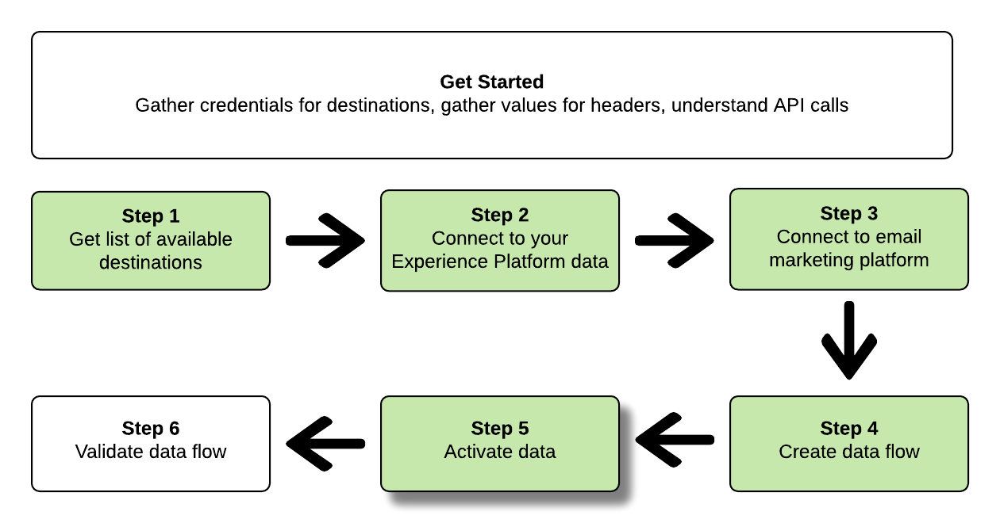

# Verbindung zu E-Mail-Marketing-Zielen herstellen und Daten mithilfe der Flow Service-API aktivieren

In dieser Anleitung erfahren Sie, wie Sie mithilfe von API-Aufrufen eine Verbindung zu Ihren Adobe Experience Platform-Daten herstellen, ein [E-Mail-Marketing-Ziel](../catalog/email-marketing/overview.md) erstellen, einen Datenfluss zu Ihrem neu erstellten Ziel einrichten und Daten zu Ihrem neu erstellten Ziel aktivieren können.

In dieser Anleitung wird für alle Beispiele das Ziel „Adobe Campaign“ verwendet, die Schritte sind aber für alle E-Mail-Marketing-Ziele identisch.


Wenn Sie es vorziehen, die Benutzeroberfläche in Platform zu verwenden, um ein Ziel zu verbinden und Daten zu aktivieren, lesen Sie den Abschnitt [Ziel verbinden](../ui/connect-destination.md) und [Aktivieren von Zielgruppendaten für Batch-Profil-Export-Ziele](../ui/activate-batch-profile-destinations.md) Tutorials.

## Erste Schritte

Dieses Handbuch setzt ein Verständnis der folgenden Komponenten von Adobe Experience Platform voraus:

* [[!DNL Experience Data Model (XDM) System]](../../xdm/home.md): Das standardisierte Framework, mit dem [!DNL Experience Platform] Kundenerlebnisdaten organisiert.
* [[!DNL Catalog Service]](../../catalog/home.md): [!DNL Catalog] ist das Aufzeichnungssystem für Speicherort und Herkunft von Daten in [!DNL Experience Platform].
* [[!DNL Sandboxes]](../../sandboxes/home.md): [!DNL Experience Platform] bietet virtuelle Sandboxes, die eine einzelne [!DNL Platform]-Instanz in separate virtuelle Umgebungen unterteilen, damit Sie Programme für digitale Erlebnisse entwickeln und weiterentwickeln können.

Die folgenden Abschnitte enthalten zusätzliche Informationen, die Sie benötigen, um Daten für E-Mail-Marketing-Ziele in Platform aktivieren zu können.

### Erforderliche Anmeldedaten sammeln

Um die Schritte in dieser Anleitung abzuschließen, benötigen Sie die folgenden Anmeldedaten, je nach Art der Ziele, mit denen Sie Segmente verbinden und aktivieren möchten.

* Für [!DNL Amazon] S3-Verbindungen zu E-Mail-Marketing-Plattformen: `accessId`, `secretKey`
* Bei SFTP-Verbindungen zu E-Mail-Marketing-Plattformen: `domain`, `port`, `username` oder `password` `ssh key` (je nach Verbindungsmethode zum FTP-Speicherort)

### Lesen von Beispiel-API-Aufrufen

In diesem Tutorial wird anhand von Beispielen für API-Aufrufe die korrekte Formatierung von Anfragen aufgezeigt. Dazu gehören Pfade, erforderliche Kopfzeilen und ordnungsgemäß formatierte Anfrage-Payloads. Außerdem wird ein Beispiel für eine von der API im JSON-Format zurückgegebene Antwort bereitgestellt. Informationen zu den Konventionen, die in der Dokumentation für Beispiel-API-Aufrufe verwendet werden, finden Sie im Abschnitt zum [Lesen von Beispiel-API-Aufrufen](../../landing/troubleshooting.md#how-do-i-format-an-api-request) im Handbuch zur Fehlerbehebung für [!DNL Experience Platform]

### Werte für erforderliche und optionale Kopfzeilen sammeln

Um [!DNL Platform]-APIs aufzurufen, müssen Sie zunächst das [Authentifizierungs-Tutorial](https://experienceleague.adobe.com/docs/experience-platform/landing/platform-apis/api-authentication.html?lang=de#platform-apis) abschließen. Durch Abschluss des Authentifizierungs-Tutorials werden die Werte für die einzelnen erforderlichen Header in allen [!DNL Experience Platform]-API-Aufrufen bereitgestellt, wie unten dargestellt:

* Authorization: Bearer `{ACCESS_TOKEN}`
* x-api-key: `{API_KEY}`
* x-gw-ims-org-id: `{IMS_ORG}`

Ressourcen in [!DNL Experience Platform] kann in bestimmte virtuelle Sandboxes isoliert werden. In Anforderungen an [!DNL Platform] APIs können Sie den Namen und die Kennung der Sandbox angeben, in der der Vorgang ausgeführt werden soll. Dies sind optionale Parameter.

* x-sandbox-name: `{SANDBOX_NAME}`

>[!NOTE]
>
>Weitere Informationen zu Sandboxes in [!DNL Experience Platform] finden Sie in der [Sandbox-Übersichtsdokumentation](../../sandboxes/home.md).

Bei allen Anfragen, die eine Payload enthalten (POST, PUT, PATCH), ist eine zusätzliche Medientyp-Kopfzeile erforderlich:

* Content-Type: `application/json`

### Swagger-Dokumentation

Eine zugehörige Referenzdokumentation für alle API-Aufrufe finden Sie in dieser Anleitung in Swagger. Siehe [Flussdienst-API-Dokumentation zur Adobe I/O](https://www.adobe.io/experience-platform-apis/references/flow-service/). Es wird empfohlen, diese Anleitung sowie die Seite mit der Swagger-Dokumentation parallel zu verwenden.

## Liste der verfügbaren Ziele abrufen {#get-the-list-of-available-destinations}


Als ersten Schritt sollten Sie entscheiden, für welches E-Mail-Marketing-Ziel Daten aktiviert werden sollen. Führen Sie also zunächst einen Aufruf durch, um eine Liste der verfügbaren Ziele anzufordern, mit denen Sie eine Verbindung herstellen und Segmente aktivieren können. Führen Sie die folgende GET-Anfrage an den `connectionSpecs`-Endpunkt aus, um eine Liste der verfügbaren Ziele zu erhalten:

**API-Format**

```http
GET /connectionSpecs
```

**Anfrage**

<!--

```shell
curl -X GET \
    'http://platform.adobe.io/data/foundation/flowservice/connectionSpecs' \
    -H 'Authorization: Bearer {ACCESS_TOKEN}' \
    -H 'x-api-key: {API_KEY}' \
    -H 'x-gw-ims-org-id: {IMS_ORG}' \
    -H 'x-sandbox-name: {SANDBOX_NAME}' \
    -H 'x-sandbox-id: {SANDBOX_ID}' \    
    -H 'Content-Type: application/json' \
```

-->

```shell
curl --location --request GET 'https://platform.adobe.io/data/foundation/flowservice/connectionSpecs' \
--header 'accept: application/json' \
--header 'x-gw-ims-org-id: {IMS_ORG}' \
--header 'x-api-key: {API_KEY}' \
--header 'x-sandbox-name: {SANDBOX_NAME}' \
--header 'Authorization: Bearer {ACCESS_TOKEN}'
```


**Antwort**

Eine erfolgreiche Antwort enthält eine Liste der verfügbaren Ziele und ihre eindeutigen Kennungen (`id`). Notieren Sie sich den Wert des Ziels, das Sie verwenden möchten, da Sie ihn in weiteren Schritten benötigen werden. Wenn Sie z. B. Segmente mit Adobe Campaign verbinden und bereitstellen möchten, suchen Sie in der Antwort nach folgendem Code-Ausschnitt:

```json
{
    "id": "0b23e41a-cb4a-4321-a78f-3b654f5d7d97",
  "name": "Adobe Campaign",
  ...
  ...
}
```

## Verbinden Sie Ihre [!DNL Experience Platform] data {#connect-to-your-experience-platform-data}


Als Nächstes müssen Sie eine Verbindung zu Ihrem [!DNL Experience Platform] Daten, damit Sie Profildaten exportieren und in Ihrem bevorzugten Ziel aktivieren können. Das umfasst zwei Unterschritte, die nachfolgend beschrieben werden.

1. Zunächst müssen Sie einen Aufruf ausführen, um den Zugriff auf Ihre Daten in [!DNL Experience Platform], indem Sie eine Basisverbindung einrichten.
2. Mithilfe der Kennung der Basisverbindung führen Sie dann einen weiteren Aufruf durch, bei dem Sie eine Quellverbindung erstellen, durch die die Verbindung zu Ihrer [!DNL Experience Platform] Daten.


### Zugriff auf Ihre Daten zulassen in [!DNL Experience Platform]

**API-Format**

```http
POST /connections
```

**Anfrage**

<!--

```shell
curl -X POST \
    'http://platform.adobe.io/data/foundation/flowservice/connections' \
    -H 'Authorization: Bearer {ACCESS_TOKEN}' \
    -H 'x-api-key: {API_KEY}' \
    -H 'x-gw-ims-org-id: {IMS_ORG}' \
    -H 'x-sandbox-name: {SANDBOX_NAME}' \
    -H 'x-sandbox-id: {SANDBOX_ID}' \ 
    -H 'Content-Type: application/json' \
    -d  '{
            
            "name": "Base connection to Experience Platform",
            "description": "This call establishes the connection to Experience Platform data",
            "connectionSpec": {
                "id": "{CONNECTION_SPEC}",
                "version": "1.0"
            }
           }'
```

-->

```shell
curl --location --request POST 'https://platform.adobe.io/data/foundation/flowservice/connections' \
--header 'Authorization: Bearer {ACCESS_TOKEN}' \
--header 'x-api-key: {API_KEY}' \
--header 'x-gw-ims-org-id: {IMS_ORG}' \
--header 'x-sandbox-name: {SANDBOX_NAME}' \
--header 'Content-Type: application/json' \
--data-raw '{
            "name": "Base connection to Experience Platform",
            "description": "This call establishes the connection to Experience Platform data",
            "connectionSpec": {
                "id": "{CONNECTION_SPEC_ID}",
                "version": "1.0"
            }
}'
```


* `{CONNECTION_SPEC_ID}`: Verwenden Sie die Verbindungsspezifikations-ID für Profil Service - `8a9c3494-9708-43d7-ae3f-cda01e5030e1`.

**Antwort**

Eine erfolgreiche Antwort enthält die eindeutige Kennung der Basisverbindung (`id`). Notieren Sie sich diesen Wert, da Sie ihn im nächsten Schritt zum Erstellen der Quellverbindung benötigen werden.

```json
{
    "id": "1ed86558-59b5-42f7-9865-5859b552f7f4"
}
```

### Verbinden Sie Ihre [!DNL Experience Platform] data {#connect-to-platform-data}

**API-Format**

```http
POST /sourceConnections
```

**Anfrage**

<!--

```shell
curl -X POST \
    'http://platform.adobe.io/data/foundation/flowservice/sourceConnections' \
    -H 'Authorization: Bearer {ACCESS_TOKEN}' \
    -H 'x-api-key: {API_KEY}' \
    -H 'x-gw-ims-org-id: {IMS_ORG}' \
    -H 'x-sandbox-id: {SANDBOX_ID}' \ 
    -H 'x-sandbox-name: {SANDBOX_NAME}' \
    -H 'Content-Type: application/json' \
    -d  '{
  "name": "Connecting to Profile Service",
  "description": "Optional",
  "baseConnectionId": "{BASE_CONNECTION_ID}",
  "connectionSpec": {
    "id": "{CONNECTION_SPEC}",
    "version": "1.0"
  },
  "data": {
    "format": "CSV",
    "schema": null
  }
  }
```

-->

```shell
curl --location --request POST 'https://platform.adobe.io/data/foundation/flowservice/sourceConnections' \
--header 'Authorization: Bearer {ACCESS_TOKEN}' \
--header 'x-api-key: {API_KEY}' \
--header 'x-gw-ims-org-id: {IMS_ORG}' \
--header 'x-sandbox-name: {SANDBOX_NAME}' \
--header 'Content-Type: application/json' \
--data-raw '{
            "name": "Connecting to Profile Service",
            "description": "Optional",
            "connectionSpec": {
                "id": "{CONNECTION_SPEC_ID}",
                "version": "1.0"
            },
            "baseConnectionId": "{BASE_CONNECTION_ID}",
            "data": {
                "format": "CSV",
                "schema": null
            },
            "params": {}
}'
```

* `{BASE_CONNECTION_ID}`: Verwenden Sie die Kennung, die Sie im vorherigen Schritt erhalten haben.
* `{CONNECTION_SPEC_ID}`: Verwenden Sie die Verbindungsspezifikations-ID für [!DNL Profile Service] - `8a9c3494-9708-43d7-ae3f-cda01e5030e1`.

**Antwort**

Eine erfolgreiche Antwort gibt die eindeutige Kennung (`id`) für die neu erstellte Quellverbindung zu [!DNL Profile Service]. Dadurch wird bestätigt, dass Sie erfolgreich eine Verbindung zu Ihrem [!DNL Experience Platform] Daten. Notieren Sie sich diesen Wert, da Sie ihn in einem späteren Schritt benötigen werden.

```json
{
    "id": "ed48ae9b-c774-4b6e-88ae-9bc7748b6e97"
}
```


## Verbindung zum E-Mail-Marketing-Ziel herstellen {#connect-to-email-marketing-destination}


In diesem Schritt richten Sie eine Verbindung zu Ihrem gewünschten E-Mail-Marketing-Ziel ein. Das umfasst zwei Unterschritte, die nachfolgend beschrieben werden.

1. Sie müssen zunächst einen Aufruf ausführen, um den Zugriff auf den E-Mail-Dienstleister zu autorisieren, indem Sie eine Basisverbindung einrichten.
2. Mithilfe der Kennung der Basisverbindung führen Sie dann einen weiteren Aufruf aus, mit dem Sie eine Zielverbindung erstellen. In dem Aufruf sind der Ort in Ihrem Speicherkonto, an dem die exportierten Daten bereitgestellt werden, sowie das Format der zu exportierenden Daten angegeben.

### Zugriff auf das E-Mail-Marketing-Ziel autorisieren

**API-Format**

```http
POST /connections
```

**Anfrage**

<!--

```shell
curl -X POST \
    'http://platform.adobe.io/data/foundation/flowservice/connections' \
    -H 'Authorization: Bearer {ACCESS_TOKEN}' \
    -H 'x-api-key: {API_KEY}' \
    -H 'x-gw-ims-org-id: {IMS_ORG}' \
    -H 'x-sandbox-name: {SANDBOX_NAME}' \
    -H 'x-sandbox-id: {SANDBOX_ID}' \ 
    -H 'Content-Type: application/json' \
    -d  '{
            
            "name": "S3 Connection for Adobe Campaign",
            "description": "ACME company holiday campaign",
            "connectionSpec": {
                "id": "{CONNECTION_SPEC}",
                "version": "1.0"
            },
            "auth": {
                "specName": "{S3 or SFTP}",
                "params": {
                    "accessId": "{ACCESS_ID}",
                    "secretKey": "{SECRET_KEY}"
                }
            }
           }'
```

-->

```shell
curl --location --request POST 'https://platform.adobe.io/data/foundation/flowservice/connections' \
--header 'Authorization: Bearer {ACCESS_TOKEN}' \
--header 'x-api-key: {API_KEY}' \
--header 'x-gw-ims-org-id: {IMS_ORG}' \
--header 'x-sandbox-name: {SANDBOX_NAME}' \
--header 'Content-Type: application/json' \
--data-raw '{
    "name": "S3 Connection for Adobe Campaign",
    "description": "summer advertising campaign",
    "connectionSpec": {
        "id": "{_CONNECTION_SPEC_ID}",
        "version": "1.0"
    },
    "auth": {
        "specName": "{S3 or SFTP}",
        "params": {
            "accessId": "{ACCESS_ID}",
            "secretKey": "{SECRET_KEY}"
        }
    }
}'
```

* `{CONNECTION_SPEC_ID}`: Verwenden Sie die Verbindungsspezifikations-ID, die Sie im Schritt [Liste der verfügbaren Ziele anfordern](#get-the-list-of-available-destinations) erhalten haben.
* `{S3 or SFTP}`: Geben Sie den gewünschten Verbindungstyp für dieses Ziel ein. Blättern Sie im [Zielkatalog](../catalog/overview.md) zu Ihrem bevorzugten Ziel, um zu sehen, ob S3- und/oder SFTP-Verbindungstypen unterstützt werden.
* `{ACCESS_ID}`[!DNL Amazon]: Ihre Zugriffskennung für Ihren S3-Datenspeicherort.
* `{SECRET_KEY}`[!DNL Amazon]: Ihr geheimer Schlüssel für Ihren S3-Datenspeicherort.

**Antwort**

Eine erfolgreiche Antwort enthält die eindeutige Kennung der Basisverbindung (`id`). Notieren Sie sich diesen Wert, da Sie ihn im nächsten Schritt benötigen, um eine Zielverbindung zu erstellen.

```json
{
    "id": "1ed86558-59b5-42f7-9865-5859b552f7f4"
}
```

### Speicherort und Datenformat angeben

[!DNL Adobe Experience Platform] Exportiert Daten für E-Mail-Marketing- und Cloud-Speicher-Ziele in Form von [!DNL CSV] Dateien.

>[!IMPORTANT]
> 
>[!DNL Adobe Experience Platform] teilt die Exportdateien automatisch mit 5 Millionen Datensätzen (Zeilen) pro Datei auf. Jede Zeile stellt ein Profil dar.
>
>Dateinamen mit Aufspaltung werden mit einer Zahl angehängt, die angibt, dass die Datei Teil eines größeren Exports ist. Dies zeigt an: `filename.csv`, `filename_2.csv`, `filename_3.csv`.

**API-Format**

```http
POST /targetConnections
```

**Anfrage**

<!--

```shell
curl -X POST \
    'http://platform.adobe.io/data/foundation/flowservice/targetConnections' \
    -H 'Authorization: Bearer {ACCESS_TOKEN}' \
    -H 'x-api-key: {API_KEY}' \
    -H 'x-gw-ims-org-id: {IMS_ORG}' \
    -H 'x-sandbox-name: {SANDBOX_NAME}' \    
    -H 'x-sandbox-id: {SANDBOX_ID}' \ 
    -H 'Content-Type: application/json' \
    -d  '{
   "baseConnectionId": "{BASE_CONNECTION_ID}",
   "name": "TargetConnection for Adobe Campaign",
   "data": {
       "format": "CSV",
       "schema": {
           "id": "1.0",
           "version": "1.0"
       },
    "connectionSpec": {
    "id": "{CONNECTION_SPEC_ID}",
    "version": "1.0"
   },
   "params": {
       "mode": "S3",
       "bucketName": "{BUCKETNAME}",
       "path": "{FILEPATH}"
    }
    }
```

-->

```shell
curl --location --request POST 'https://platform.adobe.io/data/foundation/flowservice/targetConnections' \
--header 'Authorization: Bearer {ACCESS_TOKEN}' \
--header 'x-api-key: {API_KEY}' \
--header 'x-gw-ims-org-id: {IMS_ORG}' \
--header 'Content-Type: application/json' \
--data-raw '{
    "name": "TargetConnection for Adobe Campaign",
    "description": "Connection to Adobe Campaign",
    "baseConnectionId": "{BASE_CONNECTION_ID}",
    "connectionSpec": {
        "id": "{CONNECTION_SPEC_ID}",
        "version": "1.0"
    },
    "data": {
        "format": "json",
        "schema": {
            "id": "1.0",
            "version": "1.0"
        }
    },
    "params": {
        "mode": "S3",
        "bucketName": "{BUCKETNAME}",
        "path": "{FILEPATH}",
        "format": "CSV"
    }
}'
```

* `{BASE_CONNECTION_ID}`: Nutzen Sie die Kennung der Basisverbindung, die Sie im obigen Schritt erhalten haben.
* `{CONNECTION_SPEC_ID}`: Verwenden Sie die Verbindungsspezifikation, die Sie im Schritt [Liste der verfügbaren Ziele abrufen](#get-the-list-of-available-destinations) erhalten haben.
* `{BUCKETNAME}`: Ihre [!DNL Amazon] S3-Bucket, in dem Platform den Datenexport ablegt.
* `{FILEPATH}`: Der Pfad in Ihrer [!DNL Amazon] S3-Bucket-Verzeichnis, in das Platform den Datenexport ablegt.

**Antwort**

Eine erfolgreiche Antwort gibt für die neu erstellte Zielverbindung zu Ihrem E-Mail-Marketing-Ziel die eindeutige Kennung (`id`) zurück. Notieren Sie sich diesen Wert, da Sie ihn in späteren Schritten benötigen werden.

```json
{
    "id": "12ab90c7-519c-4291-bd20-d64186b62da8"
}
```

## Datenfluss erstellen


Mithilfe der IDs, die Sie in den vorherigen Schritten erhalten haben, können Sie jetzt einen Datenfluss zwischen Ihren [!DNL Experience Platform] Daten und das Ziel, für das Sie Daten aktivieren. Stellen Sie sich diesen Schritt wie die Erstellung der Pipeline vor, durch die später Daten fließen, zwischen [!DNL Experience Platform] und Ihr gewünschtes Ziel.

Um einen Datenfluss zu erstellen, führen Sie eine POST-Anfrage durch (wie unten dargestellt) und geben Sie dabei die unten genannten Werte in der Payload an.

Führen Sie die folgende POST-Anfrage aus, um einen Datenfluss zu erstellen.

**API-Format**

```http
POST /flows
```

**Anfrage**

```shell
curl -X POST \
'https://platform.adobe.io/data/foundation/flowservice/flows' \
-H 'Authorization: Bearer {ACCESS_TOKEN}' \
-H 'x-api-key: {API_KEY}' \
-H 'x-gw-ims-org-id: {IMS_ORG}' \
-H 'x-sandbox-name: {SANDBOX_NAME}' \
-H 'Content-Type: application/json' \
-d  '{
   
        "name": "Activate segments to Adobe Campaign",
        "description": "This operation creates a dataflow which we will later use to activate segments to Adobe Campaign",
        "flowSpec": {
            "id": "{FLOW_SPEC_ID}",
            "version": "1.0"
        },
        "sourceConnectionIds": [
            "{SOURCE_CONNECTION_ID}"
        ],
        "targetConnectionIds": [
            "{TARGET_CONNECTION_ID}"
        ],
        "transformations": [
            {
                "name": "GeneralTransform",
                "params": {
                    "segmentSelectors": {
                        "selectors": []
                    },
                    "profileSelectors": {
                        "selectors": []
                    }
                }
            }
        ]
    }
```

* `{FLOW_SPEC_ID}`: Verwenden Sie den Fluss für das E-Mail-Marketing-Ziel, mit dem Sie eine Verbindung herstellen möchten. Um die Flussspezifikation abzurufen, senden Sie einen GET-Anfrage an den `flowspecs`-Endpunkt. Weiterführende Informationen finden Sie in der Swagger-Dokumentation: https://platform.adobe.io/data/foundation/flowservice/swagger#/Flow%20Specs%20API/getFlowSpecs. Suchen Sie in der Antwort nach `upsTo` und kopieren Sie die entsprechende Kennung des E-Mail-Marketing-Ziels, mit dem Sie eine Verbindung herstellen möchten. Suchen Sie zum Beispiel für Adobe Campaign nach `upsToCampaign` und kopieren Sie den `id`-Parameter.
* `{SOURCE_CONNECTION_ID}`: Verwenden Sie die Quellverbindungs-ID, die Sie im Schritt [Verbindung zu Ihren Experience Platform-Daten herstellen](#connect-to-your-experience-platform-data) erhalten haben.
* `{TARGET_CONNECTION_ID}`: Verwenden Sie die Zielverbindungs-ID, die Sie im Schritt [Verbindung mit E-Mail-Marketing-Ziel herstellen](#connect-to-email-marketing-destination) erhalten haben.

**Antwort**

Bei einer erfolgreichen Antwort werden die Kennung (`id`) des neu erstellten Datenflusses und ein `etag` zurückgegeben. Notieren Sie sich beide Werte. Sie werden sie im nächsten Schritt benötigen, um Segmente zu aktivieren.

```json
{
    "id": "8256cfb4-17e6-432c-a469-6aedafb16cd5",
    "etag": "8256cfb4-17e6-432c-a469-6aedafb16cd5"
}
```


## Daten an Ihr neues Ziel aktivieren



Nachdem Sie alle Verbindungen sowie den Datenfluss erstellt haben, können Sie jetzt Ihre Profildaten für die E-Mail-Marketing-Plattform aktivieren. In diesem Schritt wählen Sie aus, welche Segmente und Profilattribute Sie an das Ziel senden möchten. Außerdem können Sie Daten planen und an das Ziel senden.

Um Segmente für Ihr neues Ziel zu aktivieren, müssen Sie einen JSON-PATCH-Vorgang ausführen, ähnlich dem Beispiel unten. Sie können mehrere Profil- und Segmentattribute in einem Aufruf aktivieren. Weiterführende Informationen zu JSON PATCH finden Sie in der [RFC-Spezifikation](https://tools.ietf.org/html/rfc6902).

**API-Format**

```http
PATCH /flows
```

**Anfrage**

```shell
curl --location --request PATCH 'https://platform.adobe.io/data/foundation/flowservice/flows/{DATAFLOW_ID}' \
--header 'Authorization: Bearer {ACCESS_TOKEN}' \
--header 'x-api-key: {API_KEY}' \
--header 'x-gw-ims-org-id: {IMS_ORG}' \
--header 'Content-Type: application/json' \
--header 'x-sandbox-name: {SANDBOX_NAME}' \
--header 'If-Match: "{ETAG}"' \
--data-raw '[
    {
        "op": "add",
        "path": "/transformations/0/params/segmentSelectors/selectors/-",
        "value": {
            "type": "PLATFORM_SEGMENT",
            "value": {
                "name": "Name of the segment that you are activating",
                "description": "Description of the segment that you are activating",
                "id": "{SEGMENT_ID}"
            }
        }
    },
        {
        "op": "add",
        "path": "/transformations/0/params/segmentSelectors/selectors/-",
        "value": {
            "type": "PLATFORM_SEGMENT",
            "value": {
                "name": "Name of the segment that you are activating",
                "description": "Description of the segment that you are activating",
                "id": "{SEGMENT_ID}"
            }
        }
    },
        {
        "op": "add",
        "path": "/transformations/0/params/profileSelectors/selectors/-",
        "value": {
            "type": "JSON_PATH",
            "value": {
                "operator": "EXISTS",
                "path": "{PROFILE_ATTRIBUTE}"
            }
        }
    }
]
```

* `{DATAFLOW_ID}`: Verwenden Sie den Datenfluss, den Sie im vorherigen Schritt erstellt haben.
* `{ETAG}`: Verwenden Sie das eTag, das Sie im vorherigen Schritt erhalten haben.
* `{SEGMENT_ID}`: Geben Sie die Kennung des Segments an, das Sie an dieses Ziel exportieren möchten. Um Segment-IDs für die Segmente abzurufen, die Sie aktivieren möchten, gehen Sie zu **https://www.adobe.io/apis/experienceplatform/home/api-reference.html#/** auswählen **[!UICONTROL Segmentierungsdienst-API]** im linken Navigationsmenü und suchen Sie nach dem `GET /segment/definitions` Betrieb **[!UICONTROL Segmentdefinitionen]**.
* `{PROFILE_ATTRIBUTE}`: Beispiel, `"person.lastName"`

**Antwort**

Suchen Sie nach einer „202 OK“-Antwort. Es wird kein Antworttext zurückgegeben. Um zu überprüfen, ob die Anfrage korrekt war, lesen Sie den nächsten Schritt „Datenfluss validieren“.

## Datenfluss validieren


Als letzten Schritt in der Anleitung sollten Sie überprüfen, ob die Segmente und Profilattribute dem Datenfluss korrekt zugeordnet wurden.

Führen Sie zur Validierung die folgende GET-Anfrage aus:

**API-Format**

```http
GET /flows
```

**Anfrage**

```shell
curl --location --request PATCH 'https://platform.adobe.io/data/foundation/flowservice/flows/{DATAFLOW_ID}' \
--header 'Authorization: Bearer {ACCESS_TOKEN}' \
--header 'x-api-key: {API_KEY}' \
--header 'x-gw-ims-org-id: {IMS_ORG}' \
--header 'Content-Type: application/json' \
--header 'x-sandbox-name: prod' \
--header 'If-Match: "{ETAG}"' 
```

* `{DATAFLOW_ID}`: Verwenden Sie den Datenfluss aus dem vorherigen Schritt.
* `{ETAG}`: Verwenden Sie das eTag aus dem vorherigen Schritt.

**Antwort**

Die zurückgegebene Antwort sollte im `transformations`-Parameter die Segmente und Profilattribute enthalten, die Sie im vorherigen Schritt gesendet haben. Ein Beispielparameter `transformations` in der Antwort könnte wie folgt aussehen:

```json
"transformations": [
    {
        "name": "GeneralTransform",
        "params": {
            "profileSelectors": {
                "selectors": []
            },
            "segmentSelectors": {
                "selectors": [
                    {
                        "type": "PLATFORM_SEGMENT",
                        "value": {
                            "name": "Men over 50",
                            "description": "",
                            "id": "72ddd79b-6b0a-4e97-a8d2-112ccd81bd02"
                        }
                    }
                ]
            }
        }
    }
],
```

## Nächste Schritte

In diesem Tutorial haben Sie Platform erfolgreich mit einem Ihrer bevorzugten E-Mail-Marketing-Ziele verbunden und einen Datenfluss zum entsprechenden Ziel eingerichtet. Ausgehende Daten können jetzt im Ziel für E-Mail-Kampagnen, zielgruppengerechte Werbung und viele andere Anwendungsfälle genutzt werden. Weiterführende Informationen finden Sie auf den folgenden Seiten:

* [Ziele – Übersicht](../home.md)
* [Zielkatalog – Übersicht](../catalog/overview.md)
