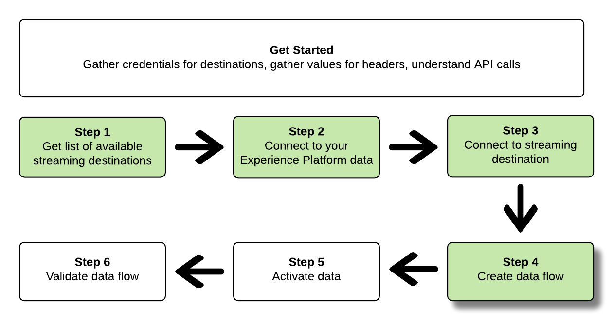

# Verbinden Sie sich mit Streaming-Zielen und aktivieren Sie Daten über die Flow Service-API

>[!IMPORTANT]
> 
>Um eine Verbindung zu einem Ziel herzustellen, benötigen Sie die **[!UICONTROL Ziele anzeigen]** und **[!UICONTROL Ziele verwalten]** [Zugriffssteuerungsberechtigungen](/help/access-control/home.md#permissions).
>
>Um Daten zu aktivieren, benötigen Sie die **[!UICONTROL Ziele anzeigen]**, **[!UICONTROL Ziele aktivieren]**, **[!UICONTROL Anzeigen von Profilen]**, und **[!UICONTROL Segmente anzeigen]** [Zugriffssteuerungsberechtigungen](/help/access-control/home.md#permissions).
>
>Lesen Sie die [Übersicht über die Zugriffssteuerung](/help/access-control/ui/overview.md) oder wenden Sie sich an Ihre Produktadmins, um die erforderlichen Berechtigungen zu erhalten.

In diesem Tutorial erfahren Sie, wie Sie mithilfe von API-Aufrufen eine Verbindung zu Ihren Adobe Experience Platform-Daten herstellen und eine Verbindung zu einem Streaming-Cloud-Speicher-Ziel herstellen ([Amazon Kinesis](../catalog/cloud-storage/amazon-kinesis.md) oder [Azure Event Hubs](../catalog/cloud-storage/azure-event-hubs.md)), erstellen Sie einen Datenfluss zu Ihrem neu erstellten Ziel und aktivieren Sie Daten zu Ihrem neu erstellten Ziel.

In diesem Tutorial wird die [!DNL Amazon Kinesis] Ziel in allen Beispielen, aber die Schritte sind für [!DNL Azure Event Hubs].


Wenn Sie es vorziehen, die Benutzeroberfläche in Platform zu verwenden, um eine Verbindung zu einem Ziel herzustellen und Daten zu aktivieren, lesen Sie den Abschnitt [Ziel verbinden](../ui/connect-destination.md) und [Aktivieren von Zielgruppendaten für Streaming-Zielgruppenexport-Ziele](../ui/activate-segment-streaming-destinations.md) Tutorials.

## Erste Schritte

Dieses Handbuch setzt ein Verständnis der folgenden Komponenten von Adobe Experience Platform voraus:

* [[!DNL Experience Data Model (XDM) System]](../../xdm/home.md): Das standardisierte Framework, mit dem Experience Platform Kundenerlebnisdaten ordnet.
* [[!DNL Catalog Service]](../../catalog/home.md): [!DNL Catalog] ist das Aufzeichnungssystem für Speicherort und Herkunft von Daten innerhalb von Experience Platform.
* [Sandboxes](../../sandboxes/home.md): Experience Platform bietet virtuelle Sandboxes, die eine einzelne Platform-Instanz in separate virtuelle Umgebungen unterteilen, damit Sie Programme für digitale Erlebnisse entwickeln und weiterentwickeln können.

Die folgenden Abschnitte enthalten zusätzliche Informationen, die Sie benötigen, um Daten für Streaming-Ziele in Platform aktivieren zu können.

### Sammeln erforderlicher Anmeldeinformationen

Um die Schritte in diesem Tutorial abzuschließen, sollten Sie je nach dem Typ der Ziele, mit denen Sie Zielgruppen verbinden und aktivieren, über die folgenden Anmeldeinformationen verfügen.

* Für [!DNL Amazon Kinesis] Verbindungen: `accessKeyId`, `secretKey`, `region` oder `connectionUrl`
* Für [!DNL Azure Event Hubs] Verbindungen: `sasKeyName`, `sasKey`, `namespace`

### Lesen von Beispiel-API-Aufrufen {#reading-sample-api-calls}

In diesem Tutorial wird anhand von Beispielen für API-Aufrufe die korrekte Formatierung von Anfragen aufgezeigt. Dazu gehören Pfade, erforderliche Kopfzeilen und ordnungsgemäß formatierte Anfrage-Payloads. Außerdem wird ein Beispiel für eine von der API im JSON-Format zurückgegebene Antwort bereitgestellt. Informationen zu den Konventionen, die in der Dokumentation für Beispiel-API-Aufrufe verwendet werden, finden Sie im Abschnitt zum [Lesen von Beispiel-API-Aufrufen](../../landing/troubleshooting.md#how-do-i-format-an-api-request) im Handbuch zur Fehlerbehebung für Experience Platform.

### Werte für erforderliche und optionale Kopfzeilen sammeln {#gather-values}

Um Platform-APIs aufrufen zu können, müssen Sie zunächst das [Authentifizierungs-Tutorial](https://experienceleague.adobe.com/docs/experience-platform/landing/platform-apis/api-authentication.html?lang=de) abschließen. Im Rahmen des Authentifizierungs-Tutorials werden die Werte für die einzelnen erforderlichen Kopfzeilen in allen Experience Platform-API-Aufrufen bereitgestellt, wie unten dargestellt:

* Authorization: Bearer `{ACCESS_TOKEN}`
* x-api-key: `{API_KEY}`
* x-gw-ims-org-id: `{ORG_ID}`

Ressourcen in Experience Platform lassen sich in spezifischen virtuellen Sandboxes isolieren. Bei Anfragen an Platform-APIs können Sie den Namen und die Kennung der Sandbox angeben, in der der Vorgang ausgeführt werden soll. Dies sind optionale Parameter.

* x-sandbox-name: `{SANDBOX_NAME}`

>[!NOTE]
>
>Weitere Informationen zu Sandboxes in Experience Platform finden Sie in der [Sandbox-Übersichtsdokumentation](../../sandboxes/home.md).

Bei allen Anfragen, die eine Payload enthalten (POST, PUT, PATCH), ist eine zusätzliche Medientyp-Kopfzeile erforderlich:

* Content-Type: `application/json`

### Swagger-Dokumentation {#swagger-docs}

Eine zugehörige Referenzdokumentation für alle API-Aufrufe finden Sie in dieser Anleitung in Swagger. Siehe [Flussdienst-API-Dokumentation unter Adobe I/O](https://www.adobe.io/experience-platform-apis/references/flow-service/). Es wird empfohlen, diese Anleitung sowie die Seite mit der Swagger-Dokumentation parallel zu verwenden.

## Liste der verfügbaren Streaming-Ziele abrufen {#get-the-list-of-available-streaming-destinations}


Als ersten Schritt sollten Sie entscheiden, für welches Streaming-Ziel Daten aktiviert werden sollen. Führen Sie zunächst einen Aufruf durch, um eine Liste der verfügbaren Ziele anzufordern, mit denen Sie Zielgruppen verbinden und aktivieren können. Führen Sie die folgende GET-Anfrage an den `connectionSpecs`-Endpunkt aus, um eine Liste der verfügbaren Ziele zu erhalten:

**API-Format**

```http
GET /connectionSpecs
```

**Anfrage**

```shell
curl --location --request GET 'https://platform.adobe.io/data/foundation/flowservice/connectionSpecs' \
--header 'accept: application/json' \
--header 'x-gw-ims-org-id: {ORG_ID}' \
--header 'x-api-key: {API_KEY}' \
--header 'x-sandbox-name: {SANDBOX_NAME}' \
--header 'Authorization: Bearer {ACCESS_TOKEN}'
```


**Antwort**

Eine erfolgreiche Antwort enthält eine Liste der verfügbaren Ziele und ihre eindeutigen Kennungen (`id`). Notieren Sie sich den Wert des Ziels, das Sie verwenden möchten, da Sie ihn in weiteren Schritten benötigen werden. Wenn Sie beispielsweise Zielgruppen verbinden und bereitstellen möchten [!DNL Amazon Kinesis] oder [!DNL Azure Event Hubs], suchen Sie in der Antwort nach dem folgenden Snippet:

```json
{
    "id": "86043421-563b-46ec-8e6c-e23184711bf6",
  "name": "Amazon Kinesis",
  ...
  ...
}

{
    "id": "bf9f5905-92b7-48bf-bf20-455bc6b60a4e",
  "name": "Azure Event Hubs",
  ...
  ...
}
```

## Verbindung zu Ihren Experience Platform-Daten herstellen {#connect-to-your-experience-platform-data}


Als Nächstes müssen Sie eine Verbindung zu Ihren Experience Platform-Daten herstellen, um Profildaten exportieren und in Ihrem bevorzugten Ziel aktivieren zu können. Das umfasst zwei Unterschritte, die nachfolgend beschrieben werden.

1. Sie müssen zunächst einen Aufruf ausführen, um den Zugriff auf Ihre Daten in Experience Platform zu autorisieren, indem Sie eine Basisverbindung einrichten.
2. Anschließend führen Sie mit der Kennung der Basisverbindung einen weiteren Aufruf aus, mit dem Sie eine Quellverbindung einrichten, die die Verbindung zu Ihren Experience Platform-Daten herstellt.


### Zugriff auf Ihre Daten in Experience Platform genehmigen

**API-Format**

```http
POST /connections
```

**Anfrage**

```shell
curl --location --request POST 'https://platform.adobe.io/data/foundation/flowservice/connections' \
--header 'Authorization: Bearer {ACCESS_TOKEN}' \
--header 'x-api-key: {API_KEY}' \
--header 'x-gw-ims-org-id: {ORG_ID}' \
--header 'x-sandbox-name: {SANDBOX_NAME}' \
--header 'Content-Type: application/json' \
--data-raw '{
            "name": "Base connection to Experience Platform",
            "description": "This call establishes the connection to Experience Platform data",
            "connectionSpec": {
                "id": "{CONNECTION_SPEC_ID}",
                "version": "1.0"
            }
}'
```


* `{CONNECTION_SPEC_ID}`: Verwenden Sie die Verbindungsspezifikations-ID für den Profildienst - `8a9c3494-9708-43d7-ae3f-cda01e5030e1`.

**Antwort**

Eine erfolgreiche Antwort enthält die eindeutige Kennung der Basisverbindung (`id`). Notieren Sie sich diesen Wert, da Sie ihn im nächsten Schritt zum Erstellen der Quellverbindung benötigen werden.

```json
{
    "id": "1ed86558-59b5-42f7-9865-5859b552f7f4"
}
```

### Verbindung zu Ihren Experience Platform-Daten herstellen {#connect-to-platform-data}

**API-Format**

```http
POST /sourceConnections
```

**Anfrage**

```shell
curl --location --request POST 'https://platform.adobe.io/data/foundation/flowservice/sourceConnections' \
--header 'Authorization: Bearer {ACCESS_TOKEN}' \
--header 'x-api-key: {API_KEY}' \
--header 'x-gw-ims-org-id: {ORG_ID}' \
--header 'x-sandbox-name: {SANDBOX_NAME}' \
--header 'Content-Type: application/json' \
--data-raw '{
            "name": "Connecting to Profile Service",
            "description": "Optional",
            "connectionSpec": {
                "id": "{CONNECTION_SPEC_ID}",
                "version": "1.0"
            },
            "baseConnectionId": "{BASE_CONNECTION_ID}",
            "data": {
                "format": "json"
            },
            "params": {}
}'
```

* `{BASE_CONNECTION_ID}`: Verwenden Sie die Kennung, die Sie im vorherigen Schritt erhalten haben.
* `{CONNECTION_SPEC_ID}`: Verwenden Sie die Verbindungsspezifikations-ID für den Profildienst - `8a9c3494-9708-43d7-ae3f-cda01e5030e1`.

**Antwort**

Eine erfolgreiche Antwort gibt die eindeutige Kennung (`id`) für die neu erstellte Quellverbindung zu Profil Service. Dadurch wird bestätigt, dass Sie erfolgreich eine Verbindung zu Ihren Experience Platform-Daten hergestellt haben. Notieren Sie sich diesen Wert, da Sie ihn in einem späteren Schritt benötigen werden.

```json
{
    "id": "ed48ae9b-c774-4b6e-88ae-9bc7748b6e97"
}
```


## Verbindung zum Streaming-Ziel herstellen {#connect-to-streaming-destination}


In diesem Schritt richten Sie eine Verbindung zu Ihrem gewünschten Streaming-Ziel ein. Dies umfasst zwei Unterschritte, die nachfolgend beschrieben werden.

1. Zunächst müssen Sie einen Aufruf ausführen, um den Zugriff auf das Streaming-Ziel zu autorisieren, indem Sie eine Basisverbindung einrichten.
2. Mithilfe der Kennung der Basisverbindung führen Sie dann einen weiteren Aufruf aus, mit dem Sie eine Zielverbindung erstellen. In dem Aufruf sind der Ort in Ihrem Speicherkonto, an dem die exportierten Daten bereitgestellt werden, sowie das Format der zu exportierenden Daten angegeben.

### Zugriff auf das Streaming-Ziel zulassen

**API-Format**

```http
POST /connections
```

**Anfrage**

>[!IMPORTANT]
>
>Das folgende Beispiel enthält Code-Kommentare mit dem Präfix `//`. Diese Kommentare zeigen, wo verschiedene Werte für verschiedene Streaming-Ziele verwendet werden müssen. Entfernen Sie die Kommentare, bevor Sie das Snippet verwenden.

```shell
curl --location --request POST 'https://platform.adobe.io/data/foundation/flowservice/connections' \
--header 'Authorization: Bearer {ACCESS_TOKEN}' \
--header 'x-api-key: {API_KEY}' \
--header 'x-gw-ims-org-id: {ORG_ID}' \
--header 'x-sandbox-name: {SANDBOX_NAME}' \
--header 'Content-Type: application/json' \
--data-raw '{
    "name": "Connection for Amazon Kinesis/ Azure Event Hubs",
    "description": "summer advertising campaign",
    "connectionSpec": {
        "id": "{_CONNECTION_SPEC_ID}",
        "version": "1.0"
    },
    "auth": {
        "specName": "{AUTHENTICATION_CREDENTIALS}",
        "params": { // use these values for Amazon Kinesis connections
            "accessKeyId": "{ACCESS_ID}",
            "secretKey": "{SECRET_KEY}",
            "region": "{REGION}"
        },
        "params": { // use these values for Azure Event Hubs connections
            "sasKeyName": "{SAS_KEY_NAME}",
            "sasKey": "{SAS_KEY}",
            "namespace": "{EVENT_HUB_NAMESPACE}"
        }        
    }
}'
```

* `{CONNECTION_SPEC_ID}`: Verwenden Sie die Verbindungsspezifikations-ID, die Sie im Schritt [Liste der verfügbaren Ziele anfordern](#get-the-list-of-available-destinations) erhalten haben.
* `{AUTHENTICATION_CREDENTIALS}`: Geben Sie den Namen Ihres Streaming-Ziels ein: `Aws Kinesis authentication credentials` oder `Azure EventHub authentication credentials`.
* `{ACCESS_ID}`: *Für [!DNL Amazon Kinesis] Verbindungen.* Ihre Zugriffskennung für Ihren Amazon Kinesis-Speicherort.
* `{SECRET_KEY}`: *Für [!DNL Amazon Kinesis] Verbindungen.* Ihr geheimer Schlüssel für Ihren Amazon Kinesis-Speicherort.
* `{REGION}`: *Für [!DNL Amazon Kinesis] Verbindungen.* Die Region in Ihrer [!DNL Amazon Kinesis] Konto, an dem Platform Ihre Daten streamen wird.
* `{SAS_KEY_NAME}`: *Für [!DNL Azure Event Hubs] Verbindungen.* Geben Sie den Namen Ihres SAS-Schlüssels ein. Erfahren Sie mehr über die Authentifizierung bei [!DNL Azure Event Hubs] mit SAS-Schlüsseln in [Microsoft-Dokumentation](https://docs.microsoft.com/en-us/azure/event-hubs/authenticate-shared-access-signature).
* `{SAS_KEY}`: *Für [!DNL Azure Event Hubs] Verbindungen.* Füllen Sie den SAS-Schlüssel aus. Erfahren Sie mehr über die Authentifizierung bei [!DNL Azure Event Hubs] mit SAS-Schlüsseln in [Microsoft-Dokumentation](https://docs.microsoft.com/en-us/azure/event-hubs/authenticate-shared-access-signature).
* `{EVENT_HUB_NAMESPACE}`: *Für [!DNL Azure Event Hubs] Verbindungen.* Füllen Sie die [!DNL Azure Event Hubs] Namespace, in dem Platform Ihre Daten streamt. Weitere Informationen finden Sie unter [Erstellen eines Ereignis-Hubs-Namespace](https://docs.microsoft.com/en-us/azure/event-hubs/event-hubs-create#create-an-event-hubs-namespace) im [!DNL Microsoft] Dokumentation.

**Antwort**

Eine erfolgreiche Antwort enthält die eindeutige Kennung der Basisverbindung (`id`). Notieren Sie sich diesen Wert, da Sie ihn im nächsten Schritt benötigen, um eine Zielverbindung zu erstellen.

```json
{
    "id": "1ed86558-59b5-42f7-9865-5859b552f7f4"
}
```

### Speicherort und Datenformat angeben

**API-Format**

```http
POST /targetConnections
```

**Anfrage**

>[!IMPORTANT]
>
>Das folgende Beispiel enthält Code-Kommentare mit dem Präfix `//`. Diese Kommentare zeigen, wo verschiedene Werte für verschiedene Streaming-Ziele verwendet werden müssen. Entfernen Sie die Kommentare, bevor Sie das Snippet verwenden.

```shell
curl --location --request POST 'https://platform.adobe.io/data/foundation/flowservice/targetConnections' \
--header 'Authorization: Bearer {ACCESS_TOKEN}' \
--header 'x-api-key: {API_KEY}' \
--header 'x-gw-ims-org-id: {ORG_ID}' \
--header 'Content-Type: application/json' \
--data-raw '{
    "name": "Amazon Kinesis/ Azure Event Hubs target connection",
    "description": "Connection to Amazon Kinesis/ Azure Event Hubs",
    "baseConnectionId": "{BASE_CONNECTION_ID}",
    "connectionSpec": {
        "id": "{CONNECTION_SPEC_ID}",
        "version": "1.0"
    },
    "data": {
        "format": "json"
    },
    "params": { // use these values for Amazon Kinesis connections
        "stream": "{NAME_OF_DATA_STREAM}", 
        "region": "{REGION}"
    },
    "params": { // use these values for Azure Event Hubs connections
        "eventHubName": "{EVENT_HUB_NAME}"
    }
}'
```

* `{BASE_CONNECTION_ID}`: Nutzen Sie die Kennung der Basisverbindung, die Sie im obigen Schritt erhalten haben.
* `{CONNECTION_SPEC_ID}`: Verwenden Sie die Verbindungsspezifikation, die Sie im Schritt [Liste der verfügbaren Ziele abrufen](#get-the-list-of-available-destinations) erhalten haben.
* `{NAME_OF_DATA_STREAM}`: *Für [!DNL Amazon Kinesis] Verbindungen.* Geben Sie den Namen Ihres vorhandenen Datenstreams in Ihrer [!DNL Amazon Kinesis] -Konto. Platform exportiert Daten in diesen Stream.
* `{REGION}`: *Für [!DNL Amazon Kinesis] Verbindungen.* Die Region in Ihrem Amazon Kinesis-Konto, in der Platform Ihre Daten streamt.
* `{EVENT_HUB_NAME}`: *Für [!DNL Azure Event Hubs] Verbindungen.* Füllen Sie die [!DNL Azure Event Hub] Name: Wo Platform Ihre Daten streamt. Weitere Informationen finden Sie unter [Ereignis-Hub erstellen](https://docs.microsoft.com/en-us/azure/event-hubs/event-hubs-create#create-an-event-hub) im [!DNL Microsoft] Dokumentation.

**Antwort**

Eine erfolgreiche Antwort gibt die eindeutige Kennung (`id`) für die neu erstellte Zielverbindung zu Ihrem Streaming-Ziel. Notieren Sie sich diesen Wert, da Sie ihn in späteren Schritten benötigen werden.

```json
{
    "id": "12ab90c7-519c-4291-bd20-d64186b62da8"
}
```

## Datenfluss erstellen



Mithilfe der Kennungen, die Sie in den vorherigen Schritten erhalten haben, können Sie jetzt einen Datenfluss zwischen Ihren Experience Platform-Daten und dem Ziel erstellen, für das Sie Daten aktivieren möchten. Stellen Sie sich diesen Schritt als Bau einer Pipeline vor, durch die später Daten zwischen Experience Platform und dem gewünschten Ziel fließen werden.

Um einen Datenfluss zu erstellen, führen Sie eine POST-Anfrage durch (wie unten dargestellt) und geben Sie dabei die unten genannten Werte in der Payload an.

Führen Sie die folgende POST-Anfrage aus, um einen Datenfluss zu erstellen.

**API-Format**

```http
POST /flows
```

**Anfrage**

```shell
curl -X POST \
'https://platform.adobe.io/data/foundation/flowservice/flows' \
-H 'Authorization: Bearer {ACCESS_TOKEN}' \
-H 'x-api-key: {API_KEY}' \
-H 'x-gw-ims-org-id: {ORG_ID}' \
-H 'x-sandbox-name: {SANDBOX_NAME}' \
-H 'Content-Type: application/json' \
-d  '{
  "name": "Azure Event Hubs",
  "description": "Azure Event Hubs",
  "flowSpec": {
    "id": "{FLOW_SPEC_ID}",
    "version": "1.0"
  },
  "sourceConnectionIds": [
    "{SOURCE_CONNECTION_ID}"
  ],
  "targetConnectionIds": [
    "{TARGET_CONNECTION_ID}"
  ],
  "transformations": [
    {
      "name": "GeneralTransform",
      "params": {
        "profileSelectors": {
          "selectors": [
            
          ]
        },
        "segmentSelectors": {
          "selectors": [
            
          ]
        }
      }
    }
  ]
}
```

* `{FLOW_SPEC_ID}`: Die Flussspezifikations-ID für profilbasierte Ziele lautet `71471eba-b620-49e4-90fd-23f1fa0174d8`. Verwenden Sie diesen Wert im -Aufruf.
* `{SOURCE_CONNECTION_ID}`: Verwenden Sie die Quellverbindungs-ID, die Sie im Schritt [Verbindung zu Ihren Experience Platform-Daten herstellen](#connect-to-your-experience-platform-data) erhalten haben.
* `{TARGET_CONNECTION_ID}`: Verwenden Sie die Ziel-Verbindungs-ID, die Sie im Schritt erhalten haben. [Verbindung zum Streaming-Ziel herstellen](#connect-to-streaming-destination).

**Antwort**

Bei einer erfolgreichen Antwort werden die Kennung (`id`) des neu erstellten Datenflusses und ein `etag` zurückgegeben. Notieren Sie sich beide Werte. wie im nächsten Schritt beschrieben, um Zielgruppen zu aktivieren.

```json
{
    "id": "8256cfb4-17e6-432c-a469-6aedafb16cd5",
    "etag": "8256cfb4-17e6-432c-a469-6aedafb16cd5"
}
```


## Daten an Ihr neues Ziel aktivieren {#activate-data}


Nachdem Sie alle Verbindungen und den Datenfluss erstellt haben, können Sie jetzt Ihre Profildaten für die Streaming-Plattform aktivieren. In diesem Schritt wählen Sie aus, welche Zielgruppen und Profilattribute Sie an das Ziel senden, und Sie können Daten planen und an das Ziel senden.

Um Zielgruppen für Ihr neues Ziel zu aktivieren, müssen Sie einen JSON-PATCH-Vorgang ausführen, der dem unten stehenden Beispiel ähnelt. Sie können mehrere Zielgruppen und Profilattribute in einem Aufruf aktivieren. Weiterführende Informationen zu JSON PATCH finden Sie in der [RFC-Spezifikation](https://tools.ietf.org/html/rfc6902).

**API-Format**

```http
PATCH /flows
```

**Anfrage**

```shell
curl --location --request PATCH 'https://platform.adobe.io/data/foundation/flowservice/flows/{DATAFLOW_ID}' \
--header 'Authorization: Bearer {ACCESS_TOKEN}' \
--header 'x-api-key: {API_KEY}' \
--header 'x-gw-ims-org-id: {ORG_ID}' \
--header 'Content-Type: application/json' \
--header 'x-sandbox-name: {SANDBOX_NAME}' \
--header 'If-Match: "{ETAG}"' \
--data-raw '[
  {
    "op": "add",
    "path": "/transformations/0/params/segmentSelectors/selectors/-",
    "value": {
      "type": "PLATFORM_SEGMENT",
      "value": {
        "name": "Name of the audience that you are activating",
        "description": "Description of the audience that you are activating",
        "id": "{SEGMENT_ID}"
      }
    }
  },
  {
    "op": "add",
    "path": "/transformations/0/params/profileSelectors/selectors/-",
    "value": {
      "type": "JSON_PATH",
      "value": {
        "operator": "EXISTS",
        "path": "{PROFILE_ATTRIBUTE}"
      }
    }
  }
]
```

| Eigenschaft | Beschreibung |
| --------- | ----------- |
| `{DATAFLOW_ID}` | Verwenden Sie in der URL die ID des Datenflusses, den Sie im vorherigen Schritt erstellt haben. |
| `{ETAG}` | Rufen Sie die `{ETAG}` aus der Antwort im vorherigen Schritt, [Erstellen eines Datenflusses](#create-dataflow). Das Antwortformat im vorherigen Schritt hat Escape-Anführungszeichen. Sie müssen die nicht maskierten Werte in der Kopfzeile der Anfrage verwenden. Siehe folgendes Beispiel: <br> <ul><li>Reaktionsbeispiel: `"etag":""7400453a-0000-1a00-0000-62b1c7a90000""`</li><li>Wert, der in Ihrer Anfrage verwendet werden soll: `"etag": "7400453a-0000-1a00-0000-62b1c7a90000"`</li></ul> <br> Der eTag-Wert wird bei jeder erfolgreichen Aktualisierung eines Datenflusses aktualisiert. |
| `{SEGMENT_ID}` | Geben Sie die Zielgruppen-ID an, die Sie an dieses Ziel exportieren möchten. Informationen zum Abrufen der Zielgruppen-IDs für die Zielgruppen, die Sie aktivieren möchten, finden Sie unter [Abrufen einer Zielgruppendefinition](https://www.adobe.io/experience-platform-apis/references/segmentation/#operation/retrieveSegmentDefinitionById) in der Experience Platform-API-Referenz. |
| `{PROFILE_ATTRIBUTE}` | Beispiel: `"person.lastName"` |
| `op` | Der Operationsaufruf, der verwendet wird, um die Aktion zu definieren, die zur Aktualisierung des Datenflusses erforderlich ist. Operationen umfassen: `add`, `replace` und `remove`. Um einem Datenfluss eine Zielgruppe hinzuzufügen, verwenden Sie die `add` Vorgang. |
| `path` | Definiert den Teil des Flusses, der aktualisiert werden soll. Verwenden Sie beim Hinzufügen einer Zielgruppe zu einem Datenfluss den im Beispiel angegebenen Pfad. |
| `value` | Der neue Wert, mit dem Sie Ihren Parameter aktualisieren möchten. |
| `id` | Geben Sie die ID der Audience an, die Sie dem Ziel-Datenfluss hinzufügen möchten. |
| `name` | *Optional*. Geben Sie den Namen der Audience an, die Sie dem Ziel-Datenfluss hinzufügen möchten. Beachten Sie, dass dieses Feld nicht erforderlich ist und Sie dem Ziel-Datenfluss erfolgreich eine Zielgruppe hinzufügen können, ohne dessen Namen anzugeben. |

**Antwort**

Suchen Sie nach einer „202 OK“-Antwort. Es wird kein Antworttext zurückgegeben. Um zu überprüfen, ob die Anfrage korrekt war, lesen Sie den nächsten Schritt „Datenfluss validieren“.

## Datenfluss validieren


Als letzten Schritt im Tutorial sollten Sie überprüfen, ob die Zielgruppen und Profilattribute dem Datenfluss korrekt zugeordnet wurden.

Führen Sie zur Validierung die folgende GET-Anfrage aus:

**API-Format**

```http
GET /flows
```

**Anfrage**

```shell
curl --location --request PATCH 'https://platform.adobe.io/data/foundation/flowservice/flows/{DATAFLOW_ID}' \
--header 'Authorization: Bearer {ACCESS_TOKEN}' \
--header 'x-api-key: {API_KEY}' \
--header 'x-gw-ims-org-id: {ORG_ID}' \
--header 'Content-Type: application/json' \
--header 'x-sandbox-name: prod' \
--header 'If-Match: "{ETAG}"' 
```

* `{DATAFLOW_ID}`: Verwenden Sie den Datenfluss aus dem vorherigen Schritt.
* `{ETAG}`: Verwenden Sie das eTag aus dem vorherigen Schritt.

**Antwort**

Die zurückgegebene Antwort sollte in der `transformations` die Zielgruppen und Profilattribute, die Sie im vorherigen Schritt gesendet haben. Ein Beispielparameter `transformations` in der Antwort könnte wie folgt aussehen:

```json
"transformations": [
    {
        "name": "GeneralTransform",
        "params": {
            "profileSelectors": {
                        "selectors": [
                            {
                                "type": "JSON_PATH",
                                "value": {
                                    "path": "personalEmail.address",
                                    "operator": "EXISTS"
                                }
                            },
                            {
                                "type": "JSON_PATH",
                                "value": {
                                    "path": "person.lastname",
                                    "operator": "EXISTS"
                                }
                            }
                        ]
                    },
            "segmentSelectors": {
                "selectors": [
                    {
                        "type": "PLATFORM_SEGMENT",
                        "value": {
                            "name": "Men over 50",
                            "description": "",
                            "id": "72ddd79b-6b0a-4e97-a8d2-112ccd81bd02"
                        }
                    }
                ]
            }
        }
    }
],
```

**Exportierte Daten**

>[!IMPORTANT]
>
> Zusätzlich zu den Profilattributen und den Zielgruppen im Schritt [Daten für Ihr neues Ziel aktivieren](#activate-data)die exportierten Daten in [!DNL AWS Kinesis] und [!DNL Azure Event Hubs] enthält auch Informationen zur Identitätszuordnung. Dies stellt die Identitäten der exportierten Profile dar (z. B. [ECID](https://experienceleague.adobe.com/docs/id-service/using/intro/id-request.html), mobile ID, Google ID, E-Mail-Adresse usw.). Siehe ein Beispiel unten.

```json
{
  "person": {
    "email": "yourstruly@adobe.com"
  },
  "segmentMembership": {
    "ups": {
      "72ddd79b-6b0a-4e97-a8d2-112ccd81bd02": {
        "lastQualificationTime": "2020-03-03T21:24:39Z",
        "status": "exited"
      },
      "7841ba61-23c1-4bb3-a495-00d695fe1e93": {
        "lastQualificationTime": "2020-03-04T23:37:33Z",
        "status": "realized"
      }
    }
  },
  "identityMap": {
    "ecid": [
      {
        "id": "14575006536349286404619648085736425115"
      },
      {
        "id": "66478888669296734530114754794777368480"
      }
    ],
    "email_lc_sha256": [
      {
        "id": "655332b5fa2aea4498bf7a290cff017cb4"
      },
      {
        "id": "66baf76ef9de8b42df8903f00e0e3dc0b7"
      }
    ]
  }
}
```

## Verwenden [!DNL Postman] Sammlungen für die Verbindung mit Streaming-Zielen  {#collections}

Um eine gestraffte Verbindung zu den in diesem Tutorial beschriebenen Streaming-Zielen herzustellen, können Sie [[!DNL Postman]](https://www.postman.com/).

[!DNL Postman] ist ein Tool, mit dem Sie API-Aufrufe durchführen und Bibliotheken vordefinierter Aufrufe und Umgebungen verwalten können.

Für dieses spezifische Tutorial gilt Folgendes [!DNL Postman] Sammlungen wurden angehängt:

* [!DNL AWS Kinesis] [!DNL Postman] collection
* [!DNL Azure Event Hubs] [!DNL Postman] collection

Klicks [here](../assets/api/streaming-destination/DestinationPostmanCollection.zip) , um das Sammlungsarchiv herunterzuladen.

Jede Sammlung enthält die erforderlichen Anforderungen und Umgebungsvariablen für [!DNL AWS Kinesis], und [!DNL Azure Event Hub], bzw.

### Verwendung der [!DNL Postman] Sammlungen {#how-to-use-postman-collections}

So verbinden Sie sich erfolgreich mit den Zielen über die angehängte [!DNL Postman] Sammlungen, führen Sie die folgenden Schritte aus:

* Herunterladen und installieren [!DNL Postman];
* [Herunterladen](../assets/api/streaming-destination/DestinationPostmanCollection.zip) und entpacken Sie die angehängten Sammlungen.
* Importieren Sie Sammlungen aus den entsprechenden Ordnern in [!DNL Postman];
* Füllen Sie die Umgebungsvariablen gemäß den Anweisungen in diesem Artikel aus.
* Führen Sie die [!DNL API] Anforderungen von [!DNL Postman], basierend auf den Anweisungen in diesem Artikel.

## Umgang mit API-Fehlern {#api-error-handling}

Die API-Endpunkte in diesem Tutorial folgen den allgemeinen Experience Platform API-Fehlermeldungsprinzipien. Siehe Abschnitt [API-Statuscodes](/help/landing/troubleshooting.md#api-status-codes) und [Fehler in der Anfragekopfzeile](/help/landing/troubleshooting.md#request-header-errors) Weitere Informationen zur Interpretation von Fehlerantworten finden Sie im Handbuch zur Fehlerbehebung bei Platform .

## Nächste Schritte {#next-steps}

In diesem Tutorial haben Sie Platform erfolgreich mit einem Ihrer bevorzugten Streaming-Ziele verbunden und einen Datenfluss zum entsprechenden Ziel eingerichtet. Ausgehende Daten können jetzt im Ziel für Kundenanalysen oder andere Datenvorgänge verwendet werden, die Sie ausführen möchten. Weiterführende Informationen finden Sie auf den folgenden Seiten:

* [Ziele – Übersicht](../home.md)
* [Zielkatalog – Übersicht](../catalog/overview.md)
