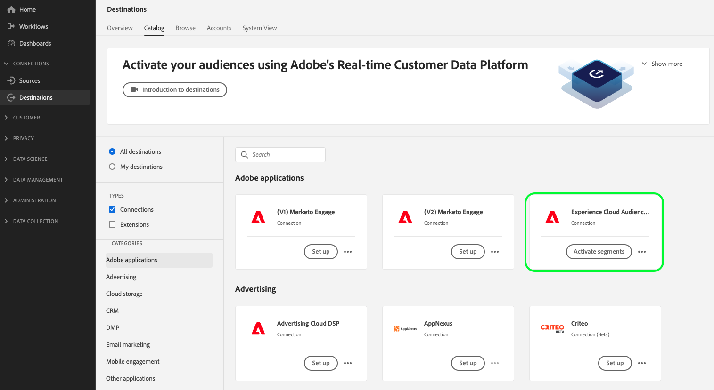
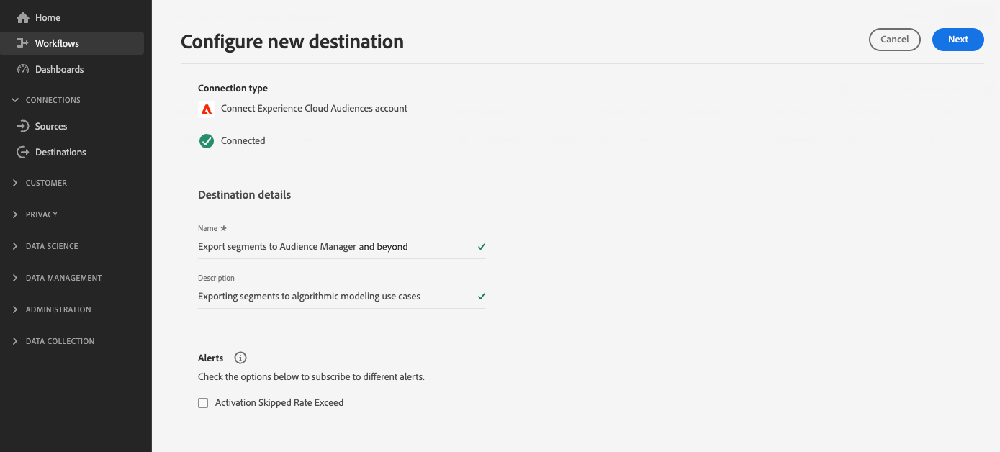

# [!UICONTROL Experience Cloud Audiences]-Verbindung

>[!AVAILABILITY]
>
> Dieses Ziel ist für Kunden von [Adobe Real-Time Customer Data Platform Prime und Ultimate](https://helpx.adobe.com/de/legal/product-descriptions/real-time-customer-data-platform.html) verfügbar.

Verwenden Sie dieses Ziel, um Zielgruppen von [!DNL Real-Time CDP] für Audience Manager und [!DNL Adobe Analytics] zu aktivieren.

Zum Senden von Zielgruppen an [!DNL Adobe Analytics] benötigen Sie eine Audience Manager-Lizenz. Weitere Informationen finden Sie in der Übersicht zu [Audience Analytics](https://experienceleague.adobe.com/docs/analytics/integration/audience-analytics/mc-audiences-aam.html?lang=en).

Um Zielgruppen an andere Adobe-Lösungen zu senden, verwenden Sie die Direktverbindungen von [!DNL Real-Time CDP] zu [Adobe Target](../personalization/adobe-target-connection.md), [Adobe Advertising](../advertising/adobe-advertising-dsp-connection.md), [Adobe Campaign ](../email-marketing/adobe-campaign.md) [Marketo Engage](../adobe/marketo-engage.md).

>[!IMPORTANT]
>
>Dieses Ziel ersetzt die [veraltete Audience-Sharing-Integration](https://experienceleague.adobe.com/docs/audience-manager/user-guide/implementation-integration-guides/integration-experience-platform/aam-aep-audience-sharing.html#aep-segments-in-aam) von [!DNL Real-Time Customer Data Platform] zu verschiedenen Experience Cloud-Lösungen.
> 
>Wenn Sie Zielgruppen bereits von [!DNL Real-Time CDP] für Audience Manager und andere Experience Cloud-Lösungen über die [veraltete Integration zur Freigabe von Zielgruppen](https://experienceleague.adobe.com/docs/audience-manager/user-guide/implementation-integration-guides/integration-experience-platform/aam-aep-audience-sharing.html#aep-segments-in-aam) freigeben, müssen Sie sich an die Kundenunterstützung wenden, um die veraltete Integration zu deaktivieren, bevor Sie dieses Ziel verwenden.

## Anwendungsbeispiele und Vorteile {#use-cases}

Damit Sie besser verstehen können, wie und wann Sie das [!UICONTROL Experience Cloud Audiences]-Ziel verwenden sollten, finden Sie hier einige Beispielanwendungsfälle, die [!DNL Real-Time CDP] Kunden mit diesem Ziel bewältigen können.

### Anwendungsfälle der Data Management-Plattform aktivieren {#dmp-use-cases}

In Audience Manager können Sie [!DNL Real-Time CDP] Zielgruppen für Anwendungsfälle der Data Management-Plattform verwenden, z. B.:

* Hinzufügen [Drittanbieterdaten](https://experienceleague.adobe.com/docs/audience-manager/user-guide/overview/data-types-collected.html#third-party-data) zu Ihren Segmenten
* [Algorithmische Modellierung](https://experienceleague.adobe.com/docs/audience-manager/user-guide/features/algorithmic-models/look-alike-modeling/understanding-models.html);
* Aktivieren Ihrer Zielgruppen für Cookie-basierte Ziele, die noch nicht im [!DNL Real-Time CDP]-Zielkatalog unterstützt werden.

### Granulare Steuerung exportierter Zielgruppen {#segments-control}

Um auszuwählen, welche Zielgruppen in Audience Manager und darüber hinaus exportiert werden sollen, verwenden Sie die neue Integration der Self-Service-Zielgruppenfreigabe über das Experience Cloud-Zielgruppen-Ziel.  Verwenden Sie diese Option, um zu bestimmen, welche Zielgruppen Sie für andere Experience Cloud-Lösungen freigeben möchten und welche Zielgruppen Sie ausschließlich in [!DNL Real-Time CDP] behalten möchten.

Die veraltete Integration zur Freigabe von Audiences ermöglichte keine granulare Kontrolle darüber, welche Audiences nach Audience Manager und darüber hinaus exportiert werden sollten.

### Freigeben von [!DNL Real-Time CDP]-Zielgruppen für [!DNL Adobe Analytics] {#share-audiences-with-analytics}

Zielgruppen, die Sie an das Experience Cloud-Zielgruppen-Ziel senden, werden in [!DNL Adobe Analytics] nicht automatisch angezeigt.

Bevor Sie Zielgruppen an [!DNL Adobe Analytics] senden können, müssen Sie [den Experience Cloud Identity Service für Analytics und Audience Manager implementieren](https://experienceleague.adobe.com/docs/id-service/using/implementation/setup-aam-analytics.html?lang=en).

>[!IMPORTANT]
>
>Zum Senden von Zielgruppen von [!DNL Real-Time CDP] an [!DNL Adobe Analytics] über das Experience Cloud Audiences-Ziel ist eine Audience Manager-Lizenz erforderlich.

### Audiences [!DNL Real-Time CDP] anderen Experience Cloud-Lösungen freigeben {#share-segments-with-other-solutions}

Sie können die Zielkarte „Zielgruppen [!DNL Real-Time CDP]&quot; verwenden, um Zielgruppen für andere Experience Cloud-Lösungen freizugeben.

Adobe empfiehlt jedoch dringend die Verwendung der folgenden dedizierten Zielkarten, wenn Sie Zielgruppen für diese Lösungen freigeben möchten:

* [Adobe Campaign](../email-marketing/adobe-campaign.md)
* [Adobe Target](../personalization/adobe-target-connection.md)
* [Adobe Advertising DSP](../advertising/adobe-advertising-dsp-connection.md)
* [Marketo](../adobe/marketo-engage.md)

## Voraussetzungen {#prerequisites}

>[!IMPORTANT]
>
> * Sie benötigen eine Audience Manager-Lizenz, um die oben genannten Anwendungsfälle [Datenverwaltungsplattform](#dmp-use-cases) zu aktivieren.
> * Sie ** eine Audience Manager-Lizenz, um [!DNL Real-Time CDP] Zielgruppen für [!DNL Adobe Analytics] freizugeben.
> * Sie *keine* Audience Manager-Lizenz benötigen, um [!DNL Real-Time CDP] Zielgruppen für [!DNL Adobe Advertising Cloud], [!DNL Adobe Target], Marketo und andere Experience Cloud-Lösungen freizugeben, die im [ oben erwähnt ](#share-segments-with-other-solutions).

### Für Kunden, die die alte Lösung zur Freigabe von Zielgruppen verwenden {#legacy-audience-sharing}

Wenn Sie Zielgruppen bereits von [!DNL Real-Time CDP] für Audience Manager und andere Experience Cloud-Lösungen über die [Legacy-Zielgruppenfreigabeintegration) freigeben](https://experienceleague.adobe.com/docs/audience-manager/user-guide/implementation-integration-guides/integration-experience-platform/aam-aep-audience-sharing.html#aep-segments-in-aam) müssen Sie sich an die Kundenunterstützung wenden, um die Legacy-Integration zu deaktivieren.

Die Durchlaufzeit zur Lösung des Deprovisioning-Tickets beträgt maximal sechs Werktage. Nachdem die vorhandene Legacy-Integration deaktiviert wurde, können Sie über [ Selbstbedienungs-Zielkarte mit dem ](#connect) „Verbindung erstellen“ fortfahren.

>[!IMPORTANT]
>
>Der Zielgruppenexport aus [!DNL Real-Time CDP] in Ihre anderen Lösungen wird in der Zeit zwischen der Ticketauflösung und dem Zeitpunkt angehalten, zu dem über die Zielkarte eine neue Verbindung hergestellt wird. Sie können diese Ausfallzeit minimieren, indem Sie die Verbindung über die Zielkarte erstellen, nachdem das Ticket geschlossen wurde.

## Bekannte Einschränkungen und Hinweise {#known-limitations}

Beachten Sie die folgenden bekannten Einschränkungen und wichtigen Hinweise bei der Verwendung der Karte Experience Cloud-Zielgruppen :

* Derzeit können Sie das Experience Cloud Audiences -Ziel in einer Sandbox pro Organisation konfigurieren. Der Versuch, eine zweite Zielverbindung in einer anderen Sandbox zu konfigurieren, führt zu einem Fehler.
* Beim Herstellen einer Verbindung zum Ziel wird die Option &quot;[ aktivieren“ ](../../ui/alerts.md). Die Option **Warnhinweise aktivieren“ ist zwar in der Benutzeroberfläche sichtbar, wird aber derzeit nicht**.
* **Unterstützung der Zielgruppen-Aufstockung**: Der erste Export in Audience Manager oder andere Experience Cloud-Lösungen umfasst eine historische Population der Zielgruppen. Benutzende der [Legacy-Zielgruppenfreigabeintegration](https://experienceleague.adobe.com/docs/audience-manager/user-guide/implementation-integration-guides/integration-experience-platform/aam-aep-audience-sharing.html#aep-segments-in-aam) die dieses Ziel konfigurieren, sollten mit einer Aufstockungsdifferenz von etwa sechs Stunden rechnen.
* Audiences, die aus [Audience-Komposition](../../../segmentation/ui/audience-composition.md) stammen, werden nicht direkt unterstützt. Um zusammengesetzte Zielgruppen für dieses Ziel zu aktivieren, müssen Sie über [Segment Builder](../../../segmentation/ui/segment-builder.md) eine Zielgruppendefinition basierend auf Ihrer zusammengesetzten Zielgruppe erstellen und die neu erstellte Zielgruppe aktivieren.

### Latenz beim Aktivieren von Zielgruppen {#audience-activation-latency}

Zwischen der ersten Aktivierung von Zielgruppen in [!DNL Real-Time CDP] und der Zeit, in der sie für die Verwendung in Audience Manager und anderen Experience Cloud-Lösungen bereit sind, liegt eine Latenz von vier Stunden.

Es kann bis zu 24 Stunden dauern, bis Zielgruppen in Audience Manager für alle Anwendungsfälle vollständig verfügbar sind. Es kann bis zu 48 Stunden dauern, bis Zielgruppen aus Experience Cloud-Zielgruppen in Audience Manager-Berichten angezeigt werden.

Metadaten wie Zielgruppennamen sind in Audience Manager innerhalb von Minuten nach der Einrichtung des Exports für das Experience Cloud Audiences-Ziel verfügbar.

## Unterstützte Identitäten {#supported-identities}

Die Profile, die an das [!UICONTROL Experience Cloud Audiences] Ziel exportiert werden, werden den Identitäten zugeordnet, die in der folgenden Tabelle beschrieben werden. Erhalten Sie weitere Informationen zu [Identitäten](/help/identity-service/features/namespaces.md).

| Ziel-Identität | Beschreibung | Zu beachten |
|---|---|---|
| ECID | Experience Cloud ID | Ein Namespace, der die ECID darstellt. Dieser Namespace kann auch durch die folgenden Aliase referenziert werden: &quot;Adobe Marketing Cloud ID“, &quot;[!DNL Adobe Experience Cloud] ID“, &quot;[!DNL Adobe Experience Platform] ID“. Weitere Informationen finden Sie im folgenden Dokument [ECID](/help/identity-service/features/ecid.md) . |
| GAID | GOOGLE ADVERTISING ID | Profile, die in [!DNL Real-Time CDP] mit der Primäridentität Google Advertising ID (GAID) aufgenommen werden, können an dieses Ziel exportiert werden. |
| IDFA | Apple-ID für Werbetreibende | Profile, die in [!DNL Real-Time CDP] mit der Primäridentität Apple ID for Advertisers (IDFA) aufgenommen werden, können an dieses Ziel exportiert werden. |
| email_lc_sha256 | E-Mail-Adressen, die mit dem SHA-256-Algorithmus gehasht wurden | Profile, die in [!DNL Real-Time CDP] mit der primären Identität einer gehashten E-Mail-Adresse aufgenommen werden, können an dieses Ziel exportiert werden. |

{style="table-layout:auto"}

## Unterstützte Zielgruppen {#supported-audiences}

In diesem Abschnitt wird beschrieben, welche Art von Zielgruppe Sie an dieses Ziel exportieren können.

| Zielgruppenherkunft | Unterstützt | Beschreibung |
|---------|----------|----------|
| [!DNL Segmentation Service] | Ja | Zielgruppen, die über den Experience Platform-[ (Segmentierungs-Service) generiert ](../../../segmentation/home.md). |
| Alle anderen Ursprünge der Zielgruppe | Nein | Diese Kategorie enthält alle Ursprünge der Zielgruppe außerhalb der Zielgruppen, die durch die [!DNL Segmentation Service] generiert wurden. Lesen Sie mehr über [verschiedene Ursprünge von Audiences](/help/segmentation/ui/audience-portal.md#customize). Einige Beispiele: <ul><li> benutzerdefinierte Upload-Zielgruppen [importiert](../../../segmentation/ui/audience-portal.md#import-audience) aus CSV-Dateien in Experience Platform,</li><li> Lookalike-Zielgruppen, </li><li> Federated Audiences, </li><li> Zielgruppen, die in anderen Experience Platform-Apps generiert werden, z. B. [!DNL Adobe Journey Optimizer], </li><li> und mehr. </li></ul> |

{style="table-layout:auto"}

Unterstützte Zielgruppen nach Zielgruppen-Datentyp:

| Datentyp der Zielgruppe | Unterstützt | Beschreibung | Anwendungsfälle |
|--------------------|-----------|-------------|-----------|
| [Personen-Zielgruppen](/help/segmentation/types/people-audiences.md) | Ja | Basierend auf Kundenprofilen können Sie bestimmte Personengruppen für Marketing-Kampagnen ansprechen. | Häufige Käufer, Warenkorbabbrüche |
| [Konto-Zielgruppen](/help/segmentation/types/account-audiences.md) | Nein | Targeting von Personen in bestimmten Organisationen für Account-basierte Marketing-Strategien. | B2B-Marketing |
| [Interessenten-Zielgruppen](/help/segmentation/types/prospect-audiences.md) | Nein | Targeting von Personen, die noch keine Kunden sind, aber Merkmale mit Ihrer Zielgruppe teilen. | Akquise mit Drittanbieterdaten |
| [Datensatzexporte](/help/catalog/datasets/overview.md) | Nein | Sammlungen strukturierter Daten, die im Data Lake von [!DNL Adobe Experience Platform] gespeichert sind. | Reporting, Datenwissenschaft-Workflows |

{style="table-layout:auto"}

## Exporttyp und -häufigkeit {#export-type-frequency}

Beziehen Sie sich auf die folgende Tabelle, um Informationen zu Typ und Häufigkeit des Zielexports zu erhalten.

| Element | Typ | Anmerkungen |
|---------|----------|---------|
| Exporttyp | **[!UICONTROL Audience export]** | Sie exportieren alle Mitglieder einer Zielgruppe, die aus den im obigen Abschnitt aufgelisteten Identitäten abgeleitet wurden. |
| Exporthäufigkeit | **[!UICONTROL Streaming]** | Streaming-Ziele sind „immer verfügbare“ API-basierte Verbindungen. Wenn ein Profil in [!DNL Real-Time CDP] auf der Grundlage einer Zielgruppenbewertung aktualisiert wird, sendet der Connector die Aktualisierung nachgelagert an die Zielplattform. Lesen Sie mehr über [Streaming-Ziele](/help/destinations/destination-types.md#streaming-destinations). |

{style="table-layout:auto"}

## Herstellen einer Verbindung mit dem Ziel {#connect}

>[!IMPORTANT]
>
>Um eine Verbindung zum Ziel herzustellen, benötigen Sie die **[!UICONTROL View Destinations]** und **[!UICONTROL Manage Destinations]** Zugriffssteuerungsberechtigungen[. ](/help/access-control/home.md#permissions) Lesen Sie die [Zugriffskontrolle – Übersicht](/help/access-control/ui/overview.md) oder wenden Sie sich an Ihren Produktadministrator, um die erforderlichen Berechtigungen zu erhalten.

Um eine Verbindung mit diesem Ziel herzustellen, gehen Sie wie im [Tutorial zur Zielkonfiguration](../../ui/connect-destination.md) beschrieben vor. Füllen Sie im Workflow zum Konfigurieren des Ziels die Felder aus, die in den beiden folgenden Abschnitten aufgeführt sind.

### Beim Ziel authentifizieren {#authenticate}

Um sich beim Ziel zu authentifizieren, wählen Sie **[!UICONTROL Set up]** in der Ansicht der Zielkarte im Katalog und anschließend **[!UICONTROL Connect to destination]** aus.

### Ausfüllen der Zieldetails {#destination-details}

Füllen Sie die folgenden erforderlichen und optionalen Felder aus, um Details für das Ziel zu konfigurieren. Ein Sternchen neben einem Feld in der Benutzeroberfläche zeigt an, dass das Feld erforderlich ist.

* **[!UICONTROL Name]**: Ein Name, durch den Sie dieses Ziel in Zukunft erkennen können.
* **[!UICONTROL Description]**: Eine Beschreibung, die Ihnen hilft, dieses Ziel in Zukunft zu identifizieren.

## Aktivieren von Zielgruppen für dieses Ziel {#activate}

>[!IMPORTANT]
>
>Zum Aktivieren von Daten benötigen Sie die **[!UICONTROL View Destinations]**, **[!UICONTROL Activate Destinations]**, **[!UICONTROL View Profiles]** und **[!UICONTROL View Segments]** [Zugriffssteuerungsberechtigungen](/help/access-control/home.md#permissions). Lesen Sie die [Übersicht über die Zugriffssteuerung](/help/access-control/ui/overview.md) oder wenden Sie sich an Ihre Produktadmins, um die erforderlichen Berechtigungen zu erhalten.

Anweisungen [ Aktivieren von Zielgruppen für dieses Ziel finden Sie unter „Aktivieren von Profilen ](/help/destinations/ui/activate-segment-streaming-destinations.md) Zielgruppen für Streaming-Zielgruppenexportziele“. Für [ Ziel ist ](/help/destinations/ui/activate-segment-streaming-destinations.md#mapping)Zuordnungsschritt) erforderlich und kein [Planungsschritt](/help/destinations/ui/activate-segment-streaming-destinations.md#scheduling) verfügbar.

## Überprüfen des Datenexports {#exported-data}

Um einen erfolgreichen Datenexport zu validieren, können Sie überprüfen, ob Ihre Zielgruppen erfolgreich zu Ihrer gewünschten Experience Cloud-Lösung gelangt sind.

### Validieren von Daten in Audience Manager {#validate-audience-manager}

Ihre [!DNL Real-Time CDP] Zielgruppen werden in Audience Manager als [Signale](https://experienceleague.adobe.com/docs/audience-manager/user-guide/implementation-integration-guides/integration-experience-platform/aam-aep-audience-sharing.html#aep-segments-as-aam-signals), [Eigenschaften](https://experienceleague.adobe.com/docs/audience-manager/user-guide/implementation-integration-guides/integration-experience-platform/aam-aep-audience-sharing.html#aep-segments-as-aam-traits) und [Segmente](https://experienceleague.adobe.com/docs/audience-manager/user-guide/implementation-integration-guides/integration-experience-platform/aam-aep-audience-sharing.html#aep-segments-as-aam-segments). Sie können in Audience Manager überprüfen, ob die Daten wie unter den obigen Dokumentations-Links beschrieben angezeigt wurden.

Segmentnamen werden 15 Minuten, nachdem die Zielgruppen aus [!DNL Real-Time CDP] gesendet wurden, in Audience Manager angezeigt.

Die Segmentpopulation beginnt innerhalb von 6 Stunden nach dem Versand von [!DNL Real-Time CDP] nach Audience Manager zu fließen und wird in Audience Manager alle 24 Stunden aktualisiert.

Die gesamte Population ist nach 72 Stunden in Audience Manager sichtbar und die Populationen fließen weiterhin nach Audience Manager, es sei denn, die Zielgruppe wurde in [!DNL Real-Time CDP] aus dem Ziel entfernt.

## Datennutzung und -Governance {#data-usage-governance}

Alle [!DNL Real-Time CDP]-Ziele sind bei der Verarbeitung Ihrer Daten mit Datennutzungsrichtlinien konform. Ausführliche Informationen darüber, wie [!DNL Adobe Experience Platform] Data Governance erzwingt, finden Sie unter [Data Governance - Übersicht](/help/data-governance/home.md).

Data Governance in [!DNL Real-Time CDP] wird sowohl durch [Datennutzungskennzeichnungen“ als auch ](/help/data-governance/labels/reference.md) Marketing-Aktionen erzwungen.
Datennutzungskennzeichnungen werden an Programme übertragen, Marketing-Aktionen jedoch nicht. Dies bedeutet, dass Zielgruppen aus [!DNL Real-Time CDP] nach der Landung in Audience Manager an alle verfügbaren Ziele exportiert werden können. In Audience Manager können Sie [Datenexportsteuerelemente) verwenden](https://experienceleague.adobe.com/docs/audience-manager/user-guide/features/data-export-controls.html) um zu verhindern, dass Zielgruppen in bestimmte Ziele exportiert werden.

Zielgruppen, die mit der [!DNL HIPAA] Marketing-Aktion markiert sind, werden nicht von [!DNL Real-Time CDP] an Audience Manager gesendet.

### Berechtigungsverwaltung in Audience Manager {#audience-manager-permissions}

Zielgruppen und Eigenschaften in Audience Manager unterliegen [rollenbasierten Zugriffssteuerung](https://experienceleague.adobe.com/docs/audience-manager/user-guide/features/administration/administration-overview.html) (RBAC).

Audiences, die aus [!DNL Real-Time CDP] exportiert wurden, werden einer bestimmten Datenquelle in Audience Manager namens **[!UICONTROL Experience Platform Segments]** zugewiesen.

Um nur bestimmten Benutzern den Zugriff auf die Zielgruppen zu gewähren, konfigurieren Sie mit [Rollenbasierten Zugriffssteuerungen](https://experienceleague.adobe.com/docs/audience-manager/user-guide/features/administration/administration-overview.html) den Benutzerzugriff auf die Zielgruppen und Eigenschaften, die aus [!DNL Real-Time CDP] Zielgruppen erstellt wurden.
