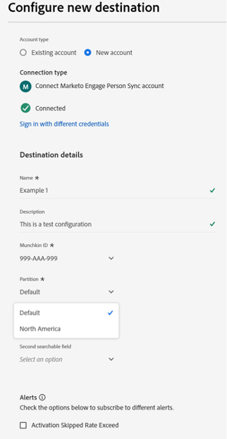

# Marketo Engage Person Sync connection {#marketo-engage-person-sync}

>[!IMPORTANT]
>
>Dieser Ziel-Connector befindet sich in der Beta-Phase und steht nur ausgewählten Kunden zur Verfügung. Wenden Sie sich an Ihren Adobe-Support-Mitarbeiter, um Zugriff anzufordern.

>[!IMPORTANT]
>
>Die Zielkarte **[!UICONTROL Marketo Engage Person Sync]** wird ab **März 2026** nicht mehr unterstützt.
>
>Um einen reibungslosen Übergang zum neuen **[[!UICONTROL Marketo Engage]](marketo-engage-connection.md)**-Ziel sicherzustellen, überprüfen Sie die folgenden Kernpunkte und erforderlichen Aktionen:
>
>* Alle Benutzerinnen und Benutzer von **[!UICONTROL Zielen der Marketo Engage-]** müssen bis März 2026 zum neuen Ziel **[&#128279;](marketo-engage-connection.md)** Marketo Engage&rbrace; migrieren.
>* **Bestehende Datenflüsse werden nicht automatisch migriert.** Sie müssen [eine neue Verbindung einrichten](marketo-engage-connection.md#connect-to-the-destination) zum neuen **[!UICONTROL Marketo Engage]**-Ziel einrichten und Ihre Zielgruppen dort aktivieren.

## Überblick {#overview}

Verwenden Sie den Marketo Engage Person Sync -Connector, um Aktualisierungen von Personen-Zielgruppen zu den entsprechenden Datensätzen in Ihrer Marketo Engage-Instanz zu streamen.

>[!IMPORTANT]
> 
>Der Zielgruppen-Synchronisierungs-Connector für [Marketo V2](/help/destinations/catalog/adobe/marketo-engage.md) sollte nicht im Erstellungsmodus in Verbindung mit dem Synchronisierungs-Connector für die Profilaktualisierung verwendet werden

## Unterstützte Identitäten und Attribute {#support-identities-and-attributes}

### Unterstützte Identitäten {#supported-identities}

| Ziel-Identität | Beschreibung |
| --------------- | ---------------------------------------------------------------------------------------------------------------------------------------------------------------------------------------- |
| E-Mail | Ein Namespace, der eine E-Mail-Adresse darstellt. Dieser Namespace ist häufig mit einer einzelnen Person verknüpft und kann daher verwendet werden, um diese Person über verschiedene Kanäle hinweg zu identifizieren. |

{style="table-layout:auto"}

### Unterstützte Attribute {#supported-attributes}

Sie können Attribute aus Experience Platform jedem der Attribute zuordnen, auf die Ihr Unternehmen in Marketo Zugriff hat. In Marketo können Sie die Anfrage [API beschreiben](https://developer.adobe.com/marketo-apis/api/mapi/#tag/Leads/operation/describeUsingGET_6) verwenden, um die Attributfelder abzurufen, auf die Ihr Unternehmen Zugriff hat.

## Unterstützte Zielgruppen {#supported-audiences}

In diesem Abschnitt wird beschrieben, welche Arten von Zielgruppen Sie an dieses Ziel exportieren können.

| Zielgruppenherkunft | Unterstützt | Beschreibung |
| -------------------- | :-------: | ------------------------------------------------------------------------------------------------------------------------------------------------------------- |
| Segmentierungs-Service | ✓ | Zielgruppen, die über den Experience Platform-[ (Segmentierungs-Service) generiert ](https://experienceleague.adobe.com/de/docs/experience-platform/segmentation/home). |
| Benutzerdefinierte Uploads | ✓ | Audiences, die aus CSV-Dateien in Experience Platform importiert wurden. |

## Exporttyp und -frequenz {#export-type-and-frequency}

Beziehen Sie sich auf die folgende Tabelle, um Informationen zu Typ und Häufigkeit des Zielexports zu erhalten.

| Element | Typ | Anmerkungen |
| ---------------- | --------- | ----------------------------------------------------------------------------------------------------------------------------------------------------------------------------------------------------------------------------------------------------------------------------------------------------------------------------------------------------------------------------------------- |
| Exporthäufigkeit | Streaming | Streaming-Ziele sind „immer verfügbare“ API-basierte Verbindungen. Sobald ein Profil in Experience Platform auf der Grundlage einer Zielgruppenauswertung aktualisiert wird, sendet der Connector das Update nachgelagert an die Zielplattform. Lesen Sie mehr über [Streaming-Ziele](/help/destinations/destination-types.md#streaming-destinations). |

{style="table-layout:auto"}

## Ziel einrichten {#set-up-destination}

>[!IMPORTANT]
>
>* Um eine Verbindung mit dem Ziel herzustellen, benötigen Sie **[!UICONTROL Ziele anzeigen]** und **[!UICONTROL Ziele verwalten]** [Zugriffssteuerungsberechtigungen](/help/access-control/home.md#permissions).

Wenn Ihr Unternehmen Zugriff auf mehrere Organisationen hat, stellen Sie sicher, dass Sie dieselbe Organisation sowohl in Marketo Engage als auch in Real-Time CDP verwenden, wo Sie den Ziel-Connector für Marketo einrichten.  Wenn Sie bereits ein Ziel konfiguriert haben, können Sie ein vorhandenes Marketo-Konto auswählen, das mit Ihrer neuen Konfiguration verwendet werden soll.  Wenn nicht, klicken Sie auf die Eingabeaufforderung Connector to Destination , über die Sie den Namen, die Beschreibung und die Marketo Munchkin-ID des gewünschten Ziels festlegen können.  Die Munchkin-ID Ihrer Marketo-Instanz finden Sie im Menü Admin->Munchkin .

>[!IMPORTANT]
>
>Die Benutzerin oder der Benutzer, die oder der das Ziel einrichtet[ muss in der Marketo](https://experienceleague.adobe.com/de/docs/marketo/using/product-docs/administration/users-and-roles/descriptions-of-role-permissions#access-database)Instanz und -Partition über die Berechtigung „Person bearbeiten“ verfügen.

* **[!UICONTROL Name]**: Ein Name, durch den Sie dieses Ziel in Zukunft erkennen können.
* **[!UICONTROL Beschreibung]**: Eine Beschreibung, die Ihnen hilft, dieses Ziel in Zukunft zu identifizieren.
* **[!UICONTROL Munchkin ID]**: Die Munchkin ID ist die eindeutige Kennung für eine bestimmte Marketo-Instanz.
* **[!UICONTROL Partition]**: ein Konzept in Marketo Engage, mit dem Lead-Datensätze nach Geschäftsbereichen getrennt werden
* **[!UICONTROL Erstes durchsuchbares Feld]**: Feld, in dem dedupliziert werden soll. Das Feld muss in jedem Lead-Datensatz der Eingabe vorhanden sein. Standardwert ist E-Mail
* **[!UICONTROL Erstes durchsuchbares Feld]**: Ein sekundäres Feld zur Deduplizierung. Das Feld muss in jedem Lead-Datensatz der Eingabe vorhanden sein. Optional

Nachdem Sie Ihre Instanz ausgewählt haben, müssen Sie auch die Lead-Partition auswählen, in die die Konfiguration integriert werden soll. Eine [Lead-Partition](https://experienceleague.adobe.com/de/docs/marketo/using/product-docs/administration/workspaces-and-person-partitions/understanding-workspaces-and-person-partitions) ist ein Konzept in Marketo Engage, mit dem Lead-Datensätze nach Geschäftsbereichen wie Marken oder Vertriebsregionen getrennt werden. Wenn Ihr Marketo-Abonnement nicht über die Funktion „Arbeitsbereiche und Partitionen“ verfügt oder wenn in Ihrem Abonnement keine zusätzlichen Partitionen erstellt wurden, ist nur die Standardpartition verfügbar. Eine einzelne Konfiguration kann nur Lead-Einträge aktualisieren, die in ihrer konfigurierten Partition vorhanden sind.

>[!IMPORTANT]
> 
>Nachdem eine Zielgruppe zum ersten Mal für das Marketo-Ziel aktiviert wurde, kann das Aufstocken von Profilen, die bereits vor der Marketo-Zielaktivierung in der Zielgruppe vorhanden waren, *bis zu 24 Stunden*. Ab jetzt werden Profile, die der Zielgruppe hinzugefügt werden, sofort zu Marketo hinzugefügt.

### Deduplizierungsfelder {#deduplication-fields}

Beim Senden von Aktualisierungen an Marketo Engage werden Datensätze anhand der ausgewählten Partition und eines oder zweier benutzerausgewählter Felder ausgewählt. Wenn Ihr Ziel mit der Nordamerika-Partition konfiguriert ist und E-Mail-Adresse und Firmenname als Deduplizierungsfelder konfiguriert sind, müssen alle drei Felder übereinstimmen, um Änderungen auf einen vorhandenen Datensatz anzuwenden. Beispiel:

* Das Ziel ist mit der Nordamerika-Partition konfiguriert
* Person mit E-Mail-<test@example.com> und Firmenname Example Inc. in Experience Platform stimmt mit der Zielgruppe überein
* Sofern in der Nordamerika-Partition in Marketo noch kein Datensatz mit diesen Werten vorhanden ist, wird ein neuer Lead-Datensatz erstellt

Wenn kein übereinstimmender Lead-Datensatz gefunden wird, wird ein neuer Datensatz erstellt.

## Zielgruppen aktivieren {#activate-audiences}

>[!IMPORTANT]
> 
>* Zum Aktivieren von Daten benötigen Sie die Berechtigungen **[!UICONTROL Ziele anzeigen]**, **[!UICONTROL Ziele aktivieren]**, **[!UICONTROL Profile anzeigen]** und **[!UICONTROL Segmente anzeigen]**&#x200B;[Zugriffssteuerung](/help/access-control/home.md#permissions). Lesen Sie die [Zugriffssteuerung – Übersicht](/help/access-control/ui/overview.md) oder wenden Sie sich an Ihren Produktadministrator, um die erforderlichen Berechtigungen zu erhalten.

Anweisungen zum Aktivieren von Zielgruppensegmenten für dieses Ziel finden Sie unter [Aktivieren von Profilen und Segmenten für Streaming-Segmentexportziele](/help/destinations/ui/activate-segment-streaming-destinations.md).

Im Schritt Zielgruppen aktivieren können Sie aus allen Personen-Zielgruppen auswählen, die für Sie sichtbar sind.

## Feldzuordnung {#field-mapping}

Damit Änderungen an einem bestimmten Personenattribut an Marketo Engage gesendet werden können, muss das Feld von einem Real-Time CDP-Feld einem Marketo-Feld zugeordnet werden.

Experience Platform-Datentypen und Marketo-Datentypen können wie folgt zugeordnet werden:

| Experience Platform-Datentyp | Marketo-Datentyp |
| ----------------------------- | ------------------------------------ |
| String | Zeichenfolge, Textbereich, URL, Telefon, E-Mail |
| Aufzählung | String |
| Datum | Datum |
| Datum-Uhrzeit | Datum/Uhrzeit |
| Ganzzahl | Ganzzahl |
| Kurz | Ganzzahl |
| Lang | Gleitkommazahl |
| Double | Währung, Gleitkommazahl, Prozent |
| Boolesch | Boolesch |
| Array | Nicht unterstützt |
| Objekt | Nicht unterstützt |
| Zuordnung | Nicht unterstützt |
| Byte | Nicht unterstützt |

{style="table-layout:auto"}

In einigen Fällen ist es wünschenswert, Integrationen zu erlauben, den Wert eines Felds festzulegen, wenn es keinen gibt, während Integrationen daran gehindert werden, Aktualisierungen an Feldern vorzunehmen, die bereits einen Wert haben.  Wenn Sie verhindern müssen, dass der Ziel-Connector vorhandene Werte in Ihrer Marketo Engage-Instanz überschreibt, können Sie im Abschnitt Admin->Feldverwaltung Ihrer Marketo-Instanz Felder so konfigurieren, dass Aktualisierungen blockiert werden, und den Quelltyp Adobe Experience Platform umschalten.

## Datennutzung und Governance {#data-usage-and-governance}

Alle Adobe Experience Platform-Ziele sind bei der Verarbeitung Ihrer Daten mit Datennutzungsrichtlinien konform. Ausführliche Informationen darüber, wie Adobe Experience Platform Data Governance erzwingt, finden Sie unter [Data Governance - Übersicht](/help/data-governance/home.md).
