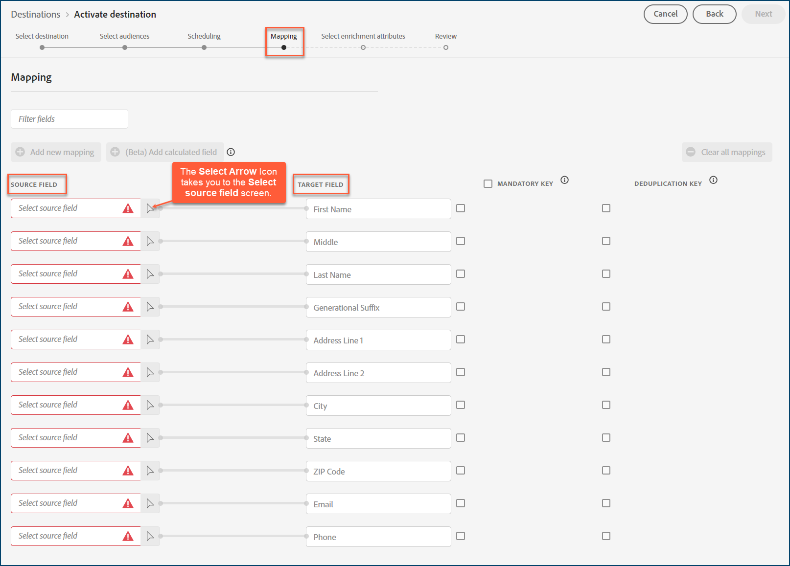

# [!DNL Acxiom Audience Distribution]

>[!NOTE]
>
>Das [!DNL Acxiom Audience Distribution]-Ziel befindet sich in der Beta-Phase. Dieser Ziel-Connector und diese Dokumentationsseite werden vom [!DNL Acxiom]-Team erstellt und gepflegt. Bei Fragen oder Aktualisierungsanfragen wenden Sie sich bitte direkt an Acxiom [hier](mailto:acxiom-adobe-help@acxiom.com).

Verwenden Sie das [!DNL Acxiom Audience Distribution] Ziel, um Zielgruppen mit [!DNL Acxiom's] [Real ID™](https://www.acxiom.com/real-id/real-id/)-Technologie zu erweitern und Zielgruppen für mehrere Plattformen zu aktivieren, z. B. [!DNL Altice], [!DNL Ampersand], [!DNL Comcast] und mehr.

Dieses Tutorial enthält Anweisungen zum Erstellen eines [!DNL Acxiom Audience Distribution]-Ziel-Connectors mithilfe der [!DNL Adobe Experience Platform]-Benutzeroberfläche. Dieser Connector wird zum Erstellen und Verteilen von Zielgruppen an ausgewählte Ziele verwendet.

## Anwendungsfälle {#use-cases}

Damit Sie besser verstehen können, wie und wann Sie das [!DNL Acxiom Audience Distribution]-Ziel verwenden sollten, finden Sie hier ein Anwendungsbeispiel, das [!DNL Adobe Experience Platform] Kunden mithilfe dieses Connectors lösen können.

### Senden von Zielgruppen von Experience Platform an Ihr Acxiom-Konto {#send-audiences}

Verwenden Sie diesen Ziel-Connector, wenn Sie ein Marketing-Experte sind, der Zielgruppen von [!DNL Experience Platform] zur kanalübergreifenden Akquise an Ihr [!DNL Acxiom]-Konto senden möchte.

So ist beispielsweise die Marketing Operations-Abteilung einer globalen Finanzdienstleistungsmarke an einer kanalübergreifenden Kundenakquise über mehrere Werbeplattformen interessiert. Sie können den Ziel-Connector von [!DNL Acxiom Audience Distribution] verwenden, um Zielgruppen von [!DNL Experience Platform] an [!DNL Acxiom] zu senden, die Zielgruppen mit [!DNL Acxiom's Real ID] Technologie zu erweitern und die Zielgruppen für mehrere Plattformen zu aktivieren, z. B. [!DNL Altice], [!DNL Ampersand], [!DNL Comcast] und mehr.

## Voraussetzungen {#prerequisites}

* **Nutzungsbedingungen bestätigen:** Bevor Sie ein neues [!DNL Acxiom Audience Distribution] konfigurieren können, müssen Sie [!DNL Acxiom's] Nutzungsbedingungen lesen und unterzeichnen. Sie erhalten den Link zur Vereinbarung, sobald Ihr ausgeführter Auftrag abgeschlossen ist. Bis zum Unterzeichnen des Vertrags wird die [!DNL Acxiom Audience Distribution] Zielkarte im Experience Platform-Zielkatalog nicht angezeigt. Nachdem Sie den Vertrag akzeptiert und unterzeichnet haben, schließen [!DNL Adobe] Ihren Onboarding-Prozess ab und Sie sehen die [!DNL Acxiom Audience Distribution] Zielkarte.
* **Kennen Sie Ihre Adobe-Organisations-ID:** Ihre [!DNL Adobe] Organisations-ID ist erforderlich, um die Bedingungen Ihrer Benutzervereinbarung zu erfüllen. Weitere Informationen zum Anzeigen *Organisations* ID finden Sie unter [!DNL Adobe's]Organisationen in [Experience Cloud](https://experienceleague.adobe.com/de/docs/core-services/interface/administration/organizations#concept_EA8AEE5B02CF46ACBDAD6A8508646255).

## Unterstützte Ziele {#supported-destinations}

Das [!DNL Acxiom Audience Distribution]-Ziel unterstützt derzeit die Zielgruppenaktivierung für die folgenden Plattformen. 

* [!DNL Altice]
* [!DNL Ampersand]
* [!DNL Comcast]
* [!DNL Cox]
* [[!DNL LG Ads]](#lg-ads)
* [!DNL Spectrum]
* [!DNL Viant]

## Herstellen einer Verbindung mit dem Ziel {#connect}

Die Authentifizierung für [!DNL Acxiom's Audience Distribution] Ziel wird automatisch im Hintergrund durchgeführt.

## Zielspezifische Einstellungen {#destination-settings}

Für einige [!DNL Acxiom Audience Distribution]-Ziele sind zusätzliche Informationen erforderlich. Die folgenden Abschnitte enthalten detaillierte Anleitungen zum Konfigurieren dieser Optionen.

### [!DNL LG Ads] {#lg-ads}

Um Details für das Ziel zu konfigurieren, füllen Sie die folgenden Felder aus.

* **Segmentkategorie**: Die Zielkategorie oder die Vertikale, in die Ihr Segment fällt. Beispiel: Finanzdienstleistungen, Automobil, Gesundheit usw.

## Aktivieren von Zielgruppen für dieses Ziel {#activate}

>[!IMPORTANT]
> 
>* Zum Aktivieren von Daten benötigen Sie die Berechtigungen **[!UICONTROL Ziele anzeigen]**, **[!UICONTROL Ziele aktivieren]**, **[!UICONTROL Profile anzeigen]** und **[!UICONTROL Segmente anzeigen]**&#x200B;[Zugriffssteuerung](/help/access-control/home.md#permissions). Lesen Sie die [Übersicht über die Zugriffssteuerung](/help/access-control/ui/overview.md) oder wenden Sie sich an Ihre Produktadmins, um die erforderlichen Berechtigungen zu erhalten.
>* Zum Exportieren *Identitäten* benötigen Sie die Berechtigung **[!UICONTROL Identitätsdiagramm anzeigen]** [Zugriffssteuerung](/help/access-control/home.md#permissions).   {width="100" zoomable="yes"}

Anweisungen zum Aktivieren von Zielgruppen für dieses Ziel finden Sie unter [Aktivieren von Zielgruppendaten für Batch-Profil-Exportziele](/help/destinations/ui/activate-batch-profile-destinations.md).

>[!NOTE]
>
>Das [!DNL Acxiom Audience Distribution] unterstützt nur vollständige Dateiexporte.

### Zuordnen von Attributen und Identitäten {#map}

Damit das [!DNL Acxiom Audience Distribution] Ziel die Zielgruppendaten korrekt erhält, müssen Sie die Quellfelder vom Experience Platform den richtigen [!DNL Acxiom Audience Distribution] Zielfeldern zuordnen.

[!DNL Acxiom Audience Distribution] ermöglicht nur die Zuordnung zu den folgenden Zielfeldern. Die in der folgenden Tabelle beschriebenen Zielfelder müssen in der unten angegebenen Reihenfolge zugeordnet werden.

| Feldname | Beschreibung | Erforderlich | Reihenfolge der Felder | Max. Länge |
|---|---|---|---|---|          
| Vorname | Vorname der Person | Nein | 1 | 255 |
| Mitte | Zweiter Vorname oder Initiale der Person | Nein | 2 | 50 |
| Nachname | Nachname der Einzelperson | Ja | 3 | 255 |
| Generationssuffix | Suffix des Individuums | Nein | 4 | 10 |
| Adresszeile 1 | Adresse 1 Feld des Hauptwohnsitzes | Ja | 5 | 255 |
| Adresszeile 2 | Adresse 2 Feld des Erstwohnsitzes | Nein | 6 | 255 |
| Stadt | Stadt mit Erstwohnsitz | Ja | 7 | 255 |
| Land | Landesabkürzung für Hauptwohnsitz | Ja | 8 | 2 |
| Postleitzahl | Postleitzahl des Hauptwohnsitzes | Ja | 9 | 10 |
| E-Mail | Primäre E-Mail Standardmäßig wird dieses Feld als Deduplizierungsschlüssel verwendet, um die Datensätze eindeutig zu machen | Nein | 10 | 255 |
| Telefon | Telefonnummer des Kontakts (Vorwahl + Nummer)  Standardmäßig wird dieses Feld als Deduplizierungsschlüssel verwendet, um die Datensätze eindeutig zu machen. | Nein | 11 | 10 |

Geben Sie in der Spalte **[!UICONTROL Source]** den Namen jedes Quellattributs ein, das Sie dem entsprechenden Zielfeld zuordnen möchten, oder wählen Sie das Pfeilsymbol aus, um den Bildschirm **[!UICONTROL Quellfeld auswählen]** öffnen. 

Nachdem Sie alle Felder zugeordnet haben, klicken Sie auf **[!UICONTROL Weiter]**.

Wenn Sie [!DNL Adobe's] Standardschema nicht verwenden, finden Sie in der Dokumentation [Handbuch zur Query Service](../../../query-service/ui/overview.md) Informationen dazu, wie Sie den Abfrage-Service verwenden, um das [!DNL Adobe] Standardschema mit Ihren Feldnamen aufzufüllen.

### Überprüfung {#review}

Nachdem Sie alle oben genannten Schritte ausgeführt haben, können Sie den Status Ihrer Zielverbindung und die Details Ihrer Zielgruppe überprüfen, bevor Sie sie aktivieren (verteilen). Die ausgewählten Zielgruppen werden in einer Liste unten angezeigt. Jede Zielgruppe ist ein separater Aufruf der [!DNL Acxiom Audience Distribution]-API.

Wenn Sie mit den Ergebnissen zufrieden sind, klicken Sie auf **[!UICONTROL Beenden]**, um Ihr Ziel zu aktivieren.

## Fehlerbehebung {#troubleshooting}

Wenn Ihr Zielvertreter Ihre Zielgruppe nicht finden kann, wenden Sie sich an Ihren [!DNL Adobe].

Sie müssen Ihrem [!DNL Adobe] folgende Informationen zur Verfügung stellen:
* Zielgruppenname
* Name des Ziels
* Datum der Zielgruppenaktivierung
* Name der exportierten Datei

## Nächste Schritte {#next-steps}

In diesem Tutorial haben Sie erfolgreich eine Zielgruppe für die ausgewählte Zielplattform aktiviert. Wenden Sie sich anschließend an den für Ihre Zielplattform zuständigen Support, um mit der Einrichtung Ihrer Kampagne zu beginnen.

## Datennutzung und -Governance {#data-usage-governance}

Alle [!DNL Adobe Experience Platform]-Ziele sind bei der Verarbeitung Ihrer Daten mit Datennutzungsrichtlinien konform. Ausführliche Informationen darüber, wie [!DNL Adobe Experience Platform] Data Governance erzwingt, finden Sie unter [Data Governance - Übersicht](https://experienceleague.adobe.com/en/docs/experience-platform/data-governance/home).
