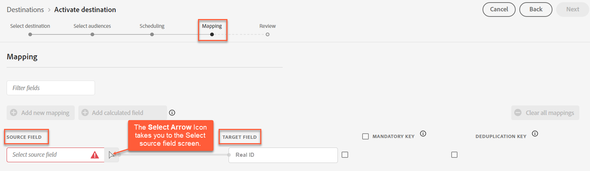

# [!DNL Acxiom Real ID™ Audience Connection]

>[!NOTE]
>
>Das [!DNL Acxiom Real ID™ Audience Connection]-Ziel befindet sich in der Beta-Phase. Dieser Ziel-Connector und diese Dokumentationsseite werden vom [!DNL Acxiom]-Team erstellt und gepflegt. Bei Fragen oder Aktualisierungsanfragen wenden Sie sich bitte direkt an Acxiom [hier](mailto:acxiom-adobe-help@acxiom.com).

Verwenden Sie das [!DNL Acxiom Real ID Audience Connection] Ziel, um Zielgruppen mit [!DNL Acxiom's] [Real ID™](https://www.acxiom.com/real-id/real-id/)-Technologie zu erweitern und Zielgruppen für mehrere Plattformen zu aktivieren, z. B. [!DNL Altice], [!DNL Ampersand], [!DNL Comcast] und mehr.

Dieses Tutorial enthält Anweisungen zum Erstellen eines [!DNL Acxiom Real ID Audience Connection]-Ziel-Connectors mithilfe der [!DNL Adobe Experience Platform]-Benutzeroberfläche. Dieser Connector wird zum Erstellen und Verteilen von Zielgruppen an ausgewählte Ziele verwendet.

## Anwendungsfälle {#use-cases}

Dieser Connector unterstützt Clients, bei denen Acxiom Real Identity als Kennung in Real-Time CDP geladen wurde. Damit Sie besser verstehen können, wie und wann Sie das [!DNL Acxiom Real ID Audience Connection]-Ziel verwenden sollten, finden Sie hier ein Anwendungsbeispiel, das [!DNL Adobe Experience Platform] Kunden mithilfe dieses Connectors lösen können.

### Senden von Zielgruppen aus Experience Platform an Ihr Acxiom-Konto {#send-audiences}

Verwenden Sie diesen Ziel-Connector, wenn Sie ein Marketing-Experte sind, der Zielgruppen von [!DNL Experience Platform] zur kanalübergreifenden Akquise an Ihr [!DNL Acxiom]-Konto senden möchte.

So ist beispielsweise die Marketing Operations-Abteilung einer globalen Finanzdienstleistungsmarke an einer kanalübergreifenden Kundenakquise über mehrere Werbeplattformen interessiert. Sie können den Ziel-Connector von [!DNL Acxiom Real ID Audience Connection] verwenden, um Zielgruppen von [!DNL Experience Platform] an [!DNL Acxiom] zu senden, die Zielgruppen mit [!DNL Acxiom's Real ID] Technologie zu erweitern und die Zielgruppen für mehrere Plattformen zu aktivieren, z. B. [!DNL Altice], [!DNL Ampersand], [!DNL Comcast] und mehr.

## Voraussetzungen {#prerequisites}

* **Nutzungsbedingungen bestätigen:** Bevor Sie ein neues [!DNL Acxiom Real ID Audience Connection] konfigurieren können, müssen Sie [!DNL Acxiom's] Nutzungsbedingungen lesen und unterzeichnen. Sie erhalten den Link zur Vereinbarung, sobald Ihr ausgeführter Auftrag abgeschlossen ist. Solange Sie die Vereinbarung nicht unterzeichnet haben, wird die [!DNL Acxiom Real ID Audience Connection] Zielkarte im Experience Platform-Zielkatalog nicht angezeigt. Nachdem Sie den Vertrag akzeptiert und unterzeichnet haben, schließen [!DNL Adobe] Ihren Onboarding-Prozess ab und Sie sehen die [!DNL Acxiom Real ID Audience Connection] Zielkarte.
* **Kennen Sie Ihre Adobe-Organisations-ID**: Zum Ausfüllen Ihrer Nutzungsbedingungen ist Ihre [!DNL Adobe] Organisations-ID erforderlich. Weitere Informationen zum Anzeigen [!DNL Adobe's] Organisations *ID finden Sie unter* Organisationen in [Experience Cloud](https://experienceleague.adobe.com/de/docs/core-services/interface/administration/organizations#concept_EA8AEE5B02CF46ACBDAD6A8508646255).
* **Lizenz für [!DNL Acxiom's Real ID] Produkt erwerben:** Sobald eine Lizenz erworben wurde, stellen Sie die Real ID von Acxiom in Real-Time CDP zur Verfügung. Siehe [Acxiom Data Enhancement](https://experienceleague.adobe.com/en/docs/experience-platform/destinations/catalog/data-partner/acxiom-data-enhancement) für weitere Informationen.

## Unterstützte Identitäten {#supported-identities}

[!DNL Acxiom's Real ID Audience Connection] Ziel unterstützt die Aktivierung von Identitäten, die in der folgenden Tabelle beschrieben sind. Erhalten Sie weitere Informationen zu [Identitäten](https://experienceleague.adobe.com/de/docs/experience-platform/identity/features/namespaces).

| Ziel-Identität | Beschreibung | Zu beachten |
|---------------|----------------|----------------|
| Tatsächliche ID | [!DNL Acxiom Real ID] | Wählen Sie diese Zielidentität aus, wenn Ihre Quellidentität ein Acxiom Real ID-Namespace ist. |
| extern_id | Benutzerdefinierte Benutzer-IDs | Wählen Sie diese Zielidentität aus, wenn Ihre Quellidentität ein benutzerdefinierter Namespace ist. |

## Unterstützte Zielgruppen {#supported-audiences}

In diesem Abschnitt wird beschrieben, welche Arten von Zielgruppen Sie an dieses Ziel exportieren können.

| Zielgruppenherkunft | Unterstützt | Beschreibung |
|---------------|----------------|----------------|
| Segmentierungs-Service | ✓ | Zielgruppen, die über den Experience Platform-[ (Segmentierungs-Service) generiert ](https://experienceleague.adobe.com/de/docs/experience-platform/segmentation/home). |
| Benutzerdefinierte Uploads | ✓ | Zielgruppen, die aus CSV-Dateien in Experience Platform [importiert](https://experienceleague.adobe.com/de/docs/experience-platform/segmentation/ui/audience-portal#import-audience) werden. |

## Unterstützte Ziele {#supported-destinations}

[!DNL Acxiom's Real ID Audience Connection] Ziel unterstützt derzeit die Zielgruppenaktivierung für die folgenden Plattformen.

* [!DNL Altice]
* [!DNL Ampersand]
* [!DNL Comcast]
* [!DNL Cox]
* [[!DNL LG Ads]](#lg-ads)
* [!DNL Spectrum]
* [!DNL Viant]

## Herstellen einer Verbindung mit dem Ziel {#connect}

Die Authentifizierung für [!DNL Acxiom's Real ID Audience Connection] Ziel wird automatisch im Hintergrund durchgeführt.

## Zielspezifische Einstellungen {#destination-settings}

Für einige [!DNL Acxiom Real ID Audience Connection]-Ziele sind zusätzliche Informationen erforderlich. Die folgenden Abschnitte enthalten detaillierte Anleitungen zum Konfigurieren dieser Optionen.

### [!DNL LG Ads] {#lg-ads}

Um Details für das Ziel zu konfigurieren, füllen Sie die folgenden Felder aus.

* **Segmentkategorie**: Die Zielkategorie oder die Vertikale, in die Ihr Segment fällt. Beispiel: Finanzdienstleistungen, Automobil, Gesundheit usw.

## Aktivieren von Zielgruppen für dieses Ziel {#activate}

>[!IMPORTANT]
>
>* Zum Aktivieren von Daten benötigen Sie die Berechtigungen **Ziele anzeigen**, **Ziele aktivieren**, **Profile anzeigen** und **Segmente anzeigen**. Lesen Sie die  oder wenden Sie sich an Ihre Produktadmins, um die erforderlichen Berechtigungen zu erhalten.
>* Zum Exportieren von Identitäten benötigen Sie die Berechtigung **Identitätsdiagramm anzeigen** .

Anweisungen zum Aktivieren von Zielgruppen für dieses Ziel finden Sie unter .

>[!NOTE]
>
>Das [!DNL Acxiom Real ID Audience Connection] unterstützt nur vollständige Dateiexporte.

### Zuordnen von Attributen und Identitäten {#map}

Damit das [!DNL Acxiom Real ID Audience Connection]-Ziel die Zielgruppendaten ordnungsgemäß erhält, müssen Sie das Quellfeld von Experience Platform dem richtigen [!DNL Acxiom Real ID Audience Connection] Zielfeld zuordnen.

[!DNL Acxiom Real ID Audience Connection] ermöglicht nur die Zuordnung zum folgenden Zielfeld.

| Feldname | Beschreibung | Erforderlich |
|--------------------|------------|--------| 
| Tatsächliche ID | Eine Real ID ist eine eindeutige alphanumerische Kennung (ID) mit 36 Byte aus dem proprietären Identitätsauflösungsdiagramm von Acxiom, ähnlich einem Primärschlüssel für eine relationale Datenbank. Ein Bezeichner, der eine Person, einen Haushalt oder eine Adresse repräsentiert. | Ja |

Geben Sie in der Spalte **[!UICONTROL Source-]** den Namen des Quellattributs ein, das Sie dem entsprechenden Zielfeld zuordnen möchten, oder wählen Sie das Pfeilsymbol aus, um den Bildschirm **[!UICONTROL Quellfeld auswählen]** öffnen. Klicken Sie dann auf **[!UICONTROL Weiter]**.

Wenn Sie [!DNL Adobe's] Standardschema nicht verwenden, finden Sie in der Dokumentation [Handbuch zur Query Service](../../../query-service/ui/overview.md) Informationen dazu, wie Sie den Abfrage-Service verwenden, um das [!DNL Adobe] Standardschema mit Ihren Feldnamen aufzufüllen.

### Überprüfung {#review}

Nachdem Sie alle oben genannten Schritte ausgeführt haben, können Sie den Status Ihrer Zielverbindung und die Details Ihrer Zielgruppe überprüfen, bevor Sie sie aktivieren (verteilen). Die ausgewählten Zielgruppen werden in einer Liste unten angezeigt. Jede Zielgruppe ist ein separater Aufruf der [!DNL Acxiom Real ID Audience Connection]-API.

Wenn Sie mit den Ergebnissen zufrieden sind, klicken Sie auf **[!UICONTROL Beenden]**, um Ihr Ziel zu aktivieren.

## Datennutzung und -Governance {#data-usage-governance}

Alle [!DNL Adobe Experience Platform]-Ziele sind bei der Verarbeitung Ihrer Daten mit Datennutzungsrichtlinien konform. Ausführliche Informationen darüber, wie [!DNL Adobe Experience Platform] Data Governance erzwingt, finden Sie unter [Data Governance - Übersicht](https://experienceleague.adobe.com/en/docs/experience-platform/data-governance/home).

## Fehlerbehebung {#troubleshooting}

Wenn Ihr Zielvertreter Ihre Zielgruppe nicht finden kann, wenden Sie sich an Ihren [!DNL Adobe].

Sie müssen Ihrem [!DNL Adobe] folgende Informationen zur Verfügung stellen:

* Zielgruppenname
* Name des Ziels
* Datum der Zielgruppenaktivierung
* Name der exportierten Datei

## Nächste Schritte {#next-steps}

In diesem Tutorial haben Sie erfolgreich eine Zielgruppe für die ausgewählte Zielplattform aktiviert. Wenden Sie sich anschließend an den für Ihre Zielplattform zuständigen Support, um mit der Einrichtung Ihrer Kampagne zu beginnen.

