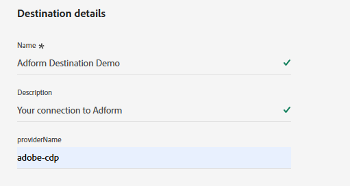

# Adform-Verbindung {#adform}

## Überblick {#overview}

Adform ist ein führender Anbieter von Kauf- und Verkaufslösungen für programmgesteuerte Medien. Durch Verbinden von Adform mit dem [!DNL Adobe Experience Platform] können Sie Ihre Erstanbieter-Zielgruppen über Adform basierend auf der Experience Cloud ID (ECID) aktivieren.

>[!IMPORTANT]
>
>Der Ziel-Connector und die Dokumentationsseite werden vom Adform-Team erstellt und gepflegt. Bei Fragen oder Aktualisierungsanfragen wenden Sie sich bitte direkt an `support@adform.com`.

## Anwendungsfälle {#use-cases}

Damit Sie besser verstehen können, wie und wann Sie das Adform-Ziel verwenden sollten, finden Sie hier einige Beispielanwendungsfälle, die [!DNL Adobe Experience Platform] Kunden mit diesem Ziel bewältigen können.

### Adobe [!DNL Real-Time CDP] Zielgruppenaktivierung {#use-case-1}

Verwenden Sie dieses Ziel, um Adobe [!DNL Real-Time CDP]-Zielgruppen zur Aktivierung basierend auf der Experience Cloud ID (ECID) und der ID Fusion von Adform an Adform zu senden. ID Fusion von Adform ist der ID-Auflösungs-Service von Adform zur Aktivierung Ihrer First-Party-Zielgruppen basierend auf der Experience Cloud ID (ECID).

Ein gängiger Fall ist die erneute Zielgruppenbestimmung Ihrer Website-Besucher auf Ihrer Website oder in Ihrer App anhand der Experience Cloud ID (ECID). Sie müssen lediglich die Experience Cloud ID (ECID) über die jederzeit verfügbaren [Event Streaming“ oder ](https://exchange.adobe.com/apps/ec/600102/adform-s2s-site-tracking)Client-seitigen[ Adform-Erweiterungen an Adform senden](https://experienceleague.adobe.com/de/docs/experience-platform/destinations/catalog/analytics/adform). Anschließend können Sie Zielgruppen über das Adform-Ziel für die Aktivierung mit Adform freigeben - allein auf Grundlage der Experience Cloud ID (ECID).

## Voraussetzungen {#prerequisites}

* Sie müssen bereits ein Adform-Kunde sein, um dieses Ziel verwenden zu können.
* Dazu benötigen Sie Ihre Zugangsdaten für die Adform Audience Base-Datenverbindung.
   * Wenn Sie keine Anmeldeinformationen für die Datenverbindung der Adform-Zielgruppe haben, wenden Sie sich an den Adobe-Support.
* Für eine ordnungsgemäße Synchronisierung müssen Sie entweder über eine [Ereignis-Streaming](https://exchange.adobe.com/apps/ec/600102/adform-s2s-site-tracking)- oder [Client-seitige](https://experienceleague.adobe.com/de/docs/experience-platform/destinations/catalog/analytics/adform) Verbindung von Ihren Entitäten zu Adform Site Tracking verfügen.
   * Wenn Sie keine Ereignis-Streaming- oder Client-seitige Verbindung von Ihren Entitäten zu Adform Site Tracking haben, wenden Sie sich an Ihren Adform-Support-Mitarbeiter.
   * Adform bietet [!DNL Adobe Experience Cloud] Erweiterungen für [Ereignis-Streaming](https://exchange.adobe.com/apps/ec/600102/adform-s2s-site-tracking) und [Client-seitig](https://experienceleague.adobe.com/de/docs/experience-platform/destinations/catalog/analytics/adform).

## Unterstützte Identitäten {#supported-identities}

Adform unterstützt die Aktivierung von Identitäten, die in der folgenden Tabelle beschrieben werden. Erhalten Sie weitere Informationen zu [Identitäten](/help/identity-service/features/namespaces.md).

| Ziel-Identität | Beschreibung | Zu beachten |
|---|---|---|
| ECID | Experience Cloud ID | Ein Namespace, der die ECID darstellt. Dieser Namespace kann auch durch die folgenden Aliase referenziert werden: &quot;Adobe Marketing Cloud ID“, &quot;[!DNL Adobe Experience Cloud] ID“, &quot;[!DNL Adobe Experience Platform] ID“. Weitere Informationen finden Sie im folgenden Dokument [ECID](/help/identity-service/features/ecid.md) . |

{style="table-layout:auto"}

## Unterstützte Zielgruppen {#supported-audiences}

In diesem Abschnitt wird beschrieben, welche Art von Zielgruppen Sie an dieses Ziel exportieren können.

| Zielgruppenherkunft | Unterstützt | Beschreibung |
|---------|----------|----------|
| [!DNL Segmentation Service] | Ja | Zielgruppen, die über den Experience Platform-[ (Segmentierungs-Service) generiert ](../../../segmentation/home.md). |
| Alle anderen Ursprünge der Zielgruppe | Nein | Diese Kategorie enthält alle Ursprünge der Zielgruppe außerhalb der Zielgruppen, die durch die [!DNL Segmentation Service] generiert wurden. Lesen Sie mehr über [verschiedene Ursprünge von Audiences](/help/segmentation/ui/audience-portal.md#customize). Einige Beispiele: <ul><li> benutzerdefinierte Upload-Zielgruppen [importiert](../../../segmentation/ui/audience-portal.md#import-audience) aus CSV-Dateien in Experience Platform,</li><li> Lookalike-Zielgruppen, </li><li> Federated Audiences, </li><li> Zielgruppen, die in anderen Experience Platform-Apps generiert werden, z. B. [!DNL Adobe Journey Optimizer], </li><li> und mehr. </li></ul> |

{style="table-layout:auto"}

Unterstützte Zielgruppen nach Zielgruppen-Datentyp:

| Datentyp der Zielgruppe | Unterstützt | Beschreibung | Anwendungsfälle |
|--------------------|-----------|-------------|-----------|
| [Personen-Zielgruppen](/help/segmentation/types/people-audiences.md) | Ja | Basierend auf Kundenprofilen können Sie bestimmte Personengruppen für Marketing-Kampagnen ansprechen. | Häufige Käufer, Warenkorbabbrüche |
| [Konto-Zielgruppen](/help/segmentation/types/account-audiences.md) | Nein | Targeting von Personen in bestimmten Organisationen für Account-basierte Marketing-Strategien. | B2B-Marketing |
| [Interessenten-Zielgruppen](/help/segmentation/types/prospect-audiences.md) | Nein | Targeting von Personen, die noch keine Kunden sind, aber Merkmale mit Ihrer Zielgruppe teilen. | Akquise mit Drittanbieterdaten |
| [Datensatzexporte](/help/catalog/datasets/overview.md) | Nein | Sammlungen strukturierter Daten, die im Data Lake von [!DNL Adobe Experience Platform] gespeichert sind. | Reporting, Datenwissenschaft-Workflows |

{style="table-layout:auto"}

## Exporttyp und -häufigkeit {#export-type-frequency}

Beziehen Sie sich auf die folgende Tabelle, um Informationen zu Typ und Häufigkeit des Zielexports zu erhalten.

| Element | Typ | Anmerkungen |
|---------|----------|---------|
| Exporttyp | **[!UICONTROL Segment export]** | Sie exportieren alle Mitglieder eines Segments (Zielgruppe) mit den IDs (Name, Telefonnummer oder sonstiges), die im Ziel *YourDestination* verwendet werden. |
| Exporthäufigkeit | **[!UICONTROL Batch]** | Batch-Ziele exportieren Dateien in Schritten von drei, sechs, acht, zwölf oder vierundzwanzig Stunden auf nachgelagerte Plattformen. Weitere Informationen finden Sie unter [Batch-Datei-basierte Ziele](/help/destinations/destination-types.md#file-based). |

{style="table-layout:auto"}

## Herstellen einer Verbindung mit dem Ziel {#connect}

>[!IMPORTANT]
>
>Um eine Verbindung zum Ziel herzustellen, benötigen Sie die **[!UICONTROL View Destinations]** und **[!UICONTROL Manage Destinations]** Zugriffssteuerungsberechtigung[. ](/help/access-control/home.md#permissions). Lesen Sie die [Zugriffskontrolle – Übersicht](/help/access-control/ui/overview.md) oder wenden Sie sich an Ihren Produktadministrator, um die erforderlichen Berechtigungen zu erhalten.

Um eine Verbindung mit diesem Ziel herzustellen, gehen Sie wie im [Tutorial zur Zielkonfiguration](../../ui/connect-destination.md) beschrieben vor. Füllen Sie im Workflow zum Konfigurieren des Ziels die Felder aus, die in den beiden folgenden Abschnitten aufgeführt sind.

### Beim Ziel authentifizieren {#authenticate}

Um sich beim Ziel zu authentifizieren, füllen Sie die erforderlichen Felder aus und wählen Sie **[!UICONTROL Connect to destination]** aus.

* **[!UICONTROL Account name]**: Geben Sie einen Kontonamen ein, mit dem Sie diese Zielverbindung in Zukunft identifizieren können.
* **[!UICONTROL S3 Access Key ID]**: Füllen Sie den von Adform bereitgestellten S3-Zugriffsschlüssel aus.
* **[!UICONTROL S3 Secret Access Key]**: Füllen Sie den geheimen S3-Zugriffsschlüssel aus, der von Adform bereitgestellt wird.

### Ausfüllen der Zieldetails {#destination-details}

Füllen Sie die folgenden erforderlichen und optionalen Felder aus, um Details für das Ziel zu konfigurieren. Ein Sternchen neben einem Feld in der Benutzeroberfläche zeigt an, dass das Feld erforderlich ist.

* **[!UICONTROL Name]**: Ein Name, durch den Sie dieses Ziel in Zukunft erkennen können.
* **[!UICONTROL Description]**: Eine Beschreibung, die Ihnen hilft, dieses Ziel in Zukunft zu identifizieren.
* **[!UICONTROL Provider Name]**: Ihr Adform-Kontoname, der von Adform bereitgestellt wird.

### Aktivieren von Warnhinweisen {#enable-alerts}

Sie können Warnhinweise aktivieren, um Benachrichtigungen zum Status des Datenflusses zu Ihrem Ziel zu erhalten. Wählen Sie einen Warnhinweis aus der zu abonnierenden Liste aus, um Benachrichtigungen über den Status Ihres Datenflusses zu erhalten. Weitere Informationen zu Warnhinweisen finden Sie im Handbuch zum [Abonnieren von Zielwarnhinweisen über die Benutzeroberfläche](../../ui/alerts.md).

Wenn Sie mit dem Eingeben der Details für Ihre Zielverbindung fertig sind, wählen Sie **[!UICONTROL Next]** aus.

## Aktivieren von Zielgruppen für dieses Ziel {#activate}

>[!IMPORTANT]
>
>* Zum Aktivieren von Daten benötigen Sie die **[!UICONTROL View Destinations]**, **[!UICONTROL Activate Destinations]**, **[!UICONTROL View Profiles]** und **[!UICONTROL View Segments]** [Zugriffssteuerungsberechtigungen](/help/access-control/home.md#permissions). Lesen Sie die [Übersicht über die Zugriffssteuerung](/help/access-control/ui/overview.md) oder wenden Sie sich an Ihre Produktadmins, um die erforderlichen Berechtigungen zu erhalten.
>* Zum Exportieren *Identitäten* benötigen Sie die **[!UICONTROL View Identity Graph]** Zugriffssteuerungsberechtigung.   {width="100" zoomable="yes"}

Anweisungen zum Aktivieren von Zielgruppensegmenten für dieses Ziel finden Sie unter [Aktivieren von Zielgruppendaten für Batch-Profil-Exportziele](/help/destinations/ui/activate-batch-profile-destinations.md).

### Zuordnen von Attributen und Identitäten {#map}

* **ECID** (Experience Cloud ID)

Verwenden Sie während des Zuordnungsschritts nur die [!DNL ECID] Zielidentitätszuordnung. Schließen Sie keine anderen Identitätsfelder ein, da dies verhindert, dass die Aktivierung erfolgreich abgeschlossen wird.

## Exportierte Daten/Datenexport validieren {#exported-data}

Der Ziel-Connector exportiert nur die ECID-Identität an das Ziel. Es wird keine andere Identität exportiert. Um zu überprüfen, ob der Datenexport erfolgreich war, melden Sie sich bei Ihrem Adobe Audience Base-Konto an und überprüfen Sie, ob die Zielgruppen verfügbar sind.

## Datennutzung und -Governance {#data-usage-governance}

Alle [!DNL Adobe Experience Platform]-Ziele sind bei der Verarbeitung Ihrer Daten mit Datennutzungsrichtlinien konform. Ausführliche Informationen darüber, wie [!DNL Adobe Experience Platform] Data Governance erzwingt, finden Sie unter [Data Governance - Übersicht](/help/data-governance/home.md).

## Weitere Ressourcen {#additional-resources}

Weitere Informationen zur Adform Audience Base finden Sie in der [Dokumentation zur Adform Audience Base](https://www.adformhelp.com/hc/en-us/categories/9738365991697-Data-Management-Platform).
