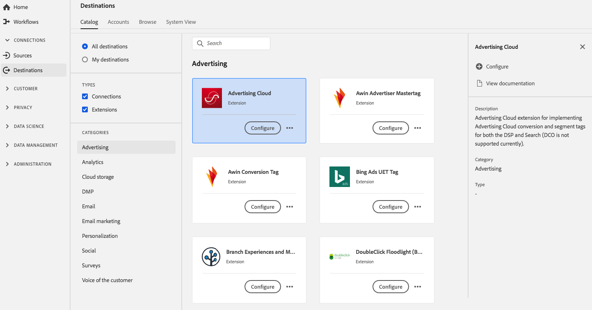

# Adobe Advertising Cloud-Erweiterung {#adobe-advertising-cloud-extension}

## Übersicht {#overview}

Dies ist die Erweiterung [!DNL Advertising Cloud] für die Implementierung von [!DNL Advertising Cloud]-Konversions- und Segment-Tags für die DSP und Suche (DCO wird derzeit nicht unterstützt).

Adobe Advertising Cloud ist eine Werbeverlängerung in Adobe Experience Platform.

Dieses Ziel ist eine [!DNL Adobe Experience Platform Launch]-Erweiterung. Weitere Informationen zur Funktionsweise von [!DNL Platform Launch]-Erweiterungen in Platform finden Sie unter [Übersicht über Experience Platform Launch-Erweiterungen](../launch-extensions/overview.md).

## Voraussetzungen  {#prerequisites}

Diese Erweiterung ist im Zielkatalog für alle Kunden verfügbar, die Platform gekauft haben.

Um diese Erweiterung verwenden zu können, benötigen Sie Zugriff auf [!DNL Experience Platform Launch]. [!DNL Experience Platform Launch] wird Adobe Experience Cloud-Kunden als eine zusätzliche Funktion angeboten. Wenden Sie sich an Ihren Unternehmensadministrator, um Zugriff auf [!DNL Launch] zu erhalten, und bitten Sie ihn, Ihnen die **[!UICONTROL manage_properties]**-Berechtigung zu erteilen, damit Sie Erweiterungen installieren können.

## Installieren einer Erweiterung {#install-extension}

So installieren Sie die Adobe Advertising Cloud-Erweiterung:

Wechseln Sie in der [Plattform-Schnittstelle](http://platform.adobe.com/) zu **[!UICONTROL Ziele]** > **[!UICONTROL Katalog]**.

Wählen Sie die Erweiterung aus dem Katalog aus oder verwenden Sie die Suchleiste.

Klicken Sie auf das Ziel, um es hervorzuheben, und wählen Sie dann **[!UICONTROL Konfigurieren]** in der rechten Leiste aus. Wenn das Steuerelement **[!UICONTROL Configure]** ausgegraut ist, fehlt Ihnen die Berechtigung **[!UICONTROL manage_properties]**. Siehe [Voraussetzungen](#prerequisites).

Wählen Sie im Fenster **[!UICONTROL Verfügbare Platform launch-Eigenschaft]** auswählen die [!DNL Platform Launch]-Eigenschaft aus, in der Sie die Erweiterung installieren möchten. Sie haben auch die Möglichkeit, eine neue Eigenschaft in [!DNL Platform Launch] zu erstellen. Eine Eigenschaft ist eine Sammlung von Regeln, Datenelementen, konfigurierten Erweiterungen, Umgebungen und Bibliotheken. Weitere Informationen zu Eigenschaften finden Sie im Abschnitt [Seite &quot;Eigenschaften&quot;der [!DNL Launch]-Dokumentation.](https://experienceleague.adobe.com/docs/launch/using/reference/admin/companies-and-properties.html#properties-page)

Der Arbeitsablauf führt Sie zu [!DNL Platform Launch], um die Installation abzuschließen.

Sie können die Erweiterung auch direkt in der [Adobe Experience Platform Launch-Schnittstelle](https://launch.adobe.com/) installieren. Siehe [Hinzufügen einer neuen Erweiterung](https://experienceleague.adobe.com/docs/launch/using/reference/manage-resources/extensions/overview.html?lang=en#add-a-new-extension) in der [!DNL Platform Launch]-Dokumentation.

## Verwenden der Erweiterung {#how-to-use}

Nachdem Sie die Erweiterung installiert haben, können Sie Beginn zum Einrichten von Regeln für diese Erweiterung direkt in [!DNL Platform Launch] erstellen.

Unter [!DNL Platform Launch] können Sie Regeln für Ihre installierten Erweiterungen einrichten, um Ereignis-Daten nur in bestimmten Situationen an das Erweiterungsziel zu senden. Weitere Informationen zum Einrichten von Regeln für Erweiterungen finden Sie in der [Regeldokumentation](https://experienceleague.adobe.com/docs/launch/using/reference/manage-resources/rules.html).

## Konfigurieren, Aktualisieren und Löschen von Erweiterungen {#configure-upgrade-delete}

Sie können Erweiterungen in der [!DNL Platform Launch]-Schnittstelle konfigurieren, aktualisieren und löschen.

>[!TIP]
>
>Wenn die Erweiterung bereits auf einer Ihrer Eigenschaften installiert ist, zeigt die Plattform-Benutzeroberfläche für die Erweiterung weiterhin **[!UICONTROL Install]** an. Starten Sie den Installations-Workflow, wie unter [Installieren einer Erweiterung](#install-extension) beschrieben, um zu zu wechseln und Ihre Erweiterung zu konfigurieren oder zu löschen.[!DNL Platform Launch]

Informationen zum Aktualisieren Ihrer Erweiterung finden Sie unter [Extension-Aktualisierung](https://experienceleague.adobe.com/docs/launch/using/reference/manage-resources/extensions/extension-upgrade.html) in der [!DNL Platform Launch]-Dokumentation.
