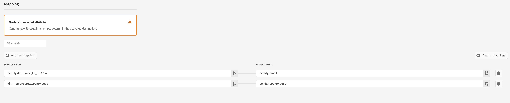

# Amazon Ads v2-Verbindung {#amazon-ads-v2}

## Überblick {#overview}

[!DNL Amazon Ads v2] ermöglicht es Werbetreibenden, Zielgruppendaten effizient über [!DNL Amazon Ads] Produkte hinweg aufzunehmen, zu verwalten, zu aktivieren und wiederzuverwenden.

>[!IMPORTANT]
>
>[!DNL Amazon Ads v2] ist das aktuelle Ziel für alle neuen [!DNL Amazon Ads]. Wenn Sie über eine bestehende [&#x200B; (veraltete)  [!DNL Amazon Ads]](./amazon-ads.md) verfügen, funktioniert sie weiterhin ohne erforderliche Änderungen. [!DNL Amazon Ads v2] stellt eine Verbindung zu [!DNL Ads Data Manager] her, das erweiterte Identitätstypen, adressbezogene Felder und die Datenfreigabe über [!DNL Amazon Ads] Produkte hinweg unterstützt und so die Targeting- und Zielgruppen-Übereinstimmungsraten im Vergleich zu [&#x200B; (veraltet) [!DNL Amazon Ads]](./amazon-ads.md).
>
>Nach Ende April 2026 wird [!DNL Amazon Ads v2] in [!DNL Amazon Ads] umbenannt und die alte Karte wird ausgeblendet, sodass nur noch eine Zielkarte im Katalog übrig bleibt. Vorhandene ältere Datenflüsse funktionieren weiterhin, und Sie können sie über dieses Datum hinaus auf der Registerkarte **[!UICONTROL Browse]** verwalten.

Die [!DNL Amazon Ads v2] Integration mit [!DNL Adobe Experience Platform] bietet eine direkte Verbindung für die Aufnahme von Zielgruppenmitgliedern in [!DNL Amazon Ads]. Die hochgeladenen Zielgruppen sind in der [!DNL Ads Data Manager (ADM)]-Konsole in [!DNL Amazon Ads] verfügbar. Sie können die [!DNL Ads Data Manager]-Konsole verwenden, um Daten über verschiedene [!DNL Amazon Ads]-Produkte hinweg freizugeben.

Weitere Informationen zu [!DNL Ads Data Manager] finden Sie unter:

* [Ads Data Manager - Konsolenübersicht](https://advertising.amazon.com/API/docs/en-us/adm/1_ads-data-manager-console-overview)
* [Verwenden der Ads Data Manager-Konsole](https://advertising.amazon.com/API/docs/en-us/adm/2_ads-data-manager-console)
* [Kontoeinrichtung in Ads Data Manager](https://advertising.amazon.com/API/docs/en-us/adm/2a_ads-data-manager_account_setup)

>[!IMPORTANT]
>
>Dieser Ziel-Connector und diese Dokumentationsseite werden vom *[!DNL Amazon Ads]*-Team erstellt und gepflegt. Bei Fragen oder Aktualisierungsanfragen wenden Sie sich bitte direkt an *`amc-support@amazon.com`.*

## Anwendungsfälle {#use-cases}

Damit Sie besser verstehen können, wie und wann Sie das [!DNL Amazon Ads v2]-Ziel verwenden sollten, finden Sie hier einige Beispielanwendungsfälle, die [!DNL Adobe Experience Platform] Kunden mit diesem Ziel bewältigen können.

### Aufnahme und Aktivierung von Audiences {#activation-and-targeting}

Eine Sportbekleidungsmarke möchte ihre Bestandskunden mit relevanten Anzeigen [!DNL Amazon Ads] erreichen. Die Marke kann E-Mail-Adressen von Kunden aus ihrem CRM in [!DNL Adobe Experience Platform] aufnehmen, mithilfe der Offline-Daten von Erstanbietern Zielgruppen erstellen und diese Zielgruppen aktivieren, um über das [!DNL Amazon Ads] Ziel zu [!DNL Amazon Ads v2]. Nach der Aktivierung können Sie diese Zielgruppen verwenden, um Anzeigen auf diese Kunden im gesamten Inventar auszurichten, sodass [!DNL Amazon Ads] Marke wieder mit bekannten Kunden interagieren und wiederholte Käufe fördern kann. Weitere Informationen finden Sie unter [Verwalten von Daten](https://advertising.amazon.com/API/docs/en-us/adm/6_adm-manage-data).

## Voraussetzungen {#prerequisites}

Um die [!DNL Amazon Ads v2] Verbindung mit [!DNL Adobe Experience Platform] verwenden zu können, benötigen Sie Zugriff auf **[!DNL Amazon Ads Data Manager]** über ein [Manager-Konto](https://advertising.amazon.com/help/G69CDSR9MNSWJH95). Weitere [&#x200B; finden Sie unter „Erste Schritte mit dem Amazon Ads](https://advertising.amazon.com/API/docs/en-us/adm/1_ads-data-manager-console-overview)Datenmanager“.

### Akzeptieren der Nutzungsbedingungen von Amazon Ads Data Manager {#accept-terms}

Melden Sie sich vor dem Konfigurieren des [!DNL Amazon Ads v2]-Ziels bei Ihrem [!DNL Amazon Ads]-Konto an und akzeptieren Sie die [!DNL Ads Data Manager]. Navigieren Sie in [!DNL Ads Data Manager] zur [!DNL Amazon Ads]-Konsole und akzeptieren Sie die Bedingungen, wenn Sie dazu aufgefordert werden. Wenn Sie die Nutzungsbedingungen nicht akzeptieren, werden keine Zielgruppen in [!DNL Amazon Ads] erstellt.

## Unterstützte Identitäten {#supported-identities}

Das [!DNL Amazon Ads v2]-Ziel unterstützt die Aktivierung der folgenden Identitäten. Erhalten Sie weitere Informationen zu [Identitäten](/help/identity-service/features/namespaces.md).

| Ziel-Identität | Beschreibung | Zu beachten |
|---|---|---|
| `phone` | Telefonnummern, die mit dem SHA256-Algorithmus gehasht wurden | [!DNL Adobe Experience Platform] unterstützt sowohl einfache als auch SHA256-Hash-Telefonnummern. Wenn Ihr Quellfeld ungehashte Attribute enthält, überprüfen Sie die Option **[!UICONTROL Apply transformation]** , damit die Daten bei Aktivierung automatisch gehasht [!DNL Experience Platform]. |
| `email` | E-Mail-Adressen (in Kleinbuchstaben), die mit dem SHA256-Algorithmus gehasht wurden | [!DNL Adobe Experience Platform] unterstützt sowohl Nur-Text- als auch SHA256-Hash-E-Mail-Adressen. Wenn Ihr Quellfeld ungehashte Attribute enthält, überprüfen Sie die Option **[!UICONTROL Apply transformation]** , damit die Daten bei Aktivierung automatisch gehasht [!DNL Experience Platform]. |
| `firstname` | Vorname des Benutzers | Sowohl Nur-Text- als auch SHA256-Hash-Vornamen werden von [!DNL Adobe Experience Platform] unterstützt. Wenn Ihr Quellfeld ungehashte Attribute enthält, überprüfen Sie die Option **[!UICONTROL Apply transformation]** , damit die Daten bei Aktivierung automatisch gehasht [!DNL Experience Platform]. |
| `lastname` | Nachname des Benutzers | Sowohl einfache als auch SHA256-Hash-Nachnamen werden von [!DNL Adobe Experience Platform] unterstützt. Wenn Ihr Quellfeld ungehashte Attribute enthält, überprüfen Sie die Option **[!UICONTROL Apply transformation]** , damit die Daten bei Aktivierung automatisch gehasht [!DNL Experience Platform]. |
| `address` | Straße und Hausnummer des Benutzers | Sowohl Nur-Text- als auch SHA256-Hash-Straßen werden von [!DNL Adobe Experience Platform] unterstützt. Wenn Ihr Quellfeld ungehashte Attribute enthält, überprüfen Sie die Option **[!UICONTROL Apply transformation]** , damit die Daten bei Aktivierung automatisch gehasht [!DNL Experience Platform]. |
| `city` | Stadt des Benutzers | Sowohl Nur-Text- als auch SHA256-Hash-Städte werden von [!DNL Adobe Experience Platform] unterstützt. Wenn Ihr Quellfeld ungehashte Attribute enthält, überprüfen Sie die Option **[!UICONTROL Apply transformation]** , damit die Daten bei Aktivierung automatisch gehasht [!DNL Experience Platform]. |
| `state` | Bundesland oder Kanton des Benutzers | Sowohl Nur-Text- als auch SHA256-Hash-Status werden von [!DNL Adobe Experience Platform] unterstützt. Wenn Ihr Quellfeld ungehashte Attribute enthält, überprüfen Sie die Option **[!UICONTROL Apply transformation]** , damit die Daten bei Aktivierung automatisch gehasht [!DNL Experience Platform]. |
| `zip` | Postleitzahl des Benutzers | Sowohl Nur-Text- als auch SHA256-Hash-Zips werden von [!DNL Adobe Experience Platform] unterstützt. Wenn Ihr Quellfeld ungehashte Attribute enthält, überprüfen Sie die Option **[!UICONTROL Apply transformation]** , damit die Daten bei Aktivierung automatisch gehasht [!DNL Experience Platform]. |
| `countryCode` | Land des Benutzers (2-stelliger ISO-Code) | Unterstützt Texteingabe. |
| `experianId` | Von [!DNL Experian] zugewiesene Kennung | Unterstützt Texteingabe. |
| `kantarId` | Von [!DNL Kantar] zugewiesene Kennung | Unterstützt Texteingabe. |
| `liveRampId` | Von [!DNL LiveRamp] zugewiesene Kennung | Unterstützt Texteingabe. |
| `maId` | Von einer Mobile App zugewiesene Kennung | Unterstützt Texteingabe. |
| `merkleId` | Von [!DNL Merkle] zugewiesene Kennung | Unterstützt Texteingabe. |
| `neustarId` | Von [!DNL Neustar] zugewiesene Kennung | Unterstützt Texteingabe. |
| `realId` | Vom realen ID-Identitätsdiagramm zugewiesene Kennung | Unterstützt Texteingabe. |
| `sambaTvId` | Von [!DNL Samba TV] zugewiesene Kennung | Unterstützt Texteingabe. |

{style="table-layout:auto"}

## Unterstützte Zielgruppen {#supported-audiences}

In diesem Abschnitt wird beschrieben, welche Arten von Zielgruppen Sie an dieses Ziel exportieren können.

| Zielgruppenherkunft | Unterstützt | Beschreibung |
|---------|----------|----------|
| [!DNL Segmentation Service] | Ja | Zielgruppen, die über den [!DNL Experience Platform]Segmentierungs[Service) generiert &#x200B;](/help/segmentation/home.md). |
| Alle anderen Ursprünge der Zielgruppe | Ja | Diese Kategorie enthält alle Ursprünge der Zielgruppe außerhalb der Zielgruppen, die durch die [!DNL Segmentation Service] generiert wurden. Lesen Sie mehr über [verschiedene Ursprünge von Audiences](/help/segmentation/ui/audience-portal.md#customize). Einige Beispiele: <ul><li> benutzerdefinierte Upload-[&#x200B; (importiert](/help/segmentation/ui/audience-portal.md#import-audience) in [!DNL Experience Platform] aus CSV-Dateien,</li><li> Lookalike-Zielgruppen, </li><li> Federated Audiences, </li><li> in anderen [!DNL Experience Platform]-Apps generierte Zielgruppen wie [!DNL Adobe Journey Optimizer], </li><li> und mehr. </li></ul> |

{style="table-layout:auto"}

Unterstützte Zielgruppen nach Zielgruppen-Datentyp:

| Datentyp der Zielgruppe | Unterstützt | Beschreibung | Anwendungsfälle |
|--------------------|-----------|-------------|-----------|
| [Personen-Zielgruppen](/help/segmentation/types/people-audiences.md) | Ja | Basierend auf Kundenprofilen können Sie bestimmte Personengruppen für Marketing-Kampagnen ansprechen. | Häufige Käufer, Warenkorbabbrüche |
| [Konto-Zielgruppen](/help/segmentation/types/account-audiences.md) | Nein | Targeting von Personen in bestimmten Organisationen für Account-basierte Marketing-Strategien. | B2B-Marketing |
| [Interessenten-Zielgruppen](/help/segmentation/types/prospect-audiences.md) | Nein | Targeting von Personen, die noch keine Kunden sind, aber Merkmale mit Ihrer Zielgruppe teilen. | Akquise mit Drittanbieterdaten |
| [Datensatzexporte](/help/catalog/datasets/overview.md) | Nein | Sammlungen strukturierter Daten, die im Data Lake von [!DNL Adobe Experience Platform] gespeichert sind. | Reporting, Datenwissenschaft-Workflows |

{style="table-layout:auto"}

## Exporttyp und -häufigkeit {#export-type-frequency}

In der folgenden Tabelle werden der Zielexporttyp und die Häufigkeit beschrieben.

| Element | Typ | Anmerkungen |
| ---------|----------|---------|
| Exporttyp | **[!UICONTROL Audience export]** | Sie exportieren alle Mitglieder einer Zielgruppe mit IDs, die von [!DNL Amazon Ads] unterstützt werden. |
| Exporthäufigkeit | **[!UICONTROL Streaming]** | Streaming-Ziele sind „immer verfügbare“ API-basierte Verbindungen. Zielgruppen-Updates in [!DNL Experience Platform] werden sofort an [!DNL Ads Data Manager] gesendet. |

{style="table-layout:auto"}

## Herstellen einer Verbindung mit dem Ziel {#connect}

>[!IMPORTANT]
>
>Um eine Verbindung zum Ziel herzustellen, benötigen Sie die **[!UICONTROL View Destinations]** und **[!UICONTROL Manage Destinations]** Zugriffssteuerungsberechtigungen[. &#x200B;](/help/access-control/home.md#permissions) Lesen Sie die [Zugriffskontrolle – Übersicht](/help/access-control/ui/overview.md) oder wenden Sie sich an Ihren Produktadministrator, um die erforderlichen Berechtigungen zu erhalten.

Um eine Verbindung mit diesem Ziel herzustellen, gehen Sie wie im [Tutorial zur Zielkonfiguration](/help/destinations/ui/connect-destination.md) beschrieben vor. Füllen Sie im Zielkonfigurations-Workflow die Felder aus, die in den beiden folgenden Abschnitten aufgeführt sind.

### Beim Ziel authentifizieren {#authenticate}

Um sich beim Ziel zu authentifizieren, füllen Sie die erforderlichen Felder aus und wählen Sie **[!UICONTROL Connect to destination]** aus.

* **[!UICONTROL Account name]**: Geben Sie einen Namen ein, der Ihnen bei der Identifizierung dieses Zielkontos hilft. Dies ist besonders nützlich, wenn Sie mehrere Verbindungen mit demselben Ziel haben.
* **[!UICONTROL Description]** (optional): Fügen Sie Details hinzu, anhand derer Sie oder Ihr Team zwischen Konten unterscheiden können, z. B. den Zweck der Verbindung oder den relevanten Geschäftskontext.

Sie werden zur [!DNL Amazon Ads v2] weitergeleitet. Wählen Sie **[!UICONTROL Allow]** aus, um sich bei Ihrem Amazon-Konto anzumelden.

Nach der Authentifizierung werden Sie mit Ihrer neuen Verbindung zurück zu [!DNL Adobe Experience Platform] weitergeleitet.

### Ausfüllen der Zieldetails {#destination-details}

Füllen Sie die folgenden erforderlichen und optionalen Felder aus, um Details für das Ziel zu konfigurieren. Ein Sternchen neben einem Feld in der Benutzeroberfläche zeigt an, dass das Feld erforderlich ist.

* **[!UICONTROL Name]**: Ein Name, durch den Sie dieses Ziel erkennen.
* **[!UICONTROL Description]**: Eine Beschreibung, die Ihnen bei der Identifizierung dieses Ziels hilft.
* **[!UICONTROL Manager Account]**: Die Konto-ID des Target-Managers aus der Dropdown-Liste.
* **[!UICONTROL All audience members sent to Amazon are consented for use for Advertising]**: Geben Sie das Einverständnis zur Datennutzung an (`GRANTED` oder `DENIED`).
* **[!UICONTROL Ads data manager Terms & Conditions]**: Akzeptieren Sie die Nutzungsbedingungen des [!DNL Amazon Ads] Data Manager. Weitere Einzelheiten finden [&#x200B; im Abschnitt &#x200B;](#accept-terms) akzeptieren.

### Aktivieren von Warnhinweisen {#enable-alerts}

Sie können Warnhinweise aktivieren, um Benachrichtigungen zum Status des Datenflusses zu Ihrem Ziel zu erhalten. Wählen Sie einen Warnhinweis aus der zu abonnierenden Liste aus, um Benachrichtigungen über den Status Ihres Datenflusses zu erhalten. Weitere Informationen zu Warnhinweisen finden Sie im Handbuch zum [Abonnieren von Warnhinweisen zu Zielen über die Benutzeroberfläche](/help/destinations/ui/alerts.md).

Wenn Sie mit dem Eingeben der Details für Ihre Zielverbindung fertig sind, wählen Sie **[!UICONTROL Next]** aus.

## Aktivieren von Zielgruppen für dieses Ziel {#activate}

>[!IMPORTANT]
>
>* Zum Aktivieren von Daten benötigen Sie die **[!UICONTROL View Destinations]**, **[!UICONTROL Activate Destinations]**, **[!UICONTROL View Profiles]** und **[!UICONTROL View Segments]**&#x200B;[&#x200B; Zugriffssteuerungsberechtigungen](/help/access-control/home.md#permissions). Lesen Sie die [Zugriffskontrolle – Übersicht](/help/access-control/ui/overview.md) oder wenden Sie sich an Ihren Produktadministrator, um die erforderlichen Berechtigungen zu erhalten.
>* Zum Exportieren von Identitäten benötigen Sie die **[!UICONTROL View Identity Graph]** [Zugriffssteuerungsberechtigung](/help/access-control/home.md#permissions).   {width="100" zoomable="yes"}

Anweisungen zum Aktivieren von Zielgruppen für dieses Ziel finden Sie unter [Aktivieren von Profilen und Zielgruppen für Streaming-Zielgruppen-Exportziele](/help/destinations/ui/activate-segment-streaming-destinations.md).

### Obligatorische Zuordnungen {#map}

Für das [!DNL Amazon Ads v2]-Ziel müssen Sie die folgenden Zuordnungen konfigurieren, damit die Datenaktivierung erfolgreich ist.

| Quellfeld | Zielfeld | Beschreibung |
|---------|----------|---------|
| `IdentityMap: Email_LC_SHA256` oder `IdentityMap: Email` | `Identity: email` | Wenn Ihr Quellfeld ungehashte Attribute enthält, überprüfen Sie die Option **[!UICONTROL Apply transformation]** , damit die Daten bei Aktivierung automatisch gehasht [!DNL Experience Platform]. |
| `xdm: homeAddress.countryCode` | `Identity: countryCode` | Land des Benutzers (2-stelliger ISO-Code) |

### Best Practices für die Zuordnung {#mapping-best-practices}

Kombinieren Sie Erstanbieter-IDs (z. B. Telefonnummer und Adresse) mit von Partnern bereitgestellten IDs. Dadurch können [!DNL Amazon Ads] beim Zielgruppen-Abgleich mehrere Identitätssignale verwenden, was zu besseren Übereinstimmungsraten führt.

Verwenden Sie Kennungen, die vom Partner bereitgestellt werden, nur, wenn sie in Ihre Quelldaten eingefügt werden. Wenn das Feld für die zugeordnete Partnerkennung für ein bestimmtes Profil leer oder nicht vorhanden ist, wird es beim Zielgruppenabgleich ignoriert und trägt nicht zu Übereinstimmungsraten bei.

### Beispiele {#examples}

* Verwenden Sie `kantarId` beim Aktivieren von Zielgruppen, die mithilfe [!DNL Kantar] Identitätsdaten erstellt oder angereichert wurden.
* Verwenden Sie `merkleId`, wenn Ihre Zielgruppendaten aus [!DNL Merkle] verwalteten Identitätslösungen stammen.
* Verwenden Sie `neustarId`, wenn Ihre Daten über [!DNL Neustar] Identitätsauflösung verknüpft sind.
* Verwenden Sie `experianId` für Zielgruppen, die mit [!DNL Experian] Identitätsdaten angereichert wurden.
* Verwenden Sie `liveRampId` beim Aktivieren von Zielgruppen, die auf [!DNL LiveRamp] Identitätsauflösung basieren.
* Verwenden Sie `sambaTvId` beim Arbeiten mit [!DNL Samba TV] bereitgestellten Zielgruppendaten.

Diese Kennungen werden normalerweise von den jeweiligen Partnern als Klartext-Kennungen bereitgestellt und erfordern kein Hashing.

## Überprüfen des Datenexports {#exported-data}

Validieren Sie nach der Aktivierung die Aufnahme Ihrer Audience in der **[!DNL Ads Data Manager]Console**.

Navigieren Sie zu **[!UICONTROL Audiences]** → **[!UICONTROL Uploaded Sources]**. Überprüfen Sie den Status, die Größe und etwaige Fehlerprotokolle der Zielgruppenaufnahme. Die [Daten verwalten](https://advertising.amazon.com/API/docs/en-us/adm/6_adm-manage-data) und [Ziele](https://advertising.amazon.com/API/docs/en-us/adm/7_adm-destinations) in der [!DNL Amazon Ads]-Dokumentation bieten weitere Validierungsanleitungen.

## Datennutzung und -Governance {#data-usage-governance}

Alle [!DNL Adobe Experience Platform]-Ziele sind bei der Verarbeitung Ihrer Daten mit Datennutzungsrichtlinien konform. Ausführliche Informationen darüber, wie [!DNL Adobe Experience Platform] Data Governance erzwingt, finden Sie unter [Data Governance - Übersicht](/help/data-governance/home.md).

## Weitere Ressourcen {#additional-resources}

Weitere Informationen zu [!DNL Amazon Ads Data Manager] finden Sie in der folgenden Ressource:

* [Übersicht über den Daten-Manager von Amazon Ads](https://advertising.amazon.com/API/docs/en-us/adm/1_ads-data-manager-console-overview)
