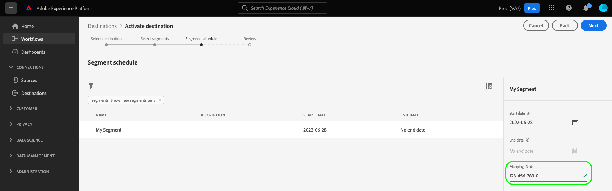

# [!DNL Microsoft Bing]-Verbindung {#bing-destination}

## Übersicht {#overview}

Die [!DNL Microsoft Bing] Das Ziel hilft beim Senden von Profildaten an [!DNL Microsoft Display Advertising].

So senden Sie Profildaten an [!DNL Microsoft Bing], müssen Sie zunächst eine Verbindung zum Ziel herstellen.

## Anwendungsfälle {#use-cases}

Als Marketer möchte ich Segmente verwenden können, die aus [!DNL Microsoft Advertising IDs] , um Benutzer über Display-Werbung anzusprechen. [!DNL Microsoft Advertising] Kanäle.

## Unterstützte Identitäten {#supported-identities}

[!DNL Microsoft Bing] unterstützt die Aktivierung der in der folgenden Tabelle beschriebenen Identitäten. Weitere Informationen [identities](/help/identity-service/namespaces.md).

| Zielgruppenidentität | Beschreibung |
|---|---|
| MAID | Microsoft Advertising ID |

{style=&quot;table-layout:auto&quot;}

## Exportart und -frequenz {#export-type-frequency}

**[!DNL Segment Export]** - Sie exportieren alle Mitglieder eines Segments (Zielgruppe) in die [!DNL Microsoft Bing] Ziel.

Informationen zum Zielexporttyp und zur Häufigkeit finden Sie in der unten stehenden Tabelle.

| Element | Typ | Anmerkungen |
---------|----------|---------|
| Exporttyp | **[!UICONTROL Segmentexport]** | Sie exportieren alle Mitglieder eines Segments (Zielgruppe) in die [!DNL Microsoft Bing] Ziel. |
| Exporthäufigkeit | **[!UICONTROL Streaming]** | Streaming-Ziele sind &quot;immer auf&quot;-API-basierte Verbindungen. Sobald ein Profil in Experience Platform auf der Grundlage einer Segmentbewertung aktualisiert wird, sendet der Connector das Update nachgelagert an die Zielplattform. Mehr dazu [Streaming-Ziele](/help/destinations/destination-types.md#streaming-destinations). |

{style=&quot;table-layout:auto&quot;}

## Voraussetzungen {#prerequisites}

>[!IMPORTANT]
>
>Wenn Sie Ihr erstes Ziel mit [!DNL Microsoft Bing] und nicht aktiviert haben, [ID-Synchronisierungsfunktion](https://experienceleague.adobe.com/docs/id-service/using/id-service-api/methods/idsync.html) Wenden Sie sich in der Vergangenheit (mit Adobe Audience Manager oder anderen Experience Cloud-ID-Diensten) an Adobe Consulting oder die Kundenunterstützung, um ID-Synchronisierungen zu aktivieren. Wenn Sie zuvor [!DNL Microsoft Bing] -Integrationen in Audience Manager werden die von Ihnen eingerichteten ID-Synchronisierungen auf Platform übertragen.

Beim Konfigurieren des Ziels müssen Sie die folgenden Informationen angeben:

* [!UICONTROL Konto-ID]: ist [!DNL Bing Ads CID], im ganzzahligen Format.

## Herstellen einer Verbindung mit der Datenbank {#connect}

>[!IMPORTANT]
> 
>Um eine Verbindung zum Ziel herzustellen, benötigen Sie die **[!UICONTROL Ziele verwalten]** [Zugriffsberechtigung](/help/access-control/home.md#permissions). Lesen Sie die [Zugriffskontrolle - Übersicht](/help/access-control/ui/overview.md) oder wenden Sie sich an Ihren Produktadministrator, um die erforderlichen Berechtigungen zu erhalten.

Um eine Verbindung mit diesem Ziel herzustellen, gehen Sie wie im Abschnitt [Tutorial zur Zielkonfiguration](../../ui/connect-destination.md) beschrieben vor.

### Verbindungsparameter {#parameters}

Beim [Einrichten](../../ui/connect-destination.md) dieses Ziels müssen Sie die folgenden Informationen angeben:

* **[!UICONTROL Name]**: Ein Name, mit dem Sie dieses Ziel in der Zukunft erkennen werden.
* **[!UICONTROL Beschreibung]**: Eine Beschreibung, die Ihnen dabei hilft, dieses Ziel in der Zukunft zu identifizieren.
* **[!UICONTROL Konto-ID]**: Ihre [!DNL Bing Ads CID].

## Aktivieren von Segmenten für dieses Ziel {#activate}

>[!CONTEXTUALHELP]
>id="platform_destinations_bing_mapping_id"
>title="Zuordnungs-ID"
>abstract="Geben Sie die numerische Bing-Segment-ID ein, der Sie das ausgewählte Segment zuordnen möchten. Wenn die Variable [!UICONTROL Zuordnungs-ID] entspricht nicht einer Segment-ID im Bing-Ziel, werden die erwarteten Zielgruppendaten in Ihrem Bing-Konto nicht angezeigt."

>[!IMPORTANT]
> 
>Um Daten zu aktivieren, benötigen Sie die **[!UICONTROL Ziele verwalten]**, **[!UICONTROL Ziele aktivieren]**, **[!UICONTROL Profile anzeigen]** und **[!UICONTROL Segmente anzeigen]** [Zugriffssteuerungsberechtigungen](/help/access-control/home.md#permissions). Lesen Sie die [Zugriffskontrolle - Übersicht](/help/access-control/ui/overview.md) oder wenden Sie sich an Ihren Produktadministrator, um die erforderlichen Berechtigungen zu erhalten.

Siehe [Aktivieren von Zielgruppendaten für Streaming-Segmentexportziele](../../ui/activate-segment-streaming-destinations.md) für Anweisungen zum Aktivieren von Zielgruppensegmenten für dieses Ziel.

Im [Segmentplan](../../ui/activate-segment-streaming-destinations.md#scheduling) Schritt: Sie müssen Ihre Segmente manuell ihrer entsprechenden numerischen Segment-ID in der [!DNL Bing] Ziel. Füllen Sie die numerische Segment-ID aus [!DNL Bing] im [!UICONTROL Zuordnungs-ID] -Feld.

Wenn die Variable [!UICONTROL Zuordnungs-ID] entspricht nicht einer Segment-ID im Bing-Ziel, werden die erwarteten Zielgruppendaten in Ihrem Bing-Konto nicht angezeigt.

## Exportierte Daten {#exported-data}

So überprüfen Sie, ob die Daten erfolgreich in die [!DNL Microsoft Bing] Ziel, überprüfen Sie Ihre [!DNL Microsoft Bing Ads] -Konto. Bei erfolgreicher Aktivierung werden Zielgruppen in Ihr Konto eingetragen.
