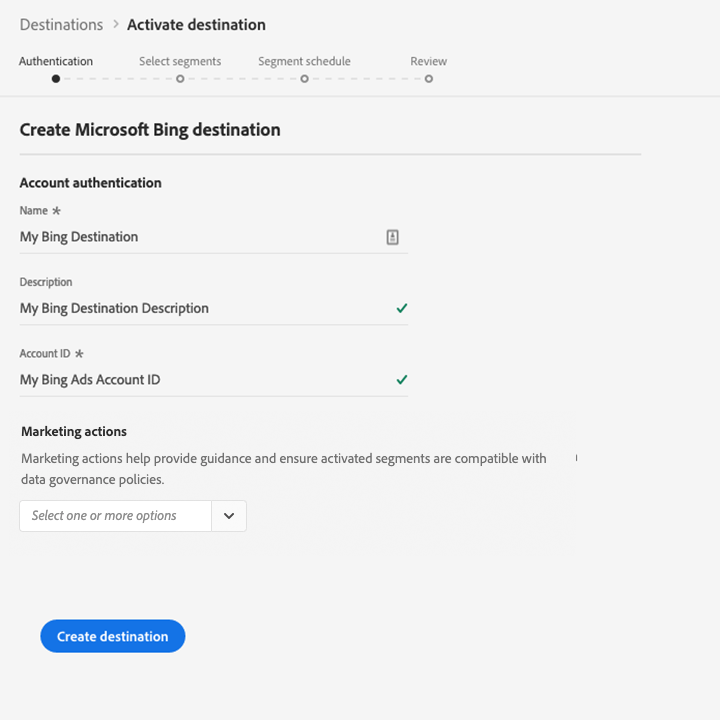

# [!DNL Microsoft Bing] connection  {#bing-destination}

## Übersicht {#overview}

Mit dem [!DNL Microsoft Bing]-Ziel können Sie Profil-Daten an [!DNL Microsoft Display Advertising] senden.

Um Profil-Daten an [!DNL Microsoft Bing] zu senden, müssen Sie zunächst eine Verbindung zum Ziel herstellen.

## Zielspezifikationen {#destination-specs}

Beachten Sie die folgenden Details, die für das [!DNL Microsoft Bing]-Ziel spezifisch sind:

* Sie können die folgenden [Identitäten](../../../identity-service/namespaces.md) an [!DNL Microsoft Bing]-Ziele senden: [!DNL Microsoft ID].

>[!IMPORTANT]
>
>Wenn Sie Ihr erstes Ziel mit [!DNL Microsoft Bing] erstellen möchten und die [ID-Synchronisierungsfunktion](https://experienceleague.adobe.com/docs/id-service/using/id-service-api/methods/idsync.html) in der Vergangenheit im Experience Cloud-ID-Dienst (mit Adobe Audience Manager oder anderen Anwendungen) nicht aktiviert haben, wenden Sie sich bitte an Adobe Consulting oder den Kundendienst, um ID-Synchronisierungen zu aktivieren. Wenn Sie zuvor [!DNL Microsoft Bing]-Integrationen in Audience Manager eingerichtet haben, werden die ID-Synchronisierungen, die Sie eingerichtet haben, auf Plattform übertragen.

## Anwendungsbeispiele {#use-cases}

Als Marketingspezialist möchte ich in der Lage sein, von [!DNL Microsoft Advertising IDs] erstellte Segmente für die Zielgruppe von Benutzern über Display-Werbung in [!DNL Microsoft Advertising]-Kanälen zu verwenden.

## Exporttyp {#export-type}

**[!DNL Segment Export]** - Sie exportieren alle Segmentmitglieder (Audiencen) in das  [!DNL Microsoft Bing] Ziel.

## Voraussetzungen {#prerequisites}

Beim Konfigurieren des Ziels müssen Sie die folgenden Informationen angeben:

* [!UICONTROL Konto-ID]: dies ist Ihr  [!DNL Bing Ads CID]ganzzahliges Format.

## Mit Ziel verbinden {#connect-destination}

Wählen Sie unter **[!UICONTROL Verbindungen]** > **[!UICONTROL Ziele]** [!DNL Microsoft Bing] aus und wählen Sie **[!UICONTROL Konfigurieren]**.

>[!NOTE]
>
>Wenn bereits eine Verbindung zu diesem Ziel besteht, wird auf der Zielkarte die Schaltfläche **[!UICONTROL Aktivieren]** angezeigt. Weitere Informationen zum Unterschied zwischen **[!UICONTROL Aktivieren]** und **[!UICONTROL Konfigurieren]** finden Sie im Abschnitt [Katalog](../../ui/destinations-workspace.md#catalog) der Dokumentation zum Zielarbeitsbereich.
>
>

Im Schritt [!UICONTROL Authentifizierung] müssen Sie die Details der Zielverbindung eingeben:

* **[!UICONTROL Name]**: Ein Name, mit dem Sie dieses Ziel in Zukunft erkennen werden.
* **[!UICONTROL Beschreibung]**: Eine Beschreibung, mit der Sie dieses Ziel in Zukunft identifizieren können.
* **[!UICONTROL Konto-ID]**: Ihr  [!DNL Bing Ads CID].
* **[!UICONTROL Marketingaktion]**: Marketingaktionen geben die Absicht an, für die Daten an das Ziel exportiert werden. Sie können aus von der Adobe definierten Marketingaktionen auswählen oder eine eigene Marketingaktion erstellen. Weitere Informationen zu Marketingaktionen finden Sie auf der Seite [Datenverwaltung in Adobe Experience Platform](../../../data-governance/policies/overview.md). Informationen zu den einzelnen, von der Adobe definierten Marketingaktionen finden Sie unter [Übersicht über Datenverwendungsrichtlinien](../../../data-governance/policies/overview.md).

Klicken Sie auf **[!UICONTROL Ziel erstellen]**. Ihr Ziel wird jetzt erstellt. Sie können auf [!UICONTROL Speichern und beenden] klicken, wenn Sie Segmente später aktivieren möchten, oder Sie können auf [!UICONTROL Weiter] klicken, um den Workflow fortzusetzen und Segmente zur Aktivierung auszuwählen. In beiden Fällen finden Sie den Rest des Workflows im nächsten Abschnitt [Segmente aktivieren](#activate-segments).

## Aktivieren von Segmenten {#activate-segments}

Informationen zum Workflow für die Segmentaktivierung finden Sie unter [Profile und Segmente für ein Ziel aktivieren](../../ui/activate-destinations.md#select-attributes).

Im Schritt [Segmentplan](../../ui/activate-destinations.md#segment-schedule) müssen Sie Ihre Segmente manuell der entsprechenden ID oder dem Anzeigenamen im Ziel zuordnen.

Bei der Segmentzuordnung empfehlen wir, den Segmentnamen [!DNL Platform] oder eine kürzere Form zu verwenden, um die Verwendung zu vereinfachen. Die Segment-ID oder der Name in Ihrem Ziel muss jedoch nicht mit der in Ihrem [!DNL Platform]-Konto übereinstimmen. Jeder Wert, den Sie in das Zuordnungsfeld einfügen, wird vom Ziel übernommen.

## Exportierte Daten {#exported-data}

Um zu überprüfen, ob Daten erfolgreich in das [!DNL Microsoft Bing]-Ziel exportiert wurden, überprüfen Sie Ihr [!DNL Microsoft Bing Ads]-Konto. Wenn die Aktivierung erfolgreich war, werden Audiencen in Ihrem Konto ausgefüllt.