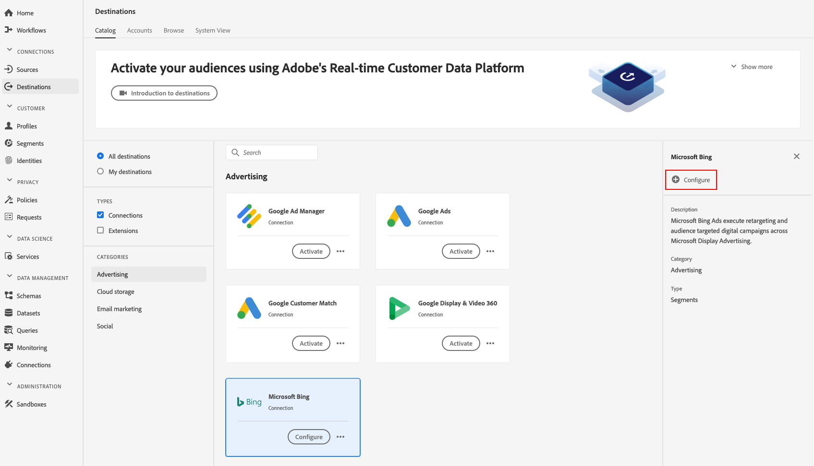

# [!DNL Microsoft Bing] Ziel

## Übersicht {#overview}

Das [!DNL Microsoft Bing] Ziel hilft Ihnen, Profil-Daten an zu senden [!DNL Microsoft Display Advertising].

Um Profil-Daten an [!DNL Microsoft Bing]zu senden, müssen Sie zunächst eine Verbindung zum Ziel herstellen.

## Zielspezifikationen {#destination-specs}

Note the following details that are specific to the [!DNL Microsoft Bing] destination:

* Sie können die folgenden [Identitäten](../../../identity-service/namespaces.md) an [!DNL Microsoft Bing] Ziele senden: [!DNL Microsoft ID].

## Anwendungsbeispiele {#use-cases}

Als Marketingspezialist möchte ich in der Lage sein, Zielgruppe-Anwendern erstellte Segmente über Display-Werbung über verschiedene [!DNL Microsoft Advertising IDs] Kanal hinweg [!DNL Microsoft Advertising] zu nutzen.

## Exporttyp {#export-type}

**[!DNL Segment Export]** - Sie exportieren alle Segmentmitglieder (Audiencen) in das [!DNL Microsoft Bing] Ziel.

## Voraussetzungen  {#prerequisites}

Beim Konfigurieren des Ziels werden Sie gebeten, die folgenden Informationen anzugeben:

* [!UICONTROL Konto-ID]: dies ist Ihr [!DNL Bing Ads CID]ganzzahliges Format.

## Mit Ziel verbinden {#connect-destination}

Wählen Sie unter **[!UICONTROL Verbindungen]** > **[!UICONTROL Ziele]** die Option [!DNL Microsoft Bing]und wählen Sie **[!UICONTROL Konfigurieren]**.

>[!NOTE]
>
>Wenn bereits eine Verbindung zu diesem Ziel besteht, wird auf der Zielkarte die Schaltfläche &quot; **[!UICONTROL Aktivieren]** &quot;angezeigt. Weitere Informationen zum Unterschied zwischen **[!UICONTROL Aktivieren]** und **[!UICONTROL Konfigurieren]** finden Sie im Abschnitt &quot; [Katalog](../../ui/destinations-workspace.md#catalog) &quot;der Dokumentation zum Zielarbeitsbereich.
>
>

Im Schritt [!UICONTROL Authentifizierung] müssen Sie die Details der Zielverbindung eingeben:

* **[!UICONTROL Name]**: Ein Name, mit dem Sie dieses Ziel in Zukunft erkennen werden.
* **[!UICONTROL Beschreibung]**: Eine Beschreibung, mit der Sie dieses Ziel in Zukunft identifizieren können.
* **[!UICONTROL Konto-ID]**: Ihr [!DNL Bing Ads CID].
* **[!UICONTROL Anwendungsfall]** für das Marketing: Anwendungsfälle für das Marketing geben die Absicht an, für die Daten an das Ziel exportiert werden. Sie können aus von der Adobe definierten Anwendungsfällen für das Marketing auswählen oder einen eigenen Anwendungsfall für das Marketing erstellen. Weitere Informationen zu Anwendungsfällen für das Marketing finden Sie auf der Seite [Datenverwaltung in Adobe Experience Platform](../../../rtcdp/privacy/data-governance-overview.md#destinations) . Informationen zu den einzelnen Anwendungsfällen für Marketingzwecke, die von der Adobe definiert wurden, finden Sie in der Übersicht über [Datenverwendungsrichtlinien](../../../data-governance/policies/overview.md#core-actions).

Klicken Sie auf Ziel **[!UICONTROL erstellen]**. Ihr Ziel wird jetzt erstellt. You can click [!UICONTROL Save &amp; Exit] if you want to activate segments later on, or you can click [!UICONTROL Next] to continue the workflow and select segments to activate. In either case, see the next section, [Activate Segments](#activate-segments), for the rest of the workflow.

## Aktivieren von Segmenten {#activate-segments}

Informationen zum Workflow für die Segmentaktivierung finden Sie unter [Profile und Segmente für ein Ziel aktivieren](../../ui/activate-destinations.md#select-attributes).

Im Schritt [Segmentplan](../../ui/activate-destinations.md#segment-schedule) müssen Sie Ihre Segmente manuell ihrer entsprechenden ID oder ihrem Anzeigenamen im Ziel zuordnen.

Beim Zuordnen von Segmenten sollten Sie den [!DNL Platform] Segmentnamen oder eine kürzere Form verwenden, um die Verwendung zu vereinfachen. Die Segment-ID oder der Name in Ihrem Ziel muss jedoch nicht mit der in Ihrem [!DNL Platform] Konto übereinstimmen. Jeder Wert, den Sie in das Zuordnungsfeld einfügen, wird vom Ziel übernommen.

## Exportierte Daten {#exported-data}

Um zu überprüfen, ob die Daten erfolgreich an das [!DNL Microsoft Bing] Ziel exportiert wurden, überprüfen Sie Ihr [!DNL Microsoft Bing Ads] Konto. Wenn die Aktivierung erfolgreich war, werden Audiencen in Ihrem Konto ausgefüllt.