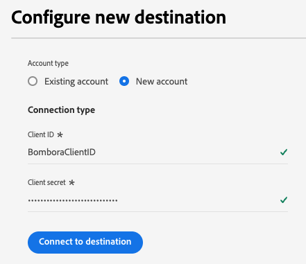

# Bombora ABM Audiences-Verbindung {#bombora}

>[!AVAILABILITY]
>
>Die Funktion zum Aktivieren von Account-Zielgruppen für das Bombora ABM Audiences-Ziel ist für Unternehmen verfügbar, die die [Business-to-Business](/help/rtcdp/overview.md#rtcdp-b2b)- und [Business-to-Person](/help/rtcdp/overview.md#rtcdp-b2p)-Editionen von Real-Time Customer Data Platform erwerben.

Aktivieren Sie Profile für Ihre Bombora-Kampagnen zum Zielgruppen-Targeting, zur Personalisierung und zur Unterdrückung, basierend auf [Account-Zielgruppen](/help/segmentation/types/account-audiences.md).

## Anwendungsfälle {#use-case}

Damit Sie besser verstehen können, wie und wann Sie das Bombora-Ziel verwenden sollten, finden Sie hier einige Beispielanwendungsfälle, die Adobe Experience Platform-Kunden mit diesem Ziel bewältigen können.

### DSP-Integration {#dsp-integration}

Als B2B-Marketing-Experte können Sie in Real-time CDP eine Account-Liste erstellen, um Unternehmen zu identifizieren, die eine hohe Absicht für Ihre Produkte haben, und dann dieses Ziel verwenden, um diese Liste in Bombora zu aktivieren.

Durch die Integration von Bombora mit DSPs können Sie zielgerichtete Anzeigenkampagnen mit Bombora-Daten durchführen. Dadurch wird sichergestellt, dass sich Ihre Werbeausgaben auf Unternehmen konzentrieren, die am ehesten konvertieren werden.

### Account-Based Marketing {#abm}

Als B2B-Marketing-Experte können Sie eine Account-Liste auf der Grundlage von CRM- und Marketing-Signalen erstellen. Dann können Sie dieses Ziel verwenden, um diese Liste in Bombora zu aktivieren, wo ABM-fähige Steuerelemente Ihnen helfen, Entscheidungsträger dieser Unternehmen anzusprechen.

### Account-basierte Marketing-Aktivierung über mehrere Kanäle {#multi-channel-abm}

Als B2B-Marketing-Experte können Sie in Real-time CDP eine Account-Liste erstellen, um Unternehmen mit hohen Absichten zu identifizieren. Dann können Sie dieses Ziel verwenden, um die Liste in Bombora zu aktivieren und zielgerichtete Kampagnen über mehrere Kanäle auszuführen.

In bezahlten sozialen Medien können Sie auf Zielkonten auf Plattformen wie [!DNL LinkedIn] und [!DNL Facebook] personalisierte Anzeigen für Fachleute schalten. Mit nativen Anzeigenplattformen können Sie sicherstellen, dass die Inhalte relevante Entscheidungsträger erreichen.

Sie können Kampagnen auch auf das erweiterte Fernsehen ausweiten und Anzeigen an Schlüsselkonten senden.

Dieser Multi-Channel-Ansatz sorgt für konsistentes Messaging über Plattformen hinweg und maximiert Interaktions- und Konversionsraten.

## Unterstützte Zielgruppen {#supported-audiences}

In diesem Abschnitt wird beschrieben, welche Art von Zielgruppen Sie an dieses Ziel exportieren können.

| Zielgruppenherkunft | Unterstützt | Beschreibung |
|---------|----------|----------|
| [!DNL Segmentation Service] | Ja | Zielgruppen, die über den Experience Platform-[ (Segmentierungs-Service) generiert ](../../../segmentation/home.md). |
| Alle anderen Ursprünge der Zielgruppe | Ja | Diese Kategorie enthält alle Ursprünge der Zielgruppe außerhalb der Zielgruppen, die durch die [!DNL Segmentation Service] generiert wurden. Lesen Sie mehr über [verschiedene Ursprünge von Audiences](/help/segmentation/ui/audience-portal.md#customize). Einige Beispiele: <ul><li> benutzerdefinierte Upload-Zielgruppen [importiert](../../../segmentation/ui/audience-portal.md#import-audience) aus CSV-Dateien in Experience Platform,</li><li> Lookalike-Zielgruppen, </li><li> Federated Audiences, </li><li> Zielgruppen, die in anderen Experience Platform-Apps wie Adobe Journey Optimizer generiert wurden, </li><li> und mehr. </li></ul> |

{style="table-layout:auto"}

Unterstützte Zielgruppen nach Zielgruppen-Datentyp:

| Datentyp der Zielgruppe | Unterstützt | Beschreibung | Anwendungsfälle |
|--------------------|-----------|-------------|-----------|
| [Personen-Zielgruppen](/help/segmentation/types/people-audiences.md) | Ja | Basierend auf Kundenprofilen können Sie bestimmte Personengruppen für Marketing-Kampagnen ansprechen. | Häufige Käufer, Warenkorbabbrüche |
| [Konto-Zielgruppen](/help/segmentation/types/account-audiences.md) | Nein | Targeting von Personen in bestimmten Organisationen für Account-basierte Marketing-Strategien. | B2B-Marketing |
| [Interessenten-Zielgruppen](/help/segmentation/types/prospect-audiences.md) | Nein | Targeting von Personen, die noch keine Kunden sind, aber Merkmale mit Ihrer Zielgruppe teilen. | Akquise mit Drittanbieterdaten |
| [Datensatzexporte](/help/catalog/datasets/overview.md) | Nein | Im Data Lake von Adobe Experience Platform gespeicherte Sammlungen strukturierter Daten. | Reporting, Datenwissenschaft-Workflows |

{style="table-layout:auto"}

## Unterstützte Identitäten {#supported-identities}

Bombora erfordert die Zuordnung der Zielidentität, die in der folgenden Tabelle beschrieben ist. Erhalten Sie weitere Informationen zu [Identitäten](/help/identity-service/features/namespaces.md).

| Ziel-Identität | Beschreibung |
|---|---|
| `primaryId` | Bombora erfordert die Zuordnung dieser Zielidentität, damit die Integration ordnungsgemäß funktioniert. Sie können dieser Identität ein beliebiges Quellfeld zuordnen. Diese Zuordnung ist obligatorisch, exportiert jedoch keine Daten nach Bombora. |

{style="table-layout:auto"}

## Exporttyp und -häufigkeit {#export-type-and-frequency}

Beziehen Sie sich auf die folgende Tabelle, um Informationen zu Typ und Häufigkeit des Zielexports zu erhalten.

| Element | Typ | Anmerkungen |
|---------|----------|---------|
| Exporttyp | **[!UICONTROL Audience export]** | Sie exportieren alle Mitglieder einer Zielgruppe mit den IDs (Name, Telefonnummer oder sonstiges), die im [!DNL Bombora]-Ziel verwendet werden. |
| Exporthäufigkeit | **[!UICONTROL Streaming]** | Streaming-Ziele sind „immer verfügbare“ API-basierte Verbindungen. Sobald ein Profil in Experience Platform auf der Grundlage einer Zielgruppenauswertung aktualisiert wird, sendet der Connector das Update nachgelagert an die Zielplattform. Lesen Sie mehr über [Streaming-Ziele](/help/destinations/destination-types.md#streaming-destinations). |

{style="table-layout:auto"}

## Voraussetzungen {#prerequisites}

Um Account-Zielgruppen nach Bombora zu exportieren, benötigen Sie die folgenden Informationen.

1. Ein Bombora-Konto. Wenn Sie noch kein solches Konto haben, können Sie über das Anforderungsformular für die Aktivierung [ Zielgruppe von Bombora ein ](https://customers.bombora.com/artcdp/audience-activation-request) anfordern.
2. Ein Bombora **[!UICONTROL client ID]** und **[!UICONTROL client secret]**.
3. Daten, die an Bombora gesendet werden, müssen aus Datensätzen stammen **die (Profil-aktiviert** sind, sodass der Datensatz in Profil enthalten ist. Stellen Sie sicher, dass Ihre Datensätze [für Profil aktiviert](/help/catalog/datasets/enable-for-profile.md) sind, bevor Sie Zielgruppen für dieses Ziel aktivieren.

## Herstellen einer Verbindung mit dem Ziel {#connect}

>[!IMPORTANT]
> 
>Um eine Verbindung zum Ziel herzustellen, benötigen Sie die **[!UICONTROL View Destinations]** und **[!UICONTROL Manage Destinations]** Zugriffssteuerungsberechtigung[. ](/help/access-control/home.md#permissions). Lesen Sie die [Zugriffskontrolle – Übersicht](/help/access-control/ui/overview.md) oder wenden Sie sich an Ihren Produktadministrator, um die erforderlichen Berechtigungen zu erhalten.

Um eine Verbindung mit diesem Ziel herzustellen, gehen Sie wie im [Tutorial zur Zielkonfiguration](../../ui/connect-destination.md) beschrieben vor. Füllen Sie im Workflow zum Konfigurieren des Ziels die Felder aus, die in den beiden folgenden Abschnitten aufgeführt sind.

### Beim Ziel authentifizieren {#authenticate}

Um sich beim Ziel zu authentifizieren, füllen Sie die erforderlichen Felder aus und wählen Sie **[!UICONTROL Connect to destination]** aus.

* **[!UICONTROL Client ID]**: Geben Sie Ihre [!DNL Bombora]-Client-ID ein.
* **[!UICONTROL Client secret]**: Geben Sie Ihr [!DNL Bombora]-Client-Geheimnis ein.

### Ausfüllen der Zieldetails {#destination-details}

Füllen Sie die folgenden erforderlichen und optionalen Felder aus, um Details für das Ziel zu konfigurieren. Ein Sternchen neben einem Feld in der Benutzeroberfläche zeigt an, dass das Feld erforderlich ist.

* **[!UICONTROL Name]**: Ein Name, durch den Sie dieses Ziel in Zukunft erkennen können.
* **[!UICONTROL Description]**: Eine Beschreibung, die Ihnen hilft, dieses Ziel in Zukunft zu identifizieren.

Jetzt können Sie Ihre Zielgruppen in Bombora aktivieren.

## Aktivieren von Zielgruppen für dieses Ziel {#activate}

>[!IMPORTANT]
> 
>* Zum Aktivieren von Daten benötigen Sie die **[!UICONTROL View Destinations]**, **[!UICONTROL Activate Destinations]**, **[!UICONTROL View Profiles]** und **[!UICONTROL View Segments]** [Zugriffssteuerungsberechtigungen](/help/access-control/home.md#permissions). Lesen Sie die [Übersicht über die Zugriffssteuerung](/help/access-control/ui/overview.md) oder wenden Sie sich an Ihre Produktadmins, um die erforderlichen Berechtigungen zu erhalten.
>* Zum Exportieren *Identitäten* benötigen Sie die **[!UICONTROL View Identity Graph]** Zugriffssteuerungsberechtigung.   {width="100" zoomable="yes"}

Anweisungen [ Aktivieren von Konto-Zielgruppen für ](/help/destinations/ui/activate-account-audiences.md) Ziel finden Sie unter „Aktivieren von Konto-Zielgruppen“.

### Obligatorische Zuordnungen {#mapping}

Für das Bombora-Ziel müssen Sie die folgenden Zuordnungen konfigurieren, um eine erfolgreiche Datenaktivierung zu ermöglichen.

| Quellfeld | Zielfeld | Beschreibung |
|---------|----------|---------|
| Beliebiger Wert | `Identity: primaryId` | Diese Zuordnung ist für Experience Platform zum Aufbau einer Verbindung mit Bombora zwingend erforderlich. Dieser Wert wird nicht nach Bombora exportiert, sondern ist für die Zielkonfiguration erforderlich. Sie können ein beliebiges Attribut für das Quellfeld auswählen. |
| `xdm: accountOrganization.domain` | `xdm: companyWebsiteDomain` | Bombora verwendet Website- oder Domain-Adressen zur Erstellung einer Kontoliste. |

## Verhalten bei der Zielgruppensynchronisierung {#sync-behavior}

Nach der ersten Zielgruppenaktivierung werden nachfolgende Aktualisierungen der Zielgruppe in Experience Platform schrittweise mit Bombora synchronisiert. Es gelten die folgenden Verhaltensweisen:

* **Konto, das der Audience hinzugefügt wurde**: Wenn ein Konto der Audience in Experience Platform hinzugefügt wird, wird es automatisch der entsprechenden Audience in Bombora hinzugefügt.
* **Konto entfernt oder nicht mehr qualifiziert**: Wenn ein Konto nicht mehr für die Zielgruppe qualifiziert ist oder aus der Zielgruppe in Experience Platform entfernt wird, wird es aus der entsprechenden Zielgruppe in Bombora entfernt.
* **Konto oder Profil gelöscht**: Wenn ein Konto oder Profil aus Experience Platform gelöscht wird und sich dieses Konto nicht mehr für die Zielgruppe qualifiziert, wird es bzw. es aus der entsprechenden Zielgruppe in Bombora entfernt.

### Verhalten beim Löschen und Trennen von Zielgruppen {#deletion-disconnect}

Wenn Sie eine Zielgruppe in Experience Platform löschen oder eine Zielgruppe aus einem Bombora-Aktivierungsdatenfluss entfernen, wird die Zielgruppe aus Ihrem Bombora-Konto entfernt.

## Zusätzliche Hinweise und wichtige Hinweise {#additional-notes}

Wenn eine Konto-Zielgruppe mit demselben Namen zuvor für Bombora aktiviert wurde, erhalten Sie einen Fehler, wenn Sie versuchen, sie über einen anderen Datenfluss zum Bombora-Ziel erneut zu aktivieren.
