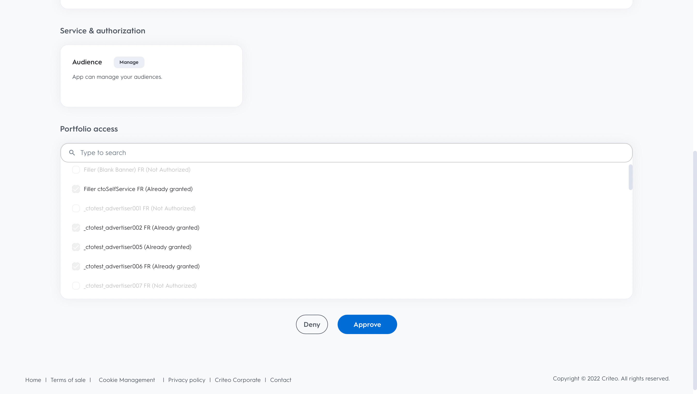

# Criteo-Verbindung

## Überblick {#overview}

>[!IMPORTANT]
>
>Dieser Ziel-Connector und diese Dokumentationsseite werden von Criteo erstellt und gepflegt. Bei Fragen oder Aktualisierungsanfragen wenden Sie sich bitte direkt an Criteo [hier](mailto:criteoTechnicalPartnerships@criteo.com).

Criteo ermöglicht vertrauenswürdige und wirkungsvolle Werbung, um jedem Verbraucher über das offene Internet ein reichhaltigeres Erlebnis zu bieten. Mit dem weltweit größten Commerce-Datensatz und der erstklassigen KI stellt Criteo sicher, dass jeder Touchpoint auf der Shopping-Journey personalisiert ist, um Kunden mit der richtigen Anzeige zum richtigen Zeitpunkt zu erreichen.

## Voraussetzungen {#prerequisites}

* Sie benötigen ein Administratorkonto im [Criteo Management Center](https://marketing.criteo.com).
* Sie benötigen Ihre Criteo Advertiser-ID (fragen Sie Ihren Criteo-Kontakt, wenn Sie diese ID nicht haben).
* Sie müssen [!DNL GUM caller ID] angeben, falls Sie [!DNL GUM ID] als Kennung verwenden möchten.

## Einschränkungen {#limitations}

* Criteo akzeptiert nur E-Mails mit [!DNL SHA-256]-Hash und Nur-Text-E-Mails (die vor dem Versand in [!DNL SHA-256] umgewandelt werden). Bitte senden Sie keine personenbezogenen Daten (persönliche identifizierbare Informationen wie Namen oder Telefonnummern von Einzelpersonen).
* Criteo benötigt mindestens eine vom Client bereitzustellende Kennung. Er priorisiert [!DNL GUM ID] als Kennung vor gehashten E-Mails, da er zu einer besseren Abgleichrate beiträgt.


## Unterstützte Identitäten {#supported-identities}

Criteo unterstützt die Aktivierung von Identitäten, die in der folgenden Tabelle beschrieben werden. Erhalten Sie weitere Informationen zu [Identitäten](https://experienceleague.adobe.com/docs/experience-platform/identity/namespaces.html?lang=de#getting-started).

| Ziel-Identität | Beschreibung | Zu beachten |
| --- | --- | --- |
| `email_sha256` | Mit dem SHA-256-Algorithmus gehashte E-Mail-Adressen | Adobe Experience Platform unterstützt sowohl Nur-Text- als auch SHA-256-Hash-E-Mail-Adressen. Wenn Ihr Quellfeld ungehashte Attribute enthält, überprüfen Sie die Option [!UICONTROL Umwandlung anwenden], damit Experience Platform die Daten bei Aktivierung automatisch hasht. |
| `gum_id` | Cookie-Kennung für Criteo [!DNL GUM] | [!DNL GUM IDs] ermöglichen es Kunden, eine Korrespondenz zwischen ihrem Benutzeridentifizierungssystem und der Benutzeridentifizierung ([!DNL UID]) von Criteo zu pflegen. Wenn der Kennungstyp `gum_id` ist, muss auch ein zusätzlicher Parameter, der [!DNL GUM Caller ID], enthalten sein. Wenden Sie sich an Ihr Criteo-Account-Team, um die entsprechenden [!DNL GUM Caller ID] zu erhalten oder um bei Bedarf weitere Informationen zu dieser [!DNL GUM ID]-Synchronisierung zu erhalten. |

## Exporttyp und -häufigkeit {#export-type-frequency}

Beziehen Sie sich auf die folgende Tabelle, um Informationen zu Typ und Häufigkeit des Zielexports zu erhalten.

| Element | Typ | Anmerkungen |
| --- | --- | --- |
| Exporttyp | Zielgruppenexport | Sie exportieren alle Mitglieder einer Zielgruppe mit den IDs (Name, Telefonnummer oder sonstiges), die im [!DNL Criteo]-Ziel verwendet werden. |
| Exporthäufigkeit | Streaming | Streaming-Ziele sind „immer verfügbare“ API-basierte Verbindungen. Sobald ein Profil in Experience Platform auf der Grundlage einer Zielgruppenauswertung aktualisiert wird, sendet der Connector das Update nachgelagert an die Zielplattform. Lesen Sie mehr über [Streaming-Ziele](../../destination-types.md#streaming-destinations). |

## Anwendungsszenarien {#use-cases}

Damit Sie besser verstehen können, wie Sie das [!DNL Criteo]-Ziel verwenden, können Adobe Experience Platform-Kundinnen und -Kunden [!DNL Criteo] folgende Ziele erreichen:

### Anwendungsfall 1: Traffic abrufen

Präsentieren Sie Ihr Unternehmen mit relevanten Produktangeboten und flexiblen Kreativen. Mit intelligenten Produktempfehlungen werden Ihre Anzeigen automatisch die Produkte enthalten, die am wahrscheinlichsten zu Besuchen und Interaktionen von Triggern führen. Flexibles Targeting ermöglicht es Ihnen, Zielgruppen aus dem Commerce-Datensatz von Criteo oder aus Ihren eigenen Interessentenlisten und Adobe CDP-Segmenten zu erstellen.

### Anwendungsfall 2 : Steigerung der Website-Konversionen

Wenn Besucherinnen und Besucher Ihre Website verlassen, erinnern Sie sie mit Retargeting-Anzeigen, die Konversionen erhöhen, daran, dass sie Sonderangebote und hyperrelevante Angebote anzeigen, unabhängig davon, wo sie als Nächstes hingehen. Verbinden Sie Ihre Adobe CDP-Zielgruppe, um bestehende Kundinnen und Kunden erneut anzusprechen, oder richten Sie sie ähnlich wie Ihre treuesten Kundinnen und Kunden an.

## Mit Criteo verbinden {#connect}

>[!IMPORTANT]
> 
>Um eine Verbindung mit dem Ziel herzustellen, benötigen Sie **[!UICONTROL Ziele anzeigen]** und **[!UICONTROL Ziele verwalten]** [Zugriffssteuerungsberechtigungen](/help/access-control/home.md#permissions). Lesen Sie die [Übersicht über die Zugriffskontrolle](/help/access-control/ui/overview.md) oder wenden Sie sich an Ihren Produktadministrator, um die erforderlichen Berechtigungen zu erhalten.

Um eine Verbindung mit diesem Ziel herzustellen, gehen Sie wie im Abschnitt [Tutorial zur Zielkonfiguration](../../ui/connect-destination.md) beschrieben vor.

### Bei Criteo authentifizieren

Die Schritte zum Verbinden sind wie folgt:

1. Melden Sie sich bei Adobe Experience Platform an und stellen Sie eine Verbindung zum Criteo-Ziel her.

   

1. Sie werden zu Criteo weitergeleitet, um die Verbindung zu autorisieren. Möglicherweise müssen Sie sich zuerst mit Ihren Criteo-Anmeldedaten anmelden:

   

   

   


### Verbindungsparameter {#connection-parameters}

Geben Sie nach der Authentifizierung beim Ziel die folgenden Verbindungsparameter ein.


| Feld | Beschreibung | Erforderlich |
| --- | --- | --- |
| Name | Ein Name, der Ihnen hilft, dieses Ziel in Zukunft zu erkennen. Der hier ausgewählte Name ist der [!DNL Audience] im Criteo Management Center und kann zu einem späteren Zeitpunkt nicht mehr geändert werden. | Ja |
| Beschreibung | Eine Beschreibung, die Ihnen hilft, dieses Ziel in Zukunft zu identifizieren. | Nein |
| Advertiser-ID | Criteo Advertiser-ID Ihrer Organisation. Wenden Sie sich an Ihren Criteo Account Manager, um diese Informationen zu erhalten. | Ja |
| Criteo [!DNL GUM caller ID] | [!DNL GUM Caller ID] Ihres Unternehmens. Wenden Sie sich an Ihr Criteo-Account-Team, um die entsprechenden [!DNL GUM Caller ID] zu erhalten oder um bei Bedarf weitere Informationen zu dieser [!DNL GUM]-Synchronisierung zu erhalten. | Ja, wenn [!DNL GUM ID] als Kennung angegeben wird |

### Aktivieren von Warnhinweisen {#enable-alerts}

Sie können Warnhinweise aktivieren, um Benachrichtigungen zum Status des Datenflusses zu Ihrem Ziel zu erhalten. Wählen Sie einen Warnhinweis aus der zu abonnierenden Liste aus, um Benachrichtigungen über den Status Ihres Datenflusses zu erhalten. Weitere Informationen zu Warnhinweisen finden Sie im Handbuch zum [Abonnieren von Zielwarnhinweisen über die Benutzeroberfläche](../../ui/alerts.md).

Wenn Sie alle Details für Ihre Zielverbindung eingegeben haben, klicken Sie auf **[!UICONTROL Weiter]**.

## Aktivieren von Zielgruppen für dieses Ziel {#activate-segments}

>[!IMPORTANT]
> 
>* Zum Aktivieren von Daten benötigen Sie die Berechtigungen **[!UICONTROL Ziele anzeigen]**, **[!UICONTROL Ziele aktivieren]**, **[!UICONTROL Profile anzeigen]** und **[!UICONTROL Segmente anzeigen]**&#x200B;[Zugriffssteuerung](/help/access-control/home.md#permissions). Lesen Sie die [Übersicht über die Zugriffssteuerung](/help/access-control/ui/overview.md) oder wenden Sie sich an Ihre Produktadmins, um die erforderlichen Berechtigungen zu erhalten.
>* Zum Exportieren *Identitäten* benötigen Sie die Berechtigung **[!UICONTROL Identitätsdiagramm anzeigen]** [Zugriffssteuerung](/help/access-control/home.md#permissions). <br> {width="100" zoomable="yes"}

Anweisungen zum Aktivieren von Zielgruppen für dieses Ziel finden Sie unter [Aktivieren von Profilen und Zielgruppen für Streaming-Zielgruppen-Exportziele](../../ui/activate-segment-streaming-destinations.md).

## Exportierte Daten {#exported-data}

Sie können die exportierten Zielgruppen im [Criteo-Management-Center](https://marketing.criteo.com/audience-manager/dashboard) anzeigen.

Der Anfragetext zum Hinzufügen eines Benutzerprofils, das von der [!DNL Criteo]-Verbindung empfangen wurde, sieht in etwa wie folgt aus:

```json
{
  "data": {
    "type": "ContactlistWithUserAttributesAmendment",
    "attributes": {
      "operation": "add",
      "identifierType": "gum",
      "gumCallerId": "123",
      "identifiers": [
        {
          "identifier": "456",
          "attributes": [
            { "key": "ctoid_GumCaller", "value": "123" },
            { "key": "ctoid_Gum", "value": "456" },
            {
              "key": "ctoid_HashedEmail",
              "value": "98833030dc03751f2b2c1a0017078975fdae951aa6908668b3ec422040f2d4be"
            }
          ]
        }
      ]
    }
  }
}
```

Der Anfragetext zum Entfernen eines Benutzerprofils, das von der [!DNL Criteo]-Verbindung empfangen wurde, sieht in etwa wie folgt aus:

```json
{
  "data": {
    "type": "ContactlistWithUserAttributesAmendment",
    "attributes": {
      "operation": "remove",
      "identifierType": "gum",
      "gumCallerId": "123",
      "identifiers": [
        {
          "identifier": "456",
          "attributes": [
            { "key": "ctoid_GumCaller", "value": "123" },
            { "key": "ctoid_Gum", "value": "456" },
            {
              "key": "ctoid_HashedEmail",
              "value": "98833030dc03751f2b2c1a0017078975fdae951aa6908668b3ec422040f2d4be"
            }
          ]
        }
      ]
    }
  }
}
```

## Datennutzung und -Governance {#data-usage}

Alle Adobe Experience Platform-Ziele sind bei der Verarbeitung Ihrer Daten mit Datennutzungsrichtlinien konform. Ausführliche Informationen darüber, wie Adobe Experience Platform Data Governance erzwingt, finden Sie unter [Data Governance - Übersicht](https://experienceleague.adobe.com/docs/experience-platform/data-governance/home.html?lang=de).

## Zusätzliche Ressourcen

* [Criteo-Hilfezentrum](https://help.criteo.com/kb/en)
* [Criteo-Entwicklerportal](https://developers.criteo.com)
