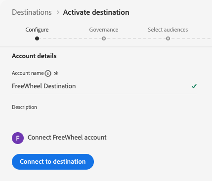

# [!DNL FreeWheel]-Verbindung {#freewheel}

>[!AVAILABILITY]
>
>Das [!DNL FreeWheel]-Ziel befindet sich derzeit in Beta und steht nur ausgewählten Kundinnen und Kunden zur Verfügung. Wenden Sie sich an Ihren Adobe-Support-Mitarbeiter, um Zugriff anzufordern.

## Überblick {#overview}

[!DNL FreeWheel] ist eine globale Werbetechnologie-Plattform, die den programmatischen Kauf und Verkauf über Connected TV (CTV)-, Video- und Display-Inventar ermöglicht. [!DNL FreeWheel] bietet einen datengesteuerten Marktplatz, der Werbetreibende mit Premium-Medienbesitzern weltweit verbindet.

Verwenden Sie dieses Ziel, um Zielgruppen von [!DNL Adobe Experience Platform] an [!DNL FreeWheel] zu senden. Audiences werden als tägliche Batch-Dateien bereitgestellt und stehen zur Zielgruppenbestimmung in [!DNL FreeWheel] Angeboten und Kampagnen zur Verfügung.

## Voraussetzungen {#prerequisites}

Bevor Sie Zielgruppen für die [!DNL FreeWheel] aktivieren können, überprüfen Sie die folgenden Anforderungen:

* **FreeWheel-Netzwerk** ID: Sie müssen über eine gültige [!DNL FreeWheel]-Netzwerk-ID verfügen. Dies wird von [!DNL FreeWheel] bei der Einrichtung Ihres Kontos bereitgestellt.

## Unterstützte Identitäten {#supported-identities}

[!DNL FreeWheel] unterstützt die Aktivierung von Identitäten, die in der folgenden Tabelle beschrieben sind. Zusätzlich zu diesen Identitäten können Sie eine beliebige Identität verwenden, die in Ihrem [!DNL FreeWheel]-Konto verfügbar ist. Anweisungen [ Zuordnen einer Identität, ](#map) nicht in der folgenden Tabelle aufgeführt ist, finden Sie unter „Zuordnen von Attributen und Identitäten“. Erhalten Sie weitere Informationen zu [Identitäten](/help/identity-service/features/namespaces.md).

| Zielidentität | Beschreibung | Zu beachten |
|---|---|---|
| `idfa` | Apple-ID für Werbetreibende | Wählen Sie diese Zielidentität aus, wenn Ihre Quellidentität ein IDFA-Namespace ist. |
| `aaid` | ANDROID ADVERTISING ID | Wählen Sie diese Zielidentität aus, wenn Ihre Quellidentität ein GAID-Namespace ist. |
| `ctv` | ID des verbundenen TV-Geräts | Wählen Sie diese Zielidentität beim Targeting von CTV-Geräten aus. |
| `ip` | IPv4-Adresse | Wählen Sie diese Zielidentität aus, um Benutzer basierend auf ihrer IP-Adresse anzusprechen. Ordnen Sie ein Profilattribut zu, das eine gültige IPv4-Adresse enthält, oder verwenden Sie ein berechnetes Feld, um den Wert abzuleiten. |
| `ipv6` | IPv6-Adresse | Wählen Sie diese Zielidentität aus, um Benutzer basierend auf ihrer IPv6-Adresse anzusprechen. Ordnen Sie ein Profilattribut zu, das eine gültige IPv6-Adresse enthält, oder verwenden Sie ein berechnetes Feld, um den Wert abzuleiten. |

{style="table-layout:auto"}

## Unterstützte Zielgruppen {#supported-audiences}

In diesem Abschnitt wird beschrieben, welche Arten von Zielgruppen Sie an dieses Ziel exportieren können.

| Zielgruppenherkunft | Unterstützt | Beschreibung |
|---------|----------|----------|
| [!DNL Segmentation Service] | Ja | Zielgruppen, die über den Experience Platform-[ (Segmentierungs-Service) generiert ](../../../segmentation/home.md). |
| Alle anderen Ursprünge der Zielgruppe | Ja | Diese Kategorie enthält alle Ursprünge der Zielgruppe außerhalb der Zielgruppen, die durch die [!DNL Segmentation Service] generiert wurden. Lesen Sie mehr über [verschiedene Ursprünge von Audiences](/help/segmentation/ui/audience-portal.md#customize). Einige Beispiele: <ul><li>benutzerdefinierte Upload-Zielgruppen [importiert](../../../segmentation/ui/audience-portal.md#import-audience) aus CSV-Dateien in Experience Platform,</li><li>Lookalike-Zielgruppen,</li><li>Federated Audiences,</li><li>Zielgruppen, die in anderen Experience Platform-Apps generiert werden, z. B. [!DNL Adobe Journey Optimizer],</li><li>und mehr.</li></ul> |

{style="table-layout:auto"}

Unterstützte Zielgruppen nach Zielgruppen-Datentyp:

| Datentyp der Zielgruppe | Unterstützt | Beschreibung | Anwendungsfälle |
|--------------------|-----------|-------------|-----------|
| [Personen-Zielgruppen](/help/segmentation/types/people-audiences.md) | Ja | Basierend auf Kundenprofilen können Sie bestimmte Personengruppen für Marketing-Kampagnen ansprechen. | CTV-Retargeting, Reichweitenunterdrückung |
| [Konto-Zielgruppen](/help/segmentation/types/account-audiences.md) | Nein | Targeting von Personen in bestimmten Organisationen für Account-basierte Marketing-Strategien. | B2B-Marketing |
| [Interessenten-Zielgruppen](/help/segmentation/types/prospect-audiences.md) | Nein | Targeting von Personen, die noch keine Kunden sind, aber Merkmale mit Ihrer Zielgruppe teilen. | Akquise mit Drittanbieterdaten |
| [Datensatzexporte](/help/catalog/datasets/overview.md) | Nein | Sammlungen strukturierter Daten, die im Data Lake von [!DNL Adobe Experience Platform] gespeichert sind. | Reporting, Datenwissenschaft-Workflows |

{style="table-layout:auto"}

## Exporttyp und -häufigkeit {#export-type-frequency}

Beziehen Sie sich auf die folgende Tabelle, um Informationen zu Typ und Häufigkeit des Zielexports zu erhalten.

| Element | Typ | Anmerkungen |
|---------|----------|---------|
| Exporttyp | **[!UICONTROL Profile-based]** | Sie exportieren alle Mitglieder einer Zielgruppe zusammen mit den gewünschten Identitätsfeldern, wie sie im Zuordnungsschritt des Workflows [Zielaktivierung“ ausgewählt ](/help/destinations/ui/activate-batch-profile-destinations.md#select-attributes). |
| Exporthäufigkeit | **[!UICONTROL Batch]** | Der erste Export ist eine vollständige Momentaufnahme aller Profile, die für die aktivierten Zielgruppen qualifiziert sind. Nachfolgende Exporte sind tägliche inkrementelle Aktualisierungen, die neue Zielgruppenqualifikationen (Hinzufügen) und Zielgruppenaustritte (Entfernen) enthalten. Es ist auch ein konfigurierbares vollständiges Zielgruppen-Aktualisierungsintervall (4, 8 oder 12 Wochen) verfügbar, das zusätzlich zu den täglichen Inkrementen regelmäßige vollständige Exporte auslöst. Vollständige Exporte enthalten nur aktuell qualifizierte Profile. Zielgruppen-Ausstiege sind nicht enthalten und werden ausschließlich über die täglichen inkrementellen Aktualisierungen bereitgestellt. Weitere Informationen finden Sie unter [Batch-Datei-basierte Ziele](/help/destinations/destination-types.md#file-based). |

{style="table-layout:auto"}

## Herstellen einer Verbindung mit dem Ziel {#connect}

>[!IMPORTANT]
>
>Um eine Verbindung zum Ziel herzustellen, benötigen Sie die **[!UICONTROL View Destinations]** und **[!UICONTROL Manage Destinations]** Zugriffssteuerungsberechtigungen[. ](/help/access-control/home.md#permissions) Lesen Sie die [Zugriffskontrolle – Übersicht](/help/access-control/ui/overview.md) oder wenden Sie sich an Ihren Produktadministrator, um die erforderlichen Berechtigungen zu erhalten.

Um eine Verbindung mit diesem Ziel herzustellen, gehen Sie wie im [Tutorial zur Zielkonfiguration](../../ui/connect-destination.md) beschrieben vor. Füllen Sie im Workflow zum Konfigurieren des Ziels die Felder aus, die in den beiden folgenden Abschnitten aufgeführt sind.

### Beim Ziel authentifizieren {#authenticate}

Die Authentifizierung beim [!DNL FreeWheel]-Ziel wird automatisch von Adobe durchgeführt. Während der Authentifizierung sind keine Anmeldeinformationen oder API-Schlüssel von Ihnen erforderlich. Adobe verwaltet in Ihrem Auftrag die sichere Verbindung zu [!DNL FreeWheel].



Wählen Sie **[!UICONTROL Connect to destination]** aus, um mit dem Schritt Zieldetails fortzufahren.

### Ausfüllen der Zieldetails {#destination-details}

>[!CONTEXTUALHELP]
>id="platform_destinations_freewheel_backfill"
>title="Vollständiges Zielgruppen-Aktualisierungsintervall"
>abstract="Wählen Sie das Intervall aus, in dem zusätzlich zu den täglichen inkrementellen Aktualisierungen ein vollständiger Zielgruppenexport an [!DNL FreeWheel] gesendet wird. Ein vollständiger Zielgruppenexport verhindert, dass Ihre Zielgruppenmitglieder in [!DNL FreeWheel] ablaufen, sodass es bei Ihren Zielgruppenmitgliedern während der Ausführung Ihrer Kampagnen nicht zu Einbrüchen kommt. Verfügbare Optionen sind 4 Wochen, 8 Wochen und 12 Wochen."

Füllen Sie die folgenden erforderlichen und optionalen Felder aus, um Details für das Ziel zu konfigurieren. Ein Sternchen neben einem Feld in der Benutzeroberfläche zeigt an, dass das Feld erforderlich ist.


* **[!UICONTROL Name]**: Ein Name, durch den Sie dieses Ziel in Zukunft erkennen können.
* **[!UICONTROL Description]**: Eine Beschreibung, die Ihnen hilft, dieses Ziel in Zukunft zu identifizieren.
* **[!UICONTROL Region]**: Die [!DNL FreeWheel] Region, in der Ihr Konto gehostet wird. Wählen Sie eine der folgenden Optionen aus:
   * **[!UICONTROL US East]**
   * **[!UICONTROL Europe]**
   * **[!UICONTROL Asia Pacific]**
* **[!UICONTROL FreeWheel network ID]**: Ihre [!DNL FreeWheel] Netzwerk-ID. Dieser Wert wird von [!DNL FreeWheel] bereitgestellt und identifiziert Ihr Unternehmen eindeutig in der [!DNL FreeWheel].
* **[!UICONTROL Full audience refresh interval]**: Die Häufigkeit, mit der zusätzlich zu täglichen inkrementellen Aktualisierungen ein vollständiger Zielgruppenexport an [!DNL FreeWheel] gesendet wird. Ein vollständiger Zielgruppenexport verhindert, dass Ihre Zielgruppenmitglieder in [!DNL FreeWheel] ablaufen, sodass es bei Ihren Zielgruppenmitgliedern während der Ausführung Ihrer Kampagnen nicht zu Einbrüchen kommt. Wählen Sie ein Intervall aus dem Dropdown-Menü aus.

### Aktivieren von Warnhinweisen {#enable-alerts}

Sie können Warnhinweise aktivieren, um Benachrichtigungen zum Status des Datenflusses zu Ihrem Ziel zu erhalten. Wählen Sie einen Warnhinweis aus der zu abonnierenden Liste aus, um Benachrichtigungen über den Status Ihres Datenflusses zu erhalten. Weitere Informationen zu Warnhinweisen finden Sie im Handbuch zum [Abonnieren von Zielwarnhinweisen über die Benutzeroberfläche](../../ui/alerts.md).

Wenn Sie mit dem Eingeben der Details für Ihre Zielverbindung fertig sind, wählen Sie **[!UICONTROL Next]** aus.

## Aktivieren von Zielgruppen für dieses Ziel {#activate}

>[!IMPORTANT]
>
>* Zum Aktivieren von Daten benötigen Sie die **[!UICONTROL View Destinations]**, **[!UICONTROL Activate Destinations]**, **[!UICONTROL View Profiles]** und **[!UICONTROL View Segments]** [Zugriffssteuerungsberechtigungen](/help/access-control/home.md#permissions). Lesen Sie die [Übersicht über die Zugriffssteuerung](/help/access-control/ui/overview.md) oder wenden Sie sich an Ihre Produktadmins, um die erforderlichen Berechtigungen zu erhalten.
>* Zum Exportieren *Identitäten* benötigen Sie die **[!UICONTROL View Identity Graph]** Zugriffssteuerungsberechtigung[ ](/help/access-control/home.md#permissions). <br> {width="100" zoomable="yes"}

Anweisungen zum Aktivieren von Zielgruppen für dieses Ziel finden Sie unter [Aktivieren von Zielgruppendaten für Batch-Profil-Exportziele](/help/destinations/ui/activate-batch-profile-destinations.md).

### Planen von Zielgruppenexporten {#schedule}


Konfigurieren Sie im **[!UICONTROL Scheduling]** Schritt den Exportzeitplan für jede Audience. [!DNL FreeWheel] verwendet ein Hybridexportmodell: Der erste Export für jede aktivierte Zielgruppe ist eine vollständige Momentaufnahme, gefolgt von täglichen inkrementellen Aktualisierungen.

Konfigurieren Sie die folgenden Felder:

* **[!UICONTROL File export options]**: **[!UICONTROL Export incremental files]** ist vorausgewählt und ist die einzige unterstützte Option. Der erste Export enthält automatisch eine vollständige Momentaufnahme aller qualifizierten Profile. Nachfolgende Exporte liefern nur neue Zielgruppenqualifikationen und -austritte seit dem letzten Export.
* **[!UICONTROL Frequency]**: **[!UICONTROL Daily]** auswählen. [!DNL FreeWheel] erwartet eine tägliche inkrementelle Dateibereitstellung.
* **[!UICONTROL Scheduled start time]**: Geben Sie die Uhrzeit in UTC ein, zu der der tägliche Export ausgeführt werden soll.
* **[!UICONTROL Date]**: Legen Sie das Start- und Enddatum für die Aktivierung fest. Das Startdatum bestimmt, wann der erste vollständige Snapshot-Export gesendet wird.

>[!NOTE]
>
>Vollständige Exporte (sowohl der erste Schnappschuss als auch regelmäßige vollständige Aktualisierungen) enthalten nur aktuell qualifizierte Profile. Zielgruppenaustritte sind nicht in vollständigen Exporten enthalten und werden ausschließlich über die täglichen inkrementellen Aktualisierungen bereitgestellt.

### Zuordnen von Attributen und Identitäten {#map}

Wählen Sie im Zuordnungsschritt die Quellfelder aus Ihren Experience Platform-Profilen aus und ordnen Sie sie den von [!DNL FreeWheel] unterstützten Identitätstypen zu. Mindestens eine Zuordnung ist erforderlich.

>[!IMPORTANT]
>
>Die [!DNL FreeWheel] unterstützten Identitätstypen werden in der Zuordnungs **Benutzeroberfläche als** Zielattribute“ und nicht als Identity-Namespaces angezeigt.

Wenn Ihr [!DNL FreeWheel]-Konto Identitätstypen unterstützt, die nicht in der Tabelle [Unterstützte Identitäten](#supported-identities) aufgeführt sind, können Sie sie zuordnen, indem Sie den Identitätsnamen manuell in das Zielfeld eingeben, anstatt aus der vordefinierten Liste auszuwählen.


Im Folgenden finden Sie Beispiele für Zuordnungen. Ihre tatsächlichen Zuordnungen hängen von Ihrem Profilschema und den Identitätstypen ab, die Ihr [!DNL FreeWheel]-Konto unterstützt.

| Quellfeld | Zielfeld |
| --- | --- |
| `identityMap.IDFA` | `idfa` |
| `identityMap.GAID` | `aaid` |
| `homeAddress.ipAddress` | `ip` |

{style="table-layout:auto"}

>[!NOTE]
>
>Es werden keine obligatorischen Zuordnungen erzwungen. Profile ohne mindestens eine gültige Identitätszuordnung werden jedoch nicht in die exportierten Dateien eingeschlossen.

## Exportierte Daten/Datenexport validieren {#exported-data}

[!DNL FreeWheel] erhält zwei Arten von Dateien pro Export. Beide Dateitypen werden automatisch generiert und bereitgestellt. Es ist keine Aktion Ihrerseits erforderlich.

**Identitätsdateien (Daten** enthalten die Daten zur Zielgruppenzugehörigkeit. Jede Zeile ordnet eine Benutzerkennung einer oder mehreren Zielgruppen-IDs zu. Die Dateien werden an [!DNL FreeWheel] im CSV-Format ohne Spaltenüberschriften übermittelt. Für jeden im Export vorhandenen Identitätstyp werden separate Dateien erstellt (z. B. eine Datei für `aaid` und eine separate Datei für `idfa`).

Beispieldatendateiformat:

```csv
aebc1234-56f7-89ab-cdef-0123456789ab,segment_1,segment_2
f7c9a8b0-4d33-11ec-81d3-0242ac130003,segment_1,segment_3
123e4567-e89b-12d3-a456-426614174000,segment_2
```

**Taxonomiedateien** beschreiben die im Export enthaltenen Zielgruppen. Diese Dateien werden zusammen mit den Datendateien bereitgestellt und enthalten die Zielgruppen-ID, den Namen und die TTL (Time to Live) in Tagen. Die von [!DNL FreeWheel] unterstützte TTL beträgt maximal 90 Tage. Die Werte im folgenden Beispiel sind beispielhaft.

Beispiel für ein Taxonomie-Dateiformat:

```csv
Segment ID,Segment Name,TTL
segment_1,my_first_segment,30
segment_2,my_second_segment,30
segment_3,my_third_segment,30
```

## Datennutzung und -Governance {#data-usage-governance}

Alle [!DNL Adobe Experience Platform]-Ziele sind bei der Verarbeitung Ihrer Daten mit Datennutzungsrichtlinien konform. Ausführliche Informationen darüber, wie [!DNL Adobe Experience Platform] Data Governance erzwingt, finden Sie unter [Data Governance – Übersicht](/help/data-governance/home.md).

## Weitere Ressourcen {#additional-resources}

Weitere Informationen zu [!DNL FreeWheel] und seiner Werbetechnologieplattform finden Sie auf der [FreeWheel-Website](https://www.freewheel.com){target="_blank"}.
