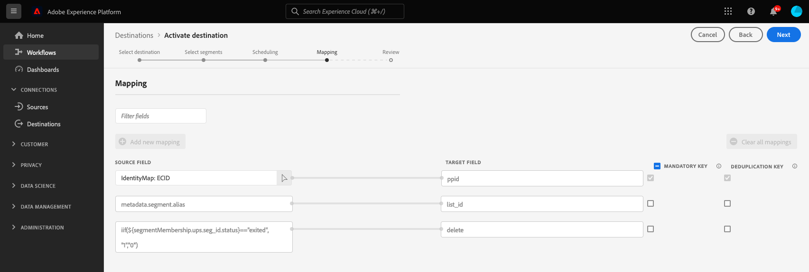

# (Beta) [!DNL Google Ad Manager 360]-Verbindung

## Übersicht {#overview}

Die [!DNL Google Ad Manager 360]-Verbindung aktiviert den Batch-Upload für [!DNL publisher provided identifiers] (PPID) in [!DNL Google Ad Manager 360] über [!DNL Google Cloud Storage].

Weitere Informationen dazu, wie vom Publisher bereitgestellte IDs in Google Ad Manager 360 funktionieren, finden Sie in der [offiziellen Google-Dokumentation](https://support.google.com/admanager/answer/2880055?hl=de).

>[!IMPORTANT]
>
>Diese Funktion befindet sich derzeit in der Beta-Phase und steht nur einer bestimmten Anzahl von Kunden zur Verfügung. Um Zugang zur [!DNL Google Ad Manager 360]-Verbindung zu erhalten, wenden Sie sich an Ihre Kontaktperson beim Adobe-Support-Mitarbeiter und geben Sie Ihre [!DNL organization ID] an.

Das [!DNL Google Ad Manager 360]-Ziel exportiert [!DNL CSV]-Dateien zu Ihrem [!DNL Google Cloud Storage]-Behälter. Nachdem Sie die [!DNL CSV]-Dateien exportiert haben, müssen Sie sie in Ihr [!DNL Google Ad Manager 360]-Konto importieren.

## Zielspezifikationen {#specifics}

Beachten Sie folgende Details, die speziell für [!DNL Google Ad Manager 360]-Ziele gelten.

* Aktivierte Zielgruppen werden programmgesteuert in der Google-Plattform erstellt und in die CSV-Datei eingefügt.

## Unterstützte Identitäten {#supported-identities}

[!DNL This integration] unterstützt die Aktualisierung von Identitäten, die in der folgenden Tabelle beschrieben werden.

| Ziel-Identität | Beschreibung | Zu beachten |
|---|---|---|
| PPID | [!DNL Publisher provided ID] | Wählen Sie diese Zielidentität aus, um Zielgruppen an [!DNL Google Ad Manager 360] zu senden. |

{style="table-layout:auto"}

## Exporttyp und -häufigkeit {#export-type-frequency}

Beziehen Sie sich auf die folgende Tabelle, um Informationen zu Typ und Häufigkeit des Zielexports zu erhalten.

| Element | Typ | Anmerkungen |
---------|----------|---------|
| Exporttyp | **[!UICONTROL Profilbasiert]** | Sie exportieren alle Teile eines Segments zusammen mit den entsprechenden Schemafeldern (wie etwa Ihre PPID), gemäß der Auswahl im Bildschirm „Profilattribute auswählen“ des [Zielaktivierungs-Workflows](/help/destinations/ui/activate-batch-profile-destinations.md#select-attributes). |
| Exporthäufigkeit | **[!UICONTROL Batch]** | Batch-Ziele exportieren Dateien in Schritten von drei, sechs, acht, zwölf oder vierundzwanzig Stunden auf nachgelagerte Plattformen. Weitere Informationen finden Sie unter [Batch-Datei-basierte Ziele](/help/destinations/destination-types.md#file-based). |

{style="table-layout:auto"}

## Voraussetzungen {#prerequisites}

### Zulassungsauflistung {#allow-listing}

Die Zulassungsauflistung ist obligatorisch, bevor Sie Ihr erstes [!DNL Google Ad Manager 360]-Ziel in Platform einrichten. Stellen Sie sicher, dass Sie den unten beschriebenen Zulassungsauflistungsprozess abgeschlossen haben, bevor Sie Ihr Ziel erstellen.

>[!NOTE]
>
>Die Ausnahme für diese Regel ist für bestehende [Audience Manager](https://experienceleague.adobe.com/docs/audience-manager/user-guide/aam-home.html?lang=de) -Kunden. Wenn Sie bereits eine Verbindung zu diesem Google-Ziel in Audience Manager erstellt haben, ist es nicht erforderlich, den Zulassungsauflistungsprozess erneut zu durchlaufen. Sie können mit den nächsten Schritten fortfahren.

1. Führen Sie die im Abschnitt [Dokumentation zu Google Ad Manager](https://support.google.com/admanager/answer/3289669?hl=de) , um Adobe als verknüpfte Data Management Platform (DMP) hinzuzufügen.
2. Im [!DNL Google Ad Manager] Benutzeroberfläche, navigieren Sie zu **[!UICONTROL Admin]** > **[!UICONTROL Globale Einstellungen]** > **[!UICONTROL Netzwerkeinstellungen]** und aktivieren Sie die **[!UICONTROL API-Zugriff]** festlegen.

## Herstellen einer Verbindung mit dem Ziel {#connect}

>[!IMPORTANT]
> 
>Um eine Verbindung zum Ziel herzustellen, benötigen Sie die [Zugriffsberechtigung](/help/access-control/home.md#permissions) **[!UICONTROL Ziele verwalten]**. Lesen Sie die [Zugriffskontrolle – Übersicht](/help/access-control/ui/overview.md) oder wenden Sie sich an Ihren Produktadministrator, um die erforderlichen Berechtigungen zu erhalten.

Um eine Verbindung mit diesem Ziel herzustellen, gehen Sie wie im [Tutorial zur Zielkonfiguration](https://experienceleague.adobe.com/docs/experience-platform/destinations/ui/connect-destination.html?lang=de) beschrieben vor. Füllen Sie im Zielkonfigurations-Workflow die Felder aus, die in den beiden folgenden Abschnitten aufgeführt sind.

### Beim Ziel authentifizieren {#authenticate}

Um sich beim Ziel zu authentifizieren, füllen Sie die erforderlichen Felder aus und wählen Sie **[!UICONTROL Mit Ziel verbinden]** aus.

* **[!UICONTROL Zugriffsschlüssel-ID]**: Eine 61-stellige alphanumerische Zeichenfolge, die zur Authentifizierung Ihres [!DNL Google Cloud Storage]-Kontos bei Platform verwendet wird.
* **[!UICONTROL Geheimer Zugriffsschlüssel]**: Eine mit Base64 verschlüsselte Zeichenfolge mit 40 Zeichen, die zum Authentifizieren Ihres [!DNL Google Cloud Storage]-Kontos bei Platform verwendet wird.

Weitere Informationen zu diesen Werten finden Sie im Handbuch [HMAC-Schlüssel für Google Cloud Storage](https://cloud.google.com/storage/docs/authentication/hmackeys#overview). Anweisungen zum Generieren Ihrer eigenen Zugriffsschlüssel-ID und Ihres geheimen Zugriffsschlüssels finden Sie in der [[!DNL Google Cloud Storage] Übersicht zu Quellen](/help/sources/connectors/cloud-storage/google-cloud-storage.md).

### Ausfüllen der Zieldetails {#destination-details}

>[!CONTEXTUALHELP]
>id="platform_destinations_gam360_appendSegmentID"
>title="Segment-ID an Segmentname anhängen"
>abstract="Wählen Sie diese Option aus, damit der Segmentname in Google Ad Manager 360 die Segment-ID aus Experience Platform wie folgt enthält: `Segment Name (Segment ID)`"

Füllen Sie die folgenden erforderlichen und optionalen Felder aus, um Details für das Ziel zu konfigurieren. Ein Sternchen neben einem Feld in der Benutzeroberfläche zeigt an, dass das Feld erforderlich ist.

* **[!UICONTROL Name]**: Geben Sie einen bevorzugten Namen für das Ziel ein.
* **[!UICONTROL Beschreibung]**: Optional. Hier können Sie beispielsweise erwähnen, für welche Kampagne Sie dieses Ziel verwenden.
* **[!UICONTROL Ordnerpfad]**: Geben Sie den Pfad zum Zielordner ein, in dem die exportierten Dateien gespeichert werden.
* **[!UICONTROL Behältername]**: Geben Sie den Namen des [!DNL Google Cloud Storage]-Behälters ein, der von diesem Ziel verwendet werden soll.
* **[!UICONTROL Konto-ID]**: Geben Sie Ihre [!DNL Audience Link ID] von [!DNL Google] -Konto. Dies ist eine spezifische Kennung, die mit Ihrem [!DNL Google Ad Manager] Netzwerk (nicht [!DNL Network code]). Sie finden dies unter **[!UICONTROL Admin > Globale Einstellungen]** im [!DNL Google Ad Manager] -Schnittstelle.
* **[!UICONTROL Kontotyp]**: Wählen Sie je nach [!DNL Google] Konto:
   * Verwenden von `AdX buyer` für [!DNL Google AdX]
   * Verwenden von `DFP by Google` für [!DNL DoubleClick] for Publishers

<!--

*  **[!UICONTROL Append segment ID to segment name]**: Select this option to have the segment name in Google Ad Manager 360 include the segment ID from Experience Platform, like this: `Segment Name (Segment ID)`

-->

### Aktivieren von Warnhinweisen {#enable-alerts}

Sie können Warnhinweise aktivieren, um Benachrichtigungen zum Status des Datenflusses zu Ihrem Ziel zu erhalten. Wählen Sie einen Warnhinweis aus der zu abonnierenden Liste aus, um Benachrichtigungen über den Status Ihres Datenflusses zu erhalten. Weitere Informationen zu Warnhinweisen finden Sie im Handbuch zum [Abonnieren von Zielwarnhinweisen über die Benutzeroberfläche](../../ui/alerts.md).

Wenn Sie mit dem Eingeben der Details für Ihre Zielverbindung fertig sind, klicken Sie auf **[!UICONTROL Weiter]**.

## Aktivieren von Segmenten für dieses Ziel {#activate}

>[!IMPORTANT]
> 
>Um Daten zu aktivieren, benötigen Sie die [Zugriffssteuerungsberechtigungen](/help/access-control/home.md#permissions) **[!UICONTROL Ziele verwalten]**, **[!UICONTROL Ziele aktivieren]**, **[!UICONTROL Profile anzeigen]** und **[!UICONTROL Segmente anzeigen]**. Lesen Sie die [Übersicht über die Zugriffskontrolle](/help/access-control/ui/overview.md) oder wenden Sie sich an Ihren Produktadministrator, um die erforderlichen Berechtigungen zu erhalten.

Anweisungen zum Aktivieren von Audience-Segmenten für dieses Ziel finden Sie unter [Aktivieren von Audience-Daten für Batch-Profil-Exportziele](../../ui/activate-batch-profile-destinations.md).

Im Schritt zur Identitätszuordnung sehen Sie die folgenden vorausgefüllten Zuordnungen:

| Vorausgefüllte Zuordnung | Beschreibung |
|---------|----------|
| `ECID` -> `ppid` | Dies ist die einzige vorausgefüllte Zuordnung, die von Benutzenden bearbeitet werden kann. Sie können beliebige Attribute oder Identitäts-Namespaces aus Platform auswählen und sie `ppid` zuordnen. |
| `metadata.segment.alias` -> `list_id` | Ordnet Segmentnamen von Experience Platform Segment-IDs in der Google-Plattform zu. |
| `iif(${segmentMembership.ups.seg_id.status}=="exited", "1","0")` -> `delete` | Teilt der Google-Plattform mit, wann disqualifizierte Benutzende aus Segmenten entfernt werden sollen. |

Diese Zuordnungen sind erforderlich für [!DNL Google Ad Manager 360] und werden von Adobe Experience Platform automatisch für alle [!DNL Google Ad Manager 360]-Verbindungen erstellt.

## Exportierte Daten {#exported-data}

Um festzustellen, ob die Daten erfolgreich exportiert wurden, überprüfen Sie Ihren [!DNL Google Cloud Storage]-Behälter und stellen Sie sicher, dass die exportierten Dateien die erwarteten Profilpopulationen enthalten.

## Fehlerbehebung {#troubleshooting}

Falls bei der Verwendung dieses Ziels Fehler auftreten und Sie eine Verbindung zu Adobe oder Google herstellen müssen, halten Sie die folgenden IDs bereit.

Dies sind die Google-Konto-IDs der Adobe:

* **[!UICONTROL Konto-ID]**: 87933855
* **[!UICONTROL Kunden-ID]**: 89690775