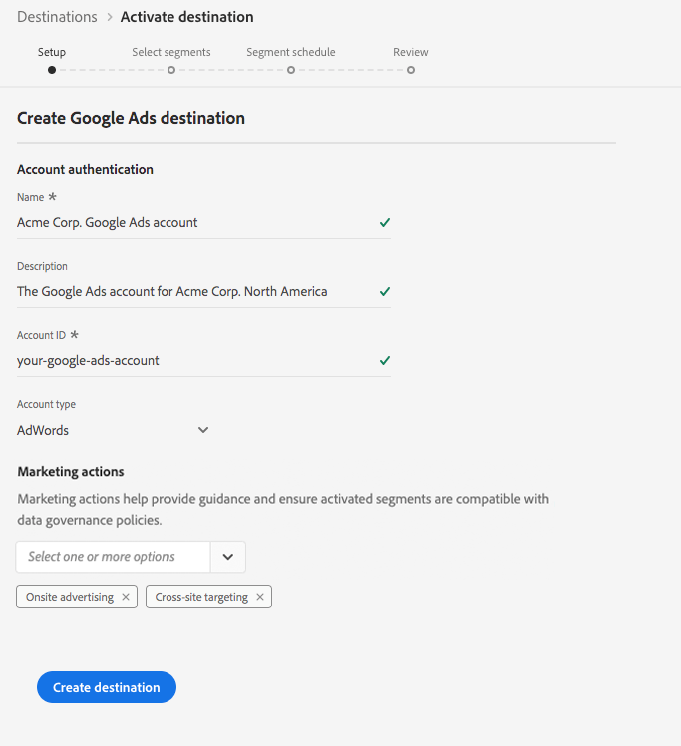

# [!DNL Google Ads] connection

[!DNL Google Ads], früher bekannt als  [!DNL Google AdWords], ist ein Online-Werbedienst, der es Unternehmen ermöglicht, per Klick Werbung über textbasierte Suchvorgänge, Grafikanzeigen,  [!DNL YouTube] Videos und mobile In-App-Anzeigen zu bezahlen.

## Zielspezifikationen

Beachten Sie die folgenden Details, die für [!DNL Google Ads]-Ziele spezifisch sind:

* Aktivierte Audiencen werden programmgesteuert auf der [!DNL Google]-Plattform erstellt.
* Die Plattform enthält derzeit keine Messungsmetrik zur Validierung einer erfolgreichen Aktivierung. Konsultieren Sie die Zielgruppenzahlen in Google, um die Integration zu validieren und die Zielgruppengröße zu verstehen.

>[!IMPORTANT]
>
>Wenn Sie Ihr erstes Ziel mit [!DNL Google Ads] erstellen und die [ID-Synchronisierungsfunktion](https://experienceleague.adobe.com/docs/id-service/using/id-service-api/methods/idsync.html) im Experience Cloud-ID-Dienst in der Vergangenheit (mit Audience Manager oder anderen Anwendungen) nicht aktiviert haben, wenden Sie sich bitte an Adobe Consulting oder den Kundendienst, um ID-Synchronisierungen zu aktivieren. Wenn Sie zuvor Google-Integrationen in Audience Manager eingerichtet haben, werden die ID-Synchronisierungen, die Sie eingerichtet haben, auf Platform übertragen.

### Unterstützte Identitäten {#supported-identities}

[!DNL Google Ad Manager] unterstützt die Aktivierung der Identitäten, die in der folgenden Tabelle beschrieben sind.

| Zielgruppe | Beschreibung | Zu beachten |
|---|---|---|
| GAID | [!DNL Google Advertising ID] | Wählen Sie diese Zielgruppen-ID aus, wenn Ihre Quellidentität ein GAID-Namensraum ist. |
| IDFA | [!DNL Apple ID for Advertisers] | Wählen Sie diese Zielgruppen-ID aus, wenn Ihre Quellidentität ein IDFA-Namensraum ist. |
| AAM UUUID | [Adobe Audience Manager [!DNL Unique User ID]](https://experienceleague.adobe.com/docs/audience-manager/user-guide/reference/ids-in-aam.html), auch bekannt als  [!DNL Device ID]. Eine numerische, 38-stellige Geräte-ID, die der Audience Manager jedem Gerät zuordnet, mit dem er interagiert. | Google verwendet [AAM UUID](https://experienceleague.adobe.com/docs/audience-manager/user-guide/reference/ids-in-aam.html?lang=en) für Zielgruppen in Kalifornien und die Google Cookie-ID für alle anderen Benutzer. |
| [!DNL Google] Cookie-ID | [!DNL Google] Cookie-ID | [!DNL Google] verwendet diese ID zur Zielgruppe von Benutzern außerhalb von Kalifornien. |
| RIDA | Roku-ID für Werbung. Diese ID identifiziert Roku-Geräte eindeutig. |  |
| MAID | Microsoft Advertising ID. Diese ID identifiziert Geräte mit Windows 10 eindeutig. |  |
| Amazon Fire TV ID | Diese ID identifiziert Amazon Fire TVs eindeutig. |  |

### Exporttyp {#export-type}

**Segmentexport** : Sie exportieren alle Segmentmitglieder (Audience) in das Google-Ziel.

## Voraussetzungen

### Vorhandenes [!DNL Google Ads]-Konto

>[!IMPORTANT]
>
> [!DNL Google] hat neue  [!DNL Google Ads] Cookie-Integrationen mit Drittanbietern überholt. Um die Zulassungslisten im nächsten Abschnitt ausführen zu können, müssen Sie über eine vorhandene Integration mit [!DNL Google Ads] verfügen. Daher wird für die Verwendung von [!DNL Google Ads] empfohlen, eine [!DNL Google Customer Match]-Integration einzurichten. Weitere Informationen zum Erstellen einer [!DNL Google Customer Match]-Integration finden Sie im Lernprogramm zum Erstellen einer [[!DNL Google Customer Match]](./google-customer-match.md)-Verbindung.

### Zulassungsliste

>[!NOTE]
>
>Die Zulassungsliste ist obligatorisch, bevor Sie Ihr erstes [!DNL Google Ads]-Ziel in Platform einrichten. Vergewissern Sie sich bitte, dass der unten beschriebene Vorgang der Zulassungsliste von [!DNL Google] abgeschlossen wurde, bevor Sie ein Ziel erstellen.

Bevor Sie das [!DNL Google Ads]-Ziel in Platform erstellen, müssen Sie sich an [!DNL Google] wenden, damit die Adobe auf die Liste der zulässigen Datenanbieter gesetzt wird und Ihr Konto der Zulassungsliste hinzugefügt werden kann. Wenden Sie sich an [!DNL Google] und geben Sie die folgenden Informationen ein:

* **Kontokennung**: Dies ist die Adobe-Kontokennung bei [!DNL Google]. Wenden Sie sich an die Kundenunterstützung von Adobe oder Ihren Adobe-Support-Mitarbeiter, um diese Kennung zu erhalten.
* **Kundenkennung**: Dies ist die Adobe-Kundenkontokennung bei [!DNL Google]. Wenden Sie sich an die Kundenunterstützung von Adobe oder Ihren Adobe-Support-Mitarbeiter, um diese Kennung zu erhalten.
* Ihr Kontotyp: **AdWords**
* **Google AdWords-ID** : Dies ist Ihre ID mit  [!DNL Google]. Das Format der Kennung lautet in der Regel 123-456-7890.

## Ziel konfigurieren

Wählen Sie unter **[!UICONTROL Verbindungen]** > **[!UICONTROL Ziele]** [!DNL Google Ads] aus und wählen Sie **[!UICONTROL Konfigurieren]**.

>[!NOTE]
>
>Wenn bereits eine Verbindung zu diesem Ziel besteht, wird auf der Zielkarte die Schaltfläche **[!UICONTROL Aktivieren]** angezeigt. Weitere Informationen zum Unterschied zwischen **[!UICONTROL Aktivieren]** und **[!UICONTROL Konfigurieren]** finden Sie im Abschnitt [Katalog](../../ui/destinations-workspace.md#catalog) der Dokumentation zum Zielarbeitsbereich.

Geben Sie im Schritt **Setup** des Arbeitsablaufs zum Erstellen des Ziels [!UICONTROL Grundlegende Informationen] für das Ziel ein.

* **[!UICONTROL Name]**: Geben Sie einen bevorzugten Namen für das Ziel ein.
* **[!UICONTROL Beschreibung]**: Optional. Hier können Sie beispielsweise erwähnen, für welche Kampagne Sie dieses Ziel verwenden.
* **[!UICONTROL Kontotyp]**: AdWords ist die einzige verfügbare Option.
* **[!UICONTROL Konto-ID]**: Geben Sie Ihre Konto-ID ein  [!DNL Google Ads]. Das Format der Kennung lautet in der Regel 123-456-7890.
* **[!UICONTROL Marketingaktion]**: Marketingaktionen geben die Absicht an, für die Daten an das Ziel exportiert werden. Sie können aus von der Adobe definierten Marketingaktionen auswählen oder eine eigene Marketingaktion erstellen. Weitere Informationen zu Marketingaktionen finden Sie unter [Übersicht über Datenverwendungsrichtlinien](../../../data-governance/policies/overview.md).

## Aktivieren von Segmenten nach [!DNL Google Ads]

Anweisungen zum Aktivieren von Segmenten in [!DNL Google Ads] finden Sie unter [Daten in Ziele aktivieren](../../ui/activate-destinations.md).

## Exportierte Daten

Um zu überprüfen, ob Daten erfolgreich in das [!DNL Google Ads]-Ziel exportiert wurden, überprüfen Sie Ihr [!DNL Google Ads]-Konto. Wenn die Aktivierung erfolgreich war, werden Audiencen in Ihrem Konto ausgefüllt.