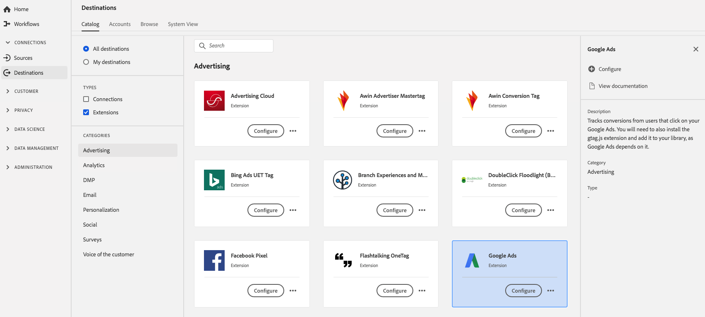

# [!DNL Google Ads]-Erweiterung 

## Übersicht {#overview}

Diese Erweiterung verfolgt Konversionen von Benutzern, die auf Ihre [!DNL Google Ads]. Sie müssen auch die gtag.js-Erweiterung installieren und sie Ihrer Bibliothek hinzufügen, wie [!DNL Google Ads] hängt davon ab.

[!DNL Google Ads] ist eine Werbeerweiterung in Adobe Experience Platform. Weitere Informationen zur Funktionalität der Erweiterung finden Sie auf der Seite der Erweiterung auf [Adobe Exchange](https://www.adobeexchange.com/experiencecloud.details.101383.google-ads.html).

Dieses Ziel ist eine Tag-Erweiterung. Weitere Informationen zur Funktionsweise von Tag-Erweiterungen in Platform finden Sie unter [Tag-Erweiterungen - Übersicht](../launch-extensions/overview.md).

## Voraussetzungen  {#prerequisites}

Diese Erweiterung ist im Zielkatalog für alle Kunden verfügbar, die Platform erworben haben.

Um diese Erweiterung verwenden zu können, benötigen Sie Zugriff auf Tags in Adobe Experience Platform. Tags werden Adobe Experience Cloud-Kunden als integrierte Mehrwertfunktion angeboten. Wenden Sie sich an Ihren Organisationsadministrator, um Zugriff auf Tags zu erhalten, und bitten Sie ihn, Ihnen die **[!UICONTROL manage_properties]** -Berechtigung, damit Sie Erweiterungen installieren können.

## Installieren einer Erweiterung {#install-extension}

So installieren Sie die [!DNL Google Ads] Erweiterung:

Im [Plattform-Benutzeroberfläche](https://platform.adobe.com/), gehen Sie zu **[!UICONTROL Ziele]** > **[!UICONTROL Katalog]**.

Wählen Sie die Erweiterung aus dem Katalog aus oder verwenden Sie die Suchleiste.

Klicken Sie auf das Ziel, um es zu markieren, und wählen Sie dann **[!UICONTROL Konfigurieren]** in der rechten Leiste. Wenn die Variable **[!UICONTROL Konfigurieren]** Kontrolle ausgegraut ist, fehlt die **[!UICONTROL manage_properties]** Berechtigung. Siehe [Voraussetzungen](#prerequisites).

Wählen Sie die Eigenschaft aus, in der Sie die Erweiterung installieren möchten. Sie können auch eine neue Eigenschaft erstellen. Eine Eigenschaft ist eine Sammlung von Regeln, Datenelementen, konfigurierten Erweiterungen, Umgebungen und Bibliotheken. Informationen zu den Eigenschaften in [Eigenschaftenseitenabschnitt](../../../tags/ui/administration/companies-and-properties.md#properties-page) in der Tag-Dokumentation.

Der Workflow führt Sie durch die Schritte zum Abschluss der Installation.

Informationen zu den Konfigurationsoptionen und zur Installationsunterstützung von Erweiterungen finden Sie auf der [Google Ads-Seite in Adobe Exchange](https://www.adobeexchange.com/experiencecloud.details.101383.google-ads.html).

Sie können die Erweiterung auch direkt im [Datenerfassungs-Benutzeroberfläche](https://experience.adobe.com/#/data-collection/). Weitere Informationen finden Sie im Abschnitt zu [Hinzufügen einer neuen Erweiterung](../../../tags/ui/managing-resources/extensions/overview.md#add-a-new-extension) in der Tag-Dokumentation.

## Verwenden der Erweiterung {#how-to-use}

Nachdem Sie die Erweiterung installiert haben, können Sie mit der Einrichtung von Regeln beginnen.

Sie können Regeln für Ihre installierten Erweiterungen einrichten, damit nur in bestimmten Situationen Ereignisdaten an das Erweiterungsziel gesendet werden. Weitere Informationen zum Einrichten von Regeln für Ihre Erweiterungen finden Sie unter [Tag-Dokumentation](../../../tags/ui/managing-resources/rules.md).

## Konfigurieren, Aktualisieren und Löschen von Erweiterungen {#configure-upgrade-delete}

Sie können Erweiterungen in der Datenerfassungs-Benutzeroberfläche konfigurieren, aktualisieren und löschen.

>[!TIP]
>
>Wenn die Erweiterung bereits in einer Ihrer Eigenschaften installiert ist, wird die Platform-Benutzeroberfläche weiterhin angezeigt **[!UICONTROL Installieren]** für die Erweiterung. Starten Sie den Installations-Workflow wie unter [Installieren der Erweiterung](#install-extension) , um Ihre Erweiterung zu konfigurieren oder zu löschen.

Informationen zum Aktualisieren Ihrer Erweiterung finden Sie im Handbuch im [Erweiterungs-Upgrade-Prozess](../../../tags/ui/managing-resources/extensions/extension-upgrade.md) in der Tag-Dokumentation.
