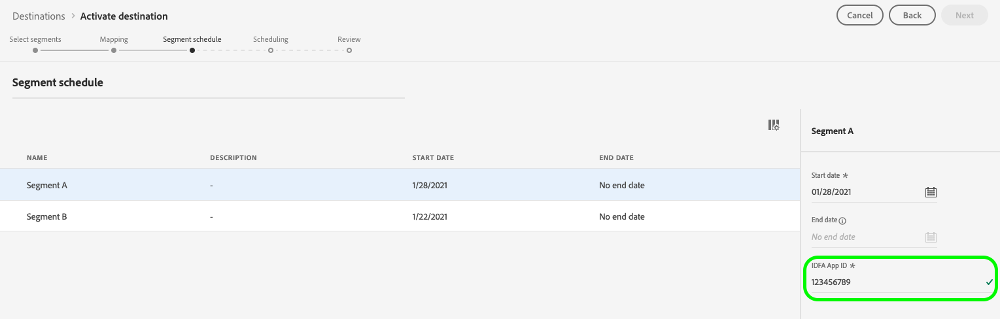
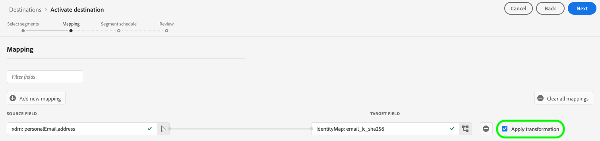

# [!DNL Google Customer Match]-Verbindung

>[!IMPORTANT]
>
> Google veröffentlicht Änderungen an der [Google Ads API](https://developers.google.com/google-ads/api/docs/start), [Kundenabgleich](https://ads-developers.googleblog.com/2023/10/updates-to-customer-match-conversion.html)und die [Display &amp; Video 360-API](https://developers.google.com/display-video/api/guides/getting-started/overview) um die Erfüllung und die Zustimmungsanforderungen zu unterstützen, die im Rahmen der [Digital Markets Act](https://digital-markets-act.ec.europa.eu/index_en) (DMA) in der Europäischen Union ([EU-Richtlinie zur Benutzereinwilligung](https://www.google.com/about/company/user-consent-policy/)). Die Durchsetzung dieser Änderungen an den Zustimmungsanforderungen ist ab 6. März 2024 verfügbar.
> 
>Um die EU-Politik zur Einwilligung von Nutzern einzuhalten und im Europäischen Wirtschaftsraum (EWR) weiterhin Zielgruppenlisten für Benutzer zu erstellen, müssen Werbetreibende und Partner sicherstellen, dass sie beim Hochladen von Zielgruppendaten die Einwilligung der Endnutzer weitergeben. Als Google-Partner bietet Ihnen Adobe die nötigen Tools, um diese Zustimmungsanforderungen gemäß DMA in der Europäischen Union zu erfüllen.
> 
>Kunden, die Adobe Privacy &amp; Security Shield erworben und eine [Einverständnisrichtlinie](../../../data-governance/enforcement/auto-enforcement.md#consent-policy-evaluation) zum Herausfiltern von Profilen ohne Zustimmung müssen keine Maßnahmen ergriffen werden.
> 
>Kunden, die keine Adobe Privacy &amp; Security Shield erworben haben, müssen die [Segmentdefinition](../../../segmentation/home.md#segment-definitions) Funktionen in [Segment Builder](../../../segmentation/ui/segment-builder.md) , um Profile ohne Zustimmung herauszufiltern, damit die bestehenden Real-Time CDP Google-Ziele ohne Unterbrechung weiterhin verwendet werden.

[[!DNL Google Customer Match]](https://support.google.com/google-ads/answer/6379332?hl=en) ermöglicht Ihnen die Verwendung Ihrer Online- und Offline-Daten, um Ihre Kunden über die eigenen und betriebenen Eigenschaften von Google zu erreichen und erneut mit ihnen zu interagieren, z. B.: [!DNL Search], [!DNL Shopping], [!DNL Gmail], und [!DNL YouTube].

## Anwendungsfälle {#use-cases}

So können Sie besser verstehen, wie und wann die Variable [!DNL Google Customer Match] Ziel, hier finden Sie Beispielanwendungsfälle, die Adobe Experience Platform-Kunden mit dieser Funktion lösen können.

### Anwendungsfall 1

Eine Sportbekleidungsmarke möchte bestehende Kunden über erreichen [!DNL Google Search] und [!DNL Google Shopping] , um Angebote und Artikel basierend auf ihren bisherigen Käufen und dem Browser-Verlauf zu personalisieren. Die Bekleidungsmarke kann E-Mail-Adressen aus ihrem eigenen CRM-System auf Experience Platform erfassen und Zielgruppen aus eigenen Offline-Daten erstellen. Anschließend können sie diese Zielgruppen an [!DNL Google Customer Match] verwendet werden, um [!DNL Search] und [!DNL Shopping], wodurch ihre Werbeausgaben optimiert werden.

### Anwendungsfall 2

Ein renommiertes Technologieunternehmen startete ein neues Telefon. Um dieses neue Telefonmodell zu bewerben, möchten sie Kunden, die Inhaber früherer Modelle ihrer Telefone sind, für die neuen Funktionen des Telefons sensibilisieren.

Um die Veröffentlichung zu bewerben, laden sie E-Mail-Adressen aus ihrer CRM-Datenbank unter Verwendung der E-Mail-Adressen als Kennungen in Experience Platform hoch. Zielgruppen werden basierend auf Kunden erstellt, die Inhaber älterer Telefonmodelle sind. Anschließend werden Zielgruppen an gesendet [!DNL Google Customer Match], damit das Unternehmen aktuelle Kunden, Kunden, die Inhaber älterer Telefonmodelle sind, und ähnliche Kunden in ansprechen kann [!DNL YouTube].

## Data Governance für [!DNL Google Customer Match] Ziele {#data-governance}

Einige Ziele in Experience Platform haben bestimmte Regeln und Pflichten für Daten, die an die Zielplattform gesendet oder von ihr empfangen werden. Sie sind dafür verantwortlich, die Einschränkungen und Pflichten Ihrer Daten zu verstehen und zu verstehen, wie Sie diese Daten in Adobe Experience Platform und der Zielplattform verwenden. Adobe Experience Platform bietet Data Governance-Tools, mit denen Sie einige dieser Datennutzungsverpflichtungen verwalten können. [Weitere Infos](../../../data-governance/labels/overview.md) über Data Governance-Tools und -Richtlinien.

## Unterstützte Identitäten {#supported-identities}

[!DNL Google Customer Match] unterstützt die Aktivierung der in der folgenden Tabelle beschriebenen Identitäten. Erhalten Sie weitere Informationen zu [Identitäten](/help/identity-service/features/namespaces.md).

| Ziel-Identität | Beschreibung | Zu beachten |
|---|---|---|
| GAID | Google Advertising ID | Wählen Sie diese Zielidentität aus, wenn Ihre Quellidentität ein GAID-Namespace ist. |
| IDFA | Apple ID für Advertiser | Wählen Sie diese Zielidentität aus, wenn Ihre Quellidentität ein IDFA-Namespace ist. |
| phone_sha256_e.164 | Telefonnummern im E164-Format, gehasht mit dem SHA256-Algorithmus | Es werden sowohl einfache als auch SHA256-Hash-Telefonnummern von Adobe Experience Platform unterstützt. Befolgen Sie die Anweisungen im Abschnitt [Anforderungen an die ID-Übereinstimmung](#id-matching-requirements-id-matching-requirements) und verwenden Sie die entsprechenden Namespaces für Klartext- bzw. Hash-Telefonnummern. Wenn Ihr Quellfeld ungehashte Attribute enthält, überprüfen Sie die Option **[!UICONTROL Umwandlung anwenden]**, damit [!DNL Platform] die Daten bei Aktivierung automatisch hasht. |
| email_lc_sha256 | E-Mail-Adressen, die mit dem SHA-256-Algorithmus gehasht wurden | Es werden sowohl Nur-Text- als auch SHA256-Hash-E-Mail-Adressen von Adobe Experience Platform unterstützt. Befolgen Sie die Anweisungen im Abschnitt [Anforderungen an die ID-Übereinstimmung](#id-matching-requirements-id-matching-requirements) und verwenden Sie die entsprechenden Namespaces für Nur-Text- bzw. Hash-E-Mail-Adressen. Wenn Ihr Quellfeld ungehashte Attribute enthält, überprüfen Sie die Option **[!UICONTROL Umwandlung anwenden]**, damit [!DNL Platform] die Daten bei Aktivierung automatisch hasht. |
| user_id | Benutzerdefinierte Benutzer-IDs | Wählen Sie diese Zielidentität aus, wenn Ihre Quellidentität ein benutzerdefinierter Namespace ist. |

{style="table-layout:auto"}

## Unterstützte Zielgruppen {#supported-audiences}

In diesem Abschnitt wird beschrieben, welche Zielgruppentypen Sie an dieses Ziel exportieren können.

| Audience Origin | Unterstützt | Beschreibung |
---------|----------|----------|
| [!DNL Segmentation Service] | ✓ | Über die Experience Platform generierte Zielgruppen [Segmentierungsdienst](../../../segmentation/home.md). |
| Benutzerdefinierte Uploads | ✓ | Zielgruppen, die aus CSV-Dateien in Experience Platform [importiert](../../../segmentation/ui/overview.md#import-audience) werden. |

{style="table-layout:auto"}

## Exporttyp und -häufigkeit {#export-type-frequency}

Beziehen Sie sich auf die folgende Tabelle, um Informationen zu Typ und Häufigkeit des Zielexports zu erhalten.

| Element | Typ | Anmerkungen |
---------|----------|---------|
| Exporttyp | **[!UICONTROL Zielgruppenexport]** | Sie exportieren alle Mitglieder einer Zielgruppe mit den IDs (Name, Telefonnummer und andere), die im [!DNL Google Customer Match] Ziel. |
| Exporthäufigkeit | **[!UICONTROL Streaming]** | Streaming-Ziele sind „immer verfügbare“ API-basierte Verbindungen. Sobald ein Profil in Experience Platform auf der Grundlage einer Zielgruppenauswertung aktualisiert wird, sendet der Connector das Update nachgelagert an die Zielplattform. Lesen Sie mehr über [Streaming-Ziele](/help/destinations/destination-types.md#streaming-destinations). |

{style="table-layout:auto"}

## [!DNL Google Customer Match] Kontovoraussetzungen {#google-account-prerequisites}

Vor der Einrichtung einer [!DNL Google Customer Match] Ziel in Experience Platform lesen und beachten Sie die Google-Richtlinie zur Verwendung von [!DNL Customer Match], die im Abschnitt [Dokumentation zur Google-Unterstützung](https://support.google.com/google-ads/answer/6299717).

Stellen Sie als Nächstes sicher, dass Ihre [!DNL Google] -Konto für eine [!DNL Standard] oder einer höheren Berechtigungsebene. Siehe [Dokumentation zu Google Ads](https://support.google.com/google-ads/answer/9978556?visit_id=637611563637058259-4176462731&amp;rd=1) für Details.

### Zulassungsliste {#allowlist}

Vor der Erstellung [!DNL Google Customer Match] Ziel in Experience Platform, stellen Sie sicher, dass Ihre [!DNL Google Ads] das Konto erfüllt die [[!DNL Google Customer Match] policy](https://support.google.com/google-ads/answer/6299717/customer-match-policy).

Kunden mit kompatiblen Konten werden automatisch von Google auf die Zulassungsliste gesetzt.

## Anforderungen an die ID-Übereinstimmung {#id-matching-requirements}

[!DNL Google] erfordert, dass keine personenbezogenen Daten (PII) klar übermittelt werden. Daher werden die Zielgruppen für [!DNL Google Customer Match] kann deaktiviert werden *Hash* Kennungen wie E-Mail-Adressen oder Telefonnummern.

Abhängig vom Typ der IDs, die Sie in Adobe Experience Platform erfassen, müssen Sie die entsprechenden Anforderungen erfüllen.

### Hash-Anforderungen für Telefonnummern {#phone-number-hashing-requirements}

Es gibt zwei Methoden zum Aktivieren von Telefonnummern in [!DNL Google Customer Match]:

* **Rohe Telefonnummern erfassen**: Sie können rohe Telefonnummern in der [!DNL E.164] in [!DNL Platform]und sie werden bei Aktivierung automatisch gehasht. Wenn Sie diese Option wählen, achten Sie darauf, Ihre rohen Telefonnummern immer in die `Phone_E.164` Namespace.
* **Hash-Telefonnummern erfassen**: Sie können Ihre Telefonnummern vor der Erfassung in [!DNL Platform]. Wenn Sie diese Option wählen, achten Sie darauf, Ihre Hash-Telefonnummern immer in die `PHONE_SHA256_E.164` Namespace.

>[!NOTE]
>
>Telefonnummern, die in die `Phone` Namespace kann nicht in aktiviert werden [!DNL Google Customer Match].

### Anforderungen an das E-Mail-Hashing {#hashing-requirements}

Sie können E-Mail-Adressen vor der Aufnahme in Adobe Experience Platform hash-Adressen oder eindeutige E-Mail-Adressen in Experience Platform verwenden und [!DNL Platform] Hash sie bei Aktivierung.

Weitere Informationen zu den Hash-Anforderungen von Google und anderen Aktivierungsbeschränkungen finden Sie in den folgenden Abschnitten der Google-Dokumentation:

* [[!DNL Customer Match] mit E-Mail-Adresse, -Adresse oder Benutzer-ID](https://developers.google.com/google-ads/api/docs/remarketing/audience-types/customer-match#customer_match_with_email_address_address_or_user_id)
* [[!DNL Customer Match] considerations](https://developers.google.com/google-ads/api/docs/remarketing/audience-types/customer-match#customer_match_considerations)
* [[!DNL Customer Match] mit Telefonnummer](https://developers.google.com/google-ads/api/docs/remarketing/audience-types/customer-match#customer_match_with_phone_number)
* [[!DNL Customer Match] mit Mobilgeräte-IDs](https://developers.google.com/google-ads/api/docs/remarketing/audience-types/customer-match#customer_match_with_mobile_device_ids)

Informationen zur Aufnahme von E-Mail-Adressen in Experience Platform finden Sie in der [Batch-Erfassung - Übersicht](../../../ingestion/batch-ingestion/overview.md) und [Streaming-Erfassung - Übersicht](../../../ingestion/streaming-ingestion/overview.md).

Wenn Sie sich dafür entscheiden, die E-Mail-Adressen selbst zu hash, stellen Sie sicher, dass Sie die Anforderungen von Google erfüllen, wie in den obigen Links beschrieben.

### Verwenden benutzerdefinierter Namespaces {#custom-namespaces}

Bevor Sie die `User_ID` Namespace zum Senden von Daten an Google verwenden, stellen Sie sicher, dass Sie Ihre eigenen Kennungen mit [!DNL gTag]. Siehe Abschnitt [Offizielle Dokumentation zu Google](https://support.google.com/google-ads/answer/9199250) für detaillierte Informationen.

<!-- Data from unhashed namespaces is automatically hashed by [!DNL Platform] upon activation.

Attribute source data is not automatically hashed. When your source field contains unhashed attributes, check the **[!UICONTROL Apply transformation]** option, to have [!DNL Platform] automatically hash the data on activation.
 -->

<!-- ## Configure destination - video walkthrough {#video}

The video below demonstrates the steps to configure a [!DNL Google Customer Match] destination and activate audiences. The steps are also laid out sequentially in the next sections.

>[!VIDEO](https://video.tv.adobe.com/v/332599/?quality=12&learn=on&captions=eng) -->

## Videoüberblick {#video-overview}

Sehen Sie sich das folgende Video an, um eine Erläuterung der Vorteile und wie Sie Daten für die Google-Kundenabstimmung aktivieren.

>[!VIDEO](https://video.tv.adobe.com/v/38180/)

## Herstellen einer Verbindung mit dem Ziel {#connect}

>[!IMPORTANT]
> 
>Um eine Verbindung zum Ziel herzustellen, benötigen Sie die **[!UICONTROL Ziele anzeigen]** und **[!UICONTROL Ziele verwalten]** [Zugriffssteuerungsberechtigungen](/help/access-control/home.md#permissions). Lesen Sie die [Übersicht über die Zugriffskontrolle](/help/access-control/ui/overview.md) oder wenden Sie sich an Ihren Produktadministrator, um die erforderlichen Berechtigungen zu erhalten.

Um eine Verbindung mit diesem Ziel herzustellen, gehen Sie wie im Abschnitt [Tutorial zur Zielkonfiguration](../../ui/connect-destination.md) beschrieben vor.

### Verbindungsparameter {#parameters}

Beim [Einrichten](../../ui/connect-destination.md) dieses Ziels müssen Sie die folgenden Informationen angeben:

* **[!UICONTROL Name]**: Geben Sie einen Namen für diese Zielverbindung an.
* **[!UICONTROL Beschreibung]**: Geben Sie eine Beschreibung für diese Zielverbindung ein.
* **[!UICONTROL Konto-ID]**: your [Google Ads-Kunden-ID](https://support.google.com/google-ads/answer/1704344?hl=en). Das Format der ID ist xxx-xxx-xxxx. Wenn Sie die [!DNL Google Ads Manager Account (My Client Center)]verwenden Sie nicht Ihre Manager-Konto-ID. Verwenden Sie die [Google Ads-Kunden-ID](https://support.google.com/google-ads/answer/1704344?hl=en) anstatt.

>[!IMPORTANT]
>
> * Die **[!UICONTROL Kombinieren mit PII]** Marketing-Aktion ist standardmäßig für die [!DNL Google Customer Match] Ziel und kann nicht entfernt werden.

### Aktivieren von Warnhinweisen {#enable-alerts}

Sie können Warnhinweise aktivieren, um Benachrichtigungen zum Status des Datenflusses zu Ihrem Ziel zu erhalten. Wählen Sie einen Warnhinweis aus der zu abonnierenden Liste aus, um Benachrichtigungen über den Status Ihres Datenflusses zu erhalten. Weitere Informationen zu Warnhinweisen finden Sie im Handbuch zum [Abonnieren von Zielwarnhinweisen über die Benutzeroberfläche](../../ui/alerts.md).

Wenn Sie alle Details für Ihre Zielverbindung eingegeben haben, klicken Sie auf **[!UICONTROL Weiter]**.

## Aktivieren von Zielgruppen für dieses Ziel {#activate}

>[!IMPORTANT]
> 
>* Um Daten zu aktivieren, benötigen Sie die **[!UICONTROL Ziele anzeigen]**, **[!UICONTROL Ziele aktivieren]**, **[!UICONTROL Anzeigen von Profilen]**, und **[!UICONTROL Segmente anzeigen]** [Zugriffssteuerungsberechtigungen](/help/access-control/home.md#permissions). Lesen Sie die [Übersicht über die Zugriffssteuerung](/help/access-control/ui/overview.md) oder wenden Sie sich an Ihre Produktadmins, um die erforderlichen Berechtigungen zu erhalten.
>* Export *identities* zu Zielen hinzufügen, benötigen Sie die **[!UICONTROL Identitätsdiagramm anzeigen]** [Zugriffsberechtigung](/help/access-control/home.md#permissions).   {width="100" zoomable="yes"}

Anweisungen zum Aktivieren von Zielgruppen für dieses Ziel finden Sie unter [Aktivieren von Zielgruppendaten für Streaming-Zielgruppen-Exportziele](../../ui/activate-segment-streaming-destinations.md).

Im **[!UICONTROL Segmentplan]** Schritt, müssen Sie [!UICONTROL App-ID] beim Senden [!DNL IDFA] oder [!DNL GAID] Zielgruppen zu [!DNL Google Customer Match].

Weitere Informationen zum Auffinden der [!DNL App ID], siehe [Offizielle Dokumentation zu Google](https://developers.google.com/adwords/api/docs/reference/v201809/AdwordsUserListService.CrmBasedUserList#appid) oder fragen Sie Ihren Google-Support-Mitarbeiter.

### Zuordnungsbeispiel: Aktivieren von Zielgruppendaten in [!DNL Google Customer Match] {#example-gcm}

Dies ist ein Beispiel für die korrekte Identitätszuordnung bei der Aktivierung von Zielgruppendaten in [!DNL Google Customer Match].

Quellfelder auswählen:

* Wählen Sie die `Email` Namespace als Quellidentität verwenden, wenn die von Ihnen verwendeten E-Mail-Adressen nicht gehasht sind.
* Wählen Sie die `Email_LC_SHA256` Namespace als Quellidentität verwenden, wenn Sie bei der Datenerfassung in einen Hash-Wert für E-Mail-Adressen von Kunden [!DNL Platform], gemäß [!DNL Google Customer Match] [Anforderungen an das E-Mail-Hashing](#hashing-requirements).
* Wählen Sie die `PHONE_E.164` Namespace als Quellkennung verwenden, wenn Ihre Daten aus nicht gehashten Telefonnummern bestehen. [!DNL Platform] Hash die Telefonnummern, um die [!DNL Google Customer Match] Anforderungen.
* Wählen Sie die `Phone_SHA256_E.164` Namespace als Quellidentität, wenn Sie bei der Datenerfassung in [!DNL Platform], gemäß [!DNL Facebook] [Hash-Anforderungen für Telefonnummern](#phone-number-hashing-requirements).
* Wählen Sie die `IDFA` Namespace als Quellidentität, wenn Ihre Daten aus [!DNL Apple] Geräte-IDs.
* Wählen Sie die `GAID` Namespace als Quellidentität, wenn Ihre Daten aus [!DNL Android] Geräte-IDs.
* Wählen Sie die `Custom` Namespace als Quellidentität verwenden, wenn Ihre Daten aus einem anderen Kennungstyp bestehen.

Zielgruppenfelder auswählen:

* Wählen Sie die `Email_LC_SHA256` Namespace als Zielidentität verwenden, wenn Ihre Quell-Namespaces `Email` oder `Email_LC_SHA256`.
* Wählen Sie die `Phone_SHA256_E.164` Namespace als Zielidentität verwenden, wenn Ihre Quell-Namespaces `PHONE_E.164` oder `Phone_SHA256_E.164`.
* Wählen Sie die `IDFA` oder `GAID` Namespaces als Zielidentität verwenden, wenn Ihre Quell-Namespaces `IDFA` oder `GAID`.
* Wählen Sie die `User_ID` Namespace als Zielidentität verwenden, wenn es sich bei Ihrem Quell-Namespace um einen benutzerdefinierten Namespace handelt.

Daten aus nicht gehashten Namespaces werden automatisch von [!DNL Platform] bei Aktivierung.

Attributquellendaten werden nicht automatisch gehasht. Wenn Ihr Quellfeld ungehashte Attribute enthält, überprüfen Sie die Option **[!UICONTROL Umwandlung anwenden]**, damit [!DNL Platform] die Daten bei Aktivierung automatisch hasht.

## Überprüfen, ob die Zielgruppenaktivierung erfolgreich war {#verify-activation}

Wechseln Sie nach Abschluss des Aktivierungsvorgangs zu Ihrer **[!UICONTROL Google Ads]** -Konto. Die aktivierten Zielgruppen werden in Ihrem Google-Konto als Kundenlisten angezeigt. Abhängig von der Größe Ihrer Zielgruppe füllen sich einige Zielgruppen nur aus, wenn mehr als 100 aktive Benutzer zur Verfügung stehen.

Beim Zuordnen einer Zielgruppe zu [!DNL IDFA] und [!DNL GAID] mobile IDs, [!DNL Google Customer Match] erstellt für jede ID-Zuordnung eine separate Zielgruppe. Ihre [!DNL Google Ads] zeigt zwei verschiedene Segmente an: eines für die [!DNL IDFA]und einer für die [!DNL GAID] Mapping.

## Fehlerbehebung {#troubleshooting}

### Fehlermeldung „400 Fehlerhafte Anfrage“ {#bad-request}

Beim Konfigurieren dieses Ziels wird möglicherweise der folgende Fehler angezeigt:

`{"message":"Google Customer Match Error: OperationAccessDenied.ACTION_NOT_PERMITTED","code":"400 BAD_REQUEST"}`

Dieser Fehler tritt auf, wenn Kundenkonten die Variable [Voraussetzungen](#google-account-prerequisites). Wenden Sie sich zur Behebung dieses Problems an Google und stellen Sie sicher, dass Ihr Konto auf der Zulassungsliste steht und für eine [!DNL Standard] oder einer höheren Berechtigungsebene. Siehe [Dokumentation zu Google Ads](https://support.google.com/google-ads/answer/9978556?visit_id=637611563637058259-4176462731&amp;rd=1) für Details.