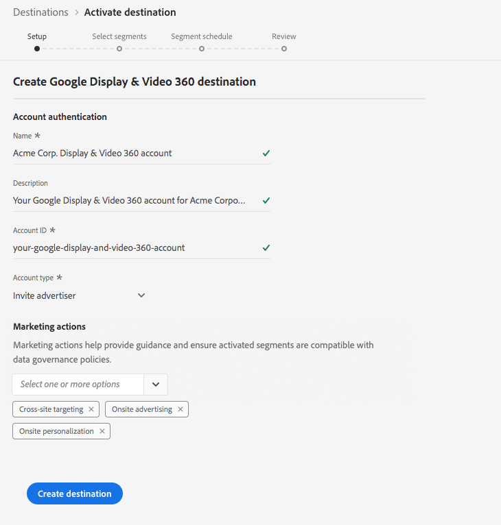

# [!DNL Google Display & Video 360] connection

## Übersicht {#overview}

[!DNL Display & Video 360], früher als bekannt, ist ein Tool zum Ausführen von digitalen Kampagnen für Retargeting und Zielgruppen-Targeting für Inventarquellen für Display, Video und Mobile.[!DNL DoubleClick Bid Manager]

## Zielspezifikationen {#specifics}

Beachten Sie die folgenden Details, die für [!DNL Google Display & Video 360]-Ziele spezifisch sind:

* Aktivierte Zielgruppen werden in der Google-Plattform programmgesteuert erstellt.
* Die Plattform enthält derzeit keine Messungsmetrik zur Validierung einer erfolgreichen Aktivierung. Konsultieren Sie die Zielgruppenzahlen in Google, um die Integration zu validieren und die Zielgruppengröße zu verstehen.

>[!IMPORTANT]
>
>Wenn Sie Ihr erstes Ziel mit Google Display &amp; Video 360 erstellen möchten und die [ID-Synchronisierungsfunktion](https://experienceleague.adobe.com/docs/id-service/using/id-service-api/methods/idsync.html) in Experience Cloud ID Service in der Vergangenheit nicht aktiviert hatten (mit Adobe Audience Manager oder anderen Anwendungen), wenden Sie sich an Adobe Consulting oder die Kundenunterstützung, um die ID-Synchronisierung zu aktivieren. Wenn Sie zuvor Google-Integrationen in Audience Manager eingerichtet haben, werden die ID-Synchronisierungen, die Sie eingerichtet haben, auf Platform übertragen.

## Unterstützte Identitäten {#supported-identities}

[!DNL Google Ad Manager] unterstützt die Aktivierung der Identitäten, die in der folgenden Tabelle beschrieben sind.

| Zielgruppe | Beschreibung | Zu beachten |
|---|---|---|
| GAID | [!DNL Google Advertising ID] | Wählen Sie diese Zielgruppen-ID aus, wenn Ihre Quellidentität ein GAID-Namensraum ist. |
| IDFA | [!DNL Apple ID for Advertisers] | Wählen Sie diese Zielgruppen-ID aus, wenn Ihre Quellidentität ein IDFA-Namensraum ist. |
| AAM UUUID | [Adobe Audience Manager [!DNL Unique User ID]](https://experienceleague.adobe.com/docs/audience-manager/user-guide/reference/ids-in-aam.html), auch bekannt als  [!DNL Device ID]. Eine numerische, 38-stellige Geräte-ID, die der Audience Manager jedem Gerät zuordnet, mit dem er interagiert. | Google verwendet [AAM UUID](https://experienceleague.adobe.com/docs/audience-manager/user-guide/reference/ids-in-aam.html?lang=en) für Zielgruppen in Kalifornien und die Google Cookie-ID für alle anderen Benutzer. |
| [!DNL Google] Cookie-ID | [!DNL Google] Cookie-ID | [!DNL Google] verwendet diese ID zur Zielgruppe von Benutzern außerhalb von Kalifornien. |
| RIDA | Roku-ID für Werbung. Diese ID identifiziert Roku-Geräte eindeutig. |  |
| MAID | Microsoft Advertising ID. Diese ID identifiziert Geräte mit Windows 10 eindeutig. |  |
| Amazon Fire TV ID | Diese ID identifiziert Amazon Fire TVs eindeutig. |  |

## Exporttyp {#export-type}

**Segmentexport** : Sie exportieren alle Segmentmitglieder (Audience) in das Google-Ziel.

## Voraussetzungen

### Zulassungsliste

>[!NOTE]
>
>Die Zulassungsliste ist obligatorisch, bevor Sie Ihr erstes [!DNL Google Display & Video 360]-Ziel in Platform einrichten. Vergewissern Sie sich bitte, dass der unten beschriebene Vorgang der Zulassungsliste von Google abgeschlossen wurde, bevor Sie ein Ziel erstellen.

Bevor Sie das [!DNL Google Display & Video 360]-Ziel in Platform erstellen, müssen Sie sich an Google wenden und um Adobe bitten, die Liste der zulässigen Datenanbieter aufzunehmen und Ihr Konto der Zulassungsliste hinzuzufügen. Kontaktieren Sie Google und machen Sie folgende Angaben:

* **Kontokennung**: Dies ist die Adobe-Kontokennung bei Google. Wenden Sie sich an die Kundenunterstützung von Adobe oder Ihren Adobe-Support-Mitarbeiter, um diese Kennung zu erhalten.
* **Kundenkennung**: Dies ist die Adobe-Kundenkontokennung bei Google. Wenden Sie sich an die Kundenunterstützung von Adobe oder Ihren Adobe-Support-Mitarbeiter, um diese Kennung zu erhalten.
* **Ihr Kontotyp**: Verwenden Sie **[!DNL Invite advertiser]**, um die Freigabe von Zielgruppen nur für eine bestimmte Marke in Ihrem Display &amp; Video 360-Konto zu ermöglichen, oder verwenden Sie **[!DNL Invite partner]**, um die Freigabe von Zielgruppen für alle Marken in Ihrem Display &amp; Video 360-Konto zu ermöglichen.

## Ziel konfigurieren

Wählen Sie unter **[!UICONTROL Verbindungen]** > **[!UICONTROL Ziele]** [!DNL Google Display & Video 360] aus und wählen Sie **[!UICONTROL Konfigurieren]**.

>[!NOTE]
>
>Wenn bereits eine Verbindung zu diesem Ziel besteht, wird auf der Zielkarte die Schaltfläche **[!UICONTROL Aktivieren]** angezeigt. Weitere Informationen zum Unterschied zwischen [!UICONTROL Aktivieren] und [!UICONTROL Konfigurieren] finden Sie im Abschnitt [Katalog](../../ui/destinations-workspace.md#catalog) der Dokumentation zum Zielarbeitsbereich.

Füllen Sie im Schritt **Setup** des Arbeitsablaufs zum Erstellen des Ziels die Felder [!UICONTROL Grundlegende Informationen] für das Ziel sowie die Marketingaktionen aus, die für dieses Ziel gelten sollen.

* **[!UICONTROL Name]**: Geben Sie einen bevorzugten Namen für das Ziel ein.
* **[!UICONTROL Beschreibung]**: Optional. Hier können Sie beispielsweise erwähnen, für welche Kampagne Sie dieses Ziel verwenden.
* **[!UICONTROL Kontotyp]**: Wählen Sie je nach Konto bei Google eine Option aus:
   * Verwenden Sie `Invite Advertiser`, um die Freigabe von Zielgruppen nur für eine bestimmte Marke in Ihrem Display &amp; Video 360-Konto zu ermöglichen.
   * Verwenden Sie `Invite Partner`, um die Freigabe von Zielgruppen für alle Marken in Ihrem Display &amp; Video 360-Konto zu ermöglichen.
* **[!UICONTROL Kontokennung]**: Geben Sie Ihre **[!DNL Invite partner]**- oder **[!DNL Invite advertiser]**-Kontokennung bei Google ein. In der Regel ist dies eine sechsstellige oder siebenstellige ID.
* **[!UICONTROL Marketingaktion]**: Marketingaktionen geben die Absicht an, für die Daten an das Ziel exportiert werden. Sie können aus von der Adobe definierten Marketingaktionen auswählen oder eine eigene Marketingaktion erstellen. Weitere Informationen zu Marketingaktionen finden Sie unter [Übersicht über Datenverwendungsrichtlinien](../../../data-governance/policies/overview.md).

>[!NOTE]
>
>Wenn Sie ein [!DNL Google Display & Video 360]-Ziel einrichten, wenden Sie sich an Ihren [!DNL Google Account Manager]- oder Kundenbetreuer, um zu verstehen, welchen Kontotyp Sie haben.

## Aktivieren von Segmenten nach [!DNL Google Display & Video 360]

Anweisungen zum Aktivieren von Segmenten in [!DNL Google Display & Video 360] finden Sie unter [Daten in Ziele aktivieren](../../ui/activate-destinations.md).

## Exportierte Daten

Um zu überprüfen, ob Daten erfolgreich in das [!DNL Google Display & Video 360]-Ziel exportiert wurden, überprüfen Sie Ihr [!DNL Google Display & Video 360]-Konto. Wenn die Aktivierung erfolgreich war, werden Audiencen in Ihrem Konto ausgefüllt.