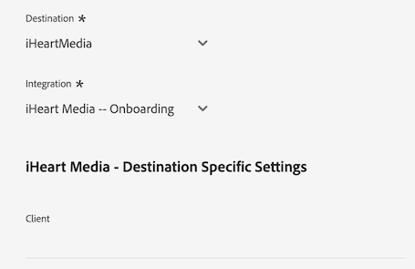
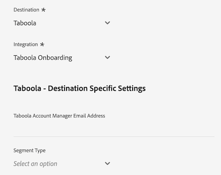

# [!DNL LiveRamp - Distribution]-Verbindung

Die [!DNL LiveRamp - Distribution] -Verbindung ermöglicht es Ihnen, Zielgruppen von Experience Platform zu Premium-Herausgebern über mobile, Web-, Display- und vernetzte TV-Medien zu aktivieren.

>[!IMPORTANT]
>
>Diese Ziel-Connector- und Dokumentationsseite werden von LiveRamp erstellt und gepflegt. Bei Anfragen oder Aktualisierungsanfragen kontaktieren Sie LiveRamp direkt [hier](mailto:adobertcdp@liveramp.com).

## Unterstützte Ziele {#supported-destinations}

[!DNL LiveRamp - Distribution] unterstützt derzeit die Aktivierung der Zielgruppe für die folgenden Plattformen:

* [[!DNL 4C Insights]](#insights)
* [[!DNL Acast]](#acast)
* [[!DNL Nexxen]](#nexxen)
* [[!DNL Ampersand.tv]](#ampersand-tv)
* [[!DNL Captify]](#captify)
* [[!DNL Cardlytics]](#cardlytics)
* [[!DNL Disney (Hulu/ESPN/ABC)]](#disney)
* [[!DNL iHeartMedia]](#iheartmedia)
* [[!DNL Index Exchange]](#index-exchange)
* [[!DNL Magnite CTV Platform]](#magnite)
* [[!DNL Magnite DV+ (Rubicon Project)]](#magnite-dv)
* [[!DNL One Fox]](#fox)
* [[!DNL Pandora]](#pandora)
* [[!DNL Reddit]](#reddit)
* [[!DNL Roku]](#roku)
* [[!DNL Spotify]](#spotify)
* [[!DNL Taboola]](#taboola)
* [[!DNL TargetSpot]](#targetspot)
* [[!DNL Teads]](#teads)
* [[!DNL WB Discovery]](#wb-discovery)

## Anwendungsfälle {#use-cases}

Damit Sie besser verstehen können, wie und wann Sie das [!DNL LiveRamp - Distribution]-Ziel verwenden sollten, finden Sie hier ein Anwendungsbeispiel, das für Kundinnen und Kunden von Adobe Experience Platform mit diesem Ziel geeignet ist.

Das Marketing-Team eines Sportbekleidungs-Einzelhändlers verwendete die Verbindung [LiveRamp - Onboarding](liveramp-onboarding.md) , um Zielgruppen von Experience Platform an ihr LiveRamp-Konto zu senden.

Durch die [!DNL LiveRamp - Distribution] -Verbindung können sie nun die Aktivierung der integrierten Zielgruppen an die [unterstützten Ziele](#supported-destinations) Trigger haben. Anschließend können Benutzer auf mobilen, offenen Web-, Social- und [!DNL CTV]-Plattformen als Ziel ausgewählt werden.

## Einbinden von Zielgruppen in LiveRamp {#onboarding}

Bevor Sie Zielgruppen über die Verbindung [!DNL LiveRamp - Distribution] aktivieren, verwenden Sie die Verbindung [LiveRamp - Onboarding](liveramp-onboarding.md) , um Ihre Experience Platform-Zielgruppen in LiveRamp zu exportieren.

Nachdem Sie Ihre Zielgruppen in LiveRamp integriert haben, fahren Sie mit dem Aktivierungs-Workflow im Schritt [Verbindung zum Ziel herstellen](#connect) fort, um Ihre Zielplattformen für die Datenaktivierung auszuwählen und zu konfigurieren.

## Herstellen einer Verbindung mit dem Ziel {#connect}

>[!CONTEXTUALHELP]
>id="platform_destinations_liveramp_distribution_identifier_settings"
>title="Identifizierungseinstellungen"
>abstract="Wählen Sie die von Ihrem Ziel unterstützten Kennungen aus. Die vollständige Liste der unterstützten Kennungen für die einzelnen Ziele finden Sie in der Dokumentation."

>[!IMPORTANT]
> 
>Um eine Verbindung zum Ziel herzustellen, benötigen Sie die Zugriffssteuerungsberechtigungen **[!UICONTROL Ziele anzeigen]** und **[!UICONTROL Ziele verwalten]** [. ](/help/access-control/home.md#permissions) Lesen Sie die [Zugriffskontrolle – Übersicht](/help/access-control/ui/overview.md) oder wenden Sie sich an Ihren Produktadministrator, um die erforderlichen Berechtigungen zu erhalten.

Um eine Verbindung mit diesem Ziel herzustellen, gehen Sie wie im [Tutorial zur Zielkonfiguration](../../ui/connect-destination.md) beschrieben vor. Füllen Sie im Workflow zum Konfigurieren des Ziels die Felder aus, die in den beiden folgenden Abschnitten aufgeführt sind.

### Bei LiveRamp authentifizieren {#authenticate}

Um sich beim Ziel zu authentifizieren, füllen Sie die erforderlichen Felder aus und klicken Sie auf **[!UICONTROL Mit Ziel verbinden]**.

* **[!UICONTROL LiveRamp-Organisations-ID]**: Die Organisations-ID Ihres LiveRamp-Kontos (aufgeführt als _owner_org_ in Ihren LiveRamp-bereitgestellten Anmeldeinformationen).
* **[!UICONTROL Kennwort]**: Ihr LiveRamp-Kontokennwort (aufgeführt als _geheimer_Schlüssel_ in Ihren von LiveRamp bereitgestellten Anmeldeinformationen).
* **[!UICONTROL Token-URL]**: Ihre LiveRamp-Token-URL.
* **[!UICONTROL Benutzername]**: Ihr LiveRamp-Konto-Benutzername (aufgeführt als _Konto-ID_ in Ihren von LiveRamp bereitgestellten Anmeldeinformationen).

### Zieldetails konfigurieren {#destination-details}

Nachdem Sie erfolgreich eine Verbindung zu Ihrem LiveRamp-Konto hergestellt haben, geben Sie die erforderlichen Informationen ein, um eine Verbindung mit dem Ziel herzustellen, für das Sie Zielgruppen aktivieren möchten.

* **[!UICONTROL Name]**: Geben Sie den bevorzugten Namen für Ihre Zielverbindung ein.

>[!NOTE]
>
>Bei der Benennung Ihres Ziels empfiehlt Adobe folgendes Format: `LiveRamp - Downstream Destination Name`. Dieses Namensmuster hilft Ihnen beim schnellen Identifizieren Ihrer Ziele auf der Registerkarte [Durchsuchen](../../ui/destinations-workspace.md#browse) im Arbeitsbereich &quot;Ziele&quot;.
> 
>Beispiel: `LiveRamp - Roku`.

* **[!UICONTROL Beschreibung]**: Geben Sie eine Beschreibung für das Ziel ein. Verwenden Sie eine Beschreibung, mit der Sie den Zweck dieses Ziels einfach identifizieren können.
* **[!UICONTROL Ziel]**: Wählen Sie über das Dropdown-Menü das Ziel aus, für das Sie Zielgruppen aktivieren möchten. Das Ziel, das Sie hier auswählen, wirkt sich direkt auf das aus, was Sie im Bildschirm [zielspezifische Einstellungen](#destination-settings) sehen.
* **[!UICONTROL Integration]**: Wählen Sie das Integrationskonto aus, das Sie für Ihr Ziel verwenden möchten.
* **[!UICONTROL Kennung]**: Wählen Sie die von Ihrem Ziel unterstützten Kennungen aus. Derzeit sind alle Ziele im Dropdown-Menü mit ihren unterstützten Kennungen vorausgefüllt.

## Zielspezifische Einstellungen {#destination-settings}

Für jedes der Ziele [unterstützt](#supported-destinations) von [!DNL LiveRamp - Distribution] müssen Sie bestimmte Konfigurationsoptionen eingeben.

In den folgenden Abschnitten finden Sie ausführliche Anleitungen zum Konfigurieren der einzelnen Ziele.

### [!DNL 4C Insights] {#insights}

>[!CONTEXTUALHELP]
>id="platform_destinations_liveramp_distribution_4cinsights_profile_id"
>title="4C-Markenprofil-ID"
>abstract="Geben Sie die numerische ID ein, die Ihrem 4C-Markenprofil zugeordnet ist. Wenn Sie diese ID nicht haben, wenden Sie sich an den 4C-Kundendienst."

Füllen Sie die unten stehenden Felder aus, um Details für das Ziel zu konfigurieren.

* **[!UICONTROL 4C-Markenprofil-ID]**: Geben Sie die numerische ID ein, die Ihrem 4C-Markenprofil zugeordnet ist. Wenn Sie diese ID nicht haben, wenden Sie sich an den 4C-Kundendienst.

### [!DNL Acast] {#acast}

>[!CONTEXTUALHELP]
>id="platform_destinations_liveramp_distribution_acast_client"
>title="Client-Name"
>abstract="Ihr Advertiser-Kontoname, wie er dem Zielpartner angezeigt werden soll. Verwenden Sie Ihren Unternehmensnamen. Verwenden Sie keine Leerzeichen oder Sonderzeichen."

Füllen Sie die unten stehenden Felder aus, um Details für das Ziel zu konfigurieren.

* **[!UICONTROL Kundenname]**: Der Name Ihres Advertiser-Kontos, wie er dem Zielpartner angezeigt werden soll. Verwenden Sie Ihren Unternehmensnamen. Verwenden Sie keine Leerzeichen oder Sonderzeichen.

### [!DNL Ampersand.tv] {#ampersand-tv}

>[!CONTEXTUALHELP]
>id="platform_destinations_liveramp_distribution_ampersand_company_name"
>title="Ihr Firmenname"
>abstract="Ihr Firmenname, wie er der Zielpartnerin bzw. dem Zielpartner angezeigt werden soll. Verwenden Sie keine Leerzeichen oder Sonderzeichen."

Füllen Sie die unten stehenden Felder aus, um Details für das Ziel zu konfigurieren.

* **[!UICONTROL Ihr Firmenname]**: Ihr Firmenname, wie er dem Zielpartner angezeigt werden soll. Verwenden Sie keine Leerzeichen oder Sonderzeichen.

### [!DNL Captify] {#captify}

>[!CONTEXTUALHELP]
>id="platform_destinations_liveramp_distribution_captify_client"
>title="Client-Name"
>abstract="Ihr Advertiser-Kontoname, wie er dem Zielpartner angezeigt werden soll. Verwenden Sie Ihren Unternehmensnamen. Verwenden Sie keine Leerzeichen oder Sonderzeichen."

Füllen Sie die unten stehenden Felder aus, um Details für das Ziel zu konfigurieren.

* **[!UICONTROL Kundenname]**: Der Name Ihres Advertiser-Kontos, wie er dem Zielpartner angezeigt werden soll. Verwenden Sie Ihren Unternehmensnamen. Verwenden Sie keine Leerzeichen oder Sonderzeichen.

### [!DNL Cardlytics] {#cardlytics}

>[!CONTEXTUALHELP]
>id="platform_destinations_liveramp_distribution_cardlytics_client"
>title="Client-Name"
>abstract="Ihr Advertiser-Kontoname, wie er dem Zielpartner angezeigt werden soll. Verwenden Sie Ihren Unternehmensnamen. Verwenden Sie keine Leerzeichen oder Sonderzeichen."

Füllen Sie die unten stehenden Felder aus, um Details für das Ziel zu konfigurieren.

* **[!UICONTROL Kundenname]**: Der Name Ihres Advertiser-Kontos, wie er dem Zielpartner angezeigt werden soll. Verwenden Sie Ihren Unternehmensnamen. Verwenden Sie keine Leerzeichen oder Sonderzeichen.

### [!DNL Disney (Hulu/ESPN/ABC)] {#disney}

>[!CONTEXTUALHELP]
>id="platform_destinations_liveramp_distribution_agreement"
>title="Vereinbarung über Zielbedingungen für Advertiser-Daten"
>abstract="Geben Sie `I AGREE` ein, um die Kenntnisnahme und das Einverständnis mit den Datenbedingungen für den Disney-Advertiser zu bestätigen."

<!-- >additional-url="<https://www.disneyadvertising.com/ADVERTISER-DATA-DESTINATION-TERMS/>" text="Read the agreement" -->

>[!CONTEXTUALHELP]
>id="platform_destinations_liveramp_distribution_disney_client"
>title="Client-Name"
>abstract="Ihr Advertiser-Kontoname, wie er dem Zielpartner angezeigt werden soll. Verwenden Sie Ihren Unternehmensnamen. Verwenden Sie keine Leerzeichen oder Sonderzeichen."

>[!CONTEXTUALHELP]
>id="platform_destinations_liveramp_distribution_disney_email"
>title="Ihre E-Mail-Adresse"
>abstract="Geben Sie eine E-Mail-Adresse ein, die an eine Person gebunden ist. Diese E-Mail-Adresse dient als Signatur zum Vertrag mit den Datennutzerbedingungen. Diese E-Mail-Adresse wird bei Bedarf auch verwendet, um Sie zu kontaktieren."

Füllen Sie die unten stehenden Felder aus, um Details für das Ziel zu konfigurieren.

* **[!UICONTROL Vereinbarung der Advertiser-Datenzielbedingungen]**: Geben Sie in `I AGREE` ein, um die Bestätigung und die Zustimmung zu den Disney Advertiser-Datenbedingungen zu bestätigen.
* **[!UICONTROL Kundenname]**: Geben Sie Ihren Unternehmensnamen so ein, wie er dem Zielpartner angezeigt werden soll.
* **[!UICONTROL E-Mail-Adresse]**: Geben Sie eine E-Mail-Adresse ein, die an eine Person gebunden ist. Diese E-Mail-Adresse dient als Signatur zum Vertrag mit den Datennutzerbedingungen.

### [!DNL iHeartMedia] {#iheartmedia}

>[!CONTEXTUALHELP]
>id="platform_destinations_liveramp_distribution_iheartmedia_client"
>title="Client-Name"
>abstract="Ihr Advertiser-Kontoname, wie er dem Zielpartner angezeigt werden soll. Verwenden Sie Ihren Unternehmensnamen. Verwenden Sie keine Leerzeichen oder Sonderzeichen."

Füllen Sie die unten stehenden Felder aus, um Details für das Ziel zu konfigurieren.

* **[!UICONTROL Kundenname]**: Ihr Name des Advertiser-Kontos, wie er dem Zielpartner angezeigt werden soll. Verwenden Sie Ihren Unternehmensnamen. Verwenden Sie keine Leerzeichen oder Sonderzeichen.

### [!DNL Index Exchange] {#index-exchange}

>[!CONTEXTUALHELP]
>id="platform_destinations_liveramp_distribution_index_advertiseraccountname"
>title="Kontoname"
>abstract="Ihr Client-Kontoname bei Index Exchange. Verwenden Sie keine Leerzeichen oder Sonderzeichen."

Füllen Sie die unten stehenden Felder aus, um Details für das Ziel zu konfigurieren.

* **[!UICONTROL Kontoname]**: Der Name Ihres Index Exchange-Kundenkontos. Verwenden Sie keine Leerzeichen oder Sonderzeichen.

### [!DNL Magnite CTV Platform] {#magnite}

>[!CONTEXTUALHELP]
>id="platform_destinations_liveramp_distribution_magnitectv_client"
>title="Client"
>abstract="Ihr Advertiser-Kontoname, wie er der Zielpartnerin bzw. dem Zielpartner angezeigt werden soll. Verwenden Sie Ihren Unternehmensnamen. Verwenden Sie keine Leerzeichen oder Sonderzeichen."

Füllen Sie die unten stehenden Felder aus, um Details für das Ziel zu konfigurieren.

* **[!UICONTROL Client]**: Ihr Kundenname, wie er dem Zielpartner angezeigt werden soll. Verwenden Sie Ihren Unternehmensnamen. Verwenden Sie keine Leerzeichen oder Sonderzeichen.

### [!DNL Magnite DV+ (Rubicon Project)] {#magnite-dv}

>[!CONTEXTUALHELP]
>id="platform_destinations_liveramp_distribution_magnitedv+_partnerid"
>title="Partner-ID"
>abstract="Die Partner-ID bei Rubicon Project, die dem Vermarkter zugeordnet ist, dem das Segment/die Daten gehören. Wenden Sie sich an Ihren Rubicon Project-Support-Kontakt, wenn Sie sich nicht sicher sind, welchen Wert Sie verwenden sollten."

>[!CONTEXTUALHELP]
>id="platform_destinations_liveramp_distribution_magnitedv+_seatid"
>title="Lizenz-ID"
>abstract="Magnite DV+-Lizenz-ID, die Ihnen von der Magnite-Kundenbetreuung bereitgestellt wurde"

Füllen Sie die unten stehenden Felder aus, um Details für das Ziel zu konfigurieren.

* **[!UICONTROL Partner-ID]**: Die Rubicon Project Partner-ID, die dem Publisher zugeordnet ist, dem das Segment/die Daten gehören. Wenden Sie sich an Ihren Rubicon Project-Support-Kontakt, wenn Sie sich nicht sicher sind, welchen Wert Sie verwenden sollten.
* **[!UICONTROL Sitzungs-ID]**: Magnite DV+-Sitzungs-ID, die von Ihrem Magnite-Kundenbetreuer bereitgestellt wird

### [!DNL Nexxen (formerly known as [!DNL Amobee])] {#nexxen}

>[!CONTEXTUALHELP]
>id="platform_destinations_liveramp_distribution_nexxen_ratetype"
>title="Ratentyp"
>abstract="Der Ratentyp stellt die Art und Weise dar, wie die Datennutzung in Rechnung gestellt werden soll. Alle Raten von 0,00 $ sollten eine Pauschalgebühr sein. Vergewissern Sie sich bei der Nexxen-Kundenbetreuung, wenn Sie sich nicht sicher sind, welcher Ratentyp verwendet werden sollte."

>[!CONTEXTUALHELP]
>id="platform_destinations_liveramp_distribution_nexxen_marketid"
>title="Markt-ID"
>abstract="Geben Sie die numerische ID des Marktes ein, wo der Nexxen-Datenvertrag erstellt werden soll. Geben Sie „-1“ ein, wenn Sie die „AlwaysOn“-Syndizierung auf allen Märkten der Nexxen-Plattform durchführen."

>[!CONTEXTUALHELP]
>id="platform_destinations_liveramp_distribution_nexxen_advertiserid"
>title="Advertiser-ID"
>abstract="Wenn Sie Daten an einen einzigen Advertiser in der Nexxen-Plattform senden, geben Sie die numerische Amobee-Advertiser-ID ein. Wenn Sie die Daten für alle Advertiser auf einem Markt verfügbar machen möchten oder wenn diese Segmente „AlwaysOn“ sind, geben Sie „-1“ ein."

>[!CONTEXTUALHELP]
>id="platform_destinations_liveramp_distribution_nexxen_contactemail"
>title="Kontakt-E-Mail"
>abstract="Geben Sie die E-Mail-Adresse ein, die Nexxen zum Senden von Datenvertragsdetails verwenden sollte. Wahrscheinlich ist dies Ihre eigene E-Mail-Adresse, aber es kann sich auch um einen E-Mail-Alias handeln. Trennen Sie bei mehreren Empfängerinnen bzw. Empfängern durch Kommas (`email1@domain.com`,`email2@domain.com` usw.)."

Füllen Sie die unten stehenden Felder aus, um Details für das Ziel zu konfigurieren.

* **[!UICONTROL Ratentyp]**: Der Ratentyp gibt an, wie die Datennutzung in Rechnung gestellt werden soll. Alle Raten von 0,00 $ sollten eine Pauschalgebühr sein. Vergewissern Sie sich bei der Nexxen-Kundenbetreuung, wenn Sie sich nicht sicher sind, welcher Ratentyp verwendet werden sollte.
* **[!UICONTROL Markt-ID]**: Geben Sie die numerische Markt-ID ein, unter der der Nexxen-Datenvertrag erstellt werden soll. Geben Sie „-1“ ein, wenn Sie die „AlwaysOn“-Syndizierung auf allen Märkten der Nexxen-Plattform durchführen.
* **[!UICONTROL Advertiser-ID]**: Wenn Sie Daten an einen einzelnen Advertiser in der Nexxen-Plattform senden, geben Sie die numerische Nexxen Advertiser-ID ein. Wenn Sie die Daten für alle Advertiser auf einem Markt verfügbar machen möchten oder wenn diese Segmente &quot;AlwaysOn&quot;sind, geben Sie -1 ein.
* **[!UICONTROL E-Mail kontaktieren]**: Geben Sie die E-Mail-Adresse ein, die Nexxen zum Senden von Datenvertragsdetails verwenden soll. Wahrscheinlich ist dies Ihre eigene E-Mail-Adresse, aber es kann sich auch um einen E-Mail-Alias handeln. Bei mehreren Empfängern durch Kommas ( `email1@domain.com`, `email2@domain.com`) trennen.

### [!DNL One Fox] {#fox}

>[!CONTEXTUALHELP]
>id="platform_destinations_liveramp_distribution_fox_client"
>title="Client"
>abstract="Der Name Ihres Unternehmens-/Vertriebskontos, wie er der Partnerin bzw. dem Partner angezeigt werden soll. Wenden Sie sich an Ihre Partner-Kundenbetreuung, wenn Sie nicht sicher sind, welchen Namen Sie verwenden möchten. Verwenden Sie keine Leerzeichen oder Sonderzeichen."

Füllen Sie die unten stehenden Felder aus, um Details für das Ziel zu konfigurieren.

* **[!UICONTROL Kunde]**: Der Name Ihres Unternehmens-/Vertriebskontos, wie er dem Partner angezeigt werden soll. Verwenden Sie Ihren Unternehmensnamen standardmäßig. Wenden Sie sich an Ihre Partner-Kundenbetreuung, wenn Sie nicht sicher sind, welchen Namen Sie verwenden möchten. Verwenden Sie keine Leerzeichen oder Sonderzeichen.

### [!DNL Pandora] {#pandora}

>[!CONTEXTUALHELP]
>id="platform_destinations_liveramp_distribution_pandora_account_name"
>title="Kontoname"
>abstract="Der Name Ihres Pandora-Kontos. Wenden Sie sich an Ihren Pandora-Support-Kontakt, wenn Sie sich nicht sicher sind, welchen Kontonamen Sie haben. Verwenden Sie keine Leerzeichen oder Sonderzeichen."

Füllen Sie die unten stehenden Felder aus, um Details für das Ziel zu konfigurieren.

* **[!UICONTROL Kontoname]**: Der Name Ihres Pandora-Kontos. Wenden Sie sich an Ihren Pandora-Support-Kontakt, wenn Sie sich nicht sicher sind, welchen Kontonamen Sie haben. Verwenden Sie keine Leerzeichen oder Sonderzeichen.

### [!DNL Reddit] {#reddit}

>[!CONTEXTUALHELP]
>id="platform_destinations_liveramp_distribution_reddit_advertiser_id"
>title="Reddit-Advertiser-ID"
>abstract="Ihre Reddit-Advertiser-ID. Muss mit „t2_“ oder „a2_“ beginnen. Wenden Sie sich an Ihren Reddit-Support-Kontakt, wenn Sie Ihre Advertiser-ID nicht kennen."

>[!CONTEXTUALHELP]
>id="platform_destinations_liveramp_distribution_reddit_advertiser_name"
>title="Reddit-Advertiser-Name"
>abstract="Ihr Reddit-Advertiser-Name. Verwenden Sie keine Leerzeichen oder Sonderzeichen."

Füllen Sie die unten stehenden Felder aus, um Details für das Ziel zu konfigurieren.

* **[!UICONTROL Reddit advertiser ID]**: Ihre Reddit Advertiser-ID. Muss mit „t2_“ oder „a2_“ beginnen. Wenden Sie sich an Ihren Reddit-Support-Kontakt, wenn Sie Ihre Advertiser-ID nicht kennen.
* **[!UICONTROL Reddit advertiser name]**: Ihr Reddit-Advertiser-Name. Verwenden Sie keine Leerzeichen oder Sonderzeichen.

### [!DNL Roku] {#roku}

>[!CONTEXTUALHELP]
>id="platform_destinations_liveramp_distribution_roku_email"
>title="E-Mail-Adresse des Roku-Kontos"
>abstract="Geben Sie die mit Ihrem Roku-Konto verknüpfte E-Mail-Adresse ein."

>[!CONTEXTUALHELP]
>id="platform_destinations_liveramp_distribution_roku_representative_email"
>title="E-Mail-Adresse des Roku-Support-Kontakts"
>abstract="Geben Sie die E-Mail-Adresse Ihres Roku-Support-Kontakts ein. Diese Adresse wird verwendet, um Taxonomie-Aktualisierungen zu senden. Um mehrere Adressen einzugeben, trennen Sie sie durch Kommas."

Füllen Sie die unten stehenden Felder aus, um Details für das Ziel zu konfigurieren.

* **[!UICONTROL E-Mail-Adresse des Roku-Kontos]**: Geben Sie die mit Ihrem Roku-Konto verknüpfte E-Mail-Adresse ein.
* **[!UICONTROL E-Mail-Adresse des Roku-Kundenbetreuers]**: Geben Sie die E-Mail-Adresse Ihres Roku-Kundenbetreuers ein. Um mehrere Adressen einzugeben, trennen Sie sie durch Kommas.

### [!DNL Spotify] {#spotify}

>[!CONTEXTUALHELP]
>id="platform_destinations_liveramp_distribution_spotify_client"
>title="Client-Name"
>abstract="Ihr Advertiser-Kontoname, wie er dem Zielpartner angezeigt werden soll. Verwenden Sie Ihren Unternehmensnamen. Verwenden Sie keine Leerzeichen oder Sonderzeichen."

Füllen Sie die unten stehenden Felder aus, um Details für das Ziel zu konfigurieren.

* **[!UICONTROL Kundenname]**: Der Name Ihres Advertiser-Kontos, wie er dem Zielpartner angezeigt werden soll. Verwenden Sie Ihren Unternehmensnamen. Verwenden Sie keine Leerzeichen oder Sonderzeichen.

### [!DNL Taboola] {#taboola}

>[!CONTEXTUALHELP]
>id="platform_destinations_liveramp_distribution_taboola_rep_email"
>title="E-Mail-Adresse der Kundenbetreuung"
>abstract="Die E-Mail-Adresse der Taboola-Kundenbetreuung."

>[!CONTEXTUALHELP]
>id="platform_destinations_liveramp_distribution_taboola_seg_type"
>title="Segmenttyp"
>abstract="Der Segmenttyp. Derzeit werden nur Erstanbietersegmente unterstützt."

Füllen Sie die unten stehenden Felder aus, um Details für das Ziel zu konfigurieren.

* **[!UICONTROL E-Mail-Adresse des Kundenbetreuers]**: Die E-Mail-Adresse Ihres Taboola-Kundenbetreuers.
* **[!UICONTROL Segmenttyp]**: Der Segmenttyp. Derzeit werden nur Erstanbietersegmente unterstützt.

### [!DNL TargetSpot] {#targetspot}

>[!CONTEXTUALHELP]
>id="platform_destinations_liveramp_distribution_targetspot_client"
>title="Client-Name"
>abstract="Ihr Advertiser-Kontoname, wie er dem Zielpartner angezeigt werden soll. Verwenden Sie Ihren Unternehmensnamen. Verwenden Sie keine Leerzeichen oder Sonderzeichen."

Füllen Sie die unten stehenden Felder aus, um Details für das Ziel zu konfigurieren.

* **[!UICONTROL Kundenname]**: Der Name Ihres Advertiser-Kontos, wie er dem Zielpartner angezeigt werden soll. Verwenden Sie Ihren Unternehmensnamen. Verwenden Sie keine Leerzeichen oder Sonderzeichen.

### [!DNL Teads] {#teads}

>[!CONTEXTUALHELP]
>id="platform_destinations_liveramp_distribution_teads_teadsid"
>title="Teads-ID"
>abstract="Ihre Teads-ID"

Füllen Sie die unten stehenden Felder aus, um Details für das Ziel zu konfigurieren.

* **[!UICONTROL teads ID]**: Ihre Teads-ID

### [!DNL WB Discovery] {#wb-discovery}

>[!CONTEXTUALHELP]
>id="platform_destinations_liveramp_distribution_wb_client"
>title="Client-Name"
>abstract="Ihr Advertiser-Kontoname, wie er dem Zielpartner angezeigt werden soll. Verwenden Sie Ihren Unternehmensnamen. Verwenden Sie keine Leerzeichen oder Sonderzeichen."

Füllen Sie die unten stehenden Felder aus, um Details für das Ziel zu konfigurieren.

* **[!UICONTROL Kundenname]**: Der Name Ihres Advertiser-Kontos, wie er dem Zielpartner angezeigt werden soll. Verwenden Sie Ihren Unternehmensnamen. Verwenden Sie keine Leerzeichen oder Sonderzeichen.

### Aktivieren von Warnhinweisen {#enable-alerts}

Sie können Warnhinweise aktivieren, um Benachrichtigungen zum Status des Datenflusses zu Ihrem Ziel zu erhalten. Um Benachrichtigungen zum Status Ihres Datenflusses zu erhalten, wählen Sie einen Warnhinweis aus der Liste aus. Weitere Informationen zu Warnhinweisen finden Sie im Handbuch zum [Abonnieren von Warnhinweisen zu Zielen über die Benutzeroberfläche](../../ui/alerts.md).

Wenn Sie alle Details für Ihre Zielverbindung eingegeben haben, klicken Sie auf **[!UICONTROL Weiter]**.

## Aktivieren von Zielgruppen für dieses Ziel {#activate}

>[!IMPORTANT]
> 
>Um Daten zu aktivieren, benötigen Sie die Zugriffssteuerungsberechtigungen **[!UICONTROL Ziele anzeigen]**, **[!UICONTROL Ziele aktivieren]**, **[!UICONTROL Profile anzeigen]** und **[!UICONTROL Segmente anzeigen]** [. ](/help/access-control/home.md#permissions) Lesen Sie die [Übersicht über die Zugriffssteuerung](/help/access-control/ui/overview.md) oder wenden Sie sich an Ihre Produktadmins, um die erforderlichen Berechtigungen zu erhalten.

Die Verbindung [!DNL LiveRamp - Distribution] aktiviert Zielgruppen, die bereits über die Verbindung [LiveRamp - Onboarding](liveramp-onboarding.md) in Ihr LiveRamp-Konto integriert wurden.

Um Ihre Zielgruppen erfolgreich zu aktivieren, müssen Sie die **gleichen Zielgruppen** auswählen, die [ zuvor in LiveRamp integriert haben](liveramp-onboarding.md).

>[!IMPORTANT]
>
>Die Auswahl von Zielgruppen, die zuvor nicht über die Verbindung [LiveRamp - Onboarding](liveramp-onboarding.md) integriert wurden, Trigger nicht das Onboarding der neuen Zielgruppen.

## Exportierte Daten/Datenexport validieren {#exported-data}

Um die Aktivierung Ihrer Zielgruppen zu überprüfen und zu überwachen, melden Sie sich bei Ihrem LiveRamp-Konto an und überprüfen Sie die Aktivierungsmetriken.

Wenden Sie sich bei Fragen zur Aktivierung der Zielgruppe an Ihren LiveRamp-Kundenbetreuer.

## Datennutzung und -Governance {#data-usage-governance}

Alle [!DNL Adobe Experience Platform]-Ziele sind bei der Verarbeitung Ihrer Daten mit Datennutzungsrichtlinien konform. Ausführliche Informationen darüber, wie [!DNL Adobe Experience Platform] Data Governance erzwingt, finden Sie unter [Data Governance - Übersicht](/help/data-governance/home.md).

## Zusätzliche Ressourcen {#additional-resources}

Weitere Informationen zum Konfigurieren Ihres [!DNL LiveRamp - Onboarding]-Ziels finden Sie in der Dokumentation [LiveRamp - Onboarding](liveramp-onboarding.md) .
