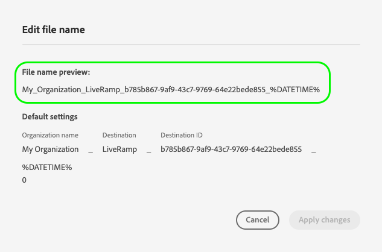

# [!DNL LiveRamp - Onboarding]-Verbindung {#liveramp-onboarding}

Verwenden Sie die Verbindung [!DNL LiveRamp - Onboarding], um Zielgruppen von der Adobe Real-time Customer Data Platform in [!DNL LiveRamp Connect] zu integrieren.

## Anwendungsfälle {#use-cases}

Damit Sie besser verstehen können, wie und wann Sie das [!DNL LiveRamp - Onboarding]-Ziel verwenden sollten, finden Sie hier ein Anwendungsbeispiel, das für Kundinnen und Kunden von Adobe Experience Platform mit diesem Ziel geeignet ist.

Als Marketer möchte ich Zielgruppen von Adobe Experience Platform senden, um Identitäten in [!DNL LiveRamp Connect] zu integrieren, damit ich Benutzende auf mobilen, offenen Web-, sozialen und [!DNL CTV]-Plattformen unter Verwendung der [!DNL Ramp ID]-Kennung ansprechen kann.

## Voraussetzungen {#prerequisites}

Die [!DNL LiveRamp - Onboarding]-Verbindung exportiert Dateien mithilfe des [LiveRamp-SFTP](https://docs.liveramp.com/connect/en/upload-a-file-via-liveramp-s-sftp.html)-Speichers.

Um Daten von Experience Platform an [!DNL LiveRamp - Onboarding] senden zu können, benötigen Sie [!DNL LiveRamp]-Anmeldedaten. Wenden Sie sich an den für Sie zuständigen [!DNL LiveRamp]-Mitarbeiter bzw. -Mitarbeiterin, um Ihre Anmeldedaten zu beziehen, falls Sie noch nicht über diese verfügen.

## Unterstützte Identitäten {#supported-identities}

[!DNL LiveRamp - Onboarding] unterstützt die Aktivierung von Identitäten wie PII-basierten Kennungen, bekannten Kennungen und benutzerdefinierten IDs, die in der offiziellen [LiveRamp-Dokumentation](https://docs.liveramp.com/connect/en/identity-and-identifier-terms-and-concepts.html#known-identifiers) beschrieben werden.

Im [Zuordnungsschritt](#map) des Aktivierungs-Workflows müssen Sie die Zielzuordnungen als benutzerdefinierte Attribute definieren.

## Unterstützte Zielgruppen {#supported-audiences}

In diesem Abschnitt wird beschrieben, welche Arten von Zielgruppen Sie an dieses Ziel exportieren können.

| Zielgruppenherkunft | Unterstützt | Beschreibung |
|---------|----------|----------|
| [!DNL Segmentation Service] | ✓ | Zielgruppen, die über den Experience Platform-[&#x200B; (Segmentierungs-Service) generiert &#x200B;](../../../segmentation/home.md). |
| Benutzerdefinierte Uploads | ✓ | Zielgruppen, die aus CSV-Dateien in Experience Platform [importiert](../../../segmentation/ui/audience-portal.md#import-audience) werden. |

{style="table-layout:auto"}

## Exporttyp und -häufigkeit {#export-type-frequency}

Beziehen Sie sich auf die folgende Tabelle, um Informationen zu Typ und Häufigkeit des Zielexports zu erhalten.

| Element | Typ | Anmerkungen |
|---------|----------|---------|
| Exporttyp | **[!UICONTROL Audience export]** | Sie exportieren alle Mitglieder einer Zielgruppe mit den IDs (Name, Telefonnummer oder sonstiges), die im [!DNL LiveRamp - Onboarding]-Ziel verwendet werden. |
| Exporthäufigkeit | **[!UICONTROL Daily batch]** | Da Profile in Experience Platform auf der Grundlage einer Zielgruppenbewertung aktualisiert werden, werden die Profile (Identitäten) einmal täglich nachgelagert auf der Zielplattform aktualisiert. Weitere Informationen finden Sie unter [Batch-Datei-basierte Ziele](/help/destinations/destination-types.md#file-based). |

{style="table-layout:auto"}

## Herstellen einer Verbindung mit dem Ziel {#connect}

>[!IMPORTANT]
> 
>Um eine Verbindung zum Ziel herzustellen, benötigen Sie die **[!UICONTROL View Destinations]** und **[!UICONTROL Manage Destinations]** Zugriffssteuerungsberechtigungen[. &#x200B;](/help/access-control/home.md#permissions) Lesen Sie die [Zugriffskontrolle – Übersicht](/help/access-control/ui/overview.md) oder wenden Sie sich an Ihren Produktadministrator, um die erforderlichen Berechtigungen zu erhalten.

Um eine Verbindung mit diesem Ziel herzustellen, gehen Sie wie im [Tutorial zur Zielkonfiguration](../../ui/connect-destination.md) beschrieben vor. Füllen Sie im Workflow zum Konfigurieren des Ziels die Felder aus, die in den beiden folgenden Abschnitten aufgeführt sind.

### Beim Ziel authentifizieren {#authenticate}

Um sich beim Ziel zu authentifizieren, füllen Sie die erforderlichen Felder aus und wählen Sie **[!UICONTROL Connect to destination]** aus.

**SFTP-Authentifizierung mit Passwort** {#sftp-password}


* **[!UICONTROL Port]**: Der für Ihren [!DNL LiveRamp - Onboarding] Speicherort verwendete Port.  Verwenden Sie den Port, der Ihrem geografischen Standort entspricht, wie unten beschrieben:
   * **[!UICONTROL NA]**: Port-`22` verwenden
   * **[!UICONTROL AU]**: Port-`2222` verwenden
* **[!UICONTROL Username]**: Der Benutzername für Ihren [!DNL LiveRamp - Onboarding] Speicherort.
* **[!UICONTROL Password]**: Das Kennwort für Ihren [!DNL LiveRamp - Onboarding] Speicherort.
* **[!UICONTROL PGP/GPG encryption key]**: Optional können Sie Ihren RSA-formatierten öffentlichen Schlüssel anhängen, um Ihren exportierten Dateien eine Verschlüsselung hinzuzufügen. Ein Beispiel für einen korrekt formatierten Verschlüsselungsschlüssel finden Sie in der folgenden Abbildung.
  
* **[!UICONTROL Subkey ID]**:IfSie einen Verschlüsselungsschlüssel bereitstellen, müssen Sie auch einen **[!UICONTROL Subkey ID]**&#x200B;angeben. Informationen zum Abrufen der Unterschlüssel-ID finden Sie in der [!DNL LiveRamp] [Verschlüsselungsdokumentation](https://docs.liveramp.com/connect/en/encrypting-files-for-uploading.html#downloading-the-current-encryption-key).

**SFTP mit SSH-Schlüsselauthentifizierung** {#sftp-ssh}


* **[!UICONTROL Port]**: Der für Ihren [!DNL LiveRamp - Onboarding] Speicherort verwendete Port.  Verwenden Sie den Port, der Ihrem geografischen Standort entspricht, wie unten beschrieben:
   * **[!UICONTROL EU]**: Port-`4222` verwenden
* **[!UICONTROL Username]**: Der Benutzername für Ihren [!DNL LiveRamp - Onboarding] Speicherort.
* **[!UICONTROL SSH Key]**: Der private [!DNL SSH], mit dem die Anmeldung bei Ihrem [!DNL LiveRamp - Onboarding] Speicherort erfolgt. Der private Schlüssel muss als eine [!DNL Base64]-verschlüsselte Zeichenfolge formatiert sein und darf nicht passwortgeschützt sein.

   * Um Ihren [!DNL SSH]-Schlüssel mit dem [!DNL LiveRamp - Onboarding]-Server zu verbinden, müssen Sie ein Ticket über das [!DNL LiveRamp]-Portal für technischen Support einreichen und Ihren öffentlichen Schlüssel bereitstellen. Weitere Informationen finden Sie in der [LiveRamp-Dokumentation](https://docs.liveramp.com/connect/en/upload-a-file-via-liveramp-s-sftp.html#upload-with-an-sftp-client).

* **[!UICONTROL PGP/GPG encryption key]**: Optional können Sie Ihren RSA-formatierten öffentlichen Schlüssel anhängen, um Ihren exportierten Dateien eine Verschlüsselung hinzuzufügen. Ein Beispiel für einen korrekt formatierten Verschlüsselungsschlüssel finden Sie in der folgenden Abbildung.
  
* **[!UICONTROL Subkey ID]**:IfSie einen Verschlüsselungsschlüssel bereitstellen, müssen Sie auch einen **[!UICONTROL Subkey ID]**&#x200B;angeben. Informationen zum Abrufen der Unterschlüssel-ID finden Sie in der [!DNL LiveRamp] [Verschlüsselungsdokumentation](https://docs.liveramp.com/connect/en/encrypting-files-for-uploading.html#downloading-the-current-encryption-key).

### Ausfüllen der Zieldetails {#destination-details}

>[!CONTEXTUALHELP]
>id="platform_destinations_liveramp_subkey"
>title="Verschlüsselungs-Unterschlüssel-ID"
>abstract="Die für die Verschlüsselung verwendete Unterschüssel-ID, die auf dem öffentlichen LiveRamp-Verschlüsselungsschlüssel basiert. Dieses Feld ist erforderlich, wenn Sie im Authentifizierungsschritt einen Verschlüsselungsschlüssel bereitgestellt haben."
>additional-url="https://docs.liveramp.com/connect/en/encrypting-files-for-uploading.html#downloading-the-current-encryption-key" text="Erfahren Sie, wie Sie die Unterschlüssel-ID abrufen"

Füllen Sie die folgenden erforderlichen und optionalen Felder aus, um Details für das Ziel zu konfigurieren. Ein Sternchen neben einem Feld in der Benutzeroberfläche zeigt an, dass das Feld erforderlich ist.

Screenshot der 

* **[!UICONTROL Name]**: Ein Name, durch den Sie dieses Ziel in Zukunft erkennen können.
* **[!UICONTROL Description]**: Eine Beschreibung, die Ihnen hilft, dieses Ziel in Zukunft zu identifizieren.
* **[!UICONTROL Region]**: Geografische Region für Ihre Instanz des LiveRamp-SFTP-Speichers.
* **[!UICONTROL Folder path]**: Der Pfad zum [!DNL LiveRamp] `uploads` Unterordner, in dem die exportierten Dateien gespeichert werden. Das Präfix `uploads` wird automatisch zum Ordnerpfad hinzugefügt. [!DNL LiveRamp] empfiehlt die Erstellung eines dedizierten Unterordners für Sendungen aus Adobe Real-Time CDP, um die Dateien von anderen vorhandenen Feeds getrennt zu halten und eine reibungslose Ausführung aller Automatisierungen zu gewährleisten.
   * Wenn Sie beispielsweise Ihre Dateien nach `uploads/my_export_folder` exportieren möchten, geben Sie `my_export_folder` in das Feld **[!UICONTROL Folder path]** ein.
* **[!UICONTROL Compression format]**: Wählen Sie den Komprimierungstyp aus, den Experience Platform für die exportierten Dateien verwenden soll. Verfügbare Optionen sind **[!UICONTROL GZIP]** oder **[!UICONTROL None]**.

### Aktivieren von Warnhinweisen {#enable-alerts}

Sie können Warnhinweise aktivieren, um Benachrichtigungen zum Status des Datenflusses zu Ihrem Ziel zu erhalten. Wählen Sie einen Warnhinweis aus der zu abonnierenden Liste aus, um Benachrichtigungen über den Status Ihres Datenflusses zu erhalten. Weitere Informationen zu Warnhinweisen finden Sie im Handbuch zum [Abonnieren von Warnhinweisen zu Zielen über die Benutzeroberfläche](../../ui/alerts.md).

Wenn Sie mit dem Eingeben der Details für Ihre Zielverbindung fertig sind, wählen Sie **[!UICONTROL Next]** aus.

## Aktivieren von Zielgruppen für dieses Ziel {#activate}

>[!IMPORTANT]
> 
>Zum Aktivieren von Daten benötigen Sie die **[!UICONTROL View Destinations]**, **[!UICONTROL Activate Destinations]**, **[!UICONTROL View Profiles]** und **[!UICONTROL View Segments]** [Zugriffssteuerungsberechtigungen](/help/access-control/home.md#permissions). Lesen Sie die [Übersicht über die Zugriffssteuerung](/help/access-control/ui/overview.md) oder wenden Sie sich an Ihre Produktadmins, um die erforderlichen Berechtigungen zu erhalten.

Anweisungen zum Aktivieren von Zielgruppen für dieses Ziel finden Sie unter [Aktivieren von Zielgruppendaten für Batch-Profil-Exportziele](/help/destinations/ui/activate-batch-profile-destinations.md).

### Planung {#scheduling}

Erstellen Sie im [!UICONTROL Scheduling] Schritt für jede Audience einen Exportzeitplan mit den unten aufgeführten Einstellungen.

* **[!UICONTROL File export options]**: [!UICONTROL Export full files]. [Inkrementelle Dateiexporte](../../ui/activate-batch-profile-destinations.md#export-incremental-files) werden derzeit nicht für das [!DNL LiveRamp]-Ziel unterstützt.
* **[!UICONTROL Frequency]**: [!UICONTROL Daily]
* **[!UICONTROL Date]**: Wählen Sie die Start- und Endzeiten für den Export wie gewünscht aus.

Screenshot der 

Der Name der exportierten Datei kann derzeit nicht benutzerseitig konfiguriert werden. Alle an das [!DNL LiveRamp - Onboarding]-Ziel exportierten Dateien werden automatisch anhand der folgenden Vorlage benannt:

`%ORGANIZATION_NAME%_%DESTINATION%_%DESTINATION_INSTANCE_ID%_%DATETIME%`

Screenshot der Experience Platform-Benutzeroberfläche mit der Namensvorlage für exportierte Dateien.

Beispielsweise könnte der Name einer exportierten Datei für eine Organisation mit dem Namen [!DNL Luma] in etwa wie folgt aussehen:

```json
Luma_LiveRamp_52137231-4a99-442d-804c-39a09ddd005d_20230330_153857.csv
```

### Zuordnen von Attributen und Identitäten {#map}

Im **[!UICONTROL Mapping]** Schritt können Sie auswählen, welche Attribute und Identitäten für Ihre Profile exportiert werden sollen.

>[!IMPORTANT]
>
>Dieses Ziel unterstützt die Aktivierung eines Quell-Identity-Namespace pro Aktivierungsfluss. Wenn Sie mehrere Identity-Namespaces exportieren müssen, z. B. `Email` und `Phone`, müssen Sie für jede Identität [einen separaten Aktivierungsfluss erstellen](../../ui/activate-batch-profile-destinations.md).

Im **[!UICONTROL Mapping]** Schritt definiert die **[!UICONTROL Target field]**-Zuordnung den Namen der Spaltenüberschrift in der exportierten CSV-Datei. Sie können die CSV-Spaltenüberschriften in der exportierten Datei in einen beliebigen Anzeigenamen ändern, indem Sie einen benutzerdefinierten Namen für die **[!UICONTROL Target field]** angeben.

>[!IMPORTANT]
>
>Bei Änderungen an den Zielfeldern nach der ersten Datenübermittlung an [!DNL LiveRamp] benachrichtigen Sie bitte Ihr Konto-Team [!DNL LiveRamp] oder [senden Sie ein Ticket an den LiveRamp-Support](https://docs.liveramp.com/connect/en/considerations-when-uploading-the-first-file-to-an-audience.html#creating-a-support-case), damit die Änderungen im Automatisierungsprozess berücksichtigt werden.

1. Wählen Sie im **[!UICONTROL Mapping]** Schritt **[!UICONTROL Add new mapping]** aus. Auf dem Bildschirm wird eine neue Zuordnungszeile angezeigt.

   

2. Wählen Sie im **[!UICONTROL Select source field]** die Kategorie **[!UICONTROL Select attributes]** und dann das XDM-Attribut aus, das Sie zuordnen möchten, oder wählen Sie die Kategorie **[!UICONTROL Select identity namespace]** und dann eine Identität aus, die Ihrem Ziel zugeordnet werden soll.

   

3. Geben Sie im **[!UICONTROL Select target field]** den Attributnamen ein, dem Sie das ausgewählte Quellfeld zuordnen möchten. Der hier definierte Attributname spiegelt sich in der exportierten CSV-Datei als Spaltenüberschrift wider.

   

   Sie können den Attributnamen auch direkt in die **[!UICONTROL Target field]** eingeben.

   

Nachdem Sie alle gewünschten Zuordnungen hinzugefügt haben, wählen Sie **[!UICONTROL Next]** aus und beenden Sie den Aktivierungs-Workflow.

## Exportierte Daten/Datenexport validieren {#exported-data}

Ihre Daten werden an den von Ihnen konfigurierten [!DNL LiveRamp - Onboarding]-Speicherort als CSV-Dateien exportiert.

Exportierte Dateien haben eine maximale Größe von 10 Millionen Zeilen. Experience Platform generiert mehrere Dateien pro Versand, wenn die ausgewählten Zielgruppen 10 Millionen Zeilen überschreiten. Wenn Sie erwarten, dass das Limit für einzelne Dateien überschritten wird, wenden Sie sich an Ihren [!DNL LiveRamp] und bitten Sie ihn, die Batch-Aufnahme für Sie zu konfigurieren.

Beim Exportieren von Dateien an das [!DNL LiveRamp - Onboarding]-Ziel generiert Experience Platform eine CSV-Datei für jede [Zusammenführungsrichtlinien-ID](../../../profile/merge-policies/overview.md).

Betrachten wir beispielsweise folgende Zielgruppen:

* Zielgruppe A (Zusammenführungsrichtlinie 1)
* Zielgruppe B (Zusammenführungsrichtlinie 2)
* Zielgruppe C (Zusammenführungsrichtlinie 1)
* Zielgruppe D (Zusammenführungsrichtlinie 1)

Experience Platform exportiert zwei CSV-Dateien nach [!DNL LiveRamp - Onboarding]:

* Eine CSV-Datei mit den Zielgruppen A, C und D;
* Eine CSV-Datei, die Zielgruppe B enthält.

Exportierte CSV-Dateien enthalten Profile mit den ausgewählten Attributen und dem entsprechenden Zielgruppenstatus in separaten Spalten, mit dem Attributnamen und `audience_namespace:audience_ID`-Paaren als Spaltenüberschriften, wie im folgenden Beispiel gezeigt:

`ATTRIBUTE_NAME, AUDIENCE_NAMESPACE_1_AUDIENCE_ID_1, AUDIENCE_NAMESPACE_2_AUDIENCE_ID_2,..., AUDIENCE_NAMESPACE_X_AUDIENCE_ID_X`

Die in den exportierten Dateien enthaltenen Profile können mit einem der folgenden Zielgruppenqualifizierungsstatus übereinstimmen:

* `Active`: Das Profil ist derzeit für die Zielgruppe qualifiziert.
* `Expired`: Das Profil ist nicht mehr für die Zielgruppe qualifiziert, war jedoch in der Vergangenheit qualifiziert.
* `""`(leere Zeichenfolge): Das Profil war nie für die Zielgruppe qualifiziert.

Eine exportierte CSV-Datei mit einem `email`-Attribut, zwei Zielgruppen, die vom [Segmentierungs-Service](../../../segmentation/home.md) von Experience Platform stammen, und einer [importierten](../../../segmentation/ui/audience-portal.md#import-audience) externen Zielgruppe könnte zum Beispiel so aussehen:

```csv
email,ups_aa2e3d98-974b-4f8b-9507-59f65b6442df,ups_45d4e762-6e57-4f2f-a3e0-2d1893bcdd7f,CustomerAudienceUpload_7729e537-4e42-418e-be3b-dce5e47aaa1e
abc117@testemailabc.com,active,,
abc111@testemailabc.com,,,active
abc102@testemailabc.com,,,active
abc116@testemailabc.com,active,,
abc107@testemailabc.com,active,expired,active
abc101@testemailabc.com,active,active,
```

Im obigen Beispiel beschreiben die Abschnitte `ups_aa2e3d98-974b-4f8b-9507-59f65b6442df` und `ups_45d4e762-6e57-4f2f-a3e0-2d1893bcdd7f` Zielgruppen, die vom Segmentierungs-Service stammen, während `CustomerAudienceUpload_7729e537-4e42-418e-be3b-dce5e47aaa1e` eine Zielgruppe beschreibt, die als [&#x200B; in Experience Platform importiert &#x200B;](../../../segmentation/ui/audience-portal.md#import-audience).

Da Experience Platform eine CSV-Datei für jede [Zusammenführungsrichtlinien-ID](../../../profile/merge-policies/overview.md) generiert, wird auch eine separate Datenflussausführung für jede Zusammenführungsrichtlinien-ID generiert.

Das bedeutet, dass die **[!UICONTROL Identities activated]**- und **[!UICONTROL Profiles received]**-Metriken auf [&#x200B; Seite „Datenflussausführungen](../../../dataflows/ui/monitor-destinations.md#dataflow-runs-for-batch-destinations) für jede Gruppe von Zielgruppen aggregiert werden, die dieselbe Zusammenführungsrichtlinie verwenden, und nicht für jede Zielgruppe angezeigt werden.

Infolge der generierten Datenflussausführungen für eine Gruppe von Zielgruppen, die dieselbe Zusammenführungsrichtlinie verwenden, werden die Zielgruppennamen nicht im [Monitoring-Dashboard](../../../dataflows/ui/monitor-destinations.md#dataflow-runs-for-batch-destinations) angezeigt.


## Hochladen exportierter Daten nach LiveRamp {#upload-to-liveramp}

Nach dem erfolgreichen Export Ihrer Daten in den [!DNL LiveRamp - Onboarding]-Speicher müssen Sie die Daten in die [!DNL LiveRamp]-Plattform hochladen.

Weitere Informationen zum Hochladen Ihrer Dateien aus dem [!DNL LiveRamp - Onboarding]-Speicher in eine [!DNL LiveRamp]-Zielgruppe finden Sie in der Dokumentation mit [Hinweisen zum Hochladen der ersten Datei in eine Zielgruppe](https://docs.liveramp.com/connect/en/considerations-when-uploading-the-first-file-to-an-audience.html#considerations-when-uploading-the-first-file-to-an-audience).

## Datennutzung und -Governance {#data-usage-governance}

Alle [!DNL Adobe Experience Platform]-Ziele sind bei der Verarbeitung Ihrer Daten mit Datennutzungsrichtlinien konform. Ausführliche Informationen darüber, wie [!DNL Adobe Experience Platform] Data Governance erzwingt, finden Sie unter [Data Governance - Übersicht](/help/data-governance/home.md).

## Zusätzliche Ressourcen {#additional-resources}

Weitere Einzelheiten zur Konfiguration Ihres [!DNL LiveRamp - Onboarding]-Speichers finden Sie in der [offiziellen Dokumentation](https://docs.liveramp.com/connect/en/upload-a-file-via-liveramp-s-sftp.html).

## Änderungsprotokoll {#changelog}

In diesem Abschnitt werden aktualisierte Funktionen und wesentliche Dokumentationsänderungen für diesen Ziel-Connector erfasst.

+++ Änderungsprotokoll anzeigen

| Veröffentlichungsmonat | Art der Aktualisierung | Beschreibung |
|---|---|---|
| März 2024 | Funktions- und Dokumentationsaktualisierung | <ul><li>Es wurde Unterstützung für Sendungen nach Europa und Australien [!DNL LiveRamp] [!DNL SFTP] Instanzen hinzugefügt.</li><li>Die Dokumentation wurde aktualisiert, um spezifische Konfigurationen für neu unterstützte Regionen zu beschreiben.</li><li>Maximale Dateigröße wurde auf 10 Millionen Zeilen erhöht (von zuvor 5 Millionen).</li><li>Die Dokumentation wurde aktualisiert, um höhere Dateigrößen widerzuspiegeln.</li></ul> |
| Juli 2023 | Erstmalige Veröffentlichung | Ursprüngliche Zielversion und Dokumentation veröffentlicht. |

{style="table-layout:auto"}

+++
