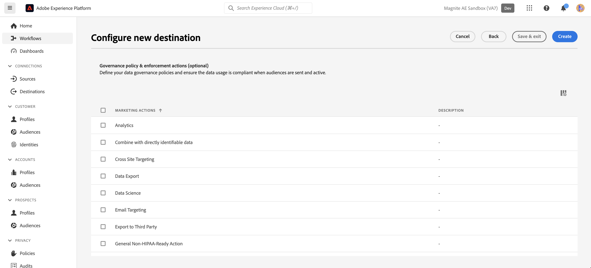
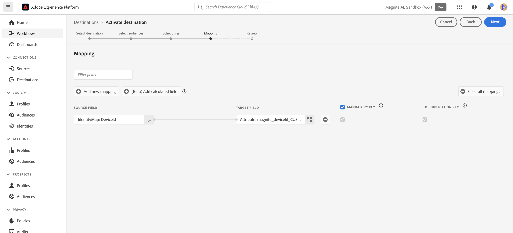
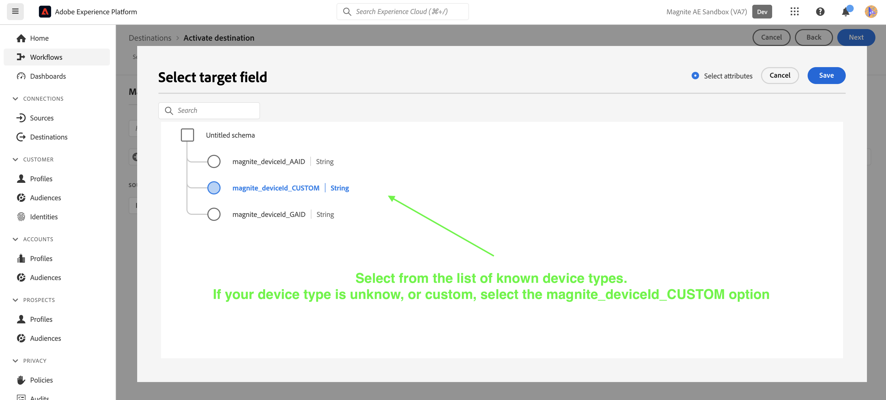

# Magnitude: Batch-Verbindung {#magnite-streaming-batch}

## Überblick {#overview}

In diesem Dokument wird das Ziel „Magnite: Batch“ beschrieben und es werden Beispiele für Anwendungsfälle bereitgestellt, die Ihnen dabei helfen, die Aktivierung und den Export von Zielgruppen besser zu verstehen.

Adobe [!DNL Real-Time CDP]-Zielgruppen können auf zwei Arten an die Magnite Streaming-Plattform gesendet werden: entweder einmal täglich oder in Echtzeit:

1. Wenn Sie Zielgruppen nur einmal täglich bereitstellen möchten und/oder müssen, können Sie das Magnite: Batch-Ziel verwenden, das Zielgruppen über einen täglichen S3-Batch-Dateiversand an Magnite Streaming bereitstellt. Diese Batch-Zielgruppen werden auf unbestimmte Zeit in der Magnite-Plattform gespeichert, im Gegensatz zu Echtzeit-Zielgruppen, die nur für einige Tage gespeichert werden.

2. Wenn Sie jedoch Zielgruppen häufiger bereitstellen möchten oder müssen, müssen Sie das [Magnite Real-Time](/help/destinations/catalog/advertising/magnite-streaming.md)-Ziel verwenden. Bei Verwendung des Echtzeit-Ziels empfängt Magnite Streaming Zielgruppen in Echtzeit, aber Magnite kann Echtzeit-Zielgruppen nur vorübergehend auf seiner Plattform speichern und sie werden innerhalb weniger Tage aus dem System entfernt. Aus diesem Grund müssen Sie, wenn Sie das Echtzeit-Ziel Magnite verwenden möchten, *auch* das Ziel Magnite: Batch verwenden - jede Zielgruppe, die Sie für das Echtzeit-Ziel aktivieren, müssen Sie auch für das Batch-Ziel aktivieren.

Zusammenfassend: Wenn Sie nur einmal täglich Adobe [!DNL Real-Time CDP]-Zielgruppen bereitstellen möchten, verwenden Sie nur das Batch-Ziel Magnite: , und die Zielgruppen werden einmal täglich bereitgestellt. Wenn Sie Adobe [!DNL Real-Time CDP]-Zielgruppen in Echtzeit bereitstellen möchten, verwenden Sie *sowohl* Magnite: Batch-Ziel als auch das Magnite-Echtzeit-Ziel. Weitere Informationen finden Sie unter Magnite: Streaming .

Lesen Sie weiter unten, um weitere Informationen über Magnite zu erhalten: Batch-Ziel, wie Sie eine Verbindung damit herstellen und wie Sie Adobe [!DNL Real-Time CDP]-Zielgruppen aktivieren.
Weitere Informationen zum Echtzeit-Ziel finden Sie stattdessen unter [diese Dokumentationsseite](magnite-streaming.md).

>[!IMPORTANT]
>
>Der Ziel-Connector und die Dokumentationsseite werden vom [!DNL Magnite]-Team erstellt und gepflegt. Bei Fragen oder Aktualisierungsanfragen wenden Sie sich bitte direkt an `adobe-tech@magnite.com`.

## Anwendungsfälle {#use-cases}

Damit Sie besser verstehen können, wie und wann Sie das Magnite: Batch-Ziel verwenden sollten, finden Sie hier einige Beispielanwendungsfälle, die [!DNL Adobe Experience Platform] Kunden mit diesem Ziel bewältigen können.

### Anwendungsfall #1 {#use-case-1}

Sie haben eine Zielgruppe für das Magnite Real-Time-Ziel aktiviert.

Alle Zielgruppen, die über das Echtzeit-Ziel Magnite aktiviert werden, müssen auch das Ziel Magnite: Batch verwenden, da die Daten des Batch-Versands die Daten des Echtzeit-Versands innerhalb der Magnite-Streaming-Plattform ersetzen/beibehalten sollen.

### Anwendungsfall #2 {#use-case-2}

Sie möchten eine Zielgruppe nur in einer Batch-/täglichen Kadenz für die Magnite-Streaming-Plattform aktivieren.

Alle über das Ziel Magnite: Batch aktivierten Zielgruppen werden in einer Batch-/täglichen Kadenz bereitgestellt und stehen dann für das Targeting auf der Streaming-Plattform Magnite zur Verfügung.

## Voraussetzungen {#prerequisites}

Um die [!DNL Magnite] Ziele in [!DNL Adobe Experience Platform] verwenden zu können, müssen Sie zunächst über ein Magnite-Streaming-Konto verfügen. Wenn Sie über ein [!DNL Magnite Streaming]-Konto verfügen, wenden Sie sich an Ihren [!DNL Magnite] Account Manager, um Anmeldeinformationen für den Zugriff auf [!DNL Magnite's] Ziele zu erhalten. Wenn Sie noch kein [!DNL Magnite Streaming]-Konto haben, wenden Sie sich bitte an adobe-tech@magnite.com

## Unterstützte Identitäten {#supported-identities}

Das Ziel Magnite: Batch kann (*)* Identitätsquellen von der Adobe CDP empfangen. Derzeit hat dieses Ziel drei Zielidentitätsfelder, denen Sie zuordnen können.

>[!NOTE]
>
>*Beliebig* Identitätsquellen können jeder der `magnite_deviceId` Zielidentitäten zugeordnet werden.

| Ziel-Identität | Beschreibung | Zu beachten |
|:--------------------------- |:------------------------------------------------------------------------------------------------ |:------------------------------------------------------------------------------------- |
| magnetie_deviceId_GAID | GOOGLE ADVERTISING ID | Wählen Sie diese Zielidentität aus, wenn Ihre Quellidentität eine GAID ist. |
| granite_deviceId_IDFA | Apple-ID für Werbetreibende | Wählen Sie diese Zielidentität aus, wenn Ihre Quellidentität ein IDFA ist. |
| granite_deviceId_CUSTOM | Benutzerdefinierte/benutzerdefinierte ID | Wählen Sie diese Zielidentität aus, wenn Ihre Quellidentität keine GAID oder IDFA ist oder wenn es sich um eine benutzerdefinierte oder benutzerdefinierte ID handelt |

{style="table-layout:auto"}

## Unterstützte Zielgruppen {#supported-audiences}

| Zielgruppenherkunft | Unterstützt | Beschreibung |
|-----------------------------|----------|----------|
| [!DNL Segmentation Service] | Ja | Zielgruppen, die über den Experience Platform-[&#x200B; (Segmentierungs-Service) generiert &#x200B;](../../../segmentation/home.md). |
| Alle anderen Ursprünge der Zielgruppe | Ja | Diese Kategorie enthält alle Ursprünge der Zielgruppe außerhalb der Zielgruppen, die durch die [!DNL Segmentation Service] generiert wurden. Lesen Sie mehr über [verschiedene Ursprünge von Audiences](/help/segmentation/ui/audience-portal.md#customize). Einige Beispiele: <ul><li> benutzerdefinierte Upload-Zielgruppen [importiert](../../../segmentation/ui/audience-portal.md#import-audience) aus CSV-Dateien in Experience Platform,</li><li> Lookalike-Zielgruppen, </li><li> Federated Audiences, </li><li> Zielgruppen, die in anderen Experience Platform-Apps generiert werden, z. B. [!DNL Adobe Journey Optimizer], </li><li> und mehr. </li></ul> |

{style="table-layout:auto"}

Unterstützte Zielgruppen nach Zielgruppen-Datentyp:

| Datentyp der Zielgruppe | Unterstützt | Beschreibung | Anwendungsfälle |
|--------------------|-----------|-------------|-----------|
| [Personen-Zielgruppen](/help/segmentation/types/people-audiences.md) | Ja | Basierend auf Kundenprofilen können Sie bestimmte Personengruppen für Marketing-Kampagnen ansprechen. | Häufige Käufer, Warenkorbabbrüche |
| [Konto-Zielgruppen](/help/segmentation/types/account-audiences.md) | Nein | Targeting von Personen in bestimmten Organisationen für Account-basierte Marketing-Strategien. | B2B-Marketing |
| [Interessenten-Zielgruppen](/help/segmentation/types/prospect-audiences.md) | Nein | Targeting von Personen, die noch keine Kunden sind, aber Merkmale mit Ihrer Zielgruppe teilen. | Akquise mit Drittanbieterdaten |
| [Datensatzexporte](/help/catalog/datasets/overview.md) | Nein | Sammlungen strukturierter Daten, die im Data Lake von [!DNL Adobe Experience Platform] gespeichert sind. | Reporting, Datenwissenschaft-Workflows |

{style="table-layout:auto"}

## Exporttyp und -häufigkeit {#export-type-frequency}

| Element | Typ | Anmerkungen |
|-----------------------------|----------|----------|
| Exporttyp | Zielgruppenexport | Sie exportieren alle Mitglieder einer Zielgruppe mit den IDs (Name, Telefonnummer oder sonstiges), die im Ziel Magnite: Batch verwendet werden. |
| Exporthäufigkeit | Batch | Batch-Ziele exportieren Dateien in Schritten von drei, sechs, acht, zwölf oder vierundzwanzig Stunden auf nachgelagerte Plattformen. Weitere Informationen finden Sie [&#x200B; Batch (dateibasierte &#x200B;](/help/destinations/destination-types.md)). |

{style="table-layout:auto"}

## Herstellen einer Verbindung mit dem Ziel {#connect}

Nachdem Ihre Zielnutzung genehmigt wurde und Magnite Streaming Ihre Anmeldeinformationen freigegeben hat, führen Sie die folgenden Schritte aus, um Daten zu authentifizieren, zuzuordnen und freizugeben.

### Beim Ziel authentifizieren {#authenticate}

Suchen Sie im Adobe Experience-Katalog das Ziel Magnite: Batch . Klicken Sie auf die Schaltfläche Zusätzliche Optionen (\…) und konfigurieren Sie dann die Zielverbindung/-instanz.

Wenn Sie bereits über ein vorhandenes Konto verfügen, können Sie es suchen, indem Sie die Option Kontotyp in „Vorhandenes Konto“ ändern. Andernfalls wird unten ein Konto erstellt:

Um ein neues Konto zu erstellen und es erstmals beim Ziel zu authentifizieren, füllen Sie die erforderlichen Felder „S3-Zugriffsschlüssel“ und „S3-Geheimschlüssel“ aus (bereitgestellt über Ihren Account Manager) und wählen Sie **[!UICONTROL Connect to destination]** aus

>[!NOTE]
>
>Die Sicherheitsrichtlinie von Magnite Streaming erfordert eine regelmäßige Rotation von S3-Schlüsseln. Sie sollten davon ausgehen, dass Sie Ihr Konto in Zukunft mit neuen S3-Zugriffs- und S3-Geheimschlüsseln aktualisieren werden. Sie müssen nur das Konto selbst aktualisieren. Ziele, die dieses Konto verwenden, verwenden automatisch die aktualisierten Schlüssel. Wenn die neuen Schlüssel nicht hochgeladen werden, können die Daten nicht an dieses Ziel gesendet werden.

### Ausfüllen der Zieldetails {#destination-details}

Füllen Sie die folgenden erforderlichen und optionalen Felder aus, um Details für das Ziel zu konfigurieren. Ein Sternchen neben einem Feld in der Benutzeroberfläche zeigt an, dass das Feld erforderlich ist.

* **[!UICONTROL Name]**: Ein Name, durch den Sie diese Zielverbindung/Instanz in der
Zukunft.
* **[!UICONTROL Description]**: Eine Beschreibung, die Ihnen hilft, dies zu identifizieren
Zielverbindung/Instanz in der Zukunft.
* **[!UICONTROL Your company name]**: Ihr Kunde-/Firmenname. Es stehen nur unterstützte [!DNL Magnite Streaming]-Clients zur Auswahl.

>[!NOTE]
>
>Der Firmenname muss eine Zeichenfolge sein, die mit dem Namen des Amazon S3-Bereitstellungs-Buckets übereinstimmt, den Sie mit Magnite konfiguriert und im Schritt [Authentifizieren bei Ziel](#authenticate) eingerichtet haben. Zu den unterstützten Zeichen gehören „a-z“, „A-Z“, „0-9“, &quot;-„(Bindestrich) oder „_„(Unterstrich).

>[!NOTE]
>
>Wenn Sie mehrere ID-Typen (GAID, IDFA usw.) mithilfe des Batch-Ziels senden möchten, ist für jede Verbindung eine neue Zielinstanz erforderlich. Wenden Sie sich an Ihren Magnite-Kundenbetreuer, um weitere Informationen zu erhalten.

Klicken Sie dann auf **[!UICONTROL Next]**

Auf dem nächsten Bildschirm mit dem Titel „Governance-Richtlinie und Durchsetzungsaktionen (Optional)“ können Sie optional relevante Data-Governance-Richtlinien auswählen. „Datenexport“ wird im Allgemeinen für das Ziel „Magnitude: Batch“ ausgewählt.

Nach der Auswahl oder wenn Sie diesen optionalen Bildschirm überspringen möchten, klicken Sie auf **[!UICONTROL Create]**

### Aktivieren von Warnhinweisen {#enable-alerts}

Sie können Warnhinweise aktivieren, um Benachrichtigungen zum Status des Datenflusses zu Ihrem Ziel zu erhalten. Wählen Sie einen Warnhinweis aus der zu abonnierenden Liste aus, um Benachrichtigungen über den Status Ihres Datenflusses zu erhalten. Weitere Informationen zu Warnhinweisen finden Sie im Handbuch zum [Abonnieren von Zielwarnhinweisen über die Benutzeroberfläche](../../ui/alerts.md).

Wenn Sie mit dem Eingeben der Details für Ihre Zielverbindung fertig sind, wählen Sie **[!UICONTROL Next]** aus.

### Aktivieren von Zielgruppen für dieses Ziel {#activate}

>[!IMPORTANT]
>
>* Zum Aktivieren von Daten benötigen Sie die **[!UICONTROL View Destinations]**, **[!UICONTROL Activate Destinations]**, **[!UICONTROL View Profiles]** und **[!UICONTROL View Segments]** [Zugriffssteuerungsberechtigungen](/help/access-control/home.md#permissions). Lesen Sie die [Übersicht über die Zugriffssteuerung](/help/access-control/ui/overview.md) oder wenden Sie sich an Ihre Produktadmins, um die erforderlichen Berechtigungen zu erhalten.
>* Zum Exportieren *Identitäten* benötigen Sie die **[!UICONTROL View Identity Graph]** Zugriffssteuerungsberechtigung[&#x200B; &#x200B;](/help/access-control/home.md#permissions).   {width="100" zoomable="yes"}

Anweisungen zum Aktivieren von Zielgruppensegmenten für dieses Ziel finden Sie unter [Aktivieren von Zielgruppendaten für Batch-Profil-Exportziele](/help/destinations/ui/activate-batch-profile-destinations.md).

### Zuordnen von Attributen und Identitäten {#map}

In der **[!UICONTROL Source field]** können Sie ein beliebiges Attribut oder eine beliebige Identität für Ihre Geräte auswählen. In diesem Beispiel haben wir eine benutzerdefinierte IdentityMap namens „DeviceId“ ausgewählt

Im **[!UICONTROL Target field]**:
 Weitere Informationen finden Sie [Unterstützte &#x200B;](#supported-identities)&quot;.
In diesem Beispiel haben wir die **[!UICONTROL Target field]**: 0magnetie_deviceId_CUSTOM ausgewählt, da unsere **[!UICONTROL Source field]** als benutzerdefinierte IdentityMap definiert wurde: DeviceID.

>[!NOTE]
>
>Wenn Sie mehrere ID-Typen (GAID, IDFA usw.) mithilfe des Batch-Ziels senden/zuordnen möchten, ist für jede Verbindung eine neue Zielinstanz erforderlich. Wenden Sie sich an Ihren Magnite-Kundenbetreuer, um weitere Informationen zu erhalten.

Auf dem Bildschirm „Konfigurieren Sie einen Dateinamen und einen Exportzeitplan für jede Zielgruppe“ müssen Sie jetzt für jede Zielgruppe ein Startdatum (obligatorisch), ein Enddatum (optional) und eine Zuordnungs-ID (obligatorisch) konfigurieren.

>[!IMPORTANT]
>
> Für dieses Ziel ist eine Zuordnungs-ID oder „KEINE“ erforderlich.
>
> Eine Zuordnungs-ID sollte bereitgestellt werden, wenn eine Zielgruppe über eine bereits vorhandene Segment-ID verfügt, die zuvor Magnite Streaming bekannt war. Andernfalls sollte „KEINE“ als Zuordnungs-ID verwendet werden.
>
> Bitte geben Sie beim Konfigurieren des Dateinamens für jede Zielgruppe über das Feld „Benutzerdefinierter Text“ die Zuordnungs-ID an, um sie hinzuzufügen. Die Zuordnungs-ID wird wie folgt angehängt: `{previous_filename}\_\[MAPPING_ID\].` Wenn diese Zielgruppe neu bei Magnite Streaming ist und Sie keine Zuordnungs-ID angeben, sollte „KEINE“ in das Feld „Benutzerdefinierter Text“ eingegeben werden. Der neue Dateiname sollte in diesem Fall lauten: `{previous_filename}\_\[NONE\]`.

## Exportierte Daten/Datenexport validieren {#exported-data}

Nach dem Hochladen Ihrer Zielgruppen können Sie überprüfen, ob Ihre Zielgruppen korrekt erstellt und hochgeladen wurden.

* Das Ziel Magnite: Batch stellt S3-Dateien täglich zum Magnite Streaming bereit. Nach dem Versand und der Aufnahme werden Zielgruppen/Segmente voraussichtlich im Magnite-Streaming angezeigt und können auf ein Angebot angewendet werden. Sie können dies bestätigen, indem Sie nach der Segment-ID oder dem Segmentnamen suchen, die bzw. der während der Aktivierungsschritte in der [!DNL Adobe Experience Platform] freigegeben wurde.

>[!NOTE]
>
>Zielgruppen, die für Magnite aktiviert/bereitgestellt wurden: Das Batch-Ziel *dieselben Zielgruppen*/ersetzen, die über das Magnite-Echtzeit-Ziel aktiviert/bereitgestellt wurden. Wenn Sie mithilfe des Segmentnamens nach einem Segment suchen, finden Sie das Segment möglicherweise erst dann in Echtzeit, wenn der Batch von der Magnite-Streaming-Plattform aufgenommen und verarbeitet wurde.

## Datennutzung und -Governance {#data-usage-governance}

Alle [!DNL Adobe Experience Platform]-Ziele sind bei der Verarbeitung Ihrer Daten mit Datennutzungsrichtlinien konform. Ausführliche Informationen darüber, wie [!DNL Adobe Experience Platform] Data Governance erzwingt, finden Sie unter [Data Governance - Übersicht](/help/data-governance/home.md).

## Weitere Ressourcen {#additional-resources}

Weitere Hilfedokumentation finden Sie im [Magnite Help Center](https://help.magnite.com/help).
