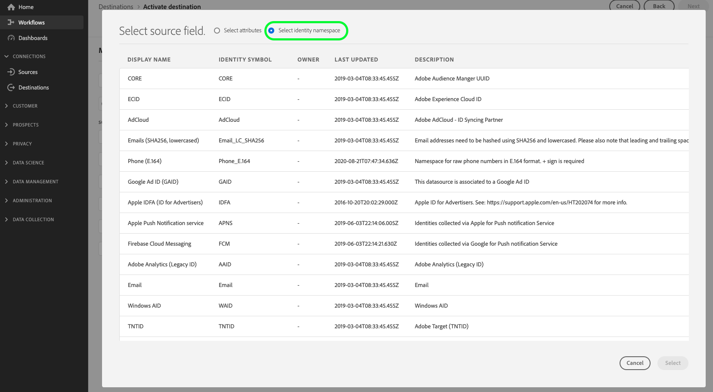

# PubMatic Connect-Ziel {#pubmatic-connect}

## Überblick {#overview}

Nutzen Sie [!DNL PubMatic Connect], um den Kundenwert zu maximieren, indem Sie die programmatische Digital-Marketing-supply chain der Zukunft bereitstellen. [!DNL PubMatic Connect] kombiniert Plattformtechnologie und dedizierten Service, um die Art und Weise zu verbessern, wie Inventar und Daten gepackt und verarbeitet werden.

Es sind zwei Ziele verfügbar, mit denen Sie Zielgruppendaten an die PubMatic Connect-Plattform senden können. Sie unterscheiden sich geringfügig in ihrer Funktionalität:

1. PubMatic Connect

   Während der ersten Aktivierung registriert dieses Ziel automatisch die Zielgruppen in der PubMatic-Plattform und verwendet die interne [!DNL Adobe Experience Platform]-ID für die Zuordnung.

2. PubMatic Connect (benutzerdefinierte Zielgruppen-ID-Zuordnung)

   Mit diesem Ziel können Sie während des Aktivierungs-Workflows manuell eine Zuordnungs-ID hinzufügen. Verwenden Sie dieses Ziel, wenn Daten an bestehende Zielgruppen der PubMatic-Plattform gesendet werden sollen oder wenn eine benutzerdefinierte &quot;Source-Zielgruppen-ID“ erforderlich ist.

>[!IMPORTANT]
>
> Der Ziel-Connector und die Dokumentationsseite werden vom [!DNL PubMatic]-Team erstellt und gepflegt. Bei Fragen oder Aktualisierungsanfragen wenden Sie sich bitte direkt an `support@pubmatic.com`.

## Anwendungsfälle {#use-cases}

Damit Sie besser verstehen können, wie und wann Sie das [!DNL PubMatic Connect]-Ziel verwenden sollten, finden Sie hier ein Anwendungsbeispiel, das für [!DNL Adobe Experience Platform] Kunden mit diesem Ziel geeignet ist.

### Ansprechen von Benutzern auf mobilen, Web- und Videoüberwachungsplattformen {#targeting}

Herausgeber oder Datenanbieter möchten Zielgruppen von [!DNL Adobe Experience Platform] an [!DNL PubMatic Connect] senden, um Benutzer auf mobilen, Web- und TV-Plattformen anzusprechen, wobei ein großer Bereich von Kennungen verwendet wird.

## Voraussetzungen {#prerequisites}

Wenden Sie sich an Ihren [!DNL PubMatic] Account Manager, um sicherzustellen, dass Ihr Konto richtig konfiguriert ist und das Onboarding von Zielgruppensegmenten unterstützt. Er wird auch sicherstellen, dass Sie über alle relevanten Details verfügen, um dieses Ziel zu verwenden und Sie während der Einrichtung zu unterstützen.

## Unterstützte Identitäten {#supported-identities}

[!DNL PubMatic Connect] unterstützt die Aktivierung von Identitäten, die in der folgenden Tabelle beschrieben sind. Erhalten Sie weitere Informationen zu [Identitäten](/help/identity-service/features/namespaces.md).

| Ziel-Identität | Beschreibung | Zu beachten |
| --------------- | ------------------------ | ------------------------------------------------------------------------------- |
| GAID | GOOGLE ADVERTISING ID | Wählen Sie die GAID-Zielidentität aus, wenn Ihre Quellidentität ein GAID-Namespace ist. |
| IDFA | Apple-ID für Werbetreibende | Wählen Sie die IDFA-Zielidentität aus, wenn Ihre Quellidentität ein IDFA-Namespace ist. |
| extern_id | Benutzerdefinierte Benutzer-IDs | Wählen Sie diese Zielidentität aus, wenn Ihre Quellidentität ein benutzerdefinierter Namespace ist. |

{style="table-layout:auto"}

## Unterstützte Zielgruppen {#supported-audiences}

In diesem Abschnitt wird beschrieben, welche Art von Zielgruppen Sie an dieses Ziel exportieren können.

| Zielgruppenherkunft | Unterstützt | Beschreibung |
|---------|----------|----------|
| [!DNL Segmentation Service] | Ja | Zielgruppen, die über den Experience Platform-[ (Segmentierungs-Service) generiert ](../../../segmentation/home.md). |
| Alle anderen Ursprünge der Zielgruppe | Nein | Diese Kategorie enthält alle Ursprünge der Zielgruppe außerhalb der Zielgruppen, die durch die [!DNL Segmentation Service] generiert wurden. Lesen Sie mehr über [verschiedene Ursprünge von Audiences](/help/segmentation/ui/audience-portal.md#customize). Einige Beispiele: <ul><li> benutzerdefinierte Upload-Zielgruppen [importiert](../../../segmentation/ui/audience-portal.md#import-audience) aus CSV-Dateien in Experience Platform,</li><li> Lookalike-Zielgruppen, </li><li> Federated Audiences, </li><li> Zielgruppen, die in anderen Experience Platform-Apps generiert werden, z. B. [!DNL Adobe Journey Optimizer], </li><li> und mehr. </li></ul> |

{style="table-layout:auto"}

Unterstützte Zielgruppen nach Zielgruppen-Datentyp:

| Datentyp der Zielgruppe | Unterstützt | Beschreibung | Anwendungsfälle |
|--------------------|-----------|-------------|-----------|
| [Personen-Zielgruppen](/help/segmentation/types/people-audiences.md) | Ja | Basierend auf Kundenprofilen können Sie bestimmte Personengruppen für Marketing-Kampagnen ansprechen. | Häufige Käufer, Warenkorbabbrüche |
| [Konto-Zielgruppen](/help/segmentation/types/account-audiences.md) | Nein | Targeting von Personen in bestimmten Organisationen für Account-basierte Marketing-Strategien. | B2B-Marketing |
| [Interessenten-Zielgruppen](/help/segmentation/types/prospect-audiences.md) | Nein | Targeting von Personen, die noch keine Kunden sind, aber Merkmale mit Ihrer Zielgruppe teilen. | Akquise mit Drittanbieterdaten |
| [Datensatzexporte](/help/catalog/datasets/overview.md) | Nein | Sammlungen strukturierter Daten, die im Data Lake von [!DNL Adobe Experience Platform] gespeichert sind. | Reporting, Datenwissenschaft-Workflows |

{style="table-layout:auto"}

## Exporttyp und -häufigkeit {#export-type-frequency}

Beziehen Sie sich auf die folgende Tabelle, um Informationen zu Typ und Häufigkeit des Zielexports zu erhalten.

| Element | Typ | Anmerkungen |
| ---------------- | ------------------------------- | ---------------------------------------------------------------------------------------------------------------------------------------------------------------------------------------------------------------------------------------------------------------------------------------------------------------------------- |
| Exporttyp | **[!UICONTROL Segment export]** | Sie exportieren alle Mitglieder eines Segments (Zielgruppe) mit den IDs (Name, Telefonnummer oder sonstiges), die im PubMatic Connect -Ziel verwendet werden. |
| Exporthäufigkeit | **[!UICONTROL Streaming]** | Streaming-Ziele sind „immer verfügbare“ API-basierte Verbindungen. Wenn ein Profil in Experience Platform auf der Grundlage einer Segmentauswertung aktualisiert wird, sendet der Connector die Aktualisierung nachgelagert an die Zielplattform. Lesen Sie mehr über [Streaming-Ziele](/help/destinations/destination-types.md#streaming-destinations). |

{style="table-layout:auto"}

## Herstellen einer Verbindung mit dem Ziel {#connect}

>[!IMPORTANT]
>
> Um eine Verbindung zum Ziel herzustellen, benötigen Sie die **[!UICONTROL Manage Destinations]** [Zugriffssteuerungsberechtigung](/help/access-control/home.md#permissions). Lesen Sie die [Zugriffskontrolle – Übersicht](/help/access-control/ui/overview.md) oder wenden Sie sich an Ihren Produktadministrator, um die erforderlichen Berechtigungen zu erhalten.

Um eine Verbindung mit diesem Ziel herzustellen, gehen Sie wie im [Tutorial zur Zielkonfiguration](../../ui/connect-destination.md) beschrieben vor. Füllen Sie im Zielkonfigurations-Workflow die Felder aus, die in den beiden folgenden Abschnitten aufgeführt sind.

### Beim Ziel authentifizieren {#authenticate}

Um sich beim Ziel zu authentifizieren, füllen Sie die erforderlichen Felder aus und wählen Sie **[!UICONTROL Connect to destination]** aus.

- **[!UICONTROL Bearer token]**: Füllen Sie das Bearer-Token aus, um sich beim Ziel zu authentifizieren.

### Ausfüllen der Zieldetails {#destination-details}

Füllen Sie die folgenden erforderlichen und optionalen Felder aus, um Details für das Ziel zu konfigurieren. Ein Sternchen neben einem Feld in der Benutzeroberfläche zeigt an, dass das Feld erforderlich ist.

- **[!UICONTROL Name]**: Ein Name, durch den Sie dieses Ziel in Zukunft erkennen können.
- **[!UICONTROL Description]**: Eine Beschreibung, die Ihnen hilft, dieses Ziel in Zukunft zu identifizieren.
- **[!UICONTROL Data partner ID]**: Die Datenpartner-ID, die für diese Integration in Ihrem [!DNL PubMatic]-Konto eingerichtet wurde.
- **[!UICONTROL Default country code]**: Der standardmäßige Länder-Code, der auf alle Identitäten angewendet werden soll, wenn im Profil keine angegeben ist.
- **[!UICONTROL Account ID]**: Ihre [!DNL PubMatic Connect]-Konto-ID.
- **[!UICONTROL Account type]**: Der Kontotyp Ihres [!DNL PubMatic] Platform-Kontos. Wenden Sie sich an Ihren [!DNL PubMatic] Account Manager, wenn Sie Fragen haben, für die Sie sich entscheiden können. Folgende Optionen sind verfügbar:
   - [!UICONTROL PUBLISHER]
   - [!UICONTROL DEMAND_PARTNER]
   - [!UICONTROL BUYER]

### Aktivieren von Warnhinweisen {#enable-alerts}

Sie können Warnhinweise aktivieren, um Benachrichtigungen zum Status des Datenflusses zu Ihrem Ziel zu erhalten. Wählen Sie einen Warnhinweis aus der zu abonnierenden Liste aus, um Benachrichtigungen über den Status Ihres Datenflusses zu erhalten. Weitere Informationen zu Warnhinweisen finden Sie im Handbuch zum [Abonnieren von Zielwarnhinweisen über die Benutzeroberfläche](../../ui/alerts.md).

Wenn Sie mit dem Eingeben der Details für Ihre Zielverbindung fertig sind, wählen Sie **[!UICONTROL Next]** aus.

## Aktivieren von Zielgruppen für dieses Ziel {#activate}

>[!IMPORTANT]
>
> - Zum Aktivieren von Daten benötigen Sie die **[!UICONTROL View Destinations]**, **[!UICONTROL Activate Destinations]**, **[!UICONTROL View Profiles]** und **[!UICONTROL View Segments]** [Zugriffssteuerungsberechtigungen](/help/access-control/home.md#permissions). Lesen Sie die [Übersicht über die Zugriffssteuerung](/help/access-control/ui/overview.md) oder wenden Sie sich an Ihre Produktadmins, um die erforderlichen Berechtigungen zu erhalten.
>
> - Zum Exportieren _Identitäten_ benötigen Sie die **[!UICONTROL View Identity Graph]** Zugriffssteuerungsberechtigung.   {width="100" zoomable="yes"}

Anweisungen [ Aktivieren von Zielgruppen für dieses Ziel finden ](/help/destinations/ui/activate-segment-streaming-destinations.md) unter Aktivieren von Zielgruppen für Streaming-Ziele .

### Zuordnen von Attributen und Identitäten {#map}

Auswahl der Quellfelder:

- Wählen Sie eine Kennung aus (normalerweise Namespaces wie IDFA oder einen benutzerdefinierten ID-Namespace).

Auswählen der Zielfelder:

- Wenden Sie sich an Ihren [!DNL PubMatic] Account Manager, um Informationen darüber zu erhalten, welcher UID-Typ in diesem Schritt korrekt sein wird.
- Wählen Sie die Nummer des [!DNL PubMatic UID] aus, die der im ersten Schritt ausgewählten Kennung entspricht.

### Zielgruppen-Planung {#audience-scheduling}

Wenn Sie das Ziel PubMatic Connect (Custom Audience ID Mapping) verwenden, müssen Sie für jede Audience eine Mapping-ID angeben, die der &quot;Source Audience ID“ in der PubMatic-Plattform entspricht.

## Exportierte Daten/Datenexport validieren {#exported-data}

Verwenden Sie die [!DNL PubMatic]-Benutzeroberfläche, um zu überprüfen, ob die Daten korrekt gepusht wurden und die Segmente verfügbar sind. Es kann bis zu 24 Stunden dauern, nachdem Daten per Push an die [!DNL PubMatic]-Benutzeroberfläche gesendet wurden.

## Datennutzung und -Governance {#data-usage-governance}

Alle [!DNL Adobe Experience Platform]-Ziele sind bei der Verarbeitung Ihrer Daten mit Datennutzungsrichtlinien konform. Ausführliche Informationen darüber, wie [!DNL Adobe Experience Platform] Data Governance erzwingt, finden Sie unter [Data Governance - Übersicht](/help/data-governance/home.md).
