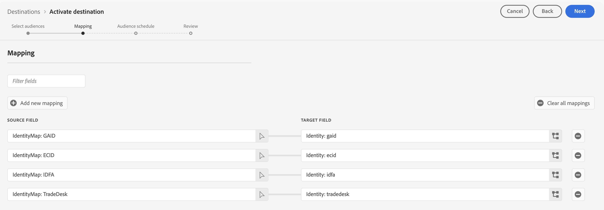

# [!DNL The Trade Desk]-Verbindung

## Übersicht {#overview}

>[!IMPORTANT]
>
> Nach dem [internen Upgrade](../../../release-notes/2025/july-2025.md#destinations) auf den Ziel-Service vom Juli 2025 werden Sie möglicherweise einen **Rückgang der Anzahl der aktivierten Profile** in Ihren Datenflüssen zu [!DNL The Trade Desk] feststellen.
> Dieser Rückgang wird durch eine verbesserte Sichtbarkeit der Überwachung verursacht. Profile ohne ECID werden jetzt in der Aktivierungsmetrik korrekt als abgelegt gezählt. Detaillierte Informationen finden Sie [&#x200B; Abschnitt &#x200B;](#mandatory-mappings)Obligatorische Zuordnung“ auf dieser Seite.
>
>**Änderungen:**
>
>* Der Ziel-Service meldet jetzt korrekt, wenn Profile ohne ECID aus der Aktivierung entfernt werden.
>* **Wichtig:** Profile ohne ECID haben es noch nie vor diesem Upgrade [!DNL The Trade Desk]. Für die Integration war immer eine ECID erforderlich. Durch dieses Upgrade wird ein Fehler behoben, durch den diese Abbrüche zuvor in Ihren Metriken nicht sichtbar waren.
>
>**Was Sie tun müssen:**
>
>* Überprüfen Sie Ihre Zielgruppendaten, um sicherzustellen, dass Profile gültige ECID-Werte haben.
>* Überwachen Sie Ihre Aktivierungsmetriken, um die erwartete Profilanzahl zu überprüfen. Niedrigere Zahlen spiegeln ein genaues Reporting wider, keine Änderung des Zielverhaltens.

Verwenden Sie diesen Ziel-Connector, um Profildaten an [!DNL The Trade Desk] zu senden. Dieser Connector sendet Daten an den [!DNL The Trade Desk] Erstanbieter-Endpunkt. Die Integration zwischen Adobe Experience Platform und [!DNL The Trade Desk] unterstützt nicht den Export von Daten an den [!DNL The Trade Desk] Drittanbieterendpunkt.

[!DNL The Trade Desk] ist eine Self-Service-Plattform für Anzeigenkäufer, um Retargeting und zielgruppenorientierte digitale Kampagnen für Display-, Video- und mobile Inventarquellen auszuführen.

Um Profildaten an [!DNL The Trade Desk] zu senden, müssen Sie zunächst eine Verbindung zum Ziel herstellen, wie in den folgenden Abschnitten dieser Seite beschrieben.

## Anwendungsfälle {#use-cases}

Als Marketing-Experte möchte ich in der Lage sein, Zielgruppen, die aus [!DNL Trade Desk IDs]- oder Geräte-IDs bestehen, zur Erstellung digitaler Retargeting- oder Zielgruppen-bezogener Kampagnen zu verwenden.

## Unterstützte Identitäten {#supported-identities}

[!DNL The Trade Desk] unterstützt die Aktivierung von Zielgruppen basierend auf den in der folgenden Tabelle aufgeführten Identitäten. Erhalten Sie weitere Informationen zu [Identitäten](/help/identity-service/features/namespaces.md).

Im Folgenden finden Sie die von [!DNL The Trade Desk] Ziel unterstützten Identitäten. Diese Identitäten können verwendet werden, um Zielgruppen für die [!DNL The Trade Desk] zu aktivieren.

Alle Identitäten in der folgenden Tabelle sind obligatorische Zuordnungen.

| Zielidentität | Beschreibung | Zu beachten |
|---|---|---|
| [!DNL GAID] | GOOGLE ADVERTISING ID | Wählen Sie die GAID-Zielidentität aus, wenn Ihre Quellidentität ein GAID-Namespace ist. |
| [!DNL IDFA] | Apple-ID für Werbetreibende | Wählen Sie die IDFA-Zielidentität aus, wenn Ihre Quellidentität ein IDFA-Namespace ist. |
| [!DNL ECID] | Experience Cloud ID | Diese Identität ist erforderlich, damit die Integration ordnungsgemäß funktioniert, wird aber nicht zur Zielgruppenaktivierung verwendet. |
| [!DNL Tradedesk] | [!DNL TDID] in der [!DNL The Trade Desk] | Verwenden Sie diese Identität, wenn Sie Zielgruppen aktivieren, die auf der proprietären ID von The Trade Desk basieren. |

{style="table-layout:auto"}

## Unterstützte Zielgruppen {#supported-audiences}

In diesem Abschnitt wird beschrieben, welche Arten von Zielgruppen Sie an dieses Ziel exportieren können.

| Zielgruppenherkunft | Unterstützt | Beschreibung |
|---------|----------|----------|
| [!DNL Segmentation Service] | ✓ | Zielgruppen, die über den Experience Platform-[&#x200B; (Segmentierungs-Service) generiert &#x200B;](../../../segmentation/home.md). |
| Benutzerdefinierte Uploads | ✓ | Zielgruppen, die aus CSV-Dateien in Experience Platform [importiert](../../../segmentation/ui/audience-portal.md#import-audience) werden. |

{style="table-layout:auto"}

## Exporttyp und -häufigkeit {#export-type-frequency}

Beziehen Sie sich auf die folgende Tabelle, um Informationen zu Typ und Häufigkeit des Zielexports zu erhalten.

| Element | Typ | Anmerkungen |
|---------|----------|---------|
| Exporttyp | **[!UICONTROL Audience export]** | Sie exportieren alle Mitglieder einer Zielgruppe an das Ziel. |
| Exporthäufigkeit | **[!UICONTROL Streaming]** | Streaming-Ziele sind „immer verfügbare“ API-basierte Verbindungen. Sobald ein Profil in Experience Platform auf der Grundlage einer Zielgruppenauswertung aktualisiert wird, sendet der Connector das Update nachgelagert an die Zielplattform. Lesen Sie mehr über [Streaming-Ziele](/help/destinations/destination-types.md#streaming-destinations). |

{style="table-layout:auto"}

## Voraussetzungen {#prerequisites}

>[!IMPORTANT]
>
>Wenn Sie Ihr erstes Ziel mit [!DNL The Trade Desk] erstellen möchten und die [ID-Synchronisierungsfunktion](https://experienceleague.adobe.com/de/docs/id-service/using/id-service-api/methods/idsync) im Experience Cloud ID-Service noch nicht aktiviert haben (mit Adobe Audience Manager oder anderen Programmen), wenden Sie sich an Adobe Consulting oder die Kundenunterstützung, um ID-Synchronisierungen zu aktivieren. Wenn Sie zuvor [!DNL The Trade Desk] Integrationen in Audience Manager eingerichtet hatten, werden die von Ihnen eingerichteten ID-Synchronisierungen auf Experience Platform übertragen.

## Herstellen einer Verbindung mit dem Ziel {#connect}

>[!IMPORTANT]
> 
>Um eine Verbindung zum Ziel herzustellen, benötigen Sie die **[!UICONTROL View Destinations]** und **[!UICONTROL Manage Destinations]** Zugriffssteuerungsberechtigungen[. &#x200B;](/help/access-control/home.md#permissions) Lesen Sie die [Übersicht über die Zugriffskontrolle](/help/access-control/ui/overview.md) oder wenden Sie sich an Ihren Produktadministrator, um die erforderlichen Berechtigungen zu erhalten.

Um eine Verbindung mit diesem Ziel herzustellen, gehen Sie wie im Abschnitt [Tutorial zur Zielkonfiguration](../../ui/connect-destination.md) beschrieben vor.

### Verbindungsparameter {#parameters}

Beim [Einrichten](../../ui/connect-destination.md) dieses Ziels müssen Sie die folgenden Informationen angeben:

* **[!UICONTROL Name]**: Ein Name, durch den Sie dieses Ziel in Zukunft erkennen können.
* **[!UICONTROL Description]**: Eine Beschreibung, die Ihnen hilft, dieses Ziel in Zukunft zu identifizieren.
* **[!UICONTROL Account ID]**: Ihr [!DNL The Trade Desk] [!UICONTROL Account ID].
* **[!UICONTROL Server Location]**: Fragen Sie Ihren [!DNL The Trade Desk], welchen regionalen Server Sie verwenden sollten. Nachfolgend sind die verfügbaren regionalen Server aufgeführt, aus denen Sie wählen können:

   * **[!UICONTROL APAC]**
   * **[!UICONTROL China]**
   * **[!UICONTROL Tokyo]**
   * **[!UICONTROL UK/EU]**
   * **[!UICONTROL US East Coast]**
   * **[!UICONTROL US West Coast]**

### Aktivieren von Warnhinweisen {#enable-alerts}

Sie können Warnhinweise aktivieren, um Benachrichtigungen zum Status des Datenflusses zu Ihrem Ziel zu erhalten. Wählen Sie einen Warnhinweis aus der zu abonnierenden Liste aus, um Benachrichtigungen über den Status Ihres Datenflusses zu erhalten. Weitere Informationen zu Warnhinweisen finden Sie im Handbuch zum [Abonnieren von Zielwarnhinweisen über die Benutzeroberfläche](../../ui/alerts.md).

Wenn Sie mit dem Eingeben der Details für Ihre Zielverbindung fertig sind, wählen Sie **[!UICONTROL Next]** aus.

## Aktivieren von Zielgruppen für dieses Ziel {#activate}

>[!IMPORTANT]
> 
>* Zum Aktivieren von Daten benötigen Sie die **[!UICONTROL View Destinations]**, **[!UICONTROL Activate Destinations]**, **[!UICONTROL View Profiles]** und **[!UICONTROL View Segments]** [Zugriffssteuerungsberechtigungen](/help/access-control/home.md#permissions). Lesen Sie die [Übersicht über die Zugriffssteuerung](/help/access-control/ui/overview.md) oder wenden Sie sich an Ihre Produktadmins, um die erforderlichen Berechtigungen zu erhalten.
>* Zum Exportieren *Identitäten* benötigen Sie die **[!UICONTROL View Identity Graph]** Zugriffssteuerungsberechtigung[&#x200B; &#x200B;](/help/access-control/home.md#permissions).   {width="100" zoomable="yes"}

Anweisungen zum Aktivieren von Zielgruppen für dieses Ziel finden Sie unter [Aktivieren von Zielgruppendaten für Streaming-Zielgruppen-Exportziele](../../ui/activate-segment-streaming-destinations.md).

Im Schritt [Zielgruppen](../../ui/activate-segment-streaming-destinations.md#scheduling) müssen Sie Ihre Zielgruppen manuell ihrer entsprechenden ID oder ihrem Anzeigenamen in der Zielplattform zuordnen.

Für die Zuordnung von Zielgruppen empfiehlt Adobe zur Vereinfachung die Verwendung des Experience Platform-Zielgruppennamen oder einer kürzeren Form des Namens. Die Zielgruppen-ID oder der Name in Ihrem Ziel muss jedoch nicht mit der ID in Ihrem Experience Platform-Konto übereinstimmen. Jeder Wert, den Sie in das Zuordnungsfeld einfügen, wird vom Ziel übernommen.

### Obligatorische Zuordnungen {#mandatory-mappings}

>[!CONTEXTUALHELP]
>id="platform_destinations_required_mappings_ttd"
>title="Vorkonfigurierte Zuordnungssätze"
>abstract="Wir haben diese vier Zuordnungssätze für Sie vorkonfiguriert. Wenn Sie Daten für das Trade Desk aktivieren, müssen die Profile, die für die aktivierten Zielgruppen qualifiziert sind, nicht unbedingt alle vier Identitäten in den Profilen vorhanden sein, da dieses Ziel mit jeder der hier angezeigten Zielidentitäten funktioniert."
>additional-url="https://experienceleague.adobe.com/de/docs/experience-platform/destinations/catalog/advertising/tradedesk#preconfigured-mappings" text="Weitere Informationen zu den vorkonfigurierten Zuordnungen"

Alle im Abschnitt [Unterstützte Identitäten](#supported-identities) beschriebenen Zielidentitäten müssen im Zuordnungsschritt des Zielgruppenaktivierungs-Workflows zugeordnet werden. Dazu gehören:

* [!DNL GAID] (Google Advertising ID)
* [!DNL IDFA] (Apple ID für Advertiser)
* [!DNL ECID] (Experience Cloud ID)
* [!DNL The Trade Desk ID]

Das Zuordnen aller Zielidentitäten stellt sicher, dass die Aktivierung Profile korrekt aufteilen und bereitstellen kann, indem eine beliebige Identität verwendet wird. Dies bedeutet nicht, dass alle Identitäten in jedem Profil vorhanden sein müssen.

Damit der Export an das Trade Desk erfolgreich ist, muss ein Profil Folgendes enthalten:

* [!DNL ECID] und
* Mindestens eines von: [!DNL GAID], [!DNL IDFA] oder [!DNL The Trade Desk ID]

Beispiele:

* Nur [!DNL ECID]: nicht exportiert
* [!DNL ECID] + [!DNL The Trade Desk ID]: exportiert
* [!DNL ECID] + [!DNL IDFA]: exportiert
* [!DNL ECID] + [!DNL GAID]: exportiert
* [!DNL IDFA] + [!DNL The Trade Desk ID] (keine [!DNL ECID]): nicht exportiert

>[!NOTE]
> 
>Nach dem [Upgrade vom Juli 2025](/help/release-notes/2025/july-2025.md#destinations) auf den Ziel-Service werden Profile ohne [!DNL ECID] jetzt korrekt in Aktivierungsmetriken als verworfen gemeldet. Dies war schon immer das Verhalten der Integration - Profile ohne [!DNL ECID] nie [!DNL The Trade Desk] erreicht - aber die Drops sind jetzt in Ihrer Datenflussüberwachung ordnungsgemäß sichtbar. Niedrigere Aktivierungszahlen spiegeln ein genaues Reporting wider, keine Änderung der Zielfunktion.

## Exportierte Daten {#exported-data}

Um sich zu vergewissern, dass die Daten erfolgreich in das [!DNL The Trade Desk]-Ziel exportiert wurden, überprüfen Sie Ihr [!DNL The Trade Desk]-Konto. Wenn die Aktivierung erfolgreich war, werden in Ihrem Konto Zielgruppen ausgefüllt.
