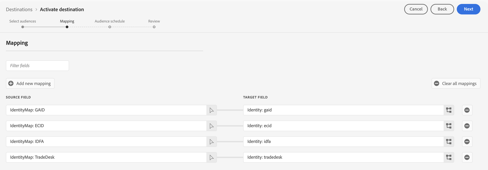

# [!DNL The Trade Desk]-Verbindung

## Übersicht {#overview}

Verwenden Sie diesen Ziel-Connector, um Profildaten an [!DNL The Trade Desk] zu senden. Dieser Connector sendet Daten an den [!DNL The Trade Desk] Erstanbieter-Endpunkt. Die Integration zwischen Adobe Experience Platform und [!DNL The Trade Desk] unterstützt nicht den Export von Daten an den [!DNL The Trade Desk] Drittanbieterendpunkt.

[!DNL The Trade Desk] ist eine Self-Service-Plattform für Anzeigenkäufer, um Retargeting und zielgruppenorientierte digitale Kampagnen für Display-, Video- und mobile Inventarquellen auszuführen.

Um Profildaten an [!DNL The Trade Desk] zu senden, müssen Sie zunächst eine Verbindung zum Ziel herstellen, wie in den folgenden Abschnitten dieser Seite beschrieben.

## Anwendungsfälle {#use-cases}

Als Marketing-Experte möchte ich in der Lage sein, Zielgruppen, die aus [!DNL Trade Desk IDs]- oder Geräte-IDs bestehen, zur Erstellung digitaler Retargeting- oder Zielgruppen-bezogener Kampagnen zu verwenden.

## Unterstützte Identitäten {#supported-identities}

[!DNL The Trade Desk] unterstützt die Aktivierung von Zielgruppen basierend auf den in der folgenden Tabelle aufgeführten Identitäten. Erhalten Sie weitere Informationen zu [Identitäten](/help/identity-service/features/namespaces.md).

Im Folgenden finden Sie die von [!DNL The Trade Desk] Ziel unterstützten Identitäten. Diese Identitäten können verwendet werden, um Zielgruppen für die [!DNL The Trade Desk] zu aktivieren.

Alle Identitäten in der folgenden Tabelle sind vorkonfiguriert und werden während der Aktivierung automatisch zugeordnet. Sie müssen diese Zuordnungen im Aktivierungs-Workflow nicht manuell konfigurieren.

| Zielidentität | Beschreibung | Zu beachten |
|---|---|---|
| GAID | GOOGLE ADVERTISING ID | Wird aktiviert, wenn eine GAID im Profil vorhanden ist. |
| IDFA | Apple-ID für Werbetreibende | Wird aktiviert, wenn ein IDFA im Profil vorhanden ist. |
| ECID | Experience Cloud ID | Ein Namespace, der die ECID darstellt. Dieser Namespace kann auch durch die folgenden Aliase referenziert werden: „Adobe Marketing Cloud ID“, „Adobe Experience Cloud ID“, „Adobe Experience Platform ID“. Weitere Informationen finden Sie im folgenden Dokument [ECID](/help/identity-service/features/ecid.md) . |
| [!DNL Tradedesk] | [!DNL TDID] in der [!DNL The Trade Desk] | Aktiviert, wenn ein Profil eine ECID hat und in Experience Platform eine ECID-zu-Trade-Desk-ID-Zuordnung vorhanden ist. |

{style="table-layout:auto"}

## Unterstützte Zielgruppen {#supported-audiences}

In diesem Abschnitt wird beschrieben, welche Arten von Zielgruppen Sie an dieses Ziel exportieren können.

| Zielgruppenherkunft | Unterstützt | Beschreibung |
|---------|----------|----------|
| [!DNL Segmentation Service] | ✓ | Zielgruppen, die über den Experience Platform-[&#x200B; (Segmentierungs-Service) generiert &#x200B;](../../../segmentation/home.md). |
| Benutzerdefinierte Uploads | ✓ | Zielgruppen, die aus CSV-Dateien in Experience Platform [importiert](../../../segmentation/ui/audience-portal.md#import-audience) werden. |

{style="table-layout:auto"}

## Exporttyp und -häufigkeit {#export-type-frequency}

Beziehen Sie sich auf die folgende Tabelle, um Informationen zu Typ und Häufigkeit des Zielexports zu erhalten.

| Element | Typ | Anmerkungen |
|---------|----------|---------|
| Exporttyp | **[!UICONTROL Audience export]** | Sie exportieren alle Mitglieder einer Zielgruppe an das Ziel. |
| Exporthäufigkeit | **[!UICONTROL Streaming]** | Streaming-Ziele sind „immer verfügbare“ API-basierte Verbindungen. Sobald ein Profil in Experience Platform auf der Grundlage einer Zielgruppenauswertung aktualisiert wird, sendet der Connector das Update nachgelagert an die Zielplattform. Lesen Sie mehr über [Streaming-Ziele](/help/destinations/destination-types.md#streaming-destinations). |

{style="table-layout:auto"}

## Voraussetzungen {#prerequisites}

Die Voraussetzungen hängen davon ab, welche Identitätstypen Sie für die Zielgruppenaktivierung verwenden möchten:

**Nur für die Aktivierung der mobilen ID** gibt es keine Voraussetzungen. Solange Sie IDs (GAID und/oder IDFA) für Ihre Kunden erfassen und verwalten, können Sie damit beginnen, Zielgruppen für die [!DNL The Trade Desk] zu aktivieren.

**Stellen Sie bei Cookie-basiertem Targeting auf[!DNL The Trade Desk]** sicher, dass eine Zuordnung zwischen ECID und [!DNL Trade Desk ID] hergestellt wurde. Führen Sie dazu die folgenden Schritte aus:

1. **ID-Synchronisierungsfunktion aktivieren**: Wenn Sie [!DNL The Trade Desk ID] Aktivierung zum ersten Mal einrichten und die [ID-Synchronisierungsfunktion](https://experienceleague.adobe.com/de/docs/id-service/using/id-service-api/methods/idsync) im Experience Cloud ID-Service noch nicht aktiviert haben (mit Adobe Audience Manager oder anderen Anwendungen), wenden Sie sich an Adobe Consulting oder die Kundenunterstützung, um ID-Synchronisierungen zu aktivieren.
   * Wenn Sie zuvor bereits [!DNL The Trade Desk] Integrationen in Audience Manager eingerichtet haben, werden Ihre bestehenden ID-Synchronisierungen automatisch auf Experience Platform übertragen.

2. **Web-Seiten instrumentieren**: Implementieren Sie Code auf Ihren Web-Seiten, um Zuordnungen zwischen [!DNL The Trade Desk ID] und Adobe ECID zu erstellen. Dadurch kann Experience Platform Trade Desk-IDs mit Ihren Kundenprofilen verknüpfen.

## Herstellen einer Verbindung mit dem Ziel {#connect}

>[!IMPORTANT]
> 
>Um eine Verbindung zum Ziel herzustellen, benötigen Sie die **[!UICONTROL View Destinations]** und **[!UICONTROL Manage Destinations]** Zugriffssteuerungsberechtigungen[. &#x200B;](/help/access-control/home.md#permissions) Lesen Sie die [Übersicht über die Zugriffskontrolle](/help/access-control/ui/overview.md) oder wenden Sie sich an Ihren Produktadministrator, um die erforderlichen Berechtigungen zu erhalten.

Um eine Verbindung mit diesem Ziel herzustellen, gehen Sie wie im Abschnitt [Tutorial zur Zielkonfiguration](../../ui/connect-destination.md) beschrieben vor.

### Verbindungsparameter {#parameters}

Beim [Einrichten](../../ui/connect-destination.md) dieses Ziels müssen Sie die folgenden Informationen angeben:

* **[!UICONTROL Name]**: Ein Name, durch den Sie dieses Ziel in Zukunft erkennen können.
* **[!UICONTROL Description]**: Eine Beschreibung, die Ihnen hilft, dieses Ziel in Zukunft zu identifizieren.
* **[!UICONTROL Account ID]**: Ihr [!DNL The Trade Desk] [!UICONTROL Account ID].
* **[!UICONTROL Server Location]**: Fragen Sie Ihren [!DNL The Trade Desk], welchen regionalen Server Sie verwenden sollten. Nachfolgend sind die verfügbaren regionalen Server aufgeführt, aus denen Sie wählen können:

   * **[!UICONTROL APAC]**
   * **[!UICONTROL China]**
   * **[!UICONTROL Tokyo]**
   * **[!UICONTROL UK/EU]**
   * **[!UICONTROL US East Coast]**
   * **[!UICONTROL US West Coast]**

### Aktivieren von Warnhinweisen {#enable-alerts}

Sie können Warnhinweise aktivieren, um Benachrichtigungen zum Status des Datenflusses zu Ihrem Ziel zu erhalten. Wählen Sie einen Warnhinweis aus der zu abonnierenden Liste aus, um Benachrichtigungen über den Status Ihres Datenflusses zu erhalten. Weitere Informationen zu Warnhinweisen finden Sie im Handbuch zum [Abonnieren von Zielwarnhinweisen über die Benutzeroberfläche](../../ui/alerts.md).

Wenn Sie mit dem Eingeben der Details für Ihre Zielverbindung fertig sind, wählen Sie **[!UICONTROL Next]** aus.

## Aktivieren von Zielgruppen für dieses Ziel {#activate}

>[!IMPORTANT]
> 
>* Zum Aktivieren von Daten benötigen Sie die **[!UICONTROL View Destinations]**, **[!UICONTROL Activate Destinations]**, **[!UICONTROL View Profiles]** und **[!UICONTROL View Segments]** [Zugriffssteuerungsberechtigungen](/help/access-control/home.md#permissions). Lesen Sie die [Übersicht über die Zugriffssteuerung](/help/access-control/ui/overview.md) oder wenden Sie sich an Ihre Produktadmins, um die erforderlichen Berechtigungen zu erhalten.
>* Zum Exportieren *Identitäten* benötigen Sie die **[!UICONTROL View Identity Graph]** Zugriffssteuerungsberechtigung[&#x200B; &#x200B;](/help/access-control/home.md#permissions).   {width="100" zoomable="yes"}

Anweisungen zum Aktivieren von Zielgruppen für dieses Ziel finden Sie unter [Aktivieren von Zielgruppendaten für Streaming-Zielgruppen-Exportziele](../../ui/activate-segment-streaming-destinations.md).

Im Schritt [Zielgruppen](../../ui/activate-segment-streaming-destinations.md#scheduling) müssen Sie Ihre Zielgruppen manuell ihrer entsprechenden ID oder ihrem Anzeigenamen in der Zielplattform zuordnen.

Für die Zuordnung von Zielgruppen empfiehlt Adobe zur Vereinfachung die Verwendung des Experience Platform-Zielgruppennamen oder einer kürzeren Form des Namens. Die Zielgruppen-ID oder der Name in Ihrem Ziel muss jedoch nicht mit der ID in Ihrem Experience Platform-Konto übereinstimmen. Jeder Wert, den Sie in das Zuordnungsfeld einfügen, wird vom Ziel übernommen.

### Vorkonfigurierte Zuordnungen {#preconfigured-mappings}

>[!CONTEXTUALHELP]
>id="platform_destinations_required_mappings_ttd"
>title="Vorkonfigurierte Zuordnungssätze"
>abstract="Wir haben diese vier Zuordnungssätze für Sie vorkonfiguriert. Wenn Sie Daten für das Trade Desk aktivieren, müssen die Profile, die für die aktivierten Zielgruppen qualifiziert sind, nicht unbedingt alle vier Identitäten in den Profilen vorhanden sein, da dieses Ziel mit jeder der hier angezeigten Zielidentitäten funktioniert.   Für das Cookie-basierte Targeting auf der Grundlage der Trade Desk-ID benötigen Sie eine im Profil vorhandene ECID und eine ID-Synchronisierungszuordnung zwischen der Trade Desk-ID und der ECID."
>additional-url="https://experienceleague.adobe.com/de/docs/experience-platform/destinations/catalog/advertising/tradedesk#preconfigured-mappings" text="Weitere Informationen zu den vorkonfigurierten Zuordnungen"

Die folgenden Identitätszuordnungen sind **vorkonfiguriert und werden automatisch ausgefüllt** um Sie im Workflow für die Zielgruppenaktivierung zu unterstützen:

* GAID (Google Advertising ID)
* IDFA (Apple ID für Advertiser)
* ECID (Experience Cloud ID)
* [!DNL The Trade Desk ID]

Diese Zuordnungen sind ausgegraut und schreibgeschützt. In diesem Schritt ist keine Konfiguration erforderlich. Wählen Sie **[!UICONTROL Next]** aus, um fortzufahren.

Experience Platform prüft automatisch jedes Profil, das zu im Aktivierungs-Workflow zugeordneten Zielgruppen gehört, auf alle unterstützten Identitätstypen und aktiviert dann das Profil mit allen vorhandenen Identitäten.

### Identitätsanforderungen nach Aktivierungstyp

**Mobile ID Activation (GAID/IDFA):** Profile mit nur GAID oder IDFA sind ausreichend für die Aktivierung. Es sind keine zusätzlichen Identitäten oder Voraussetzungen erforderlich.

**Cookie-basiertes Targeting ([!DNL Trade Desk ID]):** Erfordert beides:

* ECID im Profil vorhanden
* Eine ID-Synchronisierungszuordnung zwischen der [!DNL Trade Desk ID] und der ECID (konfiguriert wie im Abschnitt [Voraussetzungen](#prerequisites) beschrieben)

**Verhalten mehrerer IDs:** Wenn ein Profil mehrere unterstützte Identitäten enthält, wird jede Identität separat für die [!DNL The Trade Desk] aktiviert. Dadurch wird eine maximale Reichweite und Flexibilität bei der Zielgruppenaktivierung gewährleistet.

### Beispiele für Aktivierungen

* **Mobile ID-Profile:** Profile mit GAID und/oder IDFA werden mit ihren jeweiligen Werbe-IDs aktiviert. Wenn ein Profil sowohl GAID als auch IDFA enthält, wird jede ID separat aktiviert.
* **Cookie-basiertes Profil:** Ein Profil mit ECID und einer entsprechenden [!DNL Trade Desk ID]-Zuordnung wird mithilfe der Trade Desk-ID für das Cookie-basierte Targeting aktiviert.
* **Nur-ECID-Profil:** Ein Profil nur mit ECID und ohne [!DNL Trade Desk ID] wird **nicht exportiert**. ECID allein reicht für die Aktivierung nicht aus.

## Exportierte Daten {#exported-data}

Um sich zu vergewissern, dass die Daten erfolgreich in das [!DNL The Trade Desk]-Ziel exportiert wurden, überprüfen Sie Ihr [!DNL The Trade Desk]-Konto. Wenn die Aktivierung erfolgreich war, werden in Ihrem Konto Zielgruppen ausgefüllt.
