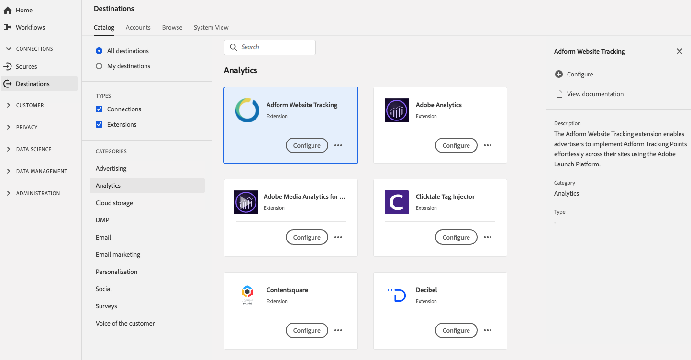

# Adform Website Tracking-Erweiterung {#adform-extension}

## Übersicht {#overview}

Mit der Adform Website Tracking-Erweiterung können Adform-Tracking-Punkte mühelos über die [!DNL Experience Platform Launch]-Plattform auf ihren Sites implementieren.

[!DNL Adform] ist eine Analyseerweiterung in Adobe Experience Platform. Weitere Informationen zur Funktionalität der Erweiterung finden Sie auf der Seite der Erweiterung auf [Adobe Exchange](https://exchange.adobe.com/experiencecloud.details.103195.adform-website-tracking.html)

Dieses Ziel ist eine [!DNL Adobe Experience Platform Launch] -Erweiterung. Weitere Informationen zur Funktionsweise von [!DNL Platform Launch]-Erweiterungen in Platform finden Sie unter [Übersicht über Experience Platform Launch-Erweiterungen](../launch-extensions/overview.md).

## Voraussetzungen {#prerequisites}

Diese Erweiterung ist im Katalog [!DNL Destinations] für alle Kunden verfügbar, die Platform erworben haben.

Um diese Erweiterung verwenden zu können, benötigen Sie Zugriff auf [!DNL Adobe Experience Platform Launch]. [!DNL Platform Launch] wird Adobe Experience Cloud-Kunden als integrierte Mehrwertfunktion angeboten. Wenden Sie sich an Ihren Organisationsadministrator, um Zugriff auf [!DNL Platform Launch] zu erhalten, und bitten Sie ihn, Ihnen die Berechtigung **[!UICONTROL manage_properties]** zu erteilen, damit Sie Erweiterungen installieren können.

## Installieren einer Erweiterung {#install-extension}

So installieren Sie die Adform-Erweiterung:

Gehen Sie in der [Platform-Oberfläche](http://platform.adobe.com/) zu **[!UICONTROL Ziele]** > **[!UICONTROL Katalog]**.

Wählen Sie die Erweiterung aus dem Katalog aus oder verwenden Sie die Suchleiste.

Klicken Sie auf das Ziel, um es zu markieren, und wählen Sie dann **[!UICONTROL Konfigurieren]** in der rechten Leiste aus. Wenn das Steuerelement **[!UICONTROL Konfigurieren]** ausgegraut ist, fehlt Ihnen die Berechtigung **[!UICONTROL manage_properties]**. Siehe [Voraussetzungen](#prerequisites).

Wählen Sie im Fenster **[!UICONTROL Verfügbare Launch-Eigenschaft]** die Eigenschaft [!DNL Launch] aus, in der Sie die Erweiterung installieren möchten. Sie können auch eine neue Eigenschaft in Launch erstellen. Eine Eigenschaft ist eine Sammlung von Regeln, Datenelementen, konfigurierten Erweiterungen, Umgebungen und Bibliotheken. Weitere Informationen zu Eigenschaften finden Sie im Abschnitt [Eigenschaftenseite](../../../tags/ui/administration/companies-and-properties.md#properties-page) der [!DNL Launch]-Dokumentation.

Der Workflow führt Sie zu [!DNL Launch], um die Installation abzuschließen.

Weitere Informationen zu den Konfigurationsoptionen für Erweiterungen und zur Installationsunterstützung finden Sie auf der Seite [Adform unter Adobe Exchange](https://exchange.adobe.com/experiencecloud.details.103195.adform-website-tracking.html).

Sie können die Erweiterung auch direkt in der [Adobe Experience Platform Launch-Benutzeroberfläche](https://launch.adobe.com/) installieren. Siehe [Hinzufügen einer neuen Erweiterung](../../../tags/ui/managing-resources/extensions/overview.md#add-a-new-extension) in der [!DNL Platform Launch] -Dokumentation.

## Verwenden der Erweiterung {#how-to-use}

Nachdem Sie die Erweiterung installiert haben, können Sie direkt in [!DNL Platform Launch] Regeln dafür einrichten.

In [!DNL Platform Launch] können Sie Regeln für Ihre installierten Erweiterungen einrichten, um Ereignisdaten nur in bestimmten Situationen an das Erweiterungsziel zu senden. Weitere Informationen zum Einrichten von Regeln für Erweiterungen finden Sie in der [Regeldokumentation](../../../tags/ui/managing-resources/rules.md).

## Konfigurieren, Aktualisieren und Löschen von Erweiterungen {#configure-upgrade-delete}

Sie können Erweiterungen in der [!DNL Platform Launch]-Benutzeroberfläche konfigurieren, aktualisieren und löschen.

>[!TIP]
>
>Wenn die Erweiterung bereits in einer Ihrer Eigenschaften installiert ist, zeigt die Platform-Benutzeroberfläche weiterhin **[!UICONTROL Installieren]** für die Erweiterung an. Starten Sie den Installations-Workflow, wie unter [Installieren einer Erweiterung](#install-extension) beschrieben, um zu zu wechseln und Ihre Erweiterung zu konfigurieren oder zu löschen.[!DNL Platform Launch]

Informationen zum Aktualisieren Ihrer Erweiterung finden Sie unter [Erweiterungs-Upgrade](../../../tags/ui/managing-resources/extensions/extension-upgrade.md) in der [!DNL Platform Launch] -Dokumentation.
