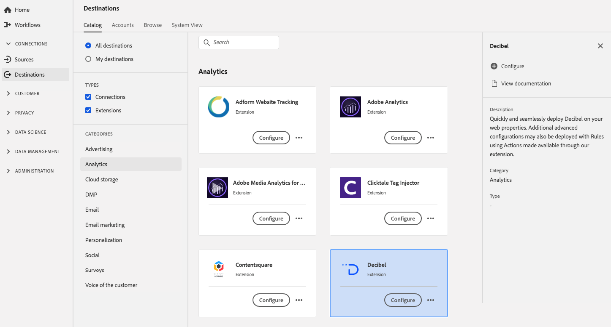

# [!DNL Decibel]-Erweiterung  {#decibel-extension}

## Übersicht {#overview}

Stellen Sie [!DNL Decibel] schnell und nahtlos in Ihren Web-Eigenschaften bereit. Zusätzliche erweiterte Konfigurationen können auch mit Regeln bereitgestellt werden, indem über die Erweiterung verfügbare Aktionen verwendet werden.

[!DNL Decibel] ist eine Analyseerweiterung in Adobe Experience Platform. Weitere Informationen zur Funktionalität der Erweiterung finden Sie auf der Seite der Erweiterung auf [Adobe Exchange](https://exchange.adobe.com/experiencecloud.details.100913.html).

Dieses Ziel ist eine Tag-Erweiterung. Weitere Informationen zur Funktionsweise von Tag-Erweiterungen in Platform finden Sie unter [Tag-Erweiterungen - Übersicht](../launch-extensions/overview.md).

## Voraussetzungen  {#prerequisites}

Diese Erweiterung ist im Katalog [!DNL Destinations] für alle Kunden verfügbar, die Platform erworben haben.

Um diese Erweiterung verwenden zu können, benötigen Sie Zugriff auf Tags in Adobe Experience Platform. Tags, die Adobe Experience Cloud-Kunden als integrierte, Mehrwert bietende Funktion angeboten werden. Wenden Sie sich an Ihren Organisationsadministrator, um Zugriff auf Tags zu erhalten, und bitten Sie ihn, Ihnen die Berechtigung **[!UICONTROL manage_properties]** zu erteilen, damit Sie Erweiterungen installieren können. und bitten Sie sie, Ihnen die Berechtigung **[!UICONTROL manage_properties]** zu erteilen, damit Sie Erweiterungen installieren können.

## Installieren einer Erweiterung {#install-extension}

So installieren Sie die [!DNL Decibel]-Erweiterung:

Gehen Sie in der [Platform-Oberfläche](http://platform.adobe.com/) zu **[!UICONTROL Ziele]** > **[!UICONTROL Katalog]**.

Wählen Sie die Erweiterung aus dem Katalog aus oder verwenden Sie die Suchleiste.

Klicken Sie auf das Ziel, um es zu markieren, und wählen Sie dann **[!UICONTROL Konfigurieren]** in der rechten Leiste aus. Wenn das Steuerelement **[!UICONTROL Konfigurieren]** ausgegraut ist, fehlt Ihnen die Berechtigung **[!UICONTROL manage_properties]**. Siehe [Voraussetzungen](#prerequisites).

Wählen Sie die Eigenschaft aus, in der Sie die Erweiterung installieren möchten. Sie können auch eine neue Eigenschaft erstellen. Eine Eigenschaft ist eine Sammlung von Regeln, Datenelementen, konfigurierten Erweiterungen, Umgebungen und Bibliotheken. Informationen zu Eigenschaften finden Sie im Abschnitt [Eigenschaftenseite](../../../tags/ui/administration/companies-and-properties.md#properties-page) der in der Tag-Dokumentation.

Der Workflow führt Sie durch die Schritte zum Abschluss der Installation.

Informationen zu den Konfigurationsoptionen der Erweiterung finden Sie auf der [Seite der Decibel-Erweiterung](https://exchange.adobe.com/experiencecloud.details.100913.html) auf Adobe Exchange.

Sie können die Erweiterung auch direkt in der [Datenerfassungs-Benutzeroberfläche](https://experience.adobe.com/#/data-collection/) installieren. Weitere Informationen finden Sie im Abschnitt [Hinzufügen einer neuen Erweiterung](../../../tags/ui/managing-resources/extensions/overview.md#add-a-new-extension) in der Tag-Dokumentation.

## Verwenden der Erweiterung {#how-to-use}

Nachdem Sie die Erweiterung installiert haben, können Sie mit der Einrichtung von Regeln beginnen.

Sie können Regeln für Ihre installierten Erweiterungen einrichten, damit nur in bestimmten Situationen Ereignisdaten an das Erweiterungsziel gesendet werden. Weitere Informationen zum Einrichten von Regeln für Ihre Erweiterungen finden Sie in der [Tag-Dokumentation](../../../tags/ui/managing-resources/rules.md).

## Konfigurieren, Aktualisieren und Löschen von Erweiterungen {#configure-upgrade-delete}

Sie können Erweiterungen in der Datenerfassungs-Benutzeroberfläche konfigurieren, aktualisieren und löschen.

>[!TIP]
>
>Wenn die Erweiterung bereits in einer Ihrer Eigenschaften installiert ist, zeigt die Platform-Benutzeroberfläche weiterhin **[!UICONTROL Installieren]** für die Erweiterung an. Starten Sie den Installations-Workflow wie unter [Installieren der Erweiterung](#install-extension) beschrieben, um Ihre Erweiterung zu konfigurieren oder zu löschen.

Informationen zum Aktualisieren Ihrer Erweiterung finden Sie im Handbuch zum [Prozess für Erweiterungs-Upgrades](../../../tags/ui/managing-resources/extensions/extension-upgrade.md) in der Tag-Dokumentation.
