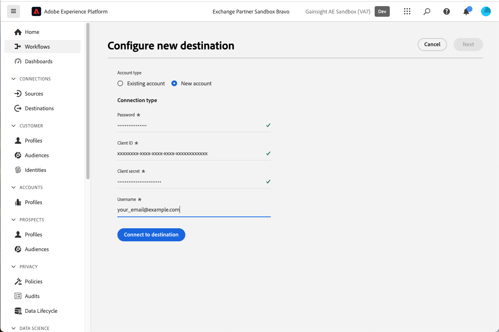

# Gainsight PX-Verbindung {#gainsight-px}

## Übersicht {#overview}

[[!DNL Gainsight PX]](https://www.gainsight.com/product-experience/) ist eine Produkt-Erlebnisplattform, mit der Produktteams verstehen können, wie Benutzer ihre Produkte verwenden, Feedback erfassen und In-App-Interaktionen wie Produktexemplare erstellen können, um das Onboarding von Benutzern und die Produktakzeptanz zu fördern.

>[!IMPORTANT]
>
>Der Ziel-Connector und die Dokumentationsseite werden vom *Gainsight PX* Team. Bei Fragen oder Aktualisierungsanfragen wenden Sie sich direkt an *`pxsupport@gainsight.com`*.

## Anwendungsfälle {#use-cases}

Um Ihnen zu helfen, besser zu verstehen, wie und wann Sie die *Gainsight PX* Ziel, hier finden Sie Beispielanwendungsfälle, die Adobe Experience Platform-Kunden mit diesem Ziel lösen können.

### Targeting von In-App-Interaktionen {#targeting-in-app-engagements}

Ein SaaS-Unternehmen möchte seine Kunden über einen anwendungsinternen Leitfaden, der auf Gainsight PX erstellt wurde, ansprechen. Eine Zielgruppe, die diese Interaktion erhält, wurde auf Adobe Experience Platform aufbauen. Das Gainsight PX-Ziel empfängt die Zielgruppe und stellt sie in der Gainsight PX-Umgebung zur Verfügung.

## Voraussetzungen {#prerequisites}

* Wenden Sie sich an den [!DNL Gainsight] Support-Team unterstützt und die Aktivierung externer Segmentfunktionen für Ihr Abonnement anfordern.
* Generieren Sie einen OAuth-Geheimniswert für Ihr PX-Abonnement mithilfe der **[!UICONTROL Neues Geheimnis generieren]** -Schaltfläche unten im [Seite &quot;Unternehmensdetails&quot;](https://app.aptrinsic.com/settings/subscription)
  

## Unterstützte Identitäten {#supported-identities}

Gainsight PX unterstützt die Aktivierung von Identitäten, die in der folgenden Tabelle beschrieben sind. Erhalten Sie weitere Informationen zu [Identitäten](../../../identity-service/features/namespaces.md).

| Ziel-Identität | Beschreibung |
|---|----|
| IdentifyID | Allgemeine Benutzer-ID, die einen Benutzer in Gainsight PX und Adobe Experience Platform eindeutig identifiziert |

{style="table-layout:auto"}

## Unterstützte Zielgruppen {#supported-audiences}

In diesem Abschnitt wird beschrieben, welcher Audience-Typ Sie an dieses Ziel exportieren können.

| Audience Origin | Unterstützt | Beschreibung |
|---|---|---|
| [!DNL Segmentation Service] | ✓ | Über die Experience Platform generierte Zielgruppen [Segmentierungsdienst](../../../segmentation/home.md). |
| Benutzerdefinierte Uploads | X | Zielgruppen, die aus CSV-Dateien in Experience Platform [importiert](../../../segmentation/ui/overview.md#import-audience) werden. |

{style="table-layout:auto"}

## Exporttyp und -häufigkeit {#export-type-frequency}

Beziehen Sie sich auf die folgende Tabelle, um Informationen zu Typ und Häufigkeit des Zielexports zu erhalten.

| Element | Typ | Anmerkungen |
|---|---|---|
| Exporttyp | **[!UICONTROL Segmentexport]** | Sie exportieren alle Mitglieder einer Zielgruppe mit den IDs (Name, Telefonnummer oder sonstiges), die im [!DNL Gainsight PX]-Ziel verwendet werden. |
| Exporthäufigkeit | **[!UICONTROL Streaming]** | Streaming-Ziele sind „immer verfügbare“ API-basierte Verbindungen. Wenn ein Profil auf der Grundlage einer Zielgruppenbewertung im Experience Platform aktualisiert wird, sendet der Connector das Update nachgelagert an die Zielplattform. Lesen Sie mehr über [Streaming-Ziele](/help/destinations/destination-types.md#streaming-destinations). |

{style="table-layout:auto"}

## Herstellen einer Verbindung mit dem Ziel {#connect}

>[!IMPORTANT]
>
>Um eine Verbindung zum Ziel herzustellen, benötigen Sie die [Zugriffsberechtigung](/help/access-control/home.md#permissions) **[!UICONTROL Ziele verwalten]**. Lesen Sie die [Zugriffskontrolle – Übersicht](/help/access-control/ui/overview.md) oder wenden Sie sich an Ihren Produktadministrator, um die erforderlichen Berechtigungen zu erhalten.

Um eine Verbindung mit diesem Ziel herzustellen, gehen Sie wie im [Tutorial zur Zielkonfiguration](../../ui/connect-destination.md) beschrieben vor. Füllen Sie im Zielkonfigurations-Workflow die Felder aus, die in den beiden folgenden Abschnitten aufgeführt sind.

### Beim Ziel authentifizieren {#authenticate}

Um sich beim Ziel zu authentifizieren, füllen Sie die erforderlichen Felder aus und wählen Sie **[!UICONTROL Mit Ziel verbinden]** aus.

* **[!UICONTROL Passwort]**: Das Kennwort für die Anmeldung bei [[!DNL Gainsight PX]](https://app.aptrinsic.com)
* **[!UICONTROL Client-ID]**: Die Gainsight PX-Abonnement-ID auf der [Seite &quot;Unternehmensdetails&quot;](https://app.aptrinsic.com/settings/subscription)
* **[!UICONTROL Client-Geheimschlüssel]**: Das OAuth-Geheimnis, das unten im [Seite &quot;Unternehmensdetails&quot;](https://app.aptrinsic.com/settings/subscription) im [!DNL Gainsight PX] Benutzeroberfläche.
* **[!UICONTROL Benutzername]**: Die E-Mail, die zum Anmelden bei der [[!DNL Gainsight PX]](https://app.aptrinsic.com) Benutzeroberfläche

### Ausfüllen der Zieldetails {#destination-details}

Füllen Sie die folgenden erforderlichen und optionalen Felder aus, um Details für das Ziel zu konfigurieren. Ein Sternchen neben einem Feld in der Benutzeroberfläche zeigt an, dass das Feld erforderlich ist.

* **[!UICONTROL Name]**: Ein Name, durch den Sie dieses Ziel in Zukunft erkennen können.
* **[!UICONTROL Beschreibung]**: Eine Beschreibung, die Ihnen hilft, dieses Ziel in Zukunft zu identifizieren.

Wenn Sie mit dem Eingeben der Details für Ihre Zielverbindung fertig sind, klicken Sie auf **[!UICONTROL Weiter]**.

## Aktivieren von Segmenten für dieses Ziel {#activate}

>[!IMPORTANT]
>
>* Um Daten zu aktivieren, benötigen Sie die [Zugriffssteuerungsberechtigungen](/help/access-control/home.md#permissions) **[!UICONTROL Ziele verwalten]**, **[!UICONTROL Ziele aktivieren]**, **[!UICONTROL Profile anzeigen]** und **[!UICONTROL Segmente anzeigen]**. Lesen Sie die [Übersicht über die Zugriffskontrolle](/help/access-control/ui/overview.md) oder wenden Sie sich an Ihren Produktadministrator, um die erforderlichen Berechtigungen zu erhalten.
>* Export *identities*, benötigen Sie die **[!UICONTROL Identitätsdiagramm anzeigen]** [Zugriffsberechtigung](/help/access-control/home.md#permissions).   {width="100" zoomable="yes"}

Anweisungen zum Aktivieren von Zielgruppensegmenten für dieses Ziel finden Sie unter [Aktivieren von Profilen und Segmenten für Streaming-Segmentexportziele](/help/destinations/ui/activate-segment-streaming-destinations.md).

### Zuordnen von Identitäten {#map}

Dieses Ziel unterstützt die Zuordnung von Profilattributen und Identitäts-Namespaces. Das Zielgruppen-Mapping muss immer die **[!UICONTROL IDENTIFY_ID]** Identitäts-Namespace.

In den folgenden Beispielen erfahren Sie, wie Sie die Zuordnung konfigurieren.

#### Profilattribut zuordnen {#map-profile-attribute}

Im folgenden Beispiel ist das Quellfeld ein XDM-Profilattribut, das dem Zielnamespace IDENTIFY_ID zugeordnet wird.

#### Identitäts-Namespace zuordnen {#map-identity-namespace}

Im folgenden Beispiel ist das Quellfeld ein Identitäts-Namespace (**[!UICONTROL ECID]**), das der **[!UICONTROL IDENTIFY_ID]** Zielgruppen-Namespace.

## Exportierte Daten/Datenexport validieren {#exported-data}

Segmentierungsdaten werden vom Experience Platform an Gainsight PX gestreamt.

Segmentmetadaten werden im Bildschirm Segmente innerhalb der [!DNL Gainsight PX] Benutzeroberfläche.

Informationen zur Segmentmitgliedschaft finden Sie auf der Registerkarte Segmente im Audience Explorer-Bildschirm des [!DNL Gainsight PX] Benutzeroberfläche.

## Datennutzung und -Governance {#data-usage-governance}

Alle [!DNL Adobe Experience Platform]-Ziele sind bei der Verarbeitung Ihrer Daten mit Datennutzungsrichtlinien konform. Ausführliche Informationen darüber, wie [!DNL Adobe Experience Platform] Data Governance erzwingt, finden Sie unter [Data Governance - Übersicht](/help/data-governance/home.md).
