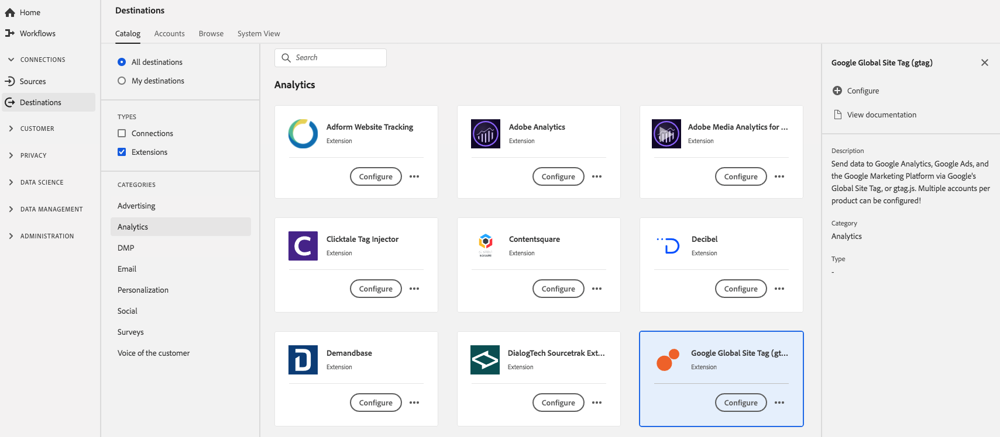

# [!DNL Google Global Site Tag]-Erweiterung {#gtag-analytics-extension}

## Übersicht {#overview}

Senden Sie Daten an [!DNL Google Analytics], [!DNL Google Ads] und [!DNL Google Marketing Platform] über [!DNL Google's Global Site Tag] oder gtag.js. Für die einzelnen Produkte können jeweils mehrere Konten konfiguriert werden.

[!DNL Google Global Site Tag] ist eine Analytics-Erweiterung in Adobe Experience Platform. Weitere Informationen zur Funktionalität der Erweiterung finden Sie auf der Seite der Erweiterung auf [Adobe Exchange](https://exchange.adobe.com/experiencecloud.details.101437.google-global-site-tag-gtag.html).

Dieses Ziel ist eine Adobe Experience Platform Launch-Erweiterung. Weitere Informationen zur Funktionsweise von Platform launch-Erweiterungen in Platform finden Sie unter [Übersicht über Adobe Experience Platform Launch-Erweiterungen](../launch-extensions/overview.md).

## Voraussetzungen  {#prerequisites}

Diese Erweiterung ist im Katalog [!DNL Destinations] für alle Kunden verfügbar, die Platform gekauft haben.

Um diese Erweiterung verwenden zu können, benötigen Sie Zugriff auf Adobe Experience Platform Launch.  Platform Launch ist für Adobe Experience Cloud-Kunden als integrierte, Mehrwert bietende Funktion verfügbar. Wenden Sie sich an Ihren Unternehmensadministrator, um Zugriff auf Platform launch zu erhalten, und bitten Sie ihn, Ihnen die **[!UICONTROL manage_properties]**-Berechtigung zu erteilen, damit Sie Erweiterungen installieren können.

## Installieren einer Erweiterung {#install-extension}

So installieren Sie die Erweiterung [!DNL Google Global Site Tag]:

Wechseln Sie in der [Plattform-Schnittstelle](http://platform.adobe.com/) zu **[!UICONTROL Ziele]** > **[!UICONTROL Katalog]**.

Wählen Sie die Erweiterung aus dem Katalog aus oder verwenden Sie die Suchleiste.

Klicken Sie auf das Ziel, um es hervorzuheben, und wählen Sie dann **[!UICONTROL Konfigurieren]** in der rechten Leiste aus. Wenn das Steuerelement **[!UICONTROL Configure]** ausgegraut ist, fehlt Ihnen die Berechtigung **[!UICONTROL manage_properties]**. Siehe [Voraussetzungen](#prerequisites).

Wählen Sie im Fenster **[!UICONTROL Verfügbare Platform launch-Eigenschaft]** auswählen die Platform launch-Eigenschaft aus, in der Sie die Erweiterung installieren möchten. Sie haben auch die Möglichkeit, eine neue Eigenschaft im Platform launch zu erstellen. Eine Eigenschaft ist eine Sammlung von Regeln, Datenelementen, konfigurierten Erweiterungen, Umgebungen und Bibliotheken. Weitere Informationen zu den Eigenschaften finden Sie im Abschnitt [Eigenschaftenseite](https://experienceleague.adobe.com/docs/launch/using/reference/admin/companies-and-properties.html#properties-page) der Platform launch-Dokumentation.

Der Arbeitsablauf führt Sie zum Platform launch, um die Installation abzuschließen.

Weitere Informationen zu den Konfigurationsoptionen für die Erweiterung finden Sie auf [Adobe Exchange](https://exchange.adobe.com/experiencecloud.details.101437.google-global-site-tag-gtag.html) unter der Seite zur Erweiterung.

Sie können die Erweiterung auch direkt in der [Adobe Experience Platform Launch-Schnittstelle](https://launch.adobe.com/) installieren. Siehe [Hinzufügen einer neuen Erweiterung](https://experienceleague.adobe.com/docs/launch/using/reference/manage-resources/extensions/overview.html?lang=en#add-a-new-extension) in der Platform launch-Dokumentation.

## Verwenden der Erweiterung {#how-to-use}

Nachdem Sie die Erweiterung installiert haben, können Sie Beginn zum Einrichten von Regeln für diese direkt in Platform launch verwenden.

Unter Platform launch können Sie Regeln für Ihre installierten Erweiterungen einrichten, um nur in bestimmten Situationen Ereignis-Daten an das Erweiterungsziel zu senden. Weitere Informationen zum Einrichten von Regeln für Erweiterungen finden Sie in der [Regeldokumentation](https://experienceleague.adobe.com/docs/launch/using/reference/manage-resources/rules.html).

## Konfigurieren, Aktualisieren und Löschen von Erweiterungen {#configure-upgrade-delete}

Sie können Erweiterungen in der Platform launch-Oberfläche konfigurieren, aktualisieren und löschen.

>[!TIP]
>
>Wenn die Erweiterung bereits auf einer Ihrer Eigenschaften installiert ist, zeigt die Plattform-Benutzeroberfläche für die Erweiterung weiterhin **[!UICONTROL Install]** an. Starten Sie den Installationsarbeitsablauf wie unter [Erweiterung installieren](#install-extension) beschrieben, um zum Platform launch zu gelangen und Ihre Erweiterung zu konfigurieren oder zu löschen.

Informationen zum Aktualisieren Ihrer Erweiterung finden Sie unter [Extension-Aktualisierung](https://experienceleague.adobe.com/docs/launch/using/reference/manage-resources/extensions/extension-upgrade.html) in der Platform launch-Dokumentation.

