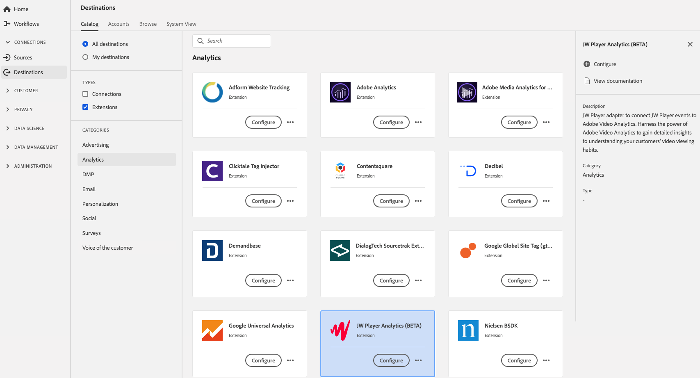

# [!DNL JW Player Analytics] (BETA) Erweiterung  {#jw-player-analytics-extension}

## Übersicht {#overview}

Mit dieser Erweiterung wird der Adapter [!DNL JW Player] installiert, um [!DNL JW Player]-Ereignis mit Adobe Video Analytics zu verbinden. Nutzen Sie die Vorteile von Adobe Video Analytics, um detaillierte Einblicke in die Videoanzeigegewohnheiten Ihrer Kunden zu gewinnen.

[!DNL JW Player Analytics] (BETA) ist eine Analytics-Erweiterung in Adobe Experience Platform. Weitere Informationen zur Funktionalität der Erweiterung finden Sie auf der Seite der Erweiterung auf [Adobe Exchange](https://exchange.adobe.com/experiencecloud.details.101523.jw-player-analytics-launch-extension.html).

Dieses Ziel ist eine Adobe Experience Platform Launch-Erweiterung. Weitere Informationen zur Funktionsweise von Plattformstarterweiterungen in Platform finden Sie unter [Übersicht über Adobe Experience Platform Launch-Erweiterungen](../launch-extensions/overview.md).

## Voraussetzungen {#prerequisites}

Diese Erweiterung ist im Katalog [!DNL Destinations] für alle Kunden verfügbar, die Platform gekauft haben.

Um diese Erweiterung verwenden zu können, benötigen Sie Zugriff auf Adobe Experience Platform Launch.  Platform Launch ist für Adobe Experience Cloud-Kunden als integrierte, Mehrwert bietende Funktion verfügbar. Wenden Sie sich an Ihren Unternehmensadministrator, um Zugriff auf den Plattformstart zu erhalten, und bitten Sie ihn, Ihnen die **[!UICONTROL manage_properties]**-Berechtigung zu erteilen, damit Sie Erweiterungen installieren können.

## Installieren einer Erweiterung {#install-extension}

So installieren Sie die Erweiterung [!DNL JW Player Analytics] (BETA):

Wechseln Sie in der [Plattform-Schnittstelle](http://platform.adobe.com/) zu **[!UICONTROL Ziele]** > **[!UICONTROL Katalog]**.

Wählen Sie die Erweiterung aus dem Katalog aus oder verwenden Sie die Suchleiste.

Klicken Sie auf das Ziel, um es hervorzuheben, und wählen Sie dann **[!UICONTROL Konfigurieren]** in der rechten Leiste aus. Wenn das Steuerelement **[!UICONTROL Configure]** ausgegraut ist, fehlt Ihnen die Berechtigung **[!UICONTROL manage_properties]**. Siehe [Voraussetzungen](#prerequisites).

Wählen Sie im Fenster **[!UICONTROL Select available Platform Launch property]** die Plattformstarteigenschaft aus, in der Sie die Erweiterung installieren möchten. Sie haben auch die Möglichkeit, eine neue Eigenschaft in Platform Launch zu erstellen. Eine Eigenschaft ist eine Sammlung von Regeln, Datenelementen, konfigurierten Erweiterungen, Umgebungen und Bibliotheken. Weitere Informationen zu den Eigenschaften finden Sie im Abschnitt [Seite Eigenschaften](https://experienceleague.adobe.com/docs/launch/using/reference/admin/companies-and-properties.html#properties-page) der Dokumentation zum Plattformstart.

Der Arbeitsablauf führt Sie zum Plattformstart, um die Installation abzuschließen.

Informationen zu den Konfigurationsoptionen für Erweiterungen finden Sie auf der [JW Player Analytics (BETA)-Erweiterungsseite](https://exchange.adobe.com/experiencecloud.details.101523.jw-player-analytics-launch-extension.html) in Adobe Exchange.

Sie können die Erweiterung auch direkt in der [Adobe Experience Platform Launch-Schnittstelle](https://launch.adobe.com/) installieren. Siehe [Hinzufügen einer neuen Erweiterung](https://experienceleague.adobe.com/docs/launch/using/reference/manage-resources/extensions/overview.html?lang=en#add-a-new-extension) in der Dokumentation zum Plattformstart.

## Verwenden der Erweiterung {#how-to-use}

Nachdem Sie die Erweiterung installiert haben, können Sie Beginn zum Einrichten von Regeln für diese Erweiterung direkt in Platform Launch einrichten.

Unter &quot;Plattformstart&quot;können Sie Regeln für Ihre installierten Erweiterungen einrichten, um nur in bestimmten Situationen Ereignis-Daten an das Erweiterungsziel zu senden. Weitere Informationen zum Einrichten von Regeln für Erweiterungen finden Sie in der [Regeldokumentation](https://experienceleague.adobe.com/docs/launch/using/reference/manage-resources/rules.html).

## Konfigurieren, Aktualisieren und Löschen von Erweiterungen {#configure-upgrade-delete}

Sie können Erweiterungen in der Benutzeroberfläche &quot;Plattformstart&quot;konfigurieren, aktualisieren und löschen.

>[!TIP]
>
>Wenn die Erweiterung bereits auf einer Ihrer Eigenschaften installiert ist, zeigt die Plattform-Benutzeroberfläche für die Erweiterung weiterhin **[!UICONTROL Install]** an. Starten Sie den Installationsvorgang wie unter [Erweiterung installieren](#install-extension) beschrieben, um zum Plattformstart zu gelangen und Ihre Erweiterung zu konfigurieren oder zu löschen.

Informationen zum Aktualisieren Ihrer Erweiterung finden Sie unter [Extension-Aktualisierung](https://experienceleague.adobe.com/docs/launch/using/reference/manage-resources/extensions/extension-upgrade.html) in der Dokumentation zum Plattformstart.

