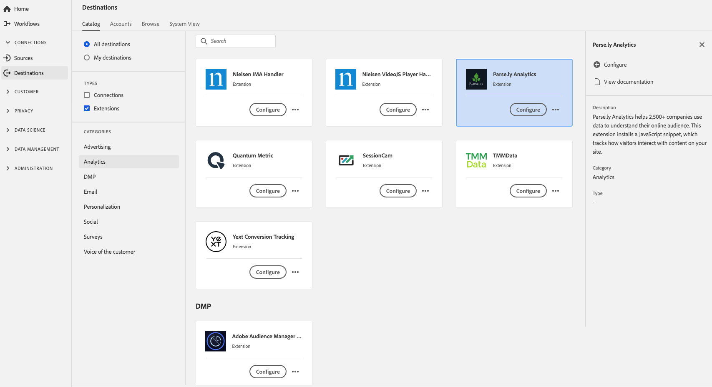

# [!DNL Parse.ly Analytics]-Erweiterung {#parsely-analytics-extension}

## Übersicht {#overview}

[!DNL Parse.ly Analytics] hilft mehr als 2.500 Unternehmen, Daten zu verwenden, um ihre Online-Zielgruppe zu verstehen. Mit dieser Erweiterung wird ein JavaScript-Snippet installiert, das verfolgt, wie Besucher mit Inhalten auf Ihrer Site interagieren.

Parse.ly ist eine Analytics-Erweiterung in Adobe Experience Platform. Weiterführende Informationen zur Erweiterungsfunktion finden Sie unter [Parse.ly Analytics](https://www.parse.ly/).

Dieses Ziel ist eine Tag-Erweiterung. Weitere Informationen zur Funktionsweise von Tag-Erweiterungen in Experience Platform finden Sie unter [Tag-Erweiterungen - Übersicht](../launch-extensions/overview.md).

## Voraussetzungen  {#prerequisites}

Diese Erweiterung ist im [!DNL Destinations] für alle Kunden verfügbar, die Experience Platform erworben haben.

Um diese Erweiterung verwenden zu können, müssen Sie Zugriff auf Tags in Adobe Experience Platform haben. Tags werden Adobe Experience Cloud-Kunden als integrierte Mehrwertfunktion angeboten. Wenden Sie sich an den Admin Ihrer Organisation, um Zugriff auf Tags zu erhalten, und bitten Sie darum, Ihnen die Berechtigung **[!UICONTROL manage_properties]** zu erteilen, damit Sie Erweiterungen installieren können.

## Installieren einer Erweiterung {#install-extension}

So installieren Sie die [!DNL Parse.ly]-Erweiterung:

Experience Platform Wechseln Sie in der [&#128279;](https://platform.adobe.com/) von zu **[!UICONTROL Ziele]** > **[!UICONTROL Katalog]**.

Wählen Sie die Erweiterung aus dem Katalog aus oder verwenden Sie die Suchleiste.

Klicken Sie auf das Ziel, um es zu markieren, und wählen Sie dann in der rechten Leiste die Option **[!UICONTROL Konfigurieren]** aus. Wenn das Feld **[!UICONTROL Konfigurieren]** ausgegraut ist, verfügen Sie nicht über die Berechtigung **[!UICONTROL manage_properties]**. Siehe [Voraussetzungen](#prerequisites).

Wählen Sie die Eigenschaft aus, in der Sie die Erweiterung installieren möchten. Sie können auch eine neue Eigenschaft erstellen. Eine Eigenschaft ist eine Sammlung von Regeln, Datenelementen, konfigurierten Erweiterungen, Umgebungen und Bibliotheken. Informationen zu Eigenschaften finden Sie im [Eigenschaften-Seitenabschnitt](../../../tags/ui/administration/companies-and-properties.md#properties-page) der Tags-Dokumentation.

Der Workflow führt Sie durch die Schritte zum Abschließen der Installation.

Sie können die Erweiterung auch direkt in der [Datenerfassungs-Benutzeroberfläche](https://experience.adobe.com/#/data-collection/) installieren. Weitere Informationen finden Sie im Abschnitt zum Thema [Hinzufügen einer neuen Erweiterung](../../../tags/ui/managing-resources/extensions/overview.md#add-a-new-extension) in der Tag-Dokumentation.

## Verwenden der Erweiterung {#how-to-use}

Nachdem Sie die Erweiterung installiert haben, können Sie mit dem Einrichten von Regeln beginnen.

Sie können Regeln für Ihre installierten Erweiterungen einrichten, damit nur in bestimmten Situationen Ereignisdaten an das Erweiterungsziel gesendet werden. Weitere Informationen zum Einrichten von Regeln für Erweiterungen finden Sie in der [Tags-Dokumentation](../../../tags/ui/managing-resources/rules.md).

## Konfigurieren, Aktualisieren und Löschen von Erweiterungen {#configure-upgrade-delete}

Sie können Erweiterungen in der Datenerfassungs-Benutzeroberfläche konfigurieren, aktualisieren und löschen.

>[!TIP]
>
>Wenn die Erweiterung bereits in einer Ihrer Eigenschaften installiert ist, wird in der Experience Platform-Benutzeroberfläche weiterhin &quot;**[!UICONTROL &quot;]** die Erweiterung angezeigt. Starten Sie den Installations-Workflow, wie unter [Installieren einer Erweiterung](#install-extension) beschrieben, um Ihre Erweiterung zu konfigurieren oder zu löschen.

Informationen zum Aktualisieren Ihrer Erweiterung finden Sie in der Anleitung zum [Erweiterungs-Upgrade-Prozess](../../../tags/ui/managing-resources/extensions/extension-upgrade.md) in der Tags-Dokumentation.
