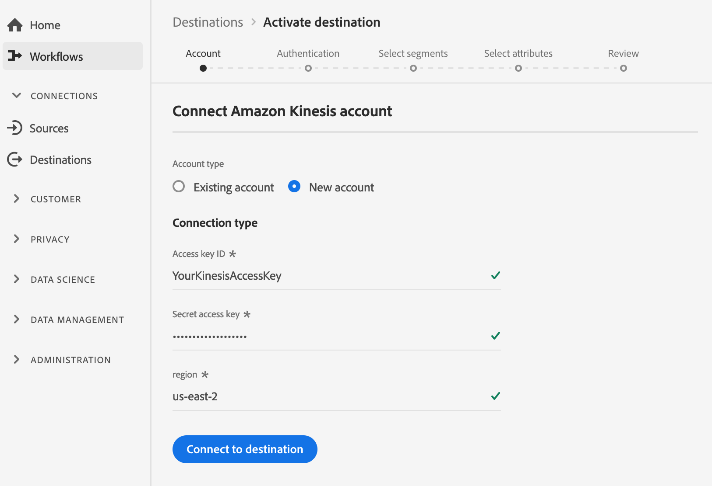
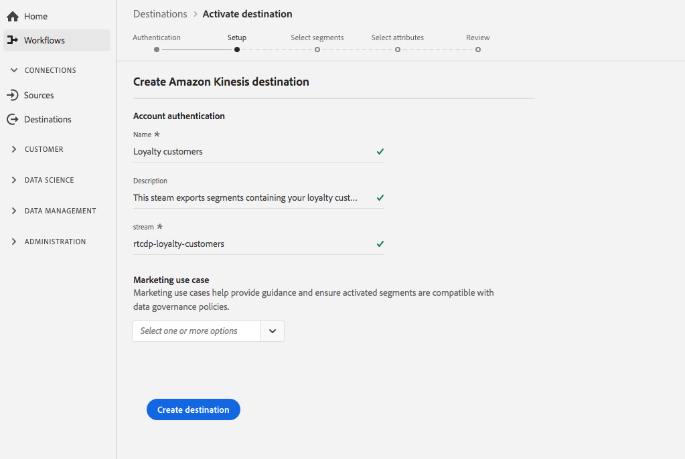

# (Beta) [!DNL Amazon Kinesis]-Verbindung

>[!IMPORTANT]
>
>Das [!DNL Amazon Kinesis]-Ziel in der Plattform befindet sich derzeit in der Betaphase. Die Dokumentation und Funktionalität können sich ändern.

Mit dem [!DNL Kinesis Data Streams]-Dienst von [!DNL Amazon Web Services] können Sie große Datenströme in Echtzeit erfassen und verarbeiten.

Sie können eine ausgehende Echtzeitverbindung zu Ihrer [!DNL Amazon Kinesis]-Datenspeicherung erstellen, um Daten von Adobe Experience Platform zu streamen.

* Weitere Informationen zu [!DNL Amazon Kinesis] finden Sie in der [Amazon-Dokumentation](https://docs.aws.amazon.com/streams/latest/dev/introduction.html).
* Informationen zum Herstellen einer Verbindung mit [!DNL Amazon Kinesis] mithilfe von API-Aufrufen finden Sie im Lehrgang [Streaming-Ziel-API](../../api/streaming-destinations.md).
* Informationen zum Herstellen einer Verbindung mit [!DNL Amazon Kinesis] mithilfe der Plattform-Benutzeroberfläche finden Sie in den folgenden Abschnitten.


## Nutzungsszenarien {#use-cases}

Durch die Verwendung von Streaming-Zielen wie [!DNL Amazon Kinesis] können Sie einfach hochwertige Segmentierungssysteme und zugehörige Profil-Attribute in Ihre bevorzugten Ereignis einspeisen.

Beispielsweise hat ein Potenzieller Kunde ein White Paper heruntergeladen, das sie in ein &quot;hohes Konversionssegment&quot;einordnet. Wenn Sie das Segment zuordnen, in das der Potenzieller Kunde zum [!DNL Amazon Kinesis]-Ziel gehört, erhalten Sie dieses Ereignis in [!DNL Amazon Kinesis]. Dort können Sie einen Do-it-self-Ansatz verwenden und die Geschäftslogik über das Ereignis beschreiben, da Sie denken, dass dies am besten mit Ihren IT-Systemen im Unternehmen funktionieren würde.

## Exporttyp {#export-type}

**Profil-basiert** : Sie exportieren alle Segmentmitglieder zusammen mit den gewünschten Segmentfeldern (z. B.: E-Mail-Adresse, Telefonnummer, Nachname), wie im Bildschirm &quot;Attribute auswählen&quot;des Arbeitsablaufs für die  [Ziel-Aktivierung](../../ui/activate-destinations.md#select-attributes) ausgewählt.

## Ziel verbinden {#connect-destination}

Unter [Arbeitsablauf für Cloud-Datenspeicherung-Ziele ](./workflow.md)finden Sie Anweisungen zum Herstellen einer Verbindung mit Ihren Cloud-Datenspeicherung-Zielen, einschließlich der von [!DNL Amazon] unterstützten Ziele.

Geben Sie für [!DNL Amazon Kinesis]-Ziele im Arbeitsablauf zum Erstellen von Zielen die folgenden Informationen ein:

### Im Authentifizierungsschritt {#authentication-step}

* **[!DNL Amazon Web Services]Zugriffsschlüssel und geheimer Schlüssel**: Generieren Sie  [!DNL Amazon Web Services]ein  `access key - secret access key` Paar, um Plattformzugriff auf Ihr  [!DNL Amazon Kinesis] Konto zu gewähren. Weitere Informationen finden Sie in der Dokumentation zu Amazon Web Services](https://docs.aws.amazon.com/IAM/latest/UserGuide/id_credentials_access-keys.html).[
* **Region**: Geben Sie an, zu welchem  [!DNL Amazon Web Services] Bereich Daten gestreamt werden sollen.



### Im Einrichtungsschritt {#setup-step}

* **Name**: Geben Sie einen Namen für Ihre Verbindung an zu  [!DNL Amazon Kinesis]
* **Beschreibung**: Geben Sie eine Beschreibung für Ihre Verbindung mit an  [!DNL Amazon Kinesis].
* **Stream**: Geben Sie den Namen eines vorhandenen Datenstroms in Ihrem  [!DNL Amazon Kinesis] Konto an. Die Plattform exportiert Daten in diesen Stream.



<!--

>[!IMPORTANT]
>
>Platform needs `write` permissions on the bucket object where the export files will be delivered.

-->

## Aktivieren von Segmenten {#activate-segments}

Informationen zum Workflow für die Segmentaktivierung finden Sie unter [Profile und Segmente für ein Ziel aktivieren](../../ui/activate-destinations.md).

## Exportierte Daten {#exported-data}

Ihre exportierten [!DNL Experience Platform]-Daten landen im JSON-Format [!DNL Amazon Kinesis]. Beispielsweise enthält das unten stehende Ereignis das E-Mail-Adressprofilattribut einer Zielgruppe, die sich für ein bestimmtes Segment qualifiziert und ein anderes Segment beendet hat. Die Identitäten für diese Perspektive sind ECID und E-Mail.

```json
{
  "person": {
    "email": "yourstruly@adobe.con"
  },
  "segmentMembership": {
    "ups": {
      "7841ba61-23c1-4bb3-a495-00d3g5fe1e93": {
        "lastQualificationTime": "2020-05-25T21:24:39Z",
        "status": "exited"
      },
      "59bd2fkd-3c48-4b18-bf56-4f5c5e6967ae": {
        "lastQualificationTime": "2020-05-25T23:37:33Z",
        "status": "existing"
      }
    }
  },
  "identityMap": {
    "ecid": [
      {
        "id": "14575006536349286404619648085736425115"
      },
      {
        "id": "66478888669296734530114754794777368480"
      }
    ],
    "email_lc_sha256": [
      {
        "id": "655332b5fa2aea4498bf7a290cff017cb4"
      },
      {
        "id": "66baf76ef9de8b42df8903f00e0e3dc0b7"
      }
    ]
  }
}
```


>[!MORELIKETHIS]
>
>* [Herstellen einer Verbindung zu Amazon Kinesis und Aktivieren von Daten mithilfe von API-Aufrufen](../../api/streaming-destinations.md)
>* [Azure Event Hubs-Ziel](./azure-event-hubs.md)
>* [Zieltypen und Kategorien](../../destination-types.md)

