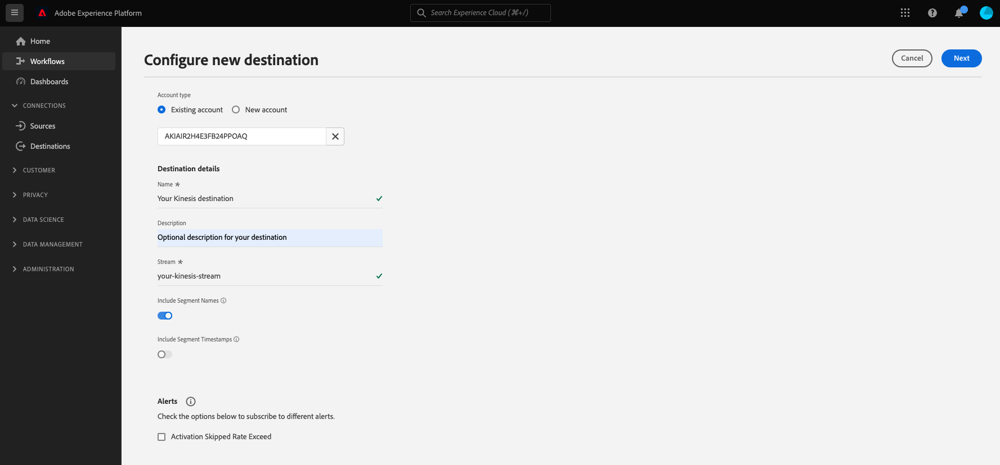

# [!DNL Amazon Kinesis]-Verbindung

## Übersicht {#overview}

>[!IMPORTANT]
>
> Dieses Ziel ist nur für Kunden von [Adobe Real-time Customer Data Platform Ultimate](https://helpx.adobe.com/de/legal/product-descriptions/real-time-customer-data-platform.html) verfügbar.

Mit dem [!DNL Kinesis Data Streams]-Service von [!DNL Amazon Web Services] können Sie große Streams an Datensätzen in Echtzeit erfassen und verarbeiten.

Sie können eine ausgehende Echtzeit-Verbindung zu Ihrem [!DNL Amazon Kinesis]-Speicher herstellen, um Daten von Adobe Experience Platform zu streamen.

* Weitere Informationen zu [!DNL Amazon Kinesis] finden Sie in der [Dokumentation zu Amazon](https://docs.aws.amazon.com/streams/latest/dev/introduction.html).
* Informationen zum programmgesteuerten Herstellen einer Verbindung zu [!DNL Amazon Kinesis] finden Sie im [Tutorial zur Streaming-Ziele-API](../../api/streaming-destinations.md).
* Informationen zum Verbinden von mit [!DNL Amazon Kinesis] über die Benutzeroberfläche von Experience Platform finden Sie in den folgenden Abschnitten.


## Anwendungsfälle {#use-cases}

Durch die Verwendung von Streaming-Zielen wie [!DNL Amazon Kinesis] können Sie einfach hochwertige Segmentierungsereignisse und zugehörige Profilattribute in Ihre gewünschten Systeme einspeisen.

Ein potenzieller Kunde hat beispielsweise ein Whitepaper heruntergeladen, in dem er in ein Segment mit einer hohen Konversionsneigung eingestuft wird. Wenn Sie die Zielgruppe, zu der der Interessent gehört, dem [!DNL Amazon Kinesis] Ziel zuordnen, erhalten Sie dieses Ereignis in [!DNL Amazon Kinesis]. Dort können Sie einen Do-it-yourself-Ansatz verwenden und zusätzlich zur Veranstaltung die Geschäftslogik beschreiben, die Ihrer Meinung nach am besten mit Ihren Unternehmens-IT-Systemen funktionieren würde.

## Unterstützte Zielgruppen {#supported-audiences}

In diesem Abschnitt wird beschrieben, welche Arten von Zielgruppen Sie an dieses Ziel exportieren können.

| Zielgruppenherkunft | Unterstützt | Beschreibung |
|---------|----------|----------|
| [!DNL Segmentation Service] | ✓ | Zielgruppen, die über den Experience Platform-[ (Segmentierungs-Service) generiert ](../../../segmentation/home.md). |
| Benutzerdefinierte Uploads | ✓ | Zielgruppen, die aus CSV-Dateien in Experience Platform [importiert](../../../segmentation/ui/audience-portal.md#import-audience) werden. |

{style="table-layout:auto"}

## Exporttyp und -häufigkeit {#export-type-frequency}

Beziehen Sie sich auf die folgende Tabelle, um Informationen zu Typ und Häufigkeit des Zielexports zu erhalten.

| Element | Typ | Anmerkungen |
---------|----------|---------|
| Exporttyp | **[!UICONTROL Profilbasiert]** | Sie exportieren alle Mitglieder eines Segments zusammen mit den gewünschten Schemafeldern (z. B. E-Mail-Adresse, Telefonnummer, Nachname), wie im Bildschirm „Auswählen der Profilattribute“ im [Zielaktivierungs-Workflow](../../ui/activate-batch-profile-destinations.md#select-attributes) festgelegt. |
| Exporthäufigkeit | **[!UICONTROL Streaming]** | Streaming-Ziele sind „immer verfügbare“ API-basierte Verbindungen. Sobald ein Profil in Experience Platform auf der Grundlage einer Zielgruppenauswertung aktualisiert wird, sendet der Connector das Update nachgelagert an die Zielplattform. Lesen Sie mehr über [Streaming-Ziele](/help/destinations/destination-types.md#streaming-destinations). |

{style="table-layout:auto"}

## Zulassungsliste von IP-Adressen {#ip-address-allowlist}

Um die Sicherheits- und Compliance-Anforderungen von Kundinnen und Kunden zu erfüllen, stellt Experience Platform auf die Zulassungsliste setzen eine Liste mit statischen IPs bereit, die Sie für das [!DNL Amazon Kinesis]-Ziel auswählen können. Siehe [Zulassungsliste von IP-Adressen für Streaming-Ziele](/help/destinations/catalog/streaming/ip-address-allow-list.md), um die vollständige Liste der IP-Adressen in der Zulassungsliste einzusehen.

## Erforderliche [!DNL Amazon Kinesis]-Berechtigungen {#required-kinesis-permission}

Um Daten erfolgreich mit Ihren [!DNL Amazon Kinesis]-Streams zu verbinden und dorthin zu exportieren, benötigt Experience Platform Berechtigungen für die folgenden Aktionen:

* `kinesis:ListStreams`
* `kinesis:PutRecord`
* `kinesis:PutRecords`

Diese Berechtigungen werden über die [!DNL Kinesis] Console angeordnet und von Experience Platform überprüft, sobald Sie Ihr Kinesis-Ziel in der Experience Platform-Benutzeroberfläche konfigurieren.

Im folgenden Beispiel werden die Mindestzugriffsrechte angezeigt, die zum erfolgreichen Exportieren von Daten an ein [!DNL Kinesis] erforderlich sind.

```json
{
    "Version": "2012-10-17",
    "Statement": [
        {
            "Effect": "Allow",
            "Action": [
                "kinesis:ListStreams",
                "kinesis:PutRecord",
                "kinesis:PutRecords"
            ],
            "Resource": [
                "arn:aws:kinesis:us-east-2:901341027596:stream/*"
            ]
        }
    ]
}
```

| Eigenschaft | Beschreibung |
| -------- | ----------- |
| `kinesis:ListStreams` | Eine Aktion, die Ihre Amazon Kinesis-Datenströme auflistet. |
| `kinesis:PutRecord` | Eine Aktion, die einen einzelnen Datensatz in einen Kinesis-Datenstrom schreibt. |
| `kinesis:PutRecords` | Eine Aktion, die in einem einzigen Aufruf mehrere Datensätze in einen Kinesis-Datenstrom schreibt. |

{style="table-layout:auto"}

Weitere Informationen zum Steuern des Zugriffs für [!DNL Kinesis] Datenströme finden Sie im folgenden [[!DNL Kinesis] Dokument](https://docs.aws.amazon.com/streams/latest/dev/controlling-access.html).

## Herstellen einer Verbindung mit dem Ziel {#connect}

>[!IMPORTANT]
> 
>Um eine Verbindung mit dem Ziel herzustellen, benötigen Sie **[!UICONTROL Ziele anzeigen]** und **[!UICONTROL Ziele verwalten]** [Zugriffssteuerungsberechtigungen](/help/access-control/home.md#permissions). Lesen Sie die [Zugriffskontrolle – Übersicht](/help/access-control/ui/overview.md) oder wenden Sie sich an Ihren Produktadministrator, um die erforderlichen Berechtigungen zu erhalten.

Um eine Verbindung mit diesem Ziel herzustellen, gehen Sie wie im [Tutorial zur Zielkonfiguration](../../ui/connect-destination.md) beschrieben vor. Beim Herstellen einer Verbindung zu diesem Ziel müssen Sie die folgenden Informationen angeben:

### Authentifizierungsinformationen {#authentication-information}

Geben Sie die unten stehenden Felder ein und wählen Sie **[!UICONTROL Mit Ziel verbinden]**:


* **[!DNL Amazon Web Services]-Zugriffsschlüssel und geheimer Schlüssel**: Generieren Sie in [!DNL Amazon Web Services] ein `access key - secret access key`, um Experience Platform Zugriff auf Ihr [!DNL Amazon Kinesis] zu gewähren. Weitere Informationen finden Sie in der [Amazon Web Services-Dokumentation](https://docs.aws.amazon.com/de_de/IAM/latest/UserGuide/id_credentials_access-keys.html).
* **[!UICONTROL Region]**: Geben Sie an, an welche [!DNL Amazon Web Services] Daten gestreamt werden sollen.

### Ausfüllen der Zieldetails {#destination-details}

>[!CONTEXTUALHELP]
>id="platform_destinations_connect_kinesis_includesegmentnames"
>title="Segmentnamen einschließen"
>abstract="Schalten Sie diese Option ein, wenn der Datenexport die Namen der zu exportierenden Zielgruppen enthalten soll. In der Dokumentation finden Sie ein Beispiel für einen Datenexport mit dieser Option."

>[!CONTEXTUALHELP]
>id="platform_destinations_connect_kinesis_includesegmenttimestamps"
>title="Zeitstempel für Segmente einschließen"
>abstract="Schalten Sie diese Option ein, wenn der Datenexport den UNIX-Zeitstempel enthalten soll, an dem die Zielgruppen erstellt und aktualisiert wurden, sowie den UNIX-Zeitstempel, an dem die Zielgruppen dem Ziel für die Aktivierung zugeordnet wurden. In der Dokumentation finden Sie ein Beispiel für einen Datenexport mit dieser Option."

Füllen Sie die folgenden erforderlichen und optionalen Felder aus, um Details für das Ziel zu konfigurieren. Ein Sternchen neben einem Feld in der Benutzeroberfläche zeigt an, dass das Feld erforderlich ist.



* **[!UICONTROL Name]**: Geben Sie einen Namen für Ihre Verbindung mit [!DNL Amazon Kinesis] an
* **[!UICONTROL Beschreibung]**: Geben Sie eine Beschreibung für Ihre Verbindung mit [!DNL Amazon Kinesis] an.
* **[!UICONTROL Stream]**: Geben Sie den Namen eines vorhandenen Daten-Streams in Ihrem [!DNL Amazon Kinesis]-Konto an. Experience Platform exportiert Daten in diesen Stream.
* **[!UICONTROL Segmentnamen einschließen]**: Schalten Sie diese Option ein, wenn der Datenexport die Namen der zu exportierenden Zielgruppen enthalten soll. Ein Beispiel für einen Datenexport, bei dem diese Option aktiviert ist, finden Sie im Abschnitt [Exportierte Daten](#exported-data) weiter unten.
* **[!UICONTROL Segmentzeitstempel einschließen]**: Schalten Sie diese Option ein, wenn der Datenexport den UNIX-Zeitstempel enthalten soll, an dem die Zielgruppen erstellt und aktualisiert wurden, sowie den UNIX-Zeitstempel, an dem die Zielgruppen dem Ziel für die Aktivierung zugeordnet wurden. Ein Beispiel für einen Datenexport, bei dem diese Option aktiviert ist, finden Sie im Abschnitt [exportierte Daten](#exported-data) weiter unten.

<!--

>[!IMPORTANT]
>
>Experience Platform needs `write` permissions on the bucket object where the export files will be delivered.

-->

### Aktivieren von Warnhinweisen {#enable-alerts}

Sie können Warnhinweise aktivieren, um Benachrichtigungen zum Status des Datenflusses zu Ihrem Ziel zu erhalten. Wählen Sie einen Warnhinweis aus der zu abonnierenden Liste aus, um Benachrichtigungen über den Status Ihres Datenflusses zu erhalten. Weitere Informationen zu Warnhinweisen finden Sie im Handbuch zum [Abonnieren von Zielwarnhinweisen über die Benutzeroberfläche](../../ui/alerts.md).

Wenn Sie alle Details für Ihre Zielverbindung eingegeben haben, klicken Sie auf **[!UICONTROL Weiter]**.

## Aktivieren von Zielgruppen für dieses Ziel {#activate}

>[!IMPORTANT]
> 
>* Zum Aktivieren von Daten benötigen Sie die Berechtigungen **[!UICONTROL Ziele anzeigen]**, **[!UICONTROL Ziele aktivieren]**, **[!UICONTROL Profile anzeigen]** und **[!UICONTROL Segmente anzeigen]**[Zugriffssteuerung](/help/access-control/home.md#permissions). Lesen Sie die [Übersicht über die Zugriffssteuerung](/help/access-control/ui/overview.md) oder wenden Sie sich an Ihre Produktadmins, um die erforderlichen Berechtigungen zu erhalten.
>* [Bewertung der Einverständnisrichtlinie](/help/data-governance/enforcement/auto-enforcement.md#consent-policy-evaluation) wird derzeit nicht in Exporten an das Amazon Kinesis-Ziel unterstützt. [Weitere Informationen](/help/destinations/ui/activate-streaming-profile-destinations.md#consent-policy-evaluation).

Anweisungen [ Aktivieren von Zielgruppen für dieses Ziel finden Sie ](../../ui/activate-streaming-profile-destinations.md) „Aktivieren von Zielgruppendaten für Streaming Profilexportziele“.

## Profilexportverhalten {#profile-export-behavior}

Experience Platform optimiert das Verhalten beim Profilexport für Ihr [!DNL Amazon Kinesis] Ziel, sodass nur Daten an Ihr Ziel exportiert werden, wenn relevante Profilaktualisierungen nach der Zielgruppenqualifizierung oder anderen wichtigen Ereignissen durchgeführt wurden. Profile werden in den folgenden Situationen an Ihr Ziel exportiert:

* Die Aktualisierung des Profils wurde durch eine Änderung der Zielgruppenzugehörigkeit für mindestens eine der dem Ziel zugeordneten Zielgruppen bestimmt. Beispielsweise hat sich das Profil für eine der Zielgruppen qualifiziert, die dem Ziel zugeordnet sind, oder es hat eine der dem Ziel zugeordneten Zielgruppen verlassen.
* Die Aktualisierung des Profils wurde durch eine Änderung der [Identitätszuordnung](/help/xdm/field-groups/profile/identitymap.md) bestimmt. Beispielsweise wurde einem Profil, das sich bereits für eine der dem Ziel zugeordneten Zielgruppen qualifiziert hatte, eine neue Identität im Identitätszuordnungsattribut hinzugefügt.
* Die Aktualisierung des Profils wurde durch eine Änderung der Attribute für mindestens eines der dem Ziel zugeordneten Attribute bestimmt. Beispielsweise wird eines der Attribute, die dem Ziel im Zuordnungsschritt zugeordnet sind, einem Profil hinzugefügt.

In allen oben beschriebenen Fällen werden nur die Profile exportiert, in denen relevante Aktualisierungen vorgenommen wurden. Wenn beispielsweise eine Zielgruppe, die dem Zielfluss zugeordnet ist, aus hundert Mitgliedern besteht und fünf neue Profile sich für das Segment qualifizieren, ist der Export in Ihr Ziel inkrementell und umfasst nur die fünf neuen Profile.

Beachten Sie, dass alle zugeordneten Attribute unabhängig vom Speicherort der Änderungen für ein Profil exportiert werden. Daher werden im obigen Beispiel alle zugeordneten Attribute für diese fünf neuen Profile exportiert, selbst wenn sich die Attribute selbst nicht geändert haben.

### Was bestimmt einen Datenexport und was ist im Export enthalten? {#what-determines-export-what-is-included}

Was die Daten betrifft, die für ein bestimmtes Profil exportiert werden, ist es wichtig, die beiden verschiedenen Konzepte zu verstehen, nämlich *was den Datenexport an Ihr [!DNL Amazon Kinesis]-Ziel bestimmt* und *welche Daten im Export enthalten sind*.

| Was einen Zielexport bestimmt | Im Zielexport enthaltene Informationen |
|---------|----------|
| <ul><li>Zugeordnete Attribute und Segmente dienen als Hinweis für einen Zielexport. Das bedeutet, dass ein Zielexport gestartet wird, wenn sich der `segmentMembership` eines Profils in `realized` oder `exiting` ändert oder zugeordnete Attribute aktualisiert werden.</li><li>Da Identitäten derzeit nicht [!DNL Amazon Kinesis] Zielen zugeordnet werden können, bestimmen Änderungen an der Identität eines bestimmten Profils auch die Zielexporte.</li><li>Als Änderung für ein Attribut wird jede Aktualisierung des Attributs definiert, unabhängig davon, ob es sich um denselben Wert handelt oder nicht. Das bedeutet, dass das Überschreiben eines Attributs als Änderung gilt, selbst wenn sich der Wert selbst nicht geändert hat.</li></ul> | <ul><li>Das `segmentMembership`-Objekt enthält das Segment, das im Aktivierungsdatenfluss zugeordnet ist und für das sich der Status des Profils nach einem Qualifikations- oder Segmentaustrittsereignis geändert hat. Beachten Sie, dass andere nicht zugeordnete Segmente, für die sich das Profil qualifiziert hat, Teil des Zielexports sein können, wenn diese Segmente zu derselben [Zusammenführungsrichtlinie](/help/profile/merge-policies/overview.md) wie das im Aktivierungsdatenfluss zugeordnete Segment gehören. </li><li>Alle Identitäten im `identityMap` Objekt sind ebenfalls enthalten (Experience Platform unterstützt derzeit keine Identitätszuordnung im [!DNL Amazon Kinesis]).</li><li>Nur die zugeordneten Attribute werden in den Zielexport einbezogen.</li></ul> |

{style="table-layout:fixed"}

Betrachten Sie beispielsweise diesen Datenfluss zu einem [!DNL Amazon Kinesis] Ziel, bei dem drei Zielgruppen im Datenfluss ausgewählt sind und dem Ziel vier Attribute zugeordnet sind.


Ein Profilexport an das Ziel kann durch ein Profil bestimmt werden, das sich für eines der *drei zugeordneten Segmente* qualifiziert. Im Datenexport jedoch können im `segmentMembership` (siehe [Exportierte Daten](#exported-data) Abschnitt unten) weitere nicht zugeordnete Zielgruppen angezeigt werden, wenn dieses bestimmte Profil zu diesen Profil gehört und diese Zielgruppen dieselbe Zusammenführungsrichtlinie verwenden wie die Zielgruppe, die den Export ausgelöst hat. Wenn ein Profil sich für die Zielgruppe **Kundin oder Kunde mit DeLorean-Autos** qualifiziert hat, aber auch Mitglied der Zielgruppen **Hat „Zurück in die Zukunft gesehen“** und **Science-Fiction-** ist, sind diese beiden anderen Zielgruppen ebenfalls im `segmentMembership` des Datenexports vorhanden, obwohl diese nicht im Datenfluss zugeordnet sind, falls diese dieselbe Zusammenführungsrichtlinie wie das Segment **Kundin oder Kunde mit DeLorean-Autos** verwenden.

Aus Sicht der Profilattribute bestimmen alle Änderungen an den vier oben zugeordneten Attributen einen Zielexport, und eines der vier im Profil vorhandenen zugeordneten Attribute wird im Datenexport vorhanden sein.

## Aufstockung historischer Daten {#historical-data-backfill}

Wenn Sie eine neue Zielgruppe zu einem vorhandenen Ziel hinzufügen oder wenn Sie ein neues Ziel erstellen und diesem Zielgruppen zuordnen, exportiert Experience Platform historische Zielgruppen-Qualifizierungsdaten an das Ziel. Profile, die sich für die Zielgruppe qualifiziert haben *zuvor* wurde die Zielgruppe zum Ziel hinzugefügt, werden innerhalb von etwa einer Stunde an das Ziel exportiert.

## Exportierte Daten {#exported-data}

Ihre exportierten [!DNL Experience Platform]-Daten landen in Ihrem [!DNL Amazon Kinesis]-Ziel im JSON-Format. Beispielsweise enthält der folgende Export ein Profil, das sich für ein bestimmtes Segment qualifiziert hat, Mitglied zweier weiterer Segmente ist und ein weiteres Segment verlassen hat. Der Export umfasst außerdem Vorname, Nachname, Geburtsdatum und persönliche E-Mail-Adresse des Profilattributs. Die Identitäten für dieses Profil sind ECID und E-Mail.

```json
{
  "person": {
    "birthDate": "YYYY-MM-DD",
    "name": {
      "firstName": "John",
      "lastName": "Doe"
    }
  },
  "personalEmail": {
    "address": "john.doe@acme.com"
  },
  "segmentMembership": {
   "ups":{
      "7841ba61-23c1-4bb3-a495-00d3g5fe1e93":{
         "lastQualificationTime":"2022-01-11T21:24:39Z",
         "status":"exited"
      },
      "59bd2fkd-3c48-4b18-bf56-4f5c5e6967ae":{
         "lastQualificationTime":"2022-01-02T23:37:33Z",
         "status":"realized"
      },
      "947c1c46-008d-40b0-92ec-3af86eaf41c1":{
         "lastQualificationTime":"2021-08-25T23:37:33Z",
         "status":"realized"
      },
      "5114d758-ce71-43ba-b53e-e2a91d67b67f":{
         "lastQualificationTime":"2022-01-11T23:37:33Z",
         "status":"realized"
      }
   }
},
  "identityMap": {
    "ecid": [
      {
        "id": "14575006536349286404619648085736425115"
      },
      {
        "id": "66478888669296734530114754794777368480"
      }
    ],
    "email_lc_sha256": [
      {
        "id": "655332b5fa2aea4498bf7a290cff017cb4"
      },
      {
        "id": "66baf76ef9de8b42df8903f00e0e3dc0b7"
      }
    ]
  }
}
```

Im Folgenden finden Sie weitere Beispiele für exportierte Daten, abhängig von den Benutzeroberflächeneinstellungen, die Sie im Fluss „Ziel verbinden“ für die Optionen **[!UICONTROL Segmentnamen einschließen]** und **[!UICONTROL Zeitstempel für Segmente einschließen]** auswählen.

+++ Das folgende Beispiel für den Datenexport enthält Zielgruppennamen im Abschnitt `segmentMembership` .

```json
"segmentMembership": {
        "ups": {
          "5b998cb9-9488-4ec3-8d95-fa8338ced490": {
            "lastQualificationTime": "2019-04-15T02:41:50+0000",
            "status": "realized",
            "createdAt": 1648553325000,
            "updatedAt": 1648553330000,
            "mappingCreatedAt": 1649856570000,
            "mappingUpdatedAt": 1649856570000,
            "name": "First name equals John"
          }
        }
      }
```

+++

+++ Das folgende Beispiel für den Datenexport enthält Zielgruppen-Zeitstempel im Abschnitt `segmentMembership` .

```json
"segmentMembership": {
        "ups": {
          "5b998cb9-9488-4ec3-8d95-fa8338ced490": {
            "lastQualificationTime": "2019-04-15T02:41:50+0000",
            "status": "realized",
            "createdAt": 1648553325000,
            "updatedAt": 1648553330000,
            "mappingCreatedAt": 1649856570000,
            "mappingUpdatedAt": 1649856570000,
          }
        }
      }
```

+++

## Beschränkungen und Wiederholungsrichtlinien {#limits-retry-policy}

Experience Platform versucht, in 95 Prozent der Fälle eine Durchsatzlatenz von weniger als 10 Minuten für erfolgreich gesendete Nachrichten mit einer Rate von weniger als 10.000 Anfragen pro Sekunde für jeden Datenfluss an ein HTTP-Ziel zu bieten.

Bei fehlgeschlagenen Anfragen an Ihr HTTP-API-Ziel speichert Experience Platform die fehlgeschlagenen Anfragen und versucht es zweimal erneut, die Anfragen an Ihren Endpunkt zu senden.

>[!MORELIKETHIS]
>
>* [Verbinden mit Amazon Kinesis und Aktivieren von Daten mithilfe der Flow Service-API](../../api/streaming-destinations.md)
>* [Azure Event Hubs-Ziel](./azure-event-hubs.md)
>* [Zieltypen und Kategorien](../../destination-types.md)
