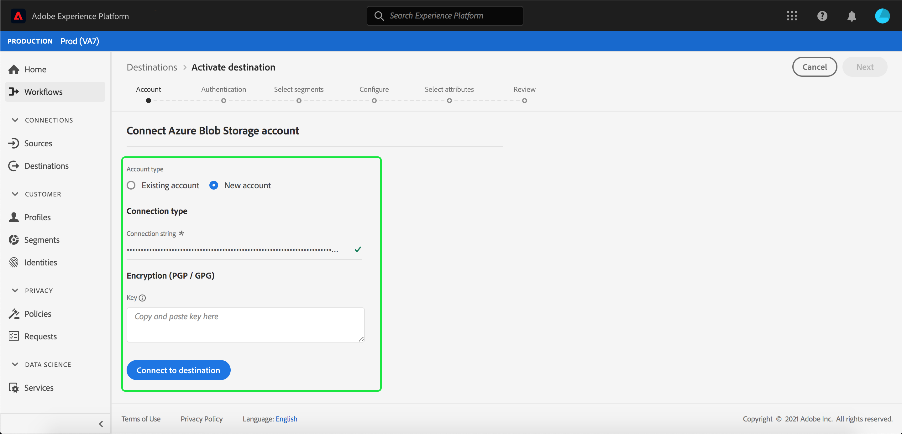

# [!DNL Azure Blob] connection

[!DNL Azure Blob] (im Folgenden &quot;[!DNL Blob]&quot; genannt) ist die Objektlösung von Microsoft für die Cloud. Dieses Lernprogramm enthält Schritte zum Erstellen eines [!DNL Blob]-Ziels mithilfe der [!DNL Platform]-Benutzeroberfläche.

## Erste Schritte

Dieses Tutorial setzt ein Grundverständnis der folgenden Komponenten von Adobe Experience Platform voraus:

- [[!DNL Experience Data Model (XDM)] System](../../../xdm/home.md): Das standardisierte Framework, mit dem Experience Platform Kundenerlebnisdaten organisiert.
   - [Grundlagen der Schemakomposition](../../../xdm/schema/composition.md): Machen Sie sich mit den Grundbausteinen von XDM-Schemas sowie den zentralen Konzepten und Best Practices rund um die Erstellung von Schemas vertraut.
   - [Schema-Editor-Lernprogramm](../../../xdm/tutorials/create-schema-ui.md): Erfahren Sie, wie Sie mit der Benutzeroberfläche des Schema-Editors benutzerdefinierte Schema erstellen.
- [[!DNL Real-time Customer Profile]](../../../profile/home.md): Bietet ein einheitliches, Echtzeit-Profil für Kunden, das auf aggregierten Daten aus mehreren Quellen basiert.

Wenn Sie bereits über ein gültiges Blob-Ziel verfügen, können Sie den Rest dieses Dokuments überspringen und mit dem Tutorial [Aktivieren von Segmenten in Ihr Ziel](../../ui/activate-destinations.md) fortfahren.

### Unterstützte Dateiformate

[!DNL Experience Platform] unterstützt das folgende Dateiformat, in das exportiert werden soll  [!DNL Blob]:

- Trennzeichen-getrennte Werte (DSV): Die Unterstützung für DSV-formatierte Datendateien ist derzeit auf kommagetrennte Werte beschränkt. Die Unterstützung für allgemeine DSV-Dateien wird in Zukunft bereitgestellt. Weitere Informationen zu unterstützten Dateien finden Sie im Abschnitt zur Cloud-Datenspeicherung im Lernprogramm [Aktivieren von Zielen](../../ui/activate-destinations.md#esp-and-cloud-storage)

## Verbinden Sie Ihr Blob-Konto {#connect-destination}

Melden Sie sich bei [Adobe Experience Platform](https://platform.adobe.com) an und wählen Sie dann **[!UICONTROL Ziele]** in der linken Navigationsleiste aus, um auf den Arbeitsbereich **[!UICONTROL Ziele]** zuzugreifen. Der Bildschirm **[!UICONTROL Katalog]** zeigt eine Reihe von Zielen an, für die Sie ein Konto erstellen können.

Sie können die entsprechende Kategorie im Katalog auf der linken Seite des Bildschirms auswählen. Alternativ können Sie mit der Suchoption das gewünschte Ziel finden.

Wählen Sie unter der Kategorie **[!UICONTROL Cloud-Datenspeicherung]** die Option **[!UICONTROL Blaue Blase-Datenspeicherung]**, gefolgt von **[!UICONTROL Aktivieren]**.

Die Seite **[!UICONTROL Verbindung mit der Azurblauch-Datenspeicherung]** herstellen wird angezeigt. Auf dieser Seite können Sie entweder neue oder vorhandene Anmeldeinformationen verwenden.

### Neues Konto {#new-account}

Wenn Sie neue Anmeldeinformationen verwenden, wählen Sie **[!UICONTROL Neues Konto]**. Geben Sie im eingeblendeten Eingabebild die Verbindungszeichenfolge ein. Die Verbindungszeichenfolge, die für den Zugriff auf Daten in Ihrer Blob-Datenspeicherung erforderlich ist. Die [!DNL Blob]-Verbindungszeichenfolgen-Beginn mit: `DefaultEndpointsProtocol=https;AccountName={ACCOUNT_NAME};AccountKey={ACCOUNT_KEY}`.

Optional können Sie Ihren RSA-formatierten öffentlichen Schlüssel anhängen, um Ihren exportierten Dateien Verschlüsselung hinzuzufügen. Beachten Sie, dass dieser öffentliche Schlüssel **als Base64-kodierte Zeichenfolge geschrieben werden muss.**

### Vorhandenes Konto

Um ein vorhandenes Konto zu verbinden, wählen Sie das [!DNL Blob]-Konto, mit dem Sie eine Verbindung herstellen möchten, und klicken Sie dann auf **Weiter**, um fortzufahren.

## Authentifizierung {#authentication}

Die Seite **Authentifizierung** wird angezeigt. Geben Sie im eingeblendeten Eingabefeld einen Namen, eine optionale Beschreibung, den Ordnerpfad und den Container für Ihre Dateien ein. Wenn Sie fertig sind, wählen Sie **[!UICONTROL Ziel erstellen]**.

## Nächste Schritte {#activate-segments}

Mit diesem Tutorial haben Sie eine Verbindung zu Ihrem [!DNL Blob]-Konto hergestellt. Sie können nun mit dem nächsten Lernprogramm fortfahren und Segmente bis zu Ihrem Ziel [aktivieren.](../../ui/activate-destinations.md)
