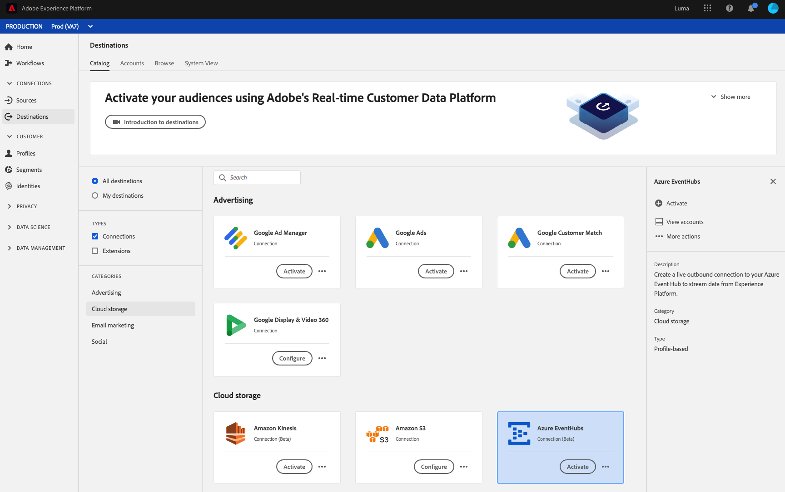
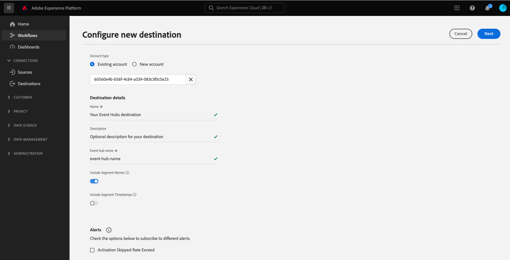

# [!DNL Azure Event Hubs]-Verbindung

## Übersicht {#overview}

>[!IMPORTANT]
>
> Dieses Ziel ist nur für Kunden von [Adobe Real-time Customer Data Platform Ultimate](https://helpx.adobe.com/de/legal/product-descriptions/real-time-customer-data-platform.html) verfügbar.

[!DNL Azure Event Hubs] ist eine Big-Data-Streaming-Plattform und ein Event-Erfassungsdienst. Es kann Millionen von Ereignissen pro Sekunde empfangen und verarbeiten. An einen Ereignis-Hub gesendete Daten können mithilfe eines beliebigen Echtzeit-Analytics-Anbieters oder von Batch-/Speicheradaptern umgewandelt und gespeichert werden.

Sie können eine ausgehende Echtzeitverbindung zu Ihrem [!DNL Azure Event Hubs] Speicher zum Streamen von Daten aus Adobe Experience Platform.

* Weitere Informationen finden Sie unter [!DNL Azure Event Hubs], siehe [Microsoft-Dokumentation](https://docs.microsoft.com/en-us/azure/event-hubs/event-hubs-about).
* Verbindung herstellen zu [!DNL Azure Event Hubs] sehen Sie programmatisch die [Tutorial zur Streaming-Ziele-API](../../api/streaming-destinations.md).
* Verbindung herstellen zu [!DNL Azure Event Hubs] Informationen zur Verwendung der Benutzeroberfläche von Platform finden Sie in den folgenden Abschnitten.



## Anwendungsfälle {#use-cases}

Durch Verwendung von Streaming-Zielen wie [!DNL Azure Event Hubs]können Sie einfach hochwertige Segmentierungsereignisse und zugehörige Profilattribute in Ihre bevorzugten Systeme einspeisen.

Beispielsweise hat ein Interessent ein Whitepaper heruntergeladen, das ihn in ein Segment mit hoher Konversionsneigung qualifiziert. Durch Zuordnung des Segments, in das der Interessent fällt, zum [!DNL Azure Event Hubs] Ziel, erhalten Sie dieses Ereignis in [!DNL Azure Event Hubs]. Dort können Sie zusätzlich zu dem Ereignis einen &quot;do-it-self&quot;-Ansatz verwenden und die Geschäftslogik beschreiben, da Sie denken, dass dies am besten mit Ihren Enterprise-IT-Systemen funktionieren würde.

## Exporttyp und -häufigkeit {#export-type-frequency}

Beziehen Sie sich auf die folgende Tabelle, um Informationen zu Typ und Häufigkeit des Zielexports zu erhalten.

| Element | Typ | Anmerkungen |
---------|----------|---------|
| Exporttyp | **[!UICONTROL Profilbasiert]** | Sie exportieren alle Mitglieder eines Segments zusammen mit den gewünschten Schemafeldern (z. B. E-Mail-Adresse, Telefonnummer, Nachname), wie im Bildschirm „Auswählen der Profilattribute“ im [Zielaktivierungs-Workflow](../../ui/activate-batch-profile-destinations.md#select-attributes) festgelegt. |
| Exporthäufigkeit | **[!UICONTROL Streaming]** | Streaming-Ziele sind „immer verfügbare“ API-basierte Verbindungen. Sobald ein Profil in Experience Platform auf der Grundlage einer Segmentbewertung aktualisiert wird, sendet der Connector das Update nachgelagert an die Zielplattform. Lesen Sie mehr über [Streaming-Ziele](/help/destinations/destination-types.md#streaming-destinations). |

{style="table-layout:auto"}

## Zulassungsliste von IP-Adressen {#ip-address-allowlist}

Um die Sicherheits- und Compliance-Anforderungen von Kunden zu erfüllen, bietet Experience Platform eine Liste statischer IPs, die Sie für die [!DNL Azure Event Hubs] Ziel. Siehe [Zulassungsliste von IP-Adressen für Streaming-Ziele](/help/destinations/catalog/streaming/ip-address-allow-list.md), um die vollständige Liste der IP-Adressen in der Zulassungsliste einzusehen.

## Herstellen einer Verbindung mit dem Ziel {#connect}

>[!IMPORTANT]
> 
>Um eine Verbindung zum Ziel herzustellen, benötigen Sie die [Zugriffsberechtigung](/help/access-control/home.md#permissions) **[!UICONTROL Ziele verwalten]**. Lesen Sie die [Zugriffskontrolle – Übersicht](/help/access-control/ui/overview.md) oder wenden Sie sich an Ihren Produktadministrator, um die erforderlichen Berechtigungen zu erhalten.

Um eine Verbindung mit diesem Ziel herzustellen, gehen Sie wie im [Tutorial zur Zielkonfiguration](../../ui/connect-destination.md) beschrieben vor. Beim Herstellen einer Verbindung zu diesem Ziel müssen Sie die folgenden Informationen angeben:

### Authentifizierungsinformationen {#authentication-information}

#### Standardauthentifizierung {#standard-authentication}


Wenn Sie die **[!UICONTROL Standardauthentifizierung]** Geben Sie ein, um eine Verbindung mit Ihrem HTTP-Endpunkt herzustellen, geben Sie die folgenden Felder ein und wählen Sie **[!UICONTROL Mit Ziel verbinden]**:

* **[!UICONTROL SAS-Schlüsselname]**: Der Name der Autorisierungsregel, der auch als SAS-Schlüsselname bezeichnet wird.
* **[!UICONTROL SAS-Schlüssel]**: Der Primärschlüssel des Ereignis-Hubs-Namespace. Die `sasPolicy` dass `sasKey` muss **verwalten** -Berechtigungen, die für das Ausfüllen der Liste der Ereignis-Hubs konfiguriert wurden. Informationen zur Authentifizierung bei [!DNL Azure Event Hubs] mit SAS-Schlüsseln in [Microsoft-Dokumentation](https://docs.microsoft.com/en-us/azure/event-hubs/authenticate-shared-access-signature).
* **[!UICONTROL Namespace]**: Füllen Sie Ihre [!DNL Azure Event Hubs] Namespace. Informationen zu [!DNL Azure Event Hubs] Namespaces im [Microsoft-Dokumentation](https://docs.microsoft.com/en-us/azure/event-hubs/event-hubs-create#create-an-event-hubs-namespace).

#### Shared Access Signature (SAS)-Authentifizierung {#sas-authentication}


Wenn Sie die **[!UICONTROL Standardauthentifizierung]** Geben Sie ein, um eine Verbindung mit Ihrem HTTP-Endpunkt herzustellen, geben Sie die folgenden Felder ein und wählen Sie **[!UICONTROL Mit Ziel verbinden]**:

* **[!UICONTROL SAS-Schlüsselname]**: Der Name der Autorisierungsregel, der auch als SAS-Schlüsselname bezeichnet wird.
* **[!UICONTROL SAS-Schlüssel]**: Der Primärschlüssel des Ereignis-Hubs-Namespace. Die `sasPolicy` dass `sasKey` muss **verwalten** -Berechtigungen, die für das Ausfüllen der Liste der Ereignis-Hubs konfiguriert wurden. Informationen zur Authentifizierung bei [!DNL Azure Event Hubs] mit SAS-Schlüsseln in [Microsoft-Dokumentation](https://docs.microsoft.com/en-us/azure/event-hubs/authenticate-shared-access-signature).
* **[!UICONTROL Namespace]**: Füllen Sie Ihre [!DNL Azure Event Hubs] Namespace. Informationen zu [!DNL Azure Event Hubs] Namespaces im [Microsoft-Dokumentation](https://docs.microsoft.com/en-us/azure/event-hubs/event-hubs-create#create-an-event-hubs-namespace).
* **[!UICONTROL Ereignis-Hub-Name]**: Füllen Sie Ihre [!DNL Azure Event Hub] name . Informationen zu [!DNL Azure Event Hubs] Namen in [Microsoft-Dokumentation](https://learn.microsoft.com/en-us/azure/event-hubs/event-hubs-create#create-an-event-hub).

### Ausfüllen der Zieldetails {#destination-details}

>[!CONTEXTUALHELP]
>id="platform_destinations_connect_eventhubs_includesegmentnames"
>title="Segmentnamen einschließen"
>abstract="Schalten Sie dies ein, wenn der Datenexport die Namen der zu exportierenden Segmente enthalten soll. In der Dokumentation finden Sie ein Beispiel für einen Datenexport mit dieser Option."

>[!CONTEXTUALHELP]
>id="platform_destinations_connect_eventhubs_includesegmenttimestamps"
>title="Zeitstempel für Segmente einschließen"
>abstract="Schalten Sie diese Option ein, wenn der Datenexport den UNIX-Zeitstempel enthalten soll, an dem die Segmente erstellt und aktualisiert wurden, sowie den UNIX-Zeitstempel, an dem die Segmente dem Ziel für die Aktivierung zugeordnet wurden. In der Dokumentation finden Sie ein Beispiel für einen Datenexport mit dieser Option."

Füllen Sie die folgenden erforderlichen und optionalen Felder aus, um Details für das Ziel zu konfigurieren. Ein Sternchen neben einem Feld in der Benutzeroberfläche zeigt an, dass das Feld erforderlich ist.



* **[!UICONTROL Name]**: Füllen Sie einen Namen für die Verbindung zu [!DNL Azure Event Hubs].
* **[!UICONTROL Beschreibung]**: Geben Sie eine Beschreibung der Verbindung an.  Beispiele: &quot;Premium-Tier-Kunden&quot;, &quot;Kunden, die an Kitesurfen interessiert sind&quot;.
* **[!UICONTROL eventHubName]**: Geben Sie einen Namen für den Stream an Ihre [!DNL Azure Event Hubs] Ziel.
* **[!UICONTROL Segmentnamen einschließen]**: Schalten Sie diese Option ein, wenn der Datenexport die Namen der zu exportierenden Segmente enthalten soll. Ein Beispiel für einen Datenexport, bei dem diese Option aktiviert ist, finden Sie im Abschnitt [Exportierte Daten](#exported-data) weiter unten.
* **[!UICONTROL Zeitstempel für Segmente einschließen]**: Schalten Sie diese Option ein, wenn der Datenexport den UNIX-Zeitstempel enthalten soll, an dem die Segmente erstellt und aktualisiert wurden, sowie den UNIX-Zeitstempel, an dem die Segmente dem Ziel für die Aktivierung zugeordnet wurden. Ein Beispiel für einen Datenexport, bei dem diese Option aktiviert ist, finden Sie im Abschnitt [exportierte Daten](#exported-data) weiter unten.

### Aktivieren von Warnhinweisen {#enable-alerts}

Sie können Warnhinweise aktivieren, um Benachrichtigungen zum Status des Datenflusses zu Ihrem Ziel zu erhalten. Wählen Sie einen Warnhinweis aus der zu abonnierenden Liste aus, um Benachrichtigungen über den Status Ihres Datenflusses zu erhalten. Weitere Informationen zu Warnhinweisen finden Sie im Handbuch zum [Abonnieren von Zielwarnhinweisen über die Benutzeroberfläche](../../ui/alerts.md).

Wenn Sie mit dem Eingeben der Details für Ihre Zielverbindung fertig sind, klicken Sie auf **[!UICONTROL Weiter]**.

## Aktivieren von Segmenten für dieses Ziel {#activate}

>[!IMPORTANT]
> 
>Um Daten zu aktivieren, benötigen Sie die [Zugriffssteuerungsberechtigungen](/help/access-control/home.md#permissions) **[!UICONTROL Ziele verwalten]**, **[!UICONTROL Ziele aktivieren]**, **[!UICONTROL Profile anzeigen]** und **[!UICONTROL Segmente anzeigen]**. Lesen Sie die [Übersicht über die Zugriffskontrolle](/help/access-control/ui/overview.md) oder wenden Sie sich an Ihren Produktadministrator, um die erforderlichen Berechtigungen zu erhalten.

Anweisungen zum Aktivieren von Zielgruppensegmenten für dieses Ziel finden Sie unter [Aktivieren von Zielgruppendaten für Streaming-Profil-Exportziele](../../ui/activate-streaming-profile-destinations.md).

## Profilexportverhalten {#profile-export-behavior}

Experience Platform optimiert das Exportverhalten von Profilen für Ihre [!DNL Azure Event Hubs] Ziel, um Daten nur dann an Ihr Ziel zu exportieren, wenn relevante Aktualisierungen an einem Profil nach der Segmentqualifizierung oder anderen wichtigen Ereignissen stattgefunden haben. Profile werden in den folgenden Situationen an Ihr Ziel exportiert:

* Die Aktualisierung des Profils wurde durch eine Änderung der Segmentzugehörigkeit für mindestens eines der dem Ziel zugeordneten Segmente bestimmt. Beispielsweise hat sich das Profil für eines der Segmente qualifiziert, die dem Ziel zugeordnet sind, oder es hat eines der dem Ziel zugeordneten Segmente verlassen.
* Die Aktualisierung des Profils wurde durch eine Änderung der [Identitätszuordnung](/help/xdm/field-groups/profile/identitymap.md) bestimmt. Beispielsweise wurde einem Profil, das sich bereits für eines der dem Ziel zugeordneten Segmente qualifiziert hatte, eine neue Identität im Identitätszuordnungsattribut hinzugefügt.
* Die Aktualisierung des Profils wurde durch eine Änderung der Attribute für mindestens eines der dem Ziel zugeordneten Attribute bestimmt. Beispielsweise wird eines der Attribute, die dem Ziel im Zuordnungsschritt zugeordnet sind, einem Profil hinzugefügt.

In allen oben beschriebenen Fällen werden nur die Profile exportiert, in denen relevante Aktualisierungen vorgenommen wurden. Wenn beispielsweise ein Segment, das dem Zielfluss zugeordnet ist, aus hundert Mitgliedern besteht und fünf neue Profile für das Segment qualifiziert sind, ist der Export in Ihr Ziel inkrementell und umfasst nur die fünf neuen Profile.

Beachten Sie, dass alle zugeordneten Attribute unabhängig vom Speicherort der Änderungen für ein Profil exportiert werden. Daher werden im obigen Beispiel alle zugeordneten Attribute für diese fünf neuen Profile exportiert, selbst wenn sich die Attribute selbst nicht geändert haben.

### Was bestimmt einen Datenexport und was ist im Export enthalten? {#what-determines-export-what-is-included}

Für die Daten, die für ein bestimmtes Profil exportiert werden, ist es wichtig, die beiden verschiedenen Konzepte von *was den Datenexport für Ihre [!DNL Azure Event Hubs] Ziel* und *welche Daten im Export enthalten sind*.

| Was einen Zielexport bestimmt | Im Zielexport enthaltene Informationen |
|---------|----------|
| <ul><li>Zugeordnete Attribute und Segmente dienen als Hinweis für einen Zielexport. Das bedeutet, dass ein Zielexport gestartet wird, wenn zugeordnete Segmente den Status ändern (von null zu realisiert oder von realisiert/existierend zu verlassend) oder alle zugeordneten Attribute aktualisiert werden.</li><li>Da Identitäten derzeit nicht zugeordnet werden können [!DNL Azure Event Hubs] Ziele, Änderungen an einer Identität in einem bestimmten Profil bestimmen auch die Zielexporte.</li><li>Als Änderung für ein Attribut wird jede Aktualisierung des Attributs definiert, unabhängig davon, ob es sich um denselben Wert handelt oder nicht. Das bedeutet, dass das Überschreiben eines Attributs als Änderung gilt, selbst wenn sich der Wert selbst nicht geändert hat.</li></ul> | <ul><li>Das `segmentMembership`-Objekt enthält das Segment, das im Aktivierungsdatenfluss zugeordnet ist und für das sich der Status des Profils nach einem Qualifikations- oder Segmentaustrittsereignis geändert hat. Beachten Sie, dass andere nicht zugeordnete Segmente, für die sich das Profil qualifiziert hat, Teil des Zielexports sein können, wenn diese Segmente zu derselben [Zusammenführungsrichtlinie](/help/profile/merge-policies/overview.md) wie das im Aktivierungsdatenfluss zugeordnete Segment gehören. </li><li>Alle Identitäten in der `identityMap` -Objekt wird ebenfalls einbezogen (Experience Platform unterstützt derzeit keine Identitätszuordnung in der [!DNL Azure Event Hubs] Ziel).</li><li>Nur die zugeordneten Attribute werden in den Zielexport einbezogen.</li></ul> |

{style="table-layout:fixed"}

Betrachten Sie diesen Datenfluss beispielsweise als [!DNL Azure Event Hubs] Ziel, bei dem im Datenfluss drei Segmente ausgewählt und dem Ziel vier Attribute zugeordnet sind.


Ein Profilexport an das Ziel kann durch ein Profil bestimmt werden, das sich für eines der *drei zugeordneten Segmente* qualifiziert. Im Datenexport jedoch wird im `segmentMembership` -Objekt (siehe [Exportierte Daten](#exported-data) weiter unten), können weitere nicht zugeordnete Segmente angezeigt werden, wenn dieses bestimmte Profil Mitglied dieses Profils ist und diese dieselbe Zusammenführungsrichtlinie wie das Segment nutzen, das den Export ausgelöst hat. Wenn ein Profil für die **Kunde mit DeLorean Cars** -Segment, ist aber auch Mitglied der **&quot;Zurück in die Zukunft&quot;** Film und **Fans von Science-Fiction** Segmente, dann sind auch diese beiden anderen Segmente im `segmentMembership` -Objekt des Datenexports, auch wenn diese nicht im Datenfluss zugeordnet sind, wenn diese dieselbe Zusammenführungsrichtlinie mit der **Kunde mit DeLorean Cars** Segment.

Aus Sicht der Profilattribute bestimmen alle Änderungen an den vier oben zugeordneten Attributen einen Zielexport, und eines der vier im Profil vorhandenen zugeordneten Attribute wird im Datenexport vorhanden sein.

## Aufstockung historischer Daten {#historical-data-backfill}

Wenn Sie ein neues Segment zu einem vorhandenen Ziel hinzufügen oder wenn Sie ein neues Ziel erstellen und ihm Segmente zuordnen, exportiert Experience Platform historische Segmentqualifikationsdaten an das Ziel. Profile, die sich für das Segment qualifiziert haben, *bevor* das Segment zum Ziel hinzugefügt wurde, werden innerhalb von etwa einer Stunde an das Ziel exportiert.

## Exportierte Daten {#exported-data}

Ihre exportierten [!DNL Experience Platform]-Daten landen in Ihrem [!DNL Azure Event Hubs]-Ziel im JSON-Format. Beispielsweise enthält der folgende Export ein Profil, das sich für ein bestimmtes Segment qualifiziert hat, Mitglied zweier weiterer Segmente ist und ein weiteres Segment verlassen hat. Der Export umfasst außerdem Vorname, Nachname, Geburtsdatum und persönliche E-Mail-Adresse des Profilattributs. Die Identitäten für dieses Profil sind ECID und E-Mail.

```json
{
  "person": {
    "birthDate": "YYYY-MM-DD",
    "name": {
      "firstName": "John",
      "lastName": "Doe"
    }
  },
  "personalEmail": {
    "address": "john.doe@acme.com"
  },
  "segmentMembership": {
   "ups":{
      "7841ba61-23c1-4bb3-a495-00d3g5fe1e93":{
         "lastQualificationTime":"2022-01-11T21:24:39Z",
         "status":"exited"
      },
      "59bd2fkd-3c48-4b18-bf56-4f5c5e6967ae":{
         "lastQualificationTime":"2022-01-02T23:37:33Z",
         "status":"existing"
      },
      "947c1c46-008d-40b0-92ec-3af86eaf41c1":{
         "lastQualificationTime":"2021-08-25T23:37:33Z",
         "status":"existing"
      },
      "5114d758-ce71-43ba-b53e-e2a91d67b67f":{
         "lastQualificationTime":"2022-01-11T23:37:33Z",
         "status":"realized"
      }
   }
},
  "identityMap": {
    "ecid": [
      {
        "id": "14575006536349286404619648085736425115"
      },
      {
        "id": "66478888669296734530114754794777368480"
      }
    ],
    "email_lc_sha256": [
      {
        "id": "655332b5fa2aea4498bf7a290cff017cb4"
      },
      {
        "id": "66baf76ef9de8b42df8903f00e0e3dc0b7"
      }
    ]
  }
}
```

Im Folgenden finden Sie weitere Beispiele für exportierte Daten, abhängig von den Benutzeroberflächeneinstellungen, die Sie im Fluss „Ziel verbinden“ für die Optionen **[!UICONTROL Segmentnamen einschließen]** und **[!UICONTROL Zeitstempel für Segmente einschließen]** auswählen.

+++ Das folgende Beispiel für den Datenexport enthält Segmentnamen im Abschnitt `segmentMembership`

```json
"segmentMembership": {
        "ups": {
          "5b998cb9-9488-4ec3-8d95-fa8338ced490": {
            "lastQualificationTime": "2019-04-15T02:41:50+0000",
            "status": "existing",
            "createdAt": 1648553325000,
            "updatedAt": 1648553330000,
            "mappingCreatedAt": 1649856570000,
            "mappingUpdatedAt": 1649856570000,
            "name": "First name equals John"
          }
        }
      }
```

+++

+++ Das folgende Beispiel für den Datenexport enthält Segmentzeitstempel im Abschnitt `segmentMembership`

```json
"segmentMembership": {
        "ups": {
          "5b998cb9-9488-4ec3-8d95-fa8338ced490": {
            "lastQualificationTime": "2019-04-15T02:41:50+0000",
            "status": "existing",
            "createdAt": 1648553325000,
            "updatedAt": 1648553330000,
            "mappingCreatedAt": 1649856570000,
            "mappingUpdatedAt": 1649856570000,
          }
        }
      }
```

+++

## Beschränkungen und Wiederholungsrichtlinien {#limits-retry-policy}

Experience Platform versucht, in 95 Prozent der Fälle eine Durchsatzlatenz von weniger als 10 Minuten für erfolgreich gesendete Nachrichten mit einer Rate von weniger als 10.000 Anfragen pro Sekunde für jeden Datenfluss an ein HTTP-Ziel zu bieten.

Bei fehlgeschlagenen Anfragen an Ihr HTTP-API-Ziel speichert Experience Platform die fehlgeschlagenen Anfragen und versucht es zweimal erneut, die Anfragen an Ihren Endpunkt zu senden.

>[!MORELIKETHIS]
>
>* [Verbindung zu Azure Event Hubs herstellen und Daten mithilfe der Flow Service-API aktivieren](../../api/streaming-destinations.md)
>* [AWS Kinesis-Ziel](./amazon-kinesis.md)
>* [Zieltypen und Kategorien](../../destination-types.md)

