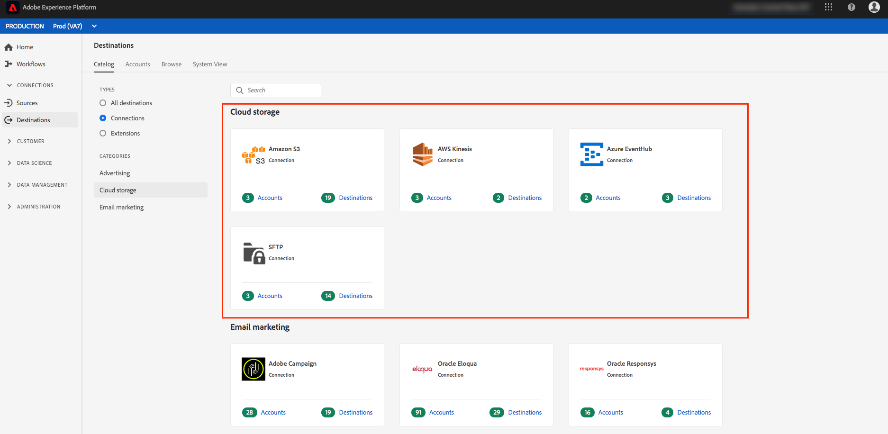
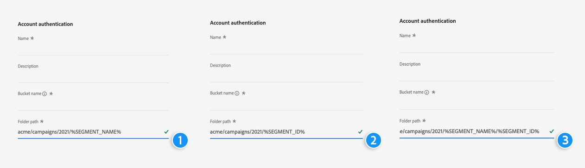

# Übersicht über die Cloud-Speicher-Ziele {#cloud-storage-destinations}

## Übersicht {#overview}

Adobe Experience Platform kann Ihre Segmente als Datendateien an Ihre Cloud-Speicherorte senden. Dadurch können Sie Zielgruppen und ihre Profilattribute über CSV-Dateien für [!DNL Amazon S3], [!DNL Azure Blob] und SFTP. Für [!DNL Amazon Kinesis] und [!DNL Azure Event Hubs] Ziele, werden Daten aus der Experience Platform in gestreamt [!DNL JSON] Format.

## Unterstützte Cloud-Speicher-Ziele {#supported-destinations}

Adobe Experience Platform unterstützt die folgenden Cloud-Speicher-Ziele:

* [Amazon Kinesis-Verbindung](amazon-kinesis.md)
* [Amazon S3-Verbindung](amazon-s3.md)
* [Azure Blob-Verbindung](azure-blob.md)
* [Azure Event Hubs-Verbindung](azure-event-hubs.md)
* [SFTP-Verbindung](sftp.md)

## Verbindung zu einem neuen Cloud-Speicher-Ziel herstellen {#connect-destination}

Um Segmente für Ihre Kampagnen an Cloud-Speicher-Ziele zu senden, muss Platform zunächst eine Verbindung zum Ziel herstellen. Siehe [Tutorial zur Zielerstellung](../../ui/connect-destination.md) für detaillierte Informationen zur Einrichtung eines neuen Ziels.

## Verwenden Sie Makros, um einen Ordner in Ihrem Speicherort zu erstellen {#use-macros}

>[!NOTE]
>
> Die in diesem Abschnitt beschriebene Funktion ist derzeit verfügbar für [Amazon S3](amazon-s3.md) nur Ziele.

Um einen benutzerdefinierten Ordner pro Segmentdatei in Ihrem Speicherort zu erstellen, können Sie Makros im Eingabefeld Ordnerpfad verwenden. Fügen Sie die Makros am Ende des Eingabefelds ein, wie unten dargestellt.

Die folgenden Beispiele verweisen auf ein Beispielsegment `Luxury Audience` mit ID `25768be6-ebd5-45cc-8913-12fb3f348615`.

**Makro 1:`%SEGMENT_NAME%`**

Eingabe: `acme/campaigns/2021/%SEGMENT_NAME%`
Ordnerpfad in Ihrem Speicherort: `acme/campaigns/2021/Luxury Audience`

**Makro 2:`%SEGMENT_ID%`**

Eingabe: `acme/campaigns/2021/%SEGMENT_ID%`
Ordnerpfad in Ihrem Speicherort: `acme/campaigns/2021/25768be6-ebd5-45cc-8913-12fb3f348615`

**Makro 3:`%SEGMENT_NAME%/%SEGMENT_ID%`**

Eingabe: `acme/campaigns/2021/%SEGMENT_NAME%/%SEGMENT_ID%`
Ordnerpfad in Ihrem Speicherort: `acme/campaigns/2021/Luxury Audience/25768be6-ebd5-45cc-8913-12fb3f348615`

## Datenexporttyp {#export-type}

Unterstützung von Cloud-Speicher-Zielen **Profilbasierter Export**. Das bedeutet, dass Sie Details über die Kontakte in der Audience exportieren. Diese Details sind für die Personalisierung erforderlich und können Attribute, Ereignisse, Segmentmitgliedschaften und mehr umfassen.