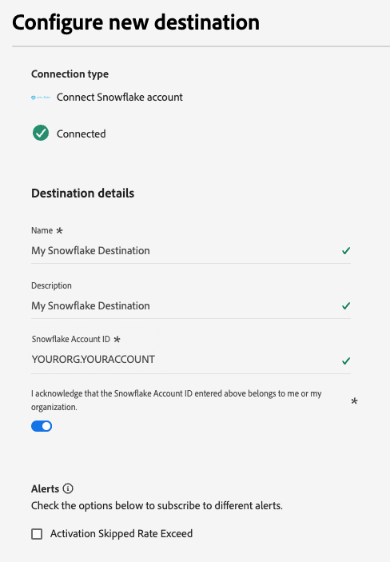

# Snowflake-Verbindung {#snowflake-destination}

>[!IMPORTANT]
>
>Dieser Ziel-Connector befindet sich in der Beta-Phase und steht nur ausgewählten Kunden zur Verfügung. Wenden Sie sich an Ihren Adobe-Support-Mitarbeiter, um Zugriff anzufordern.

## Überblick {#overview}

Exportieren Sie Daten mithilfe privater Listeneinträge in Ihr Snowflake-Konto.

## Voraussetzungen {#prerequisites}

Bevor Sie Ihre Snowflake-Verbindung konfigurieren, stellen Sie sicher, dass Sie die folgenden Voraussetzungen erfüllen:

* Sie haben Zugriff auf ein [!DNL Snowflake].
* Ihr Snowflake-Konto hat private Listeneinträge abonniert. Sie oder eine andere Person in Ihrem Unternehmen, die über Administratorrechte für das Konto auf Snowflake verfügt, können dies konfigurieren.

## Unterstützte Zielgruppen {#supported-audiences}

In diesem Abschnitt wird beschrieben, welche Arten von Zielgruppen Sie an dieses Ziel exportieren können.

| Zielgruppenherkunft | Unterstützt | Beschreibung |
|---------|----------|----------|
| [!DNL Segmentation Service] | ✓ | Zielgruppen, die über den Experience Platform-[ (Segmentierungs-Service) generiert ](../../../segmentation/home.md). |
| Benutzerdefinierte Uploads | ✓ | Zielgruppen, die aus CSV-Dateien in Experience Platform [importiert](../../../segmentation/ui/audience-portal.md#import-audience) werden. |

{style="table-layout:auto"}

## Exporttyp und -häufigkeit {#export-type-frequency}

Beziehen Sie sich auf die folgende Tabelle, um Informationen zu Typ und Häufigkeit des Zielexports zu erhalten.

| Element | Typ | Anmerkungen |
---------|----------|---------|
| Exporttyp | **[!UICONTROL Zielgruppenexport]** | Sie exportieren alle Mitglieder einer Zielgruppe mit den IDs (Name, Telefonnummer oder sonstiges), die im [!DNL Snowflake]-Ziel verwendet werden. |
| Exporthäufigkeit | **[!UICONTROL Streaming]** | Streaming-Ziele sind „immer verfügbare“ API-basierte Verbindungen. Sobald ein Profil in Experience Platform auf der Grundlage einer Zielgruppenauswertung aktualisiert wird, sendet der Connector das Update nachgelagert an die Zielplattform. Lesen Sie mehr über [Streaming-Ziele](/help/destinations/destination-types.md#streaming-destinations). |

{style="table-layout:auto"}

## Herstellen einer Verbindung mit dem Ziel {#connect}

>[!IMPORTANT]
> 
>Um eine Verbindung mit dem Ziel herzustellen, benötigen Sie **[!UICONTROL Ziele anzeigen]** und **[!UICONTROL Ziele verwalten]** [Zugriffssteuerungsberechtigungen](/help/access-control/home.md#permissions). Lesen Sie die [Zugriffskontrolle – Übersicht](/help/access-control/ui/overview.md) oder wenden Sie sich an Ihren Produktadministrator, um die erforderlichen Berechtigungen zu erhalten.

Um eine Verbindung mit diesem Ziel herzustellen, gehen Sie wie im [Tutorial zur Zielkonfiguration](../../ui/connect-destination.md) beschrieben vor. Füllen Sie im Workflow zum Konfigurieren des Ziels die Felder aus, die in den beiden folgenden Abschnitten aufgeführt sind.

### Beim Ziel authentifizieren {#authenticate}

Um sich beim Ziel zu authentifizieren, wählen Sie **[!UICONTROL Mit Ziel verbinden]** aus.

### Ausfüllen der Zieldetails {#destination-details}

Füllen Sie die folgenden erforderlichen und optionalen Felder aus, um Details für das Ziel zu konfigurieren. Ein Sternchen neben einem Feld in der Benutzeroberfläche zeigt an, dass das Feld erforderlich ist.

* **[!UICONTROL Name]**: Ein Name, durch den Sie dieses Ziel in Zukunft erkennen können.
* **[!UICONTROL Beschreibung]**: Eine Beschreibung, die Ihnen hilft, dieses Ziel in Zukunft zu identifizieren.
* **[!UICONTROL Snowflake-Konto-]**: Ihre Snowflake-Konto-ID. Beispiel: `adobe-123456`.
* **[!UICONTROL Kontobestätigung]**: Schalten Sie die Snowflake-Konto-ID-Bestätigung um, um zu bestätigen, dass Ihre Konto-ID korrekt ist und zu Ihnen gehört.

>[!IMPORTANT]
>
> Sonderzeichen, die im Zielnamen und im Namen der Experience Platform-Sandbox verwendet werden, werden in Snowflake automatisch in Unterstriche (`_`) konvertiert. Um Verwirrung zu vermeiden, verwenden Sie keine Sonderzeichen in Ihrem Ziel und Sandbox-Namen.

### Aktivieren von Warnhinweisen {#enable-alerts}

Sie können Warnhinweise aktivieren, um Benachrichtigungen zum Status des Datenflusses zu Ihrem Ziel zu erhalten. Wählen Sie einen Warnhinweis aus der zu abonnierenden Liste aus, um Benachrichtigungen über den Status Ihres Datenflusses zu erhalten. Weitere Informationen zu Warnhinweisen finden Sie im Handbuch zum [Abonnieren von Warnhinweisen zu Zielen über die Benutzeroberfläche](../../ui/alerts.md).

Wenn Sie alle Details für Ihre Zielverbindung eingegeben haben, klicken Sie auf **[!UICONTROL Weiter]**.

## Aktivieren von Zielgruppen für dieses Ziel {#activate}

>[!IMPORTANT]
> 
>* Zum Aktivieren von Daten benötigen Sie die Berechtigungen **[!UICONTROL Ziele anzeigen]**, **[!UICONTROL Ziele aktivieren]**, **[!UICONTROL Profile anzeigen]** und **[!UICONTROL Segmente anzeigen]**[Zugriffssteuerung](/help/access-control/home.md#permissions). Lesen Sie die [Übersicht über die Zugriffssteuerung](/help/access-control/ui/overview.md) oder wenden Sie sich an Ihre Produktadmins, um die erforderlichen Berechtigungen zu erhalten.
>* Zum Exportieren *Identitäten* benötigen Sie die Berechtigung **[!UICONTROL Identitätsdiagramm anzeigen]** [Zugriffssteuerung](/help/access-control/home.md#permissions).   {width="100" zoomable="yes"}

Anweisungen zum Aktivieren von Zielgruppen für dieses Ziel finden Sie unter [Aktivieren von Profilen und Zielgruppen für Streaming-Zielgruppen-Exportziele](/help/destinations/ui/activate-segment-streaming-destinations.md).

### Attribute zuordnen {#map}

Das Snowflake-Ziel unterstützt die Zuordnung von Profilattributen zu benutzerdefinierten Attributen.

Die Zielattribute werden in Snowflake automatisch mit dem Attributnamen erstellt, den Sie im Feld **[!UICONTROL Attributname]** angeben.

## Exportierte Daten/Datenexport validieren {#exported-data}

Überprüfen Sie Ihr Snowflake-Konto, um sicherzustellen, dass die Daten korrekt exportiert wurden.

## Datennutzung und -Governance {#data-usage-governance}

Alle [!DNL Adobe Experience Platform]-Ziele sind bei der Verarbeitung Ihrer Daten mit Datennutzungsrichtlinien konform. Ausführliche Informationen darüber, wie [!DNL Adobe Experience Platform] Data Governance erzwingt, finden Sie unter [Data Governance - Übersicht](/help/data-governance/home.md).