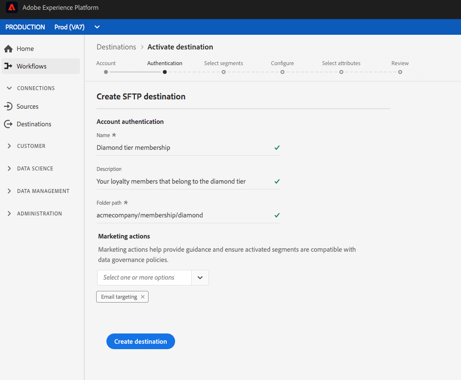

# Ziel einer Cloud-Datenspeicherung erstellen

## Übersicht {#overview}

Auf dieser Seite wird erläutert, wie Sie eine Verbindung zu Cloud-Datenspeicherung in Adobe Experience Platform herstellen können.

Wählen Sie unter **[!UICONTROL Verbindungen]** > **[!UICONTROL Ziele]** Ihr bevorzugtes Ziel für die Cloud-Datenspeicherung und dann **[!UICONTROL Konfigurieren]**.

>[!NOTE]
>
>Wenn bereits eine Verbindung zu diesem Ziel besteht, wird auf der Zielkarte die Schaltfläche **[!UICONTROL Aktivieren]** angezeigt. Weitere Informationen zum Unterschied zwischen **[!UICONTROL Aktivieren]** und **[!UICONTROL Konfigurieren]** finden Sie im Abschnitt [Katalog](../../ui/destinations-workspace.md#catalog) der Dokumentation zum Zielarbeitsbereich.

## Authentifizierungsschritt {#authentication}

Wenn Sie im Schritt **[!UICONTROL Authentifizieren]** zuvor eine Verbindung zu Ihrem Cloud-Speicher-Ziel eingerichtet haben, wählen Sie **[!UICONTROL Vorhandenes Konto]** und wählen Sie Ihre bestehende Verbindung aus. Sie können auch **[!UICONTROL Neues Konto]** auswählen, um eine neue Verbindung zu Ihrem Cloud-Speicher-Ziel einzurichten. Geben Sie die Anmeldedaten für die Kontoauthentifizierung ein und wählen Sie **[!UICONTROL Mit Ziel verbinden]** aus. Optional können Sie Ihren RSA-formatierten öffentlichen Schlüssel anhängen, um Ihren exportierten Dateien Verschlüsselung hinzuzufügen. Ihr öffentlicher Schlüssel muss als [!DNL Base64] kodierte Zeichenfolge geschrieben werden.

Weitere Informationen zu den Anmeldeinformationen im Schritt **Authentifizierung** finden Sie unter [Amazon S3](./amazon-s3.md)-Ziel, [[!DNL Amazon Kinesis]](./amazon-kinesis.md)-Ziel, [[!DNL Azure Event Hubs]](./azure-event-hubs.md)-Ziel und [SFTP](./sftp.md)-Ziel.

>[!NOTE]
>
>Plattform unterstützt die Berechtigungsüberprüfung im Authentifizierungsprozess und zeigt eine Fehlermeldung an, wenn Sie falsche Anmeldeinformationen an Ihrem Speicherort für die Cloud-Datenspeicherung eingeben. Dadurch wird sichergestellt, dass Sie den Workflow nicht mit falschen Anmeldeinformationen abschließen.

## Setup-Schritt {#setup}

Geben Sie im Schritt **[!UICONTROL Setup]** einen **[!UICONTROL Name]** und einen **[!UICONTROL description]** für die Aktivierung ein.

In diesem Schritt können Sie auch eine beliebige **[!UICONTROL Marketingaktion]** auswählen, die auf dieses Ziel angewendet werden soll. Marketingaktionen geben die Absicht an, für die Daten an das Ziel exportiert werden. Sie können aus von der Adobe definierten Marketingaktionen auswählen oder eine eigene Marketingaktion erstellen. Weitere Informationen zu Marketingaktionen finden Sie unter [Übersicht über Datenverwendungsrichtlinien](../../../data-governance/policies/overview.md).

Geben Sie für Amazon S3-Ziele den **[!UICONTROL Behälternamen]** und den **[!UICONTROL Ordnerpfad]** in das Cloud-Datenspeicherung-Ziel ein, an dem die Dateien bereitgestellt werden. Wählen Sie **[!UICONTROL Ziel erstellen]** aus, nachdem Sie die obigen Felder ausgefüllt haben.

Geben Sie für SFTP-Ziele den **[!UICONTROL Ordnerpfad]** ein, an dem die Dateien bereitgestellt werden sollen. Wählen Sie **[!UICONTROL Ziel erstellen]** aus, nachdem Sie die obigen Felder ausgefüllt haben.

Geben Sie für [!DNL Amazon Kinesis]-Ziele den Namen Ihres vorhandenen Datenstroms in Ihrem [!DNL Amazon Kinesis]-Konto ein. Plattform exportiert Daten in diesen Stream. Wählen Sie **[!UICONTROL Ziel erstellen]** aus, nachdem Sie die obigen Felder ausgefüllt haben.

Geben Sie für [!DNL Azure Event Hubs]-Ziele den Namen Ihres vorhandenen Datenstroms in Ihrem [!DNL Amazon Event Hubs]-Konto ein. Plattform exportiert Daten in diesen Stream. Wählen Sie **[!UICONTROL Ziel erstellen]** aus, nachdem Sie die obigen Felder ausgefüllt haben.

Ihr Ziel wird jetzt erstellt. Sie können **[!UICONTROL Speichern und beenden]** auswählen, wenn Sie Segmente später aktivieren möchten, oder Sie können **[!UICONTROL Weiter]** wählen, um den Workflow fortzusetzen und Segmente zur Aktivierung auszuwählen. In beiden Fällen finden Sie im nächsten Abschnitt [Segmente aktivieren](#activate-segments) Informationen zum Export von Daten durch den restlichen Workflow.

## Aktivieren von Segmenten {#activate-segments}

Informationen zum Workflow für die Segmentaktivierung finden Sie unter [Profile und Segmente für ein Ziel aktivieren](../../ui/activate-destinations.md).