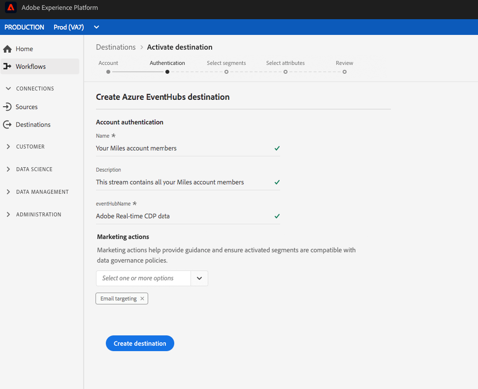

# Workflow zum Erstellen von Cloud-Speicher-Zielen

## Übersicht

Auf dieser Seite wird erläutert, wie Sie eine Verbindung zu Cloud-Datenspeicherung in der Echtzeit-Kundendatenplattform herstellen können.

In **[!UICONTROL Connections]** > **[!UICONTROL Destinations]**, select your preferred cloud storage destination, then select **[!UICONTROL Configure]**.

>[!NOTE]
>
>Wenn bereits eine Verbindung zu diesem Ziel besteht, wird auf der Zielkarte die Schaltfläche &quot; **[!UICONTROL Aktivieren]** &quot;angezeigt. Weitere Informationen zum Unterschied zwischen **[!UICONTROL Aktivieren]** und **[!UICONTROL Konfigurieren]** finden Sie im Abschnitt &quot; [Katalog](../../ui/destinations-workspace.md#catalog) &quot;der Dokumentation zum Zielarbeitsbereich.

Wenn Sie im Schritt **[!UICONTROL Authentifizieren]** zuvor eine Verbindung zu Ihrem Cloud-Speicher-Ziel eingerichtet haben, wählen Sie **[!UICONTROL Vorhandenes Konto]** und wählen Sie Ihre bestehende Verbindung aus. Sie können auch **[!UICONTROL Neues Konto]** auswählen, um eine neue Verbindung zu Ihrem Cloud-Speicher-Ziel einzurichten. Geben Sie die Anmeldedaten für die Kontoauthentifizierung ein und wählen Sie **[!UICONTROL Mit Ziel verbinden]** aus. Optional können Sie Ihren RSA-formatierten öffentlichen Schlüssel anhängen, um Ihren exportierten Dateien Verschlüsselung hinzuzufügen. Beachten Sie, dass dieser öffentliche Schlüssel als Base64-kodierte Zeichenfolge geschrieben werden **muss** .

Weitere Informationen zur Eingabe von Anmeldeinformationen im Schritt [Authentifizierung finden Sie unter](./amazon-s3.md) Amazon S3 [[!DNL Amazon Kinesis]](./amazon-kinesis.md) -Ziel, [[!DNL Azure Event Hubs]](./azure-event-hubs.md) Ziel, [Ziel und](./sftp.md) SFTP **-Ziel** .

>[!NOTE]
>
>Die Echtzeit-CDP unterstützt die Berechtigungsprüfung im Authentifizierungsprozess und zeigt eine Fehlermeldung an, wenn Sie falsche Anmeldeinformationen für Ihren Cloud-Speicher eingeben. Dadurch wird sichergestellt, dass Sie den Workflow nicht mit falschen Anmeldeinformationen abschließen.

Geben Sie im Schritt **[!UICONTROL Einrichten]** einen **[!UICONTROL Namen]** und eine **[!UICONTROL Beschreibung]** für die Aktivierung ein.

In diesem Schritt können Sie auch einen beliebigen **[!UICONTROL Marketing-Anwendungsfall]** auswählen, der für dieses Ziel gelten soll. Anwendungsfälle für das Marketing geben die Absicht an, für die Daten an das Ziel exportiert werden. Sie können aus von der Adobe definierten Anwendungsfällen für das Marketing auswählen oder einen eigenen Anwendungsfall für das Marketing erstellen. Weitere Informationen zu Anwendungsfällen für das Marketing finden Sie auf der Seite [Datenverwaltung in Echtzeit-CDP](../../../rtcdp/privacy/data-governance-overview.md#destinations) . Informationen zu den einzelnen Anwendungsfällen für Marketingzwecke, die von der Adobe definiert wurden, finden Sie in der Übersicht über [Datenverwendungsrichtlinien](../../../data-governance/policies/overview.md#core-actions).

Geben Sie für Amazon S3-Ziele den **[!UICONTROL Behälternamen]** und den **[!UICONTROL Ordnerpfad]** in das Cloud-Datenspeicherung-Ziel ein, an das die Dateien gesendet werden sollen. Wählen Sie **[!UICONTROL Ziel erstellen]** aus, nachdem Sie die obigen Felder ausgefüllt haben.

Geben Sie für SFTP-Ziele den **[!UICONTROL Ordnerpfad]** ein, unter dem die Dateien bereitgestellt werden sollen. Wählen Sie **[!UICONTROL Ziel erstellen]** aus, nachdem Sie die obigen Felder ausgefüllt haben.

Geben Sie für [!DNL Amazon Kinesis] Ziele den Namen Ihres vorhandenen Datenstroms in Ihrem [!DNL Amazon Kinesis] Konto an. Echtzeit-CDP exportiert Daten in diesen Stream. Wählen Sie **[!UICONTROL Ziel erstellen]** aus, nachdem Sie die obigen Felder ausgefüllt haben.

Geben Sie für [!DNL Azure Event Hubs] Ziele den Namen Ihres vorhandenen Datenstroms in Ihrem [!DNL Amazon Event Hubs] Konto an. Echtzeit-CDP exportiert Daten in diesen Stream. Wählen Sie **[!UICONTROL Ziel erstellen]** aus, nachdem Sie die obigen Felder ausgefüllt haben.

Ihr Ziel wird jetzt erstellt. Sie können **[!UICONTROL Speichern und beenden]** auswählen, wenn Sie Segmente später aktivieren möchten, oder Sie können **[!UICONTROL Weiter]** wählen, um den Workflow fortzusetzen und Segmente zur Aktivierung auszuwählen. In either case, see the next section, [Activate segments](#activate-segments), for the rest of the workflow to export data.

## Aktivieren von Segmenten {#activate-segments}

Informationen zum Workflow für die Segmentaktivierung finden Sie unter [Profile und Segmente für ein Ziel aktivieren](../../ui/activate-destinations.md).