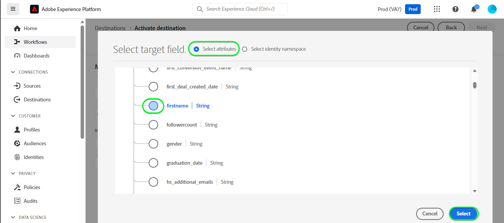

# [!DNL HubSpot]-Verbindung

[[!DNL HubSpot]](https://www.hubspot.com) ist eine CRM-Plattform mit all der Software, Integrationen und Ressourcen, die Sie für die Verbindung von Marketing, Vertrieb, Content-Management und Kundendienst benötigen. Damit können Sie Ihre Daten, Teams und Kunden auf einer CRM-Plattform verbinden.

Dieses [!DNL Adobe Experience Platform] [Ziel](/help/destinations/home.md) nutzt die [[!DNL HubSpot] Kontakte-API](https://developers.hubspot.com/docs/api/crm/contacts), um Kontakte innerhalb von [!DNL HubSpot] aus einer bestehenden Experience Platform-Zielgruppe nach der Aktivierung zu aktualisieren.

Anweisungen zur Authentifizierung bei Ihrer [!DNL HubSpot]-Instanz sehen Sie weiter unten im Abschnitt [Authentifizieren bei Ziel](#authenticate).

## Anwendungsfälle {#use-cases}

Damit Sie besser verstehen können, wie und wann Sie das [!DNL HubSpot]-Ziel verwenden sollten, finden Sie hier ein Anwendungsbeispiel, das für Kundinnen und Kunden von Adobe Experience Platform mit diesem Ziel geeignet ist.

[!DNL HubSpot] Kontakte speichern Informationen über die Personen, die mit Ihrem Unternehmen interagieren. Ihr Team verwendet die in [!DNL HubSpot] vorhandenen Kontakte, um die Experience Platform-Zielgruppen zu erstellen. Nachdem diese Zielgruppen an [!DNL HubSpot] gesendet wurden, werden ihre Informationen aktualisiert und jedem Kontakt wird eine Eigenschaft mit dem Wert als Zielgruppenname zugewiesen, der angibt, zu welcher Zielgruppe der Kontakt gehört.

## Voraussetzungen {#prerequisites}

In den folgenden Abschnitten finden Sie alle Voraussetzungen, die Sie in Experience Platform und [!DNL HubSpot] einrichten müssen, sowie Informationen, die Sie vor der Arbeit mit dem [!DNL HubSpot]-Ziel sammeln müssen.

### Voraussetzungen für Experience Platform {#prerequisites-in-experience-platform}

Bevor Sie Daten für das [!DNL HubSpot]-Ziel aktivieren, müssen Sie ein [Schema](/help/xdm/schema/composition.md), einen [Datensatz](https://experienceleague.adobe.com/docs/platform-learn/tutorials/data-ingestion/create-datasets-and-ingest-data.html) und [Audiences](https://experienceleague.adobe.com/docs/platform-learn/tutorials/audiences/create-audiences.html) in [!DNL Experience Platform] erstellt haben.

Weitere Informationen finden Sie in der Experience Platform[Dokumentation für die Schemafeldgruppe „Details zur Zielgruppenzugehörigkeit](/help/xdm/field-groups/profile/segmentation.md) , wenn Sie Anleitungen zu Zielgruppenstatus benötigen.

### Voraussetzungen für das [!DNL HubSpot] Ziel {#prerequisites-destination}

Beachten Sie die folgenden Voraussetzungen, um Daten aus Experience Platform in Ihr [!DNL HubSpot]-Konto zu exportieren:

#### Sie müssen über ein [!DNL HubSpot] Konto verfügen {#prerequisites-account}

Um Daten aus Experience Platform in Ihr [!DNL Hubspot]-Konto zu exportieren, benötigen Sie ein [!DNL HubSpot]. Wenn Sie noch kein solches Konto haben, besuchen Sie die Seite [HubSpot-Konto einrichten](https://knowledge.hubspot.com/get-started/set-up-your-account) und befolgen Sie die Anweisungen zur Registrierung und Erstellung Ihres Kontos.

#### Abrufen des Zugriffstokens für die [!DNL HubSpot] private App {#gather-credentials}

Sie benötigen Ihre [!DNL HubSpot] `Access token`, damit das [!DNL HubSpot]-Ziel API-Aufrufe über Ihre [!DNL HubSpot] private App in Ihrem [!DNL HubSpot]-Konto durchführen kann. Die `Access token` dient als `Bearer token` bei der [Authentifizierung des Ziels](#authenticate).

Wenn Sie keine private App haben, befolgen Sie die Dokumentation unter [Erstellen einer privaten App in [!DNL HubSpot]](https://developers.hubspot.com/docs/api/private-apps).

>[!IMPORTANT]
>
> Der privaten App sollten die folgenden Bereiche zugewiesen werden:
> &#x200B;> `crm.objects.contacts.write`, `crm.objects.contacts.read`
> &#x200B;> `crm.schemas.contacts.write`, `crm.schemas.contacts.read`

| Anmeldedaten | Beschreibung | Beispiel |
| --- | --- | --- |
| `Bearer token` | Die `Access token` Ihrer [!DNL HubSpot] privaten App.  Um Ihre [!DNL HubSpot] abzurufen, `Access token` Sie der [!DNL HubSpot]-Dokumentation, um [API-Aufrufe mit dem Zugriffstoken Ihrer App durchzuführen](https://developers.hubspot.com/docs/api/private-apps#make-api-calls-with-your-app-s-access-token). | `pat-na1-11223344-abcde-12345-9876-1234a1b23456` |

## Leitlinien {#guardrails}

[!DNL HubSpot] private Apps unterliegen [Ratenbeschränkungen](https://developers.hubspot.com/docs/api/usage-details). Die Anzahl der Aufrufe, die Ihre private App tätigen kann, hängt von Ihrem [!DNL HubSpot]-Kontoabonnement ab und davon, ob Sie das API-Add-on erworben haben. Siehe auch &quot;[&#x200B; Beschränkungen](https://developers.hubspot.com/docs/api/usage-details#other-limits).

## Unterstützte Identitäten {#supported-identities}

[!DNL HubSpot] unterstützt die Aktualisierung von Identitäten, die in der folgenden Tabelle beschrieben werden. Erhalten Sie weitere Informationen zu [Identitäten](/help/identity-service/features/namespaces.md).

| Ziel-Identität | Beispiel | Beschreibung | Zu beachten |
|---|---|---|---|
| `email` | `test@test.com` | E-Mail-Adresse des Kontakts. | Obligatorisch |

## Unterstützte Zielgruppen {#supported-audiences}

In diesem Abschnitt werden alle Zielgruppen beschrieben, die Sie an dieses Ziel exportieren können.

Dieses Ziel unterstützt die Aktivierung aller durch die Experience Platform generierten Zielgruppen über den [Segmentierungsdienst](../../../segmentation/home.md).

Dieses Ziel unterstützt auch die Aktivierung der in der folgenden Tabelle beschriebenen Zielgruppen.

| Zielgruppentyp | Beschreibung |
|---------|----------|
| Benutzerdefinierte Uploads | Zielgruppen, die aus CSV-Dateien in Experience Platform [importiert](../../../segmentation/ui/audience-portal.md#import-audience) werden. |

{style="table-layout:auto"}

## Exporttyp und -häufigkeit {#export-type-frequency}

Beziehen Sie sich auf die folgende Tabelle, um Informationen zu Typ und Häufigkeit des Zielexports zu erhalten.

| Element | Typ | Anmerkungen |
|---------|----------|---------|
| Exporttyp | **[!UICONTROL Profile-based]** | <ul><li>Sie exportieren alle Mitglieder einer Zielgruppe zusammen mit den gewünschten Schemafeldern *z. B. E-Mail-Adresse, Telefonnummer, Nachname)* entsprechend Ihrer Feldzuordnung.</li><li> Darüber hinaus wird in [!DNL HubSpot] für jede der ausgewählten Zielgruppen eine neue Eigenschaft unter Verwendung des Zielgruppennamen erstellt, deren Wert mit dem entsprechenden Zielgruppenstatus aus Experience Platform übereinstimmt.</li></ul> |
| Exporthäufigkeit | **[!UICONTROL Streaming]** | <ul><li>Streaming-Ziele sind „immer verfügbare“ API-basierte Verbindungen. Sobald ein Profil in Experience Platform auf der Grundlage einer Zielgruppenauswertung aktualisiert wird, sendet der Connector das Update nachgelagert an die Zielplattform. Lesen Sie mehr über [Streaming-Ziele](/help/destinations/destination-types.md#streaming-destinations).</li></ul> |

{style="table-layout:auto"}

## Herstellen einer Verbindung mit dem Ziel {#connect}

>[!IMPORTANT]
>
>Um eine Verbindung zum Ziel herzustellen, benötigen Sie die **[!UICONTROL View Destinations]** und **[!UICONTROL Manage Destinations]** Zugriffssteuerungsberechtigungen[. &#x200B;](/help/access-control/home.md#permissions) Lesen Sie die [Zugriffskontrolle – Übersicht](/help/access-control/ui/overview.md) oder wenden Sie sich an Ihren Produktadministrator, um die erforderlichen Berechtigungen zu erhalten.

Um eine Verbindung mit diesem Ziel herzustellen, gehen Sie wie im [Tutorial zur Zielkonfiguration](../../ui/connect-destination.md) beschrieben vor. Füllen Sie im Workflow zum Konfigurieren des Ziels die Felder aus, die in den beiden folgenden Abschnitten aufgeführt sind.

Suchen Sie in **[!UICONTROL Destinations]** > **[!UICONTROL Catalog]** nach [!DNL HubSpot]. Alternativ können Sie es unter der Kategorie **[!UICONTROL CRM]** finden.

### Beim Ziel authentifizieren {#authenticate}

Füllen Sie die erforderlichen Felder aus. Eine Anleitung dazu finden [&#x200B; im Abschnitt  [!DNL HubSpot] -Zugriffstoken für private &#x200B;](#gather-credentials) .

* **[!UICONTROL Bearer token]**: Das Zugriffstoken für Ihre [!DNL HubSpot] private App.

Um sich beim Ziel zu authentifizieren, wählen Sie **[!UICONTROL Connect to destination]** aus.
Screenshot der 

Wenn die angegebenen Details gültig sind, zeigt die Benutzeroberfläche einen **[!UICONTROL Connected]** mit einem grünen Häkchen an. Sie können dann mit dem nächsten Schritt fortfahren.

### Ausfüllen der Zieldetails {#destination-details}

Füllen Sie die folgenden erforderlichen und optionalen Felder aus, um Details für das Ziel zu konfigurieren. Ein Sternchen neben einem Feld in der Benutzeroberfläche zeigt an, dass das Feld erforderlich ist.
Screenshot der 

* **[!UICONTROL Name]**: Ein Name, durch den Sie dieses Ziel in Zukunft erkennen können.
* **[!UICONTROL Description]**: Eine Beschreibung, die Ihnen hilft, dieses Ziel in Zukunft zu identifizieren.

### Aktivieren von Warnhinweisen {#enable-alerts}

Sie können Warnhinweise aktivieren, um Benachrichtigungen zum Status des Datenflusses zu Ihrem Ziel zu erhalten. Wählen Sie einen Warnhinweis aus der zu abonnierenden Liste aus, um Benachrichtigungen über den Status Ihres Datenflusses zu erhalten. Weitere Informationen zu Warnhinweisen finden Sie im Handbuch zum [Abonnieren von Zielwarnhinweisen über die Benutzeroberfläche](../../ui/alerts.md).

Wenn Sie mit dem Eingeben der Details für Ihre Zielverbindung fertig sind, wählen Sie **[!UICONTROL Next]** aus.

## Aktivieren von Zielgruppen für dieses Ziel {#activate}

>[!IMPORTANT]
>
>Zum Aktivieren von Daten benötigen Sie die **[!UICONTROL View Destinations]**, **[!UICONTROL Activate Destinations]**, **[!UICONTROL View Profiles]** und **[!UICONTROL View Segments]** [Zugriffssteuerungsberechtigungen](/help/access-control/home.md#permissions). Lesen Sie die [Übersicht über die Zugriffssteuerung](/help/access-control/ui/overview.md) oder wenden Sie sich an Ihre Produktadmins, um die erforderlichen Berechtigungen zu erhalten.

Anweisungen zum Aktivieren von Zielgruppen für dieses Ziel finden Sie unter [Aktivieren von Profilen und Zielgruppen für Streaming-Zielgruppen-Exportziele](/help/destinations/ui/activate-segment-streaming-destinations.md).

### Zuordnen von Attributen und Identitäten {#map}

Um Ihre Zielgruppendaten ordnungsgemäß von Adobe Experience Platform an das [!DNL HubSpot] Ziel zu senden, müssen Sie den Schritt zur Feldzuordnung durchlaufen. Die Zuordnung besteht darin, eine Verknüpfung zwischen den Schemafeldern Ihres Experience-Datenmodells (XDM) in Ihrem Experience Platform-Konto und den entsprechenden Entsprechungen vom Ziel zu erstellen.

Gehen Sie wie folgt vor, um Ihre XDM-Felder den [!DNL HubSpot]-Zielfeldern korrekt zuzuordnen:

#### Zuordnen der `Email` Identität

Die `Email` Identität ist eine obligatorische Zuordnung für dieses Ziel. Gehen Sie wie folgt vor, um sie zuzuordnen:

1. Wählen Sie im **[!UICONTROL Mapping]** Schritt **[!UICONTROL Add new mapping]** aus. Auf dem Bildschirm wird nun eine neue Zuordnungszeile angezeigt.
   Screenshot der Experience Platform-Benutzeroberfläche mit hervorgehobener Schaltfläche „Neue Zuordnung hinzufügen“.
1. Wählen Sie im **[!UICONTROL Select source field]** die **[!UICONTROL Select identity namespace]** und dann eine Identität aus.
   
1. Wählen Sie im **[!UICONTROL Select target field]** die **[!UICONTROL Select attributes]** und dann `email` aus.
   

| Quellfeld | Zielfeld | Obligatorisch |
| --- | --- | --- |
| `IdentityMap: Email` | `Identity: email` | Ja |

Nachfolgend finden Sie ein Beispiel mit der Identitätszuordnung:
Beispiel-Screenshot der 

#### Zuordnung **optional** Attribute

Um weitere Attribute hinzuzufügen, die Sie zwischen Ihrem XDM-Profilschema und Ihrem [!DNL HubSpot]-Konto aktualisieren möchten, wiederholen Sie die folgenden Schritte:

1. Wählen Sie im **[!UICONTROL Mapping]** Schritt **[!UICONTROL Add new mapping]** aus. Auf dem Bildschirm wird nun eine neue Zuordnungszeile angezeigt.
   Screenshot der Experience Platform-Benutzeroberfläche mit hervorgehobener Schaltfläche „Neue Zuordnung hinzufügen“.
1. Wählen Sie im **[!UICONTROL Select source field]** die Kategorie **[!UICONTROL Select attributes]** und dann das XDM-Attribut aus.
   Screenshot der 
1. Wählen Sie im **[!UICONTROL Select target field]**-Fenster **[!UICONTROL Select attributes]** Kategorie und wählen Sie aus der Liste der Attribute aus, die automatisch aus Ihrem [!DNL HubSpot]-Konto eingefügt werden. Das Ziel verwendet die [[!DNL HubSpot] Properties](https://developers.hubspot.com/docs/api/crm/properties)-API, um diese Informationen abzurufen. Sowohl [!DNL HubSpot] [Standardeigenschaften](https://knowledge.hubspot.com/contacts/hubspots-default-contact-properties) als auch alle benutzerdefinierten Eigenschaften werden zur Auswahl als Zielfelder abgerufen.
   Screenshot der 

Nachfolgend finden Sie einige verfügbare Zuordnungen zwischen Ihrem XDM-Profilschema und [!DNL Hubspot]:

| Quellfeld | Zielfeld |
| --- | --- |
| `xdm: person.name.firstName` | `Attribute: firstname` |
| `xdm: person.name.lastName` | `Attribute: lastname` |
| `xdm: workAddress.street1` | `Attribute: address` |
| `xdm: workAddress.city` | `Attribute: city` |
| `xdm: workAddress.country` | `Attribute: country` |

Nachfolgend finden Sie ein Beispiel für die Verwendung dieser Attributzuordnungen:
Beispiel-Screenshot der 

Wenn Sie mit dem Eingeben der Zuordnungen für Ihre Zielverbindung fertig sind, wählen Sie **[!UICONTROL Next]** aus.

## Überprüfen des Datenexports {#exported-data}

Gehen Sie wie folgt vor, um zu überprüfen, ob Sie das Ziel korrekt eingerichtet haben:

1. Melden Sie sich bei der [!DNL HubSpot]-Website an und navigieren Sie dann zur Seite **[!UICONTROL Contacts]** , um den Status der Zielgruppe zu überprüfen. Diese Liste kann so konfiguriert werden, dass Spalten für die benutzerdefinierten Eigenschaften angezeigt werden, die mit dem Zielgruppennamen erstellt wurden, wobei deren Wert die Zielgruppenstatus sind.
   

1. Alternativ können Sie einen Drilldown zu einer einzelnen **[!UICONTROL Person]** durchführen und zu den Eigenschaften navigieren, in denen der Zielgruppenname und der Zielgruppenstatus angezeigt werden.
   

## Datennutzung und -Governance {#data-usage-governance}

Alle [!DNL Adobe Experience Platform]-Ziele sind bei der Verarbeitung Ihrer Daten mit Datennutzungsrichtlinien konform. Ausführliche Informationen darüber, wie [!DNL Adobe Experience Platform] Data Governance erzwingt, finden Sie unter [Data Governance – Übersicht](/help/data-governance/home.md).

## Weitere Ressourcen {#additional-resources}

Weitere nützliche Informationen aus der [!DNL HubSpot] Dokumentation finden Sie unten:

* [Authentifizierungsmethoden auf HubSpot](https://developers.hubspot.com/docs/api/intro-to-auth)
* [!DNL HubSpot] API-Referenzen für die [Kontakte](https://developers.hubspot.com/docs/api/crm/contacts) und [Eigenschaften](https://developers.hubspot.com/docs/api/crm/properties) APIs.

### Änderungsprotokoll

In diesem Abschnitt werden aktualisierte Funktionen und wesentliche Dokumentationsänderungen für diesen Ziel-Connector erfasst.

+++ Änderungsprotokoll anzeigen

| Veröffentlichungsmonat | Art der Aktualisierung | Beschreibung |
|---|---|---|
| September 2023 | Erstmalige Veröffentlichung | Erstmalige Zielveröffentlichung und Dokumentation. |

{style="table-layout:auto"}

+++
